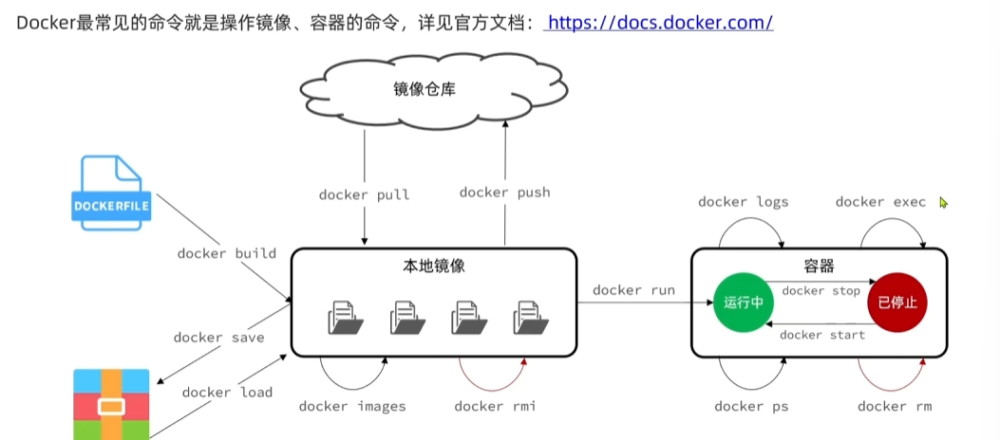
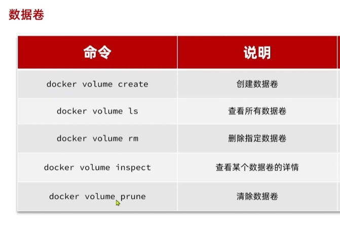
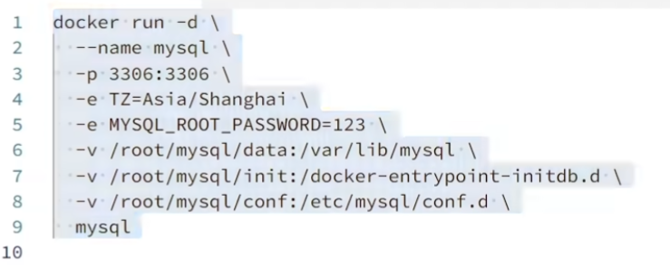

# Docker笔记

## 基本概念

Docker是一个用于构建运行传送应用程序的平台，可以解决环境配置的问题，将第三方软件库，依赖等打包，运行在任何的环境

Docker是一个容器的实现，容器是一个虚拟化技术是一个独立的环境，使用宿主机的OS操作系统，减少资源的浪费（运行多个操作系统和图形化界面）

容器是Docker的一个运行实例，提供一个可以移植的环境，可以在这个环境中运行应用程序，镜像和容器的关系类似Java中的类和实例，Docker仓库可以存储Docker镜像和上传，我们打包容器为镜像上传给别人，别人就可以使用镜像创建相应的容器


## Docker安装

在Windows版本中有Docker的桌面版本，相比于命令行的方式简单方便，照着教程配即可，这里安装的是linux版本（CentOS7）

更换国内源

```
sudo yum-config-manager --add-repo https://mirrors.aliyun.com/docker-ce/linux/centos/docker-ce.repo
```


卸载旧有版本

```
sudo yum remove docker \
               docker-client \
               docker-client-latest \
               docker-common \
               docker-latest \
               docker-latest-logrotate \
               docker-logrotate \
               docker-engine
```

安装必要依赖包

```
sudo yum install -y yum-utils device-mapper-persistent-data lvm2
```

添加Docker官方仓库

```
sudo yum-config-manager --add-repo https://download.docker.com/linux/centos/docker-ce.repo
```

安装Docker引擎：查看最新版本，指定版本号

```
yum list docker-ce --showduplicates | sort -r
```

```
sudo yum install -y docker-ce-20.10.17 docker-ce-cli-20.10.17 containerd.io
```


## 相关指令

### 基础指令



```
- 搜索仓库镜像：docker search 镜像名
- 拉取镜像：docker pull 镜像名
- 查看正在运行的容器：docker ps
- 查看所有容器：docker ps -a
- 删除容器：docker rm container_id
- 查看镜像：docker images
- 删除镜像：docker rmi image_id
- 启动（停止的）容器：docker start 容器ID
- 停止容器：docker stop  容器ID
- 重启容器：docker restart 容器ID
- 启动（新）容器：docker run -it ubuntu /bin/bash
- 进入容器：`docker attach 容器ID`或`docker exec -it 容器ID /bin/bash`，推荐使用后者。
```

将镜像打成tar包

```
docker save -o nginx.tar nginx:latest
```

加载tar包

```
docker load -i nginx.tar
```

运行镜像

```
docker run -d --name nginx -p 80:80 nginx
```

启动/停止容器

```
docker start/stop nginx
```

进入容器内部交互

```
docker exec -it nginx bash
```


**启动Redis服务**

或者我们通过Docker启动一个redis服务

查找可用redis镜像

```
docker search redis
```

下载redis镜像

```
docker pull redis
```

运行redis容器，并且通过-p参数将容器端口映射到宿主机端口

```
docker run --name redis_name -p 6379:6379 -d redis
```

在宿主机连接docker运行中的redis容器对象

```
redis-cli -h 127.0.0.1 -p 6379
```


### 数据卷

数据卷（volume）是一个虚拟目录，是容器内目录和宿主机目录之间的映射桥梁

通过在系统的数据卷虚拟目录即可操作Docker容器中的内容，可以解决容器中不能运行大部分指令的问题



我们在执行docker run命令的时候，使用-v 数据卷：容器内目录 可以完成数据卷挂载

当创建容器时，如果挂载了数据卷且数据卷不存在，则会自动创建数据卷

```
docker run -d --name nginx -p 80:80 -v usr:/usr/share nginx
```

容器被挂载到了/var/lib/docker/volumes/usr/_data

```
[root@iv-ye5w83dog0bw80eugddg _data]# docker volume inspect usr
[
    {
        "CreatedAt": "2025-10-07T21:14:39+08:00",
        "Driver": "local",
        "Labels": null,
        "Mountpoint": "/var/lib/docker/volumes/usr/_data",
        "Name": "usr",
        "Options": null,
        "Scope": "local"
    }
]
```

或者我们也可以挂载到指定的目录 /home/nginx

```
docker run -d --name nginx -p 80:80 -v /home/nginx:/usr/share nginx
```

如果需要挂在多个目录也可以多加几个-v 参数




### 自定义镜像

镜像就是包含了应用程序，程序运行的系统函数库、运行配置等文件的文件包。构建镜像的过程实际上就是把上述文件打包的过程
