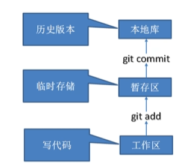
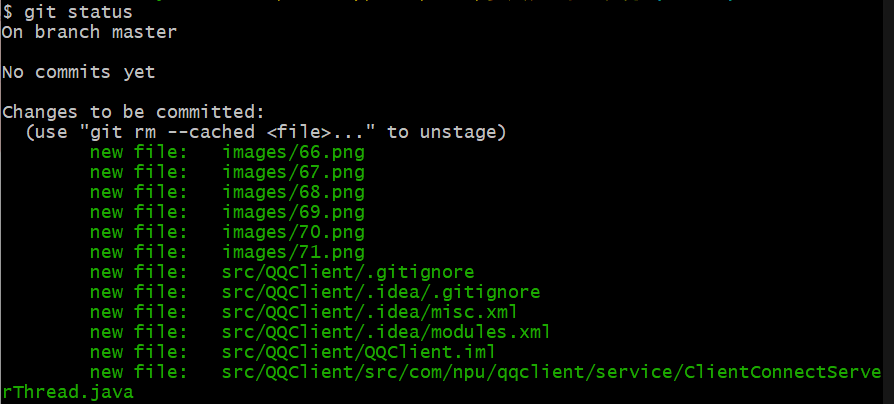
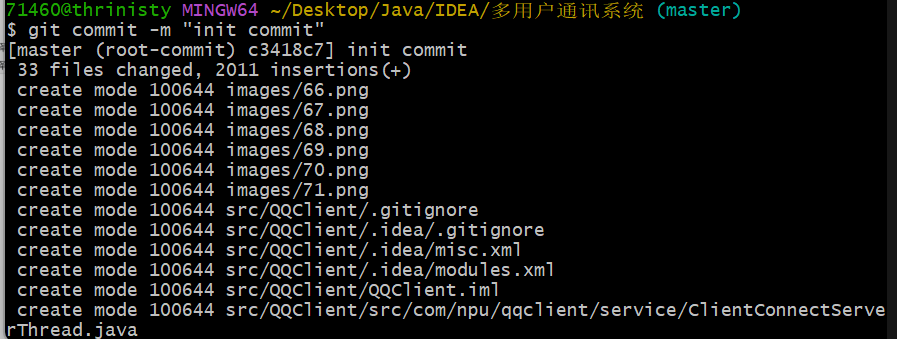
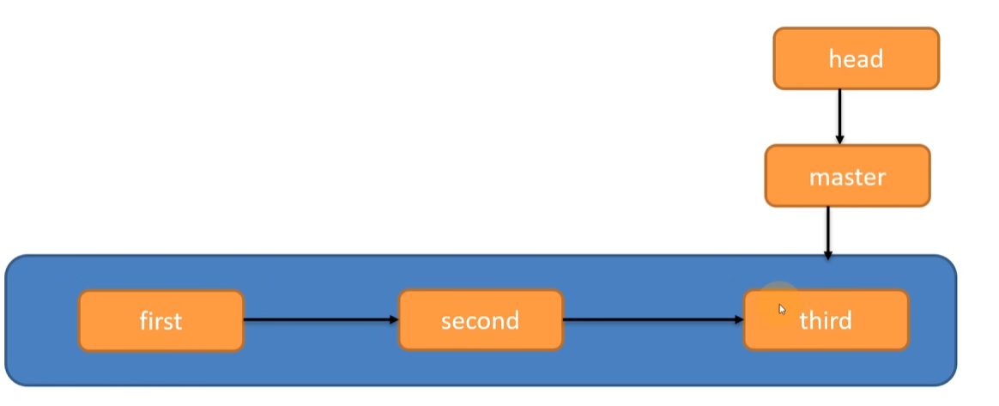
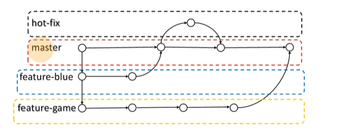
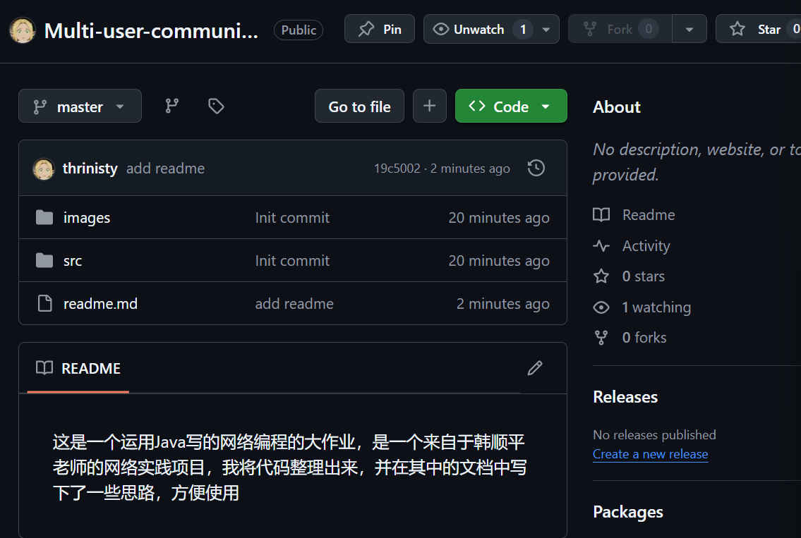
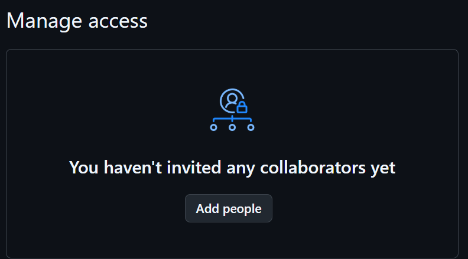

# GIT

Mysql基础部分内容结束，本来打算直接进入JDBC的学习，但是一来我有点小累，学不动Java了，二来我的编译原理课程需要使用到Git，实习的公司也要求熟练运用Git，所以就先看看这一个部分的知识，整理笔记并实际运用，预计今天（15号）一个晚自习和明天把这一块知识拿下（熟练使用Git、Github、GitLab、Gitee）

之前的博客中我也介绍了一下Git大体是个什么玩意，但是使用的是VsCode链接到的Github，而我现在学Java改用IDEA了，又需要重新配置一下才可以方便使用。

找的课程也就4~5个小时，就当过一遍教程了，对不了解的代码分支，分支合并学习一下，以下是该课程涉及的一些知识点（代码推送、代码拉取、代码克隆、IDEA集成Github、分支合并）


## 重要概念

### 版本控制

版本控制是一种记录文件内容变化，以便将来查阅特定版本修订情况的系统

其中最重要的就是可以记录文件修改历史，从而让用户能够查看历史版本，方便切换版本

对于个人而言或许不太需要版本控制，但是如果一旦上升到公司集体，为了方便安全的对于代码进行修改（对于多个修改进行正确的合并），版本控制的使用就异常重要


### 分布式和集中式

对于早期的集中式管理系统，多个用户针对于中央服务器进行代码提交修改，这样做方便管理者来集中控制权限，但是如果中央服务器崩溃，项目就无法查看版本记录，而本地工作副本仅保存当前文件状态，无法形成有效的本地版本历史，而如今的分布式可以很好的解决这一点，通过拉取到本地，推送来统一进度，当中央发生故障的时候，任可以在自己的主机上做本地的版本控制


### Git的工作机制



工作区：指的是本地存放代码的地方，也是直接编写代码的本地区域

暂存区：是为了git识别，将工作区通过git add添加到的一个特定区域

本地库：将暂存区的代码commit提交到本地库就会生成历史版本，无法删除记录（除非删除本地代码重新拉取云端的版本）


### 代码托管中心

代码托管中心是基于网络服务器的远程代码仓库，一般简单地称为远程库，在上述工作机制中，我们还可以把本地库运用push将本地库推送到远程库中，以下是一些常见的代码托管中心

局域网 GitLab

互联网 Github     Gitee 码云


## 本地库操作

### 相关命令

| 命令名称                               | 作用           |
| -------------------------------------- | -------------- |
| git config --global user.name 用户名称 | 设置用户签名   |
| git config --global user.email 邮箱    | 设置用户签名   |
| git init                               | 初始化本地库   |
| git status                             | 查看本地库状态 |
| git add 文件名                         | 添加到暂存区   |
| git commit -m "日志信息" 文件名        | 提交到本地库   |
| git reflog                             | 查看历史记录   |
| git reset --hard 版本号                | 版本穿梭       |


### Git操作

#### 设置用户签名

```shell
git config --global user.name thrinisty
git config --global user.email 714605471@qq.com
```

签名的作用是区分不同的操作者的身份，用户的签名信息在每一个版本的提交信息中能够看到，以确认本次提交是谁做的，Git首次安装必须要设置一下用户签名，否则无法提交代码

注意，这里设置用户签名和将来登录Github的帐号没有任何的关系


#### 初始化本地库

找到你要git提交的文件进入，输入以下指令创建空的git本地库

```shell
git init
```


#### 查看本地库状态

```shell
git status
```

默认是在master分支下

```shell
On branch master
No commits yet
Untracked files:
  (use "git add <file>..." to include in what will be committed)
        images/
        src/

nothing added to commit but untracked files present (use "git add" to track)
```

其中的images和src还没有被添加到暂存区，没有被追踪


#### 添加至暂存区

添加所有文件

```shell
git add . 
```

添加image文件夹

```shell
git add image
```

这个时候我们也可以使用git status来查看新添加进入的文件




#### 提交本地库

生成历史版本

```shell
git commit -m "init commit" [可选字段 默认提交所有暂存区中内容]
```



这个时候再次查看git本地库状态，看见所有在暂存区的内容被提交

```shell
$ git status
On branch master
nothing to commit, working tree clean
```


#### 查看版本信息

我们也可以通过一下的指令来查看版本信息

```shell
$ git reflog
c3418c7 (HEAD -> master) HEAD@{0}: commit (initial): init commit
```

发现有一个提交过的版本名为init commit

以下是一个更为详细的版本信息查看

```shell
$ git log
commit c3418c789ad7bfb246a65f88f26f37764a011764 (HEAD -> master)
Author: thrinisty <714605471@qq.com>
Date:   Wed Apr 16 14:57:49 2025 +0800

	init commit
```


#### 修改文件

修改文件之后我们需要将修改的文件再次添加到暂存区，以及提交到本地库

例如我们在images文件夹下新增了一张图片

```shell
$ git status
On branch master
Untracked files:
  (use "git add <file>..." to include in what will be committed)
        images/2.jpg

nothing added to commit but untracked files present (use "git add" to track)
```


我们就需要重新将这张图片存储到到暂存区

```shell
$ git status
On branch master
Changes to be committed:
  (use "git restore --staged <file>..." to unstage)
        new file:   images/2.jpg
```


再重新提交到本地库，从而生成第二个版本

```shell
$ git commit -m "New picture"
[master 8c69e8c] New picture
 1 file changed, 0 insertions(+), 0 deletions(-)
 create mode 100644 images/2.jpg
```


现在我们再查看版本信息，就可以看到第二次提交

```shell
$ git reflog
8c69e8c (HEAD -> master) HEAD@{0}: commit: New picture
c3418c7 HEAD@{1}: commit (initial): init commit
```


#### 版本切换

Git切换版本，底层实际上就是移动的Head指针

```shell
git reset --hard c3418c7
```

这个时候我们的版本指针指向的就是第一次提交的版本

```shell
c3418c7 (HEAD -> master) HEAD@{0}: reset: moving to c3418c7
8c69e8c HEAD@{1}: commit: New picture
c3418c7 (HEAD -> master) HEAD@{2}: commit (initial): init commit
```

而我们添加的工作区中的第二次新添加的图片也会消失不见

当然我们也可以版本穿梭回去

```sh
git reset --hard 8c69e8c
```

我们工作区中的图片就会被添加回来




## 分支

在版本控制过程中，同时推进多个任务，为每个任务，我们就可以创建每个任务的单独分支。使用分支意味着程序员可以把自己的工作从开发主线上分离开来，开发自己分支的时候，不会影响到主线分支的运行

而对于初学者而言，分支可以简单理解为副本，一个分支就是一个单独的副本（分支的底层的实现也是通过指针完成）



分支优点：同时并行推进多个功能的开发，提高开发效率

在各个分支的开发过程中，如果某一个分支开发失败，不会对其他分支有任何影响，失败的分支重新删除即可


### 分支相关指令

| 命令名称            | 作用                         |
| ------------------- | ---------------------------- |
| git branch 分支名   | 创建分支                     |
| git branch -v       | 查看分支                     |
| git checkout 分支名 | 切换分支                     |
| git merge 分支名    | 把指定的分支合并到当前分支上 |


### 基本使用

我们有的时候需要对于工作代码进行热修补，我们可以创建一个hot-fix分支，切换到分支，在分支上对于代码进行修改，完成之后切换到master分支下就可以使用git merge进行合并

```shell
git branch hot-fix
git checkout hot-fix
相关的热修复
git checkout master
git merge hot-fix
```

最后的本地库状态

```shell
$ git reflog
37195a2 (HEAD -> master, hot-fix) HEAD@{0}: merge hot-fix: Fast-forward
8c69e8c HEAD@{1}: checkout: moving from hot-fix to master
37195a2 (HEAD -> master, hot-fix) HEAD@{2}: commit: commit 1.jpg
8c69e8c HEAD@{3}: checkout: moving from master to hot-fix
8c69e8c HEAD@{4}: reset: moving to 8c69e8c
c3418c7 HEAD@{5}: reset: moving to c3418c7
8c69e8c HEAD@{6}: commit: New picture
c3418c7 HEAD@{7}: commit (initial): init commit
```


### 合并冲突

以上的例子是在master没有修改的情况下完成的合并，所以可以合并成功，在企业中我们在合并分支的时候往往遇到冲突

合并分支的时候，两个分支在同一个文件的同一个位置有两套完全不同的修改，而Git无法替我们决定使用哪一个，必须要认为决定新代码内容

例如我们在master中创建了一个1.txt 然后创建一个another分支，在两个分支下分别修改这个1.txt，分别提交，尝试在master中合并another，发现没有办法正常自动合并

```shell
git merge another
Auto-merging 1.txt.txt
CONFLICT (content): Merge conflict in 1.txt.txt
Automatic merge failed; fix conflicts and then commit the result.
```

而用git status指令查看，发现了1.txt合并冲突

```shell
On branch master
You have unmerged paths.
  (fix conflicts and run "git commit")
  (use "git merge --abort" to abort the merge)

Unmerged paths:
  (use "git add <file>..." to mark resolution)
        both modified:   1.txt.txt

no changes added to commit (use "git add" and/or "git commit -a")
```

而打开冲突的文件，会发现git帮我们完成了冲突的标注

```shell
<<<<<<< HEAD
master中的修改
=======
分支中的修改
>>>>>>> another
```

我们需要手动合并

```
master中的修改
分支中的修改
```

需要重新添加提交

```
git add .
git commit -m "merge test"
```

```shell
71460@thrinisty MINGW64 ~/多用户通讯系统 (master|MERGING)
$ git commit -m "merge test"
[master 0f34b4c] merge test

71460@thrinisty MINGW64 ~/多用户通讯系统 (master)
```

发现两个分支合并成功，其实无论master还是another都是版本记录的指针，而所在的分支，其实是由Head决定的，所以创建分支的本质就是多创建一个指针，切换Head就是切换分支


## 团队协作

我们在实际开发的过程中不光有本地的仓库，还应该将代码同步到云端（代码托管平台）

远程仓库命令

| 命令名称                     | 说明                                             |
| ---------------------------- | ------------------------------------------------ |
| git remote -v                | 查看当前所有远程地址别名                         |
| git remote add 别名 远程地址 | 起一个别名                                       |
| git push 别名 分支           | 推送本地分支上的内容到远程仓库                   |
| git clone 远程地址           | 将远程仓库的内容克隆到本地                       |
| git pull 别名 远程分支名     | 将远程仓库对于分支最新内容拉取与本地分支直接合并 |


### 远程仓库操作

#### 创建远程仓库

在github创建一个远程仓库名为Multi-user-communication-system（举例）

其中 https://github.com/thrinisty/Multi-user-communication-system.git

是我们的仓库链接，我们可以对于这个链接起一个别名system

```shell
git remote add system 
https://github.com/thrinisty/Multi-user-communication-system.git
```


#### 推送本地仓库到远程仓库

```shell
git push system master
```

这个时候我们就将代码推送到了远程仓库




#### 拉取代码

如果需要拉取云端的代码对本地的代码进行合并（请注意保持本地库的代码是最新的状态）

```shell
git pull system master
```

```shell
git pull system master
From https://github.com/thrinisty/Multi-user-communication-system
 * branch            master     -> FETCH_HEAD
Already up to date.
```


#### 克隆仓库

如果没有本地库代码，我们还可以使用git clone完成项目的克隆，别名默认为origin

```
git clone https://github.com/thrinisty/Multi-user-communication-system
```


### 团队内协作

在克隆的本地仓库可以用另外一个人的帐号，进行推送，但是需要赋予相关的权限，需要将这个人的账号添加进入团队


#### 添加团队人员

在仓库的拥有者中仓库设置的Collaborators可以选取添加仓库的相关人员，而添加的相关人员就会有push代码的权限




#### 团队成员修改提交

之后团队内成员可以拉取合并代码，并修改提交，参与到项目的研发中


### 跨团队协作

有的时候我们需要找一个外来人员更改代码，但是我们又不想要让这个外来人员进入团队，我们就需要跨团队协作

这个时候外来人员可以通过项目链接选择使用fork看到代码，修改代码，提交修改，但是只是修改自己的本地仓库

外来人员想要将修改的代码合并到对应的项目中可以使用pull request发送请求，而仓库的管理人员就可以审核申请，之后还可以查看修改，如果没有问题就可以确认合并。


## IDEA集成

**Github**  **Gitee**  **GitLab**

这部分的内容照着尚硅谷的B站课程过一遍就好，一般都记得住，不会用的时候再去复习一下就好，用的多就会了，没必记录笔记

在公司中代码保护非常的常见，之前我在讯飞得生产实习就有明确要求只准许使用公司内网连接，网络实时监控，不允许向网络上提交代码相关的内容

而一个项目的开发中代码的保护也是很重要，这个时候就需要使用到GitLab自建代码托管平台，在局域网是进行代码管理


## 结语

Git到这里告一段落，明天开始JDBC的学习，计划两天完成，目的是掌握基础语法，JDBC大体结构，JDBC实战项目暂时不打算做了，得快点把概念和实际操作过熟练了，计划之后学完JDBC的高层框架（Mybatis）后实战运用，就不用底层的JDBC做项目了
