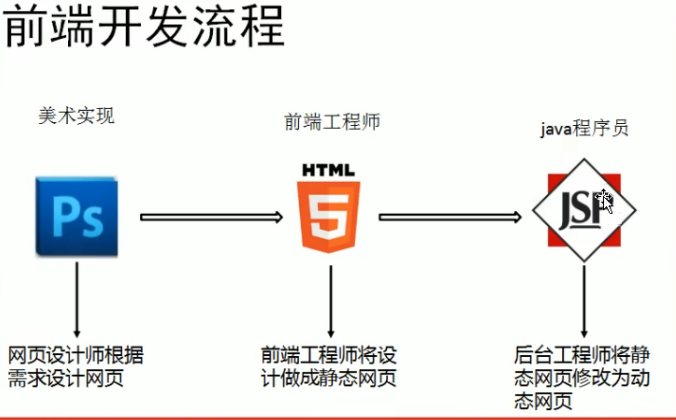
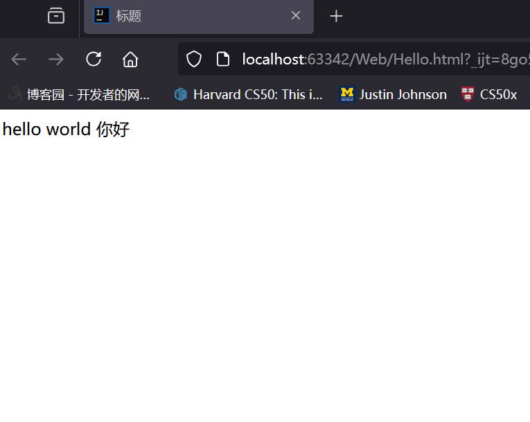
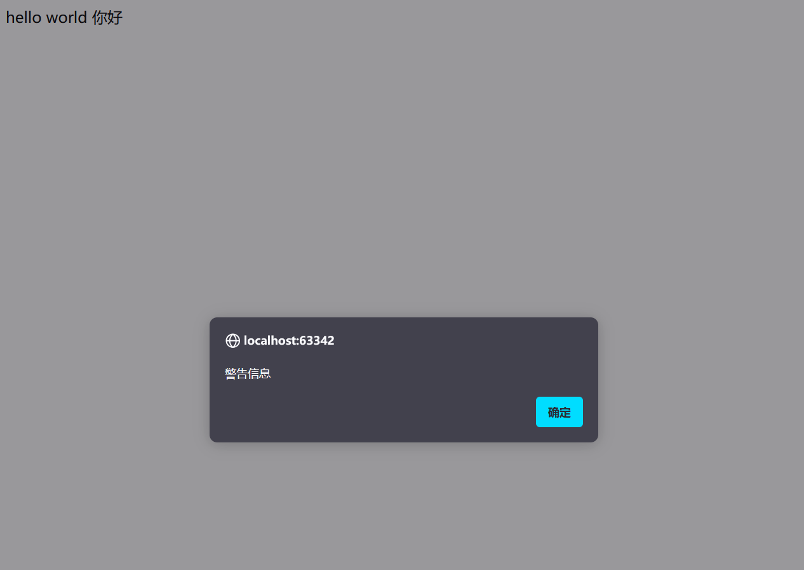
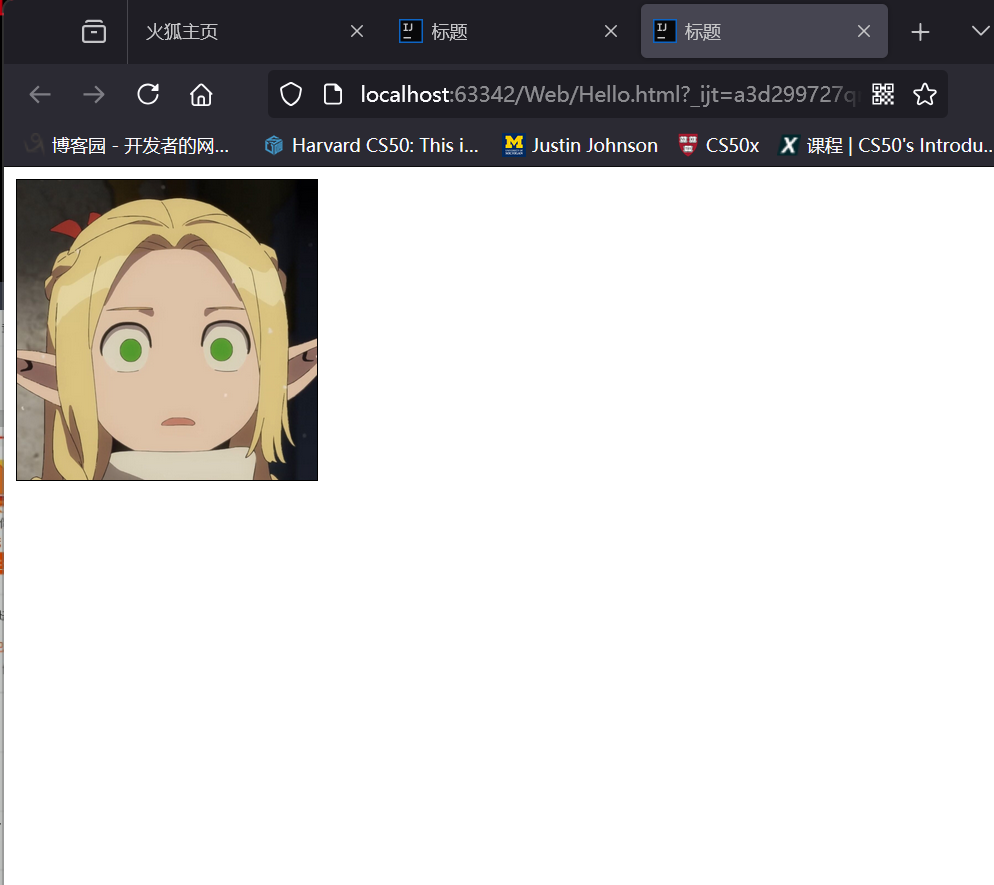
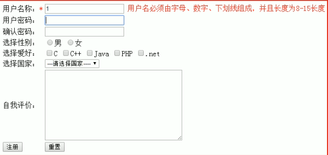
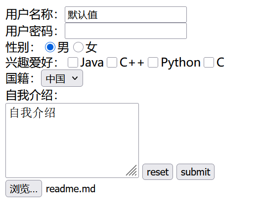

# JavaWeb笔记

学习Redis到了Spring集成Jedis客户端那里的时候碰壁了，学习效率奇低，复盘了一下，发现是Maven和SpringBoot没有学习导致了环境上的问题，所以更改一下学习策略，先进行Java各大框架的学习，再使用Redis进行改进，这样也符合正常的学习规律

首先是JavaWeb的学习，打算分出12天完成

Java开发流程



页面有三个部分内容组成：内容（html），表现（CSS），行为（JavaScript）

内容是在页面上可以看到的数据，表现是这些内容在页面上的展示形式（布局颜色大小等），行为是指页面中元素与输入设备交互的响应


## HTLM

Hyper Text Markup Language

简介

HTML通过标签来标记显示网页中的各个部分，网页文件本身就是一种文本文件，通过在文本文件中添加标记符，可以告诉浏览器中如何显示其中的内容


### 创建HTML文件

1.创建一个Web工程

2.在工程下创建html文件

```html
<!DOCTYPE html><!-- 约束声明 -->
<html lang="zh"><!--html表示html开始，lang=zh表示中文，分为head和body-->
<head><!--头部信息，一般包含title，css，js-->
    <meta charset="UTF-8"><!--字符集-->
    <title>标题</title><!--标题区域-->
</head>
<body><!--主体内容-->
    hello world
    你好
</body>
</html>
```

可以在IDEA下运行html文件打开网页(html文件不需要编译，只需要浏览器解析即可)

这里我设置的是edge浏览器

```
C:\Program Files (x86)\Microsoft\Edge\Application\msedge
```




### 标签

1.标签的格式

```html
<标签名>封装的数据</标签名>
```

2.标签名大小写不敏感

3.标签拥有自己的属性，分为基本属性（修改简单的样式效果）和实践属性（可以直接设置事件响应后的代码）

```html
<body bgcolor="aqua"><!--主体内容-->
    hello world
    你好
</body>
```



4.标签又分为，单标签、双标签

```html
<br/> <!--换行-->
<hr/> <!--水平线-->
<p></p>
```


### 标签语法

标签不可以交叉嵌套

```html
<1><2>内容</2></1> <!--正确-->
<1><2>内容</1></2> <!--错误，但有些浏览器可以解析-->
```

标签必须要闭合

```html
<br/><!--正确-->
<br><!--错误-->
```

属性必须要有值，属性值必须有“”

```html
<body bgcolor="aqua">
```

注释不可以嵌套

```html
<!--<!---->-->  <!--错误-->
```


### 常用标签

#### font标签

font改变字体颜色，大小，字体

```html
</head>
<body onclick="alert('警告信息')"><!--主体内容-->
<font color="#a52a2a" face="宋体" size="7">hello world<br/>你好</font>
</body>
</html>
```


#### 特殊字符

如果我们想要在浏览器上显示如下特殊字符<br>则<>会被解析，我们需要使用&lt 与 &gt代替

```html
<font color="#a52a2a" face="宋体" size="7">
    你好<br>你好
    你好&lt;br&gt;你好
</font>
```

与此类似的还有html会裁掉，我们需要保留空格，我们需要使用到&nbsp

```html
<body onclick="alert('警告信息')"><!--主体内容-->
<font color="#a52a2a" face="宋体" size="7">
    你好&nbsp;&lt;br&gt;&nbsp;你好
</font>
</body>
```


#### 标题标签

h1-h6，h7会显示原文本

```html
<body><!--主体内容-->
    <h1>标题</h1>
    <h2>标题</h2>
    <h3>标题</h3>
    <h4>标题</h4>
    <h5>标题</h5>
    <h6>标题</h6>
</body>
```

可以为标签添加属性，使其左右居中对齐

```html
<body><!--主体内容-->
    <h1 align="left">标题</h1>
    <h2 align="center">标题</h2>
    <h3 align="right">标题</h3>
</body>
```


#### 超链接

指定href 连接对象，也可以增加target属性设置点击操作（默认为self）

blank会打开新的标签页

```html
<body><!--主体内容-->
    <a href="https://www.baidu.com">百度</a>
    <a href="https://www.baidu.com" target="_self">百度</a>
    <a href="https://www.baidu.com" target="_blank">百度</a>
</body>
```


#### 标签列表

还可以修改列表前的符号，加上type="none"

无序列表ul

```html
<body><!--主体内容-->
    <ul>
        <li>赵四</li>
        <li>刘能</li>
        <li>沈阳</li>
        <li>小宝</li>
    </ul>
</body>
```

有序列表ol

```html
<body><!--主体内容-->
    <ol>
        <li>赵四</li>
        <li>刘能</li>
        <li>沈阳</li>
        <li>小宝</li>
    </ol>
</body>
```


#### img标签

显示图片

border是边框大小，alt是找不到显示的文本内容

```html

```




#### 表格标签

做一个代表头的，三行三列表格，显示边框

```html
<table>
    <tr>
        <td>1</td>
        <td>2</td>
        <td>3</td>
    </tr>
    <tr>
        <td>4</td>
        <td>5</td>
        <td>6</td>
    </tr>
    <tr>
        <td>7</td>
        <td>8</td>
        <td>9</td>
    </tr>
</table>
```

修改长宽，边框（border）

```html
<table border="1" width="400" height="300">
```

添加th显示表头加增粗

```html
<tr>
    <th>1</th>
    <th>2</th>
    <th>3</th>
</tr>
```

cellspacing可以调节格子间的间距一般就使用0即可

跨行

```html
<td colspan="2">4</td>
```

跨列

```html
<td rowspan="2">6</td>
```

也可以叠加使用


#### iframe标签

可以在html页面上打开一个小窗口加载单独的页面

```html
<body><!--主体内容-->
    主页面
    <iframe src="123.html"></iframe>
</body>
```


#### div、span、p

div标签默认独占一行

span标签长度是封装数据的长度

p段落标签会在上下各空出一行，如果有则不空


### 表单

#### 入门使用

form标签就是表单

表单用于收集用户信息，把信息发送给服务器



```html
<body><!--主体内容-->
    <form>
        用户名称：<input type="text" value="默认值"/><br/>
        用户密码：<input type="password"/><br/>
        性别：<input type="radio" name="sex" checked="checked">男<input type="radio" name="sex">女<br/>
        兴趣爱好：<input type="checkbox">Java<input type="checkbox">C++<input type="checkbox">Python<input type="checkbox">C<br/>
        国籍：<select>
        <option>国籍</option>
        <option>美国</option>
        <option selected="selected">中国</option>
        <option>日本</option>
        </select><br/>
        自我介绍：<br/>
        <textarea rows="5" cols="20">自我介绍
        </textarea>
        <input type="reset" value="reset"/>
        <input type="submit" value="submit"/><br/>
        <input type="file"/>
    </form>
</body>
```

生成的网页



在实际使用的时候可以将所有的表单行放入表格对齐，更加的美观


#### 表单提交

注意需要将提交表单的对应行都添加上name才能发送到服务器

```html
<form action=https://www.baidu.com method="get或者post">
```

get：浏览器浏览器的地址是（action属性[+?+请求参数]），参数是(name=value&name=value...)

post：可传送requuest主体的表单内容 浏览器地址中只有action，安全，长度无限制


## CSS

CSS是层叠样式表单，是用于增强控制网页样式并允许将样式信息和网页内容分离的一种标记性语言


### 语法规则

```css
选择器{
	属性: 值
}
```

选择器：浏览器根据选择器决定受CSS样式影响的HTML元素（标签）

属性(property)：要改变的样式名，并且每个属性都有一个值，用：隔开，并被{}包围，这样就组成了一个完成的样式声明(declaration) 例如 p{color:blue}

多个声明：如果定义的不只有一个声明，则需要用分号将每个声明分开

```css
p {
    color:red;
	font-size:80px;
}
```

CSS注释

```css
/*注释内容*/
```


### HTML结合使用

入门使用

设置div和span的样式，这样的可读性差，没复用性

```html
<body>
    <div style="border: aqua solid 1px">CSS说明</div>
    <span style="border: red solid 1px">CSS说明</span>
</body>
```


自定义样式

我们可以自定义样式，对所有的特定标签生效

```html
<!DOCTYPE html>
<html lang="en">
<head>
    <meta charset="UTF-8">
    <title>CSS</title>
    <style style="height: auto">
        div{
            border: 1px solid black;
        }
        span{
            color: red;
        }
    </style>
</head>
<body>
    <div>CSS说明</div>
    <span>CSS说明</span>
</body>
</html>
```

以上代码也是有缺陷的，只可以在同一个页面编辑head内容创建style设置样式，不可以多个页面复用css代码，且维护不方便，我们可以通过如下的方式多页使用


link引入

把css样式写成一个单独的css文件，再通过link标签引入即可复用

编写.css文件

```css
div{
    border: 1px solid black;
}
span{
    color: red;
}
```

```html
<!DOCTYPE html>
<html lang="en">
<head>
    <meta charset="UTF-8">
    <title>CSS</title>
    <link rel="stylesheet" type="text/css" href="test.css"/>
</head>
<body>
    <div>div</div>
    <span>span</span>
</body>
</html>
```

后续修改在.css改即可


### 选择器

#### 标签名选择器

可以决定哪些标签被动的使用这个样式

```html
<!DOCTYPE html>
<html lang="en">
<head>
    <meta charset="UTF-8">
    <title>CSS</title>
    <style type="text/css">
        div{
            border: 1px solid #050505;
            color: #3dc6b1;
            font-size: 20px;
        }
        span{
            border: 5px solid #050505;
            color: red;
            font-size: 20px;
        }
    </style>
</head>
<body>
    <div>div</div>
    <span>span</span>
</body>
</html>
```


#### id选择器

格式

```css
#id 属性值{
	属性:值;
}
```

id选择器，可以让我们通过id属性选择性的去使用样式

```html
<!DOCTYPE html>
<html lang="en">
<head>
    <meta charset="UTF-8">
    <title>CSS</title>
    <style type="text/css">
        #id001{
            border: 1px solid #050505;
            color: #3dc6b1;
            font-size: 20px;
        }
        #id002{
            border: 5px solid #050505;
            color: red;
            font-size: 20px;
        }
    </style>
</head>
<body>
    <div id="id001">div</div>
    <span id="id002">span</span>
</body>
</html>
```


#### class选择器

使用建议

- 使用**class**来定义可重复使用的样式
- 使用**id**来标识唯一的页面元素（通常用于JS操作或页面锚点）

格式

```html
.class 属性值{
	属性:值;
}
```

```html
<!DOCTYPE html>
<html lang="en">
<head>
    <meta charset="UTF-8">
    <title>CSS</title>
    <style type="text/css">
        .class01{
            border: 1px solid #050505;
            color: #3dc6b1;
            font-size: 20px;
        }
        .class02{
            border: 5px solid #050505;
            color: red;
            font-size: 20px;
        }
    </style>
</head>
<body>
    <div class="class01">div</div>
    <span class="class02">span</span>
</body>
</html>
```


#### 组合选择器

可以用多个标签去共享样式，id和class也可以

格式

```
选择器1, 选择器2, 选择器... {
	属性:值;
}
```

```html
<!DOCTYPE html>
<html lang="en">
<head>
    <meta charset="UTF-8">
    <title>CSS</title>
    <style type="text/css">
        div, span{
            border: 1px solid #050505;
            color: #3dc6b1;
            font-size: 20px;
        }

    </style>
</head>
<body>
    <div>div</div>
    <span>span</span>
</body>
</html>
```


### 常用样式

color字体颜色，border像素框，weight宽，height高，backgroud-color背景颜色，margin-left（auto）框格式左对齐，text-align（center、right、left）文字设置，text-decoration:none去除超链接


## JavaScript

JavaScript语言最开始最要是为了完成页面的数据验证，运行在客户端，需要运行浏览器来解释执行JavaScript代码


### 特点

交互性：可以做信息的动态交互

安全性：不允许直接访问本地硬盘空间

跨平台性：只要是可以解释JS的浏览器都可以执行，和平台无关


### HTML结合使用

第一种，在head标签中或者body标签中，使用script标签来书写Javascript代码

```html
<!DOCTYPE html>
<html lang="en">
<head>
    <meta charset="UTF-8">
    <title>JavaScript</title>
  <script type="text/javascript">
    alert("Hello World!");
  </script>
</head>
<body>

</body>
</html>
```

第二种，为了复用可以将Javascript代码写为一个文件，再导入这个文件到html中

```javascript
alert("Hello World!");
```

```html
<!DOCTYPE html>
<html lang="en">
<head>
    <meta charset="UTF-8">
    <title>JavaScript</title>
    <script type="text/javascript" src="Javaweb.js"></script>
</head>
<body>

</body>
</html>
```

以上两者二选一，不可以既选择js，又在同样的标签下写js代码


### 变量

变量可以存放某些值得内存名称，其中JavaScript中有如下的变量类型

数值类型：number

字符串类型：string

对象类型：object

布尔类型：boolean

函数类型：function


以下是JavaScript中特殊的值

undefined：未定义，所有js变量未赋于初始值的时候，默认都是该类型

null：空值

NAN：非数字


JS定义变量类型格式

```javascript
var 变量名称;
var 变量名称 = 值
```

```javascript
var i;
alert(i);/*undefined*/
i = 12;
alert(typeof (i));/*number*/
```


### 运算符

#### 比较运算符

相比较于Java中增加了===全等于

```javascript
var i;
i = (12 == "12");
alert(i);/*true*/
i = (12 === "12");
alert(i);/*flase*/
```

而所有的变量都可以作为一个boolean类型的变量去使用

```java
0,null,undefined,"" /*false*/
```


#### 逻辑运算符

返回确定表达式真假的第一个表达式的值

&&

当表达式全为真的情况下，返回最后一个表达式的值

当表达式有一个为假的时候，返回第一个为假的表达式值

||

当表达式全为假的时候，返回最后一个表达式的值

当表达式有一个为真的时候，返回第一个为真的表达式值


### 数组

#### 使用

```javascript
var 数组名称 = [];//空数组
var 数组名称 = [1,'abc',true];//定义数组时赋值
```

```javascript
var arr = [123, 133, 133];
alert(arr[2]);
```

在使用上基本上和java没有区别

```javascript
var arr = [123, 133, 133];
for (var i = 0; i < 2; i++) {
    alert(arr[i]);
}
```


#### 区别

JavaScript中的数组，只要通过数组下表赋值，那么数组下标的最大值就会给数组做扩容操作，没有赋值的内容类型是undefined


### 函数

#### 基本使用

在Javascript中有两种方式定义函数

第一种：使用function关键字来定义函数

```javascript
function 函数名称(形参列表){
	函数体
}
```

```javascript
function fun() {
    var arr = [123, 133, 1323];
    for (var i = 0; i < 3; i++) {
        alert(arr[i]);
    }
}

fun();
```

```javascript
function fun(a, b, c) {
    alert(a + " " + b + " " + c);
}

var arr = [123, 133, 1323];
fun(arr[0], arr[1], arr[2]);
```

第二种：由于function在JavaScript中是一种类型，可以进行赋值操作

```javascript
var 函数名称 = function(形参列表) {
	函数体
}
```

```javascript
function fun(a, b, c) {
    alert(a + " " + b + " " + c);
}

anotherFun = fun;
var arr = [123, 133, 1323];
anotherFun(arr[0], arr[1], arr[2]);
```

注意在，Javascript中不允许解析函数的重载，如果函数名称重名会覆盖上一次定义


#### 隐形参数

在Javascript中存在一个arguments隐藏参数，在function函数体中不需要定义，但是可以获取所有参数的变量，很像Java中的可变参数，操作类似数组

```javascript
function fun() {
    alert("无参函数fun");
    alert(arguments[0] + " " + arguments[1] + " " + arguments[2]);
}

anotherFun = fun;
var arr = [123, 133, 1323];
anotherFun(arr[0], arr[1], arr[2]);
```

```javascript
function fun() {
    var result = 0;
    for (var i = 0; i < arguments.length; i++) {
        result += arguments[i];
    }
    return result;
}

var number = fun(1, 2, 3, 4, 5);
alert(number);
```


### 自定义对象

#### Object

Object形式自定义对象

定义格式

```javascript
var 变量名称 = new Object();//定义空对象
变量名称.属性名 = 值;
变量名称.函数名 = function() {}
```

使用方式

```
变量名称.属性名
变量名称.函数名
```

```javascript
var obj = new Object();
obj.id = Math.random();
obj.fun = function(){
    alert(obj.id);
}
obj.fun();
```


#### {}

{}形式的自定义对象

定义格式（注意各行之间用 , 间隔开，而最后一行不加 , ）

```javascript
var 变量名称 = {
    属性名称:值，
    属性名称:值，
    函数名:function(){}
};
```

使用方式

```javascript
var obj = {
    id:Math.random(),
    fun:function () {alert(obj.id);}
}
obj.fun();
```

# 总结

今天为JavaWeb开了一个头，感觉学起来还是非常轻松的，尤其是在JavaScript上由于语法和Java大体类似，只需要过一遍就可以很快的掌握语法，并加以使用，而CSS和HTML部分的学习我觉得作为主攻后端开发来说做到随超随用就行，大概了解使用方式即可

明天会结束JavaScript部分的内容（事件），并开始jQuery的学习
