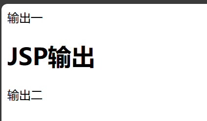

# JavaWeb笔记

## JSP

### 初步介绍

JSP全称为Java Server Pages，java的服务器页面，主要作用为替Servlet程序回传html页面的数据，因为Servlet程序回传html页面数据是一件非常繁琐的事情，开发成本和维护成本都很高

我们在使用Servlet程序回传html需要通过回传流需要一行一行地将html页面的数据传回，要会传完整一个html页面需要大量的代码使用write写入返回到客户端地浏览器

以下是一个代码示例，可见非常的繁琐

```java
@WebServlet("/test")
public class TestServlet extends HttpServlet {
    @Override
    protected void doGet(HttpServletRequest req, HttpServletResponse resp) throws ServletException, IOException {
        //通过响应的回传流回传html页面数据
        // 设置响应内容类型为HTML
        resp.setContentType("text/html;charset=UTF-8");

        // 获取响应输出流
        PrintWriter out = resp.getWriter();

        // 构建HTML页面内容
        out.println("<!DOCTYPE html>");
        out.println("<html>");
        out.println("<head>");
        out.println("    <title>Servlet生成的页面</title>");
        out.println("    <style>");
        out.println("        body { font-family: Arial, sans-serif; margin: 40px; }");
        out.println("        h1 { color: #3366cc; }");
        out.println("    </style>");
        out.println("</head>");
        out.println("<body>");
        out.println("    <h1>这是由TestServlet动态生成的页面</h1>");
        out.println("    <p>当前时间: " + new java.util.Date() + "</p>");
        out.println("    <p>请求方法: " + req.getMethod() + "</p>");
        out.println("    <p>Servlet路径: " + req.getServletPath() + "</p>");
        out.println("</body>");
        out.println("</html>");

        // 关闭输出流
        out.close();
    }
}
```


与此同时JSP可以很好的解决这个问题，代替了Servlet程序回传html页面的数据，注意JSP页面要通过服务器端进行解析，需要先运行Tomcat服务器后才可以显示动态生成出来，而不是像html一样可以直接通过本地的浏览器一样解析

```java
<%@ page contentType="text/html;charset=UTF-8" language="java" %>
<html>
<head>
    <title>JSP生成的页面</title>
</head>
<body>
    JSP JSP JSP
</body>
</html>
```

JSP页面本质上是一个Servlet程序，当我们第一次访问JSP页面的时候，Tomcat服务器会帮我们将jsp页面翻译为一个java源文件，并且将其编译为class字节码程序

生成的Servlet继承自HttpJspBase，所以 JSP 本质上就是一个Servlet，生成的Servlet程序生成的html页面也是通过write输出流生成

```java
      out.write("\r\n");
      out.write("\r\n");
      out.write("<html>\r\n");
      out.write("<head>\r\n");
      out.write("    <title>JSP生成的页面</title>\r\n");
      out.write("</head>\r\n");
      out.write("<body>\r\n");
      out.write("    JSP JSP JSP\r\n");
      out.write("</body>\r\n");
      out.write("</html>\r\n");
```


### JSP page

jsp的page指令可以修改jsp页面中的一些重要属性或者行为

```jsp
<%@ page contentType="text/html;charset=UTF-8" language="java" %>
```

以下是一些常见的可以修改的属性


language 属性：表示jsp翻译后是什么语言文件，暂时只支持java

contentType 属性：表示jsp返回的数据类型是什么，也是源码中response.setContentType设置的编码类型（一般都是UTF-8）

pageEncoding 属性：表示当前jsp页面文件本身的字符集（一般都是UTF-8）

import 属性：和Java一致，导入包

```jsp
<%@ page import="java.util" %>
```

autoFlush 属性：设置当out输出流缓冲区满了后，是否自动刷新缓冲区，默认为true

buffer 属性：设置out输出缓冲区大小，默认为8kb

errorPage 属性：设置当jsp页面运行出错的时候，会自动跳转的错误页面

isErrorPage 属性：设置当前jsp页面是否是错误信息页面，默认为false，如果是true可以获取异常信息

session 属性：设置访问当前jsp页面，是否会创建HttpSession对象，默认是true

extends 属性：设置jsp翻译出来的java类默认继承谁


### JSP脚本

#### 声明脚本

可以给JSP翻译出来的java类定义属性和方法，甚至是静态代码块和方法，定义的声明会生成到对应的Java源文件和class文件中

格式为

```
<%!
	Java声明语句
%>
```

声明类属性

```jsp
<%!
    private Integer id;
    private String name;
    private static Map<String,Object> map;
%>
```

声明static静态代码块

```jsp
<%!
    static {
        map = new HashMap<String,String>();
        map.put("key1", "v1");
        map.put("key2", "v2");
        map.put("key3", "v3");
        map.put("key4", "v4");
    }
%>
```

声明类方法

```jsp
<%!
    public int function(){
        return 12;
    }
%>
```

声明内部类

```jsp
<%!
    public static class Student{
        private String name = "Jack";
        private int age = 10;
    }
%>
```


#### 表达式脚本

作用：在jsp页面上输出数据

格式

```jsp
<%=表达式%>
```

```jsp
<%=12 %><br>
<%=name %><br>
<%="字符串测试" %><br>
<%=map %><br>
```

输出内容

```
JSP JSP JSP 12
TestString
字符串测试
{key1=v1, key2=v2, key3=v3, key4=v4}
```

特点

所有的表达式脚本都会被翻译到_jspService方法中

所有的表达式脚本都会被翻译成为out.print输出到页面上

由于表达式脚本翻译的内容都在_jspService方法中，所以jspService方法中的对象都可以直接使用

```
<%=request.getParameter("name")%>
```

http://localhost:8080/JSPTest/Test.jsp?name=1234

```
1234
```

表达式内容不可以 ; 结束


#### 代码脚本

作用：可以在jsp页面中，编写我们自己需要的功能（java语句）

格式

```
<%
	java语句
%>
```

```jsp
<%
    int i = 12;
    if(i == 12) {
        System.out.println(i);
    }
%>
```

代码脚本特点

1.代码脚本翻译之后都在_jspServive方法中

2.代码脚本中可以直接使用_jspService方法中的对象

3.代码脚本还可以由多个代码脚本块组合完成一个Java语句

```jsp
<%
    int i = 12;
    for (int j = 0; j < i; j++) {   
%>
<%
        System.out.println("j");
    }
%>
```

4.代码脚本还可以与表达式脚本组合使用在JSP页面打印

```jsp
<%
    int i = 12;
    for (int j = 0; j < i; j++) {
%>
    <%=j%><br>
<%
    }
%>
```

当然也不建议这么使用，太过于混乱了，现在基本上都是直接使用框架了，这么些可维护性差


#### JSP注释

```jsp
<%@ page contentType="text/html;charset=UTF-8" language="java" %>
<html>
<head>
    <title>Test</title>
</head>
<body>
    <!--html注释-->
    <%
        //Java注释
        /*会被翻译到Java源代码中*/
    %>
    <%--JSP注释（时JSP中真正的注释）--%>
</body>
</html>
```


### 内置对象

JSP中的内置对象，指的是Tomcat在翻译JSP页面为Servlet源代码后，内部提供的九大对象称为内置对象

request：请求对象

response：响应对象

pageContext：jsp上下文对象

session：会话对象

application：ServletContext对象

config：ServletConfig对象

out：jsp输出流对象

page：指向当前jsp的对象

exception：异常对象（当页面异常isErrorPage开启时创建异常对象）


#### 四个域对象

pageContext（PageContextImpl类）当前jsp页面范围内有效

request（HttpServletRequest类）一次请求内有效（请求转发不会丢失request数据）

session（HttpSession类）一个会话范围内有效（打开浏览器访问服务器，直到关闭浏览器）

application（ServletContext类）整个Web工程范围内都有效（Web停止后销毁）

域对象是可以像Map一样存取数据的对象，四个域对象的功能一样，不同的是特们对于数据的存取范围


我在这里遇到了pageContext无法解析set/getAttribute方法，应该是缺少 JSP API 依赖导致的

你的依赖中没有明确包含 `jsp-api`

这会导致 IDEA 无法解析 `pageContext` 的方法

添加如下的依赖配置即可

```xml
<dependency>
    <groupId>javax.servlet.jsp</groupId>
    <artifactId>javax.servlet.jsp-api</artifactId>
    <version>2.3.3</version>
    <scope>provided</scope>
</dependency>
```

```jsp
<%@ page contentType="text/html;charset=UTF-8" language="java" %>
<html>
<head>
    <title>JSP生成的页面</title>
</head>
<body>
    <h1>JSP标题</h1>
    <%
        pageContext.setAttribute("key1", "pageContext");
        request.setAttribute("key2", "Request");
        session.setAttribute("key3", "Session");
        application.setAttribute("key4", "Application");
    %>
    <%=pageContext.getAttribute("key1")%>
    <%=request.getAttribute("key2")%>
    <%=session.getAttribute("key3")%>
    <%=application.getAttribute("key4")%>
</body>
</html>
```

虽然都可以存取顺序，但是有使用优先顺序，最好在使用条件允许下使用小的范围


### 输出的细节

#### out与getWriter

response中表示响应，经常用于设置返回给客户端的内容（输出）

out也是给用户做输出使用

```jsp
<%@ page contentType="text/html;charset=UTF-8" language="java" %>
<html>
<head>
    <title>JSP生成的页面</title>
</head>
<body>
    <h1>JSP输出</h1>
    <%
        response.getWriter().write("输出一");
        out.write("输出二");
    %>
</body>
</html>
```

输出结果：我们发现response的write输出在标题的上边，和预期有些不符



1. JSP 引擎先处理模板文本 `<h1>JSP输出</h1>`
2. 遇到脚本片段时：
   - `response.getWriter().write()` 立即输出到客户端
   - `out.write()` 写入缓冲区
3. 最后 JSP 引擎刷新缓冲区，`out.write()` 的内容才真正输出

一般在使用中统一使用out输出，避免打乱顺序


#### out.print与out.write

print会将内容逐个转为字符再通过write输出，而write输出整形数据会出现问题，会将内容转为字符串（并非单个字符转化）

所以在实际使用的时候输出数字用print完成（或者直接统一使用print）


### 常用标签

#### 静态包含

有的时候我们将一个页面分为数个部分显示，为了保证页面的灵活性，我们可以将单个部分提取出来编写，方便随时替换或者修改

```jsp
<%@ page contentType="text/html;charset=UTF-8" language="java" %>
<html>
<head>
    <title>JSP生成的页面</title>
</head>
<body>
    <h1>常用标签</h1>
    头部信息<br>
    主体信息<br>
    页脚信息<br>
</body>
</html>
```

我们将页脚信息提取出来

```jsp
<%@ page contentType="text/html;charset=UTF-8" language="java" %>
<html>
<head>
    <title>页脚</title>
</head>
<body>
    页脚内容(静态包含)<br>
</body>
</html>
```

使用jsp页面

```jsp
<%@ page contentType="text/html;charset=UTF-8" language="java" %>
<html>
<head>
    <title>JSP生成的页面</title>
</head>
<body>
    <h1>常用标签</h1>
    头部信息<br>
    主体信息<br>
    <%@ include file="/foot.jsp"%><br>
</body>
</html>
```

静态包含的特点：不会翻译被包含的jsp页面，而是将被包含的jsp页面拷贝到包含的位置输出


#### 动态包含

```jsp
<%@ page contentType="text/html;charset=UTF-8" language="java" %>
<html>
<head>
    <title>JSP生成的页面</title>
</head>
<body>
    <h1>常用标签</h1>
    头部信息<br>
    主体信息<br>
    <jsp:include page="foot.jsp"></jsp:include>
</body>
</html>
```

效果上和静态包含效果上差别不大，动态包含会把包含的jsp页面也翻译为java代码，动态包含底层调用了include方法调用被包含的页面进行输出（将被包含的页面的对象给包含页面进行使用）

工程上一般使用静态代码


#### 请求转发

```jsp
<%@ page contentType="text/html;charset=UTF-8" language="java" %>
<html>
<head>
    <title>JSP生成的页面</title>
</head>
<body>
    <h1>请求转发</h1>
    <jsp:forward page="/servlet"></jsp:forward>
</body>
</html>
```


### Listener监听器

Listener监听器时JavaWeb的三大组件之一（Servler程序、Filter过滤器、Listener监听器）

是JavaEE的规范，即接口，作用为监听某种事物的变化，通过回调函数，反馈给客户（程序）做一些处理


#### ServletContextListener

可以监听ServletContext对象的创建和销毁（ServletContext对象在Web工程启动的时候创建，在Web工程停止的时候销毁）

监听到创建和销毁之后都会分别调用ServletContextListener监听器的方法反馈，这两个方法分别是contextInitialized和contextDestroyed，其中传入了ServletContextEvent对象

使用方式

1.编写一个类实现ServletContextListener

2.实现两个回调方法

3.配置web.xml监听器（配置注解@WebListener）

```java
package com.listener;

import javax.servlet.ServletContextEvent;
import javax.servlet.ServletContextListener;
import javax.servlet.annotation.WebListener;
import java.awt.event.ActionListener;

@WebListener
public class ListenerTest implements ServletContextListener {
    @Override
    public void contextDestroyed(ServletContextEvent sce) {
        System.out.println("contextDestroyed");
    }

    @Override
    public void contextInitialized(ServletContextEvent sce) {
        System.out.println("contextInitialized");
    }
}
```

这两天忙着准备面试+编译原理实验（最恶心的一个）+线性代数考试复习，暂时抽不出时间，等10号之后再开始EL表达式的学习
