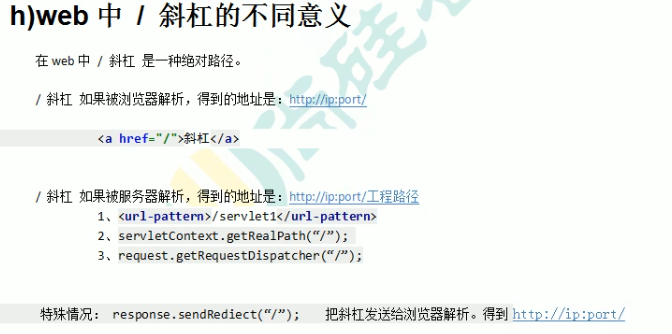
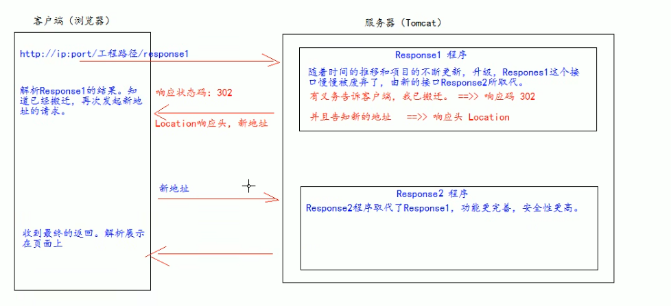

# JavaWeb笔记

今天完成Servlet剩余部分的学习，JavaWeb部分的实战项目我就不练了，我打算这一个部分的练手等到学习完开发框架之后做成一整个项目

今天发现自己的Servlet程序没有办法打印出中文字符，去网络上搜索了以下，回答的都是处理请求头的编码处理，但想想直接打印也是乱码，应该是Tomcat的配置出了问题，以下是解决方式：在Tomcat运行设置里的虚拟机选项填入以下内容（修改运行配置）

```
-Dfile.encoding=UTF-8
```


## HttpServletRequest

作用：每次只要有请求进入Tomcat服务器，Tomcat服务器就会把请求过来的HTTP协议信息解析好封装到Request对象中，然后传递到service方法，在doGet和doPost方法中给我们使用，我们可以通过HttpServletRequest对象，获取到所有的请求信息

http://localhost:8080/ServletTest/test?username=2022302546&password=123455&hobby=cpp&hobby=java

### 常用方法

#### getRequestURI

获取请求资源路径

```java
System.out.println(req.getRequestURI());
///ServletRequests/test
```

#### getRequestURL

获取请求的统一资源定位符

```java
System.out.println(req.getRequestURL());
//http://localhost:8080/ServletRequests/test
```

#### getRemoteHost

获取客户端的ip地址

```java
System.out.println(req.getRemoteHost());
//0:0:0:0:0:0:0:1
```

#### getHeader

获取请求头

```java
System.out.println(req.getHeader("Accept-Language"));
//zh-CN,zh;q=0.9,en;q=0.8,en-GB;q=0.7,en-US;q=0.6 取决你想要访问的头
```

#### getMethod

获取请求的方式

```java
System.out.println(req.getMethod());
//GET
```

#### getParameter

获取请求参数

我们先加入一个html页面，其中设置一个表单，名称填为18288763320，可以在doGet中通过req参数获取到username参数对应的表单项值

```html
<!DOCTYPE html>
<html lang="en">
<head>
    <meta charset="UTF-8">
    <title>Test</title>
</head>
<body>
    <form action="http://localhost:8080/ServletTest/test" method="get">
        名称<input type="text" name="username"><br/>
        密码<input type="password" name="password"/><br/>
        爱好
        <input type="checkbox" name="hobby" value="cpp">C++
        <input type="checkbox" name="hobby" value="java">Java
        <input type="checkbox" name="hobby" value="python">python
        <input type="submit">
    </form>
</body>
</html>
```

```java
System.out.println(req.getParameter("username"));
//18288763320
```

#### getParameterValues

获取请求的参数（多个值时使用，如使用勾选框的时候）返回一个数组

```java
String[] hobbies = req.getParameterValues("hobby");
for (String hobby : hobbies) {
    System.out.print(hobby + " ");
}//cpp java 
```

#### setCharacterEncoding

在Post请求中没法正确获取到表单中的中文字符（乱码）可通过在doPost中设置字符集解决，注意在打印请求前设置

```java
request.setCharacterEncoding("UTF-8");
```

#### setAttribute

设置域数据

#### getAttribute

获取域数据

和Map集合类似，这里不再过多说明

```java
req.setAttribute("test", "test");
String test = (String)req.getAttribute("test");
System.out.println(test);
```


### 转发请求

#### getRequestDispatcher

获取转发请求

在第一个Servlet程序中完成请求的转发，并填入一个域数据，用以被第二个Servlet程序获取处理

```java
@WebServlet("/test1")
public class Servlet1 extends HttpServlet {
    @Override
    protected void doGet(HttpServletRequest req, HttpServletResponse resp) throws ServletException, IOException {
        System.out.println("doGetServlet1");
        req.setAttribute("function", "target");
        //添加域数据
        RequestDispatcher requestDispatcher = req.getRequestDispatcher("/test2");
        //获取到访问地址
        requestDispatcher.forward(req, resp);
        //访问目标地址，并转发请求req
    }
}
```

第二个Servlet程序，由于也传入了req访问请求参数，可以获取到其中的信息

```java
@WebServlet("/test2")
public class Servlet2 extends HttpServlet {
    @Override
    protected void doGet(HttpServletRequest req, HttpServletResponse resp) throws ServletException, IOException {
        System.out.println("doGetServlet2");
        System.out.println("获取到了" + req.getAttribute("function"));
    }
}
```


#### 转发请求的特点

1.浏览器地址栏没有变化

2.他们是一次请求

3.可以共享Request域数据

4.可以转发到WEB-INF目录下（直接通过浏览器地址栏没法访问）


## base标签

我们有如下一个场景，两个页面相互跳转，通过a标签设置链接完成

index.html

```html
<!DOCTYPE html>
<html lang="en">
<head>
    <meta charset="UTF-8">
    <title>Test</title>
</head>
<body>
    <a href="a/b/c.html">跳转页面</a>
    <a href="http://localhost:8080/ServletTest/Servlet">通过servlet跳转页面</a>
</body>
</html>
```

c.html

```html
<!DOCTYPE html>
<html lang="en">
<head>
    <meta charset="UTF-8">
    <title>Title</title>
</head>
<body>
    <a href="../../index.html">跳转回index页面</a>
</body>
</html>
```

可以正常跳转，没有问题，我们现在通过Servlet转发实现

```html
<a href="http://localhost:8080/ServletTest/Servlet">通过servlet跳转页面</a>
```

```java
@WebServlet("/Servlet")
public class Servlet extends HttpServlet {
    @Override
    protected void doGet(HttpServletRequest req, HttpServletResponse resp) throws ServletException, IOException {
        System.out.println("转发");
        RequestDispatcher requestDispatcher = req.getRequestDispatcher("/a/b/c.html");
        //获取到访问地址
        requestDispatcher.forward(req, resp);
        //访问目标地址，并转发请求req
    }
}
```

在index页面中可以正常跳转到c.html页面下，但是没有办法跳转回来，因为当前的地址为 http://localhost:8080/ServletTest/Servlet （转发的时候不会跳转地址） 回溯路径是 ../../index.html 而在8080工作路径下没有c.html

我们这个时候可以使用到base标签：设置当前页面中所有的相对路径工作时，参照哪一个路径进行跳转

更改c.html 设置base标签，标注在当前c.html跳转时参照 http://localhost:8080/ServletTest/a/b/ 进行跳转

```html
<!DOCTYPE html>
<html lang="en">
<head>
    <meta charset="UTF-8">
    <title>Title</title>
    <base href="http://localhost:8080/ServletTest/a/b/">
</head>
<body>
    <a href="../../index.html">跳转回index页面</a>
</body>
</html>
```

这样就没有问题了，可以正常跳回index页面




## HttpServletResponse

​	HttpServletResponse类和HttpServletRequest类一样，每一次请求都会创建一个Response对线传递给Servlet程序使用，HttpServletRequest表示请求过来的信息，而HttpServletResponse表示所有响应的信息

​	如果我们需要设置返回给客户端的信息，都可以通过HttpServletResponse对象来进行设置


### 两个输出流

二者只能使用其一

```java
@WebServlet("/Servlet")
public class Servlet extends HttpServlet {
    @Override
    protected void doGet(HttpServletRequest req, HttpServletResponse resp) throws ServletException, IOException {
        resp.setCharacterEncoding("UTF-8");
        //设置响应字符集为UTF-8，除此之外还要设置浏览器字符集
        resp.setHeader("Content-Type", "text/html;charset=UTF-8");
        //设置浏览器字符集
        
        //resp.setContentType("text/html;charset=UTF-8");
        //同时设置以上的响应和服务器字符集，选其中之一即可（注意设置后再获取流对象）
        
        PrintWriter writer = resp.getWriter();
//        ServletOutputStream outputStream = resp.getOutputStream();
    }
}
```


#### 字节流

getOutputStream

常用于下载

```java
ServletOutputStream outputStream = resp.getOutputStream();
```


#### 字符流

getWriter

常用于回传字符串

```java
PrintWriter writer = resp.getWriter();
```

```java
PrintWriter writer = resp.getWriter();
writer.write("response");
```


### 请求重定向

请求重定向：是指客户端给服务器发送请求，然后服务器告诉客户端说，给与新地址以访问（之前的地址可能被废弃）




第一个访问的Servlet程序，访问第二个Servlet程序

```java
package com.servlet;

@WebServlet("/index.html")
public class Servlet extends HttpServlet {
    @Override
    protected void doGet(HttpServletRequest req, HttpServletResponse resp) throws ServletException, IOException {
        resp.setStatus(302);
        resp.setHeader("Location", "http://localhost:8080/ServletTest/another");
    }
}
```

第二个Servlet程序，告诉用户新的资源地址

```java
package com.servlet;

@WebServlet("/another")
public class Response extends HttpServlet {
    @Override
    protected void doGet(HttpServletRequest req, HttpServletResponse resp) throws ServletException, IOException {
        resp.setContentType("text/html;charset=UTF-8");
        PrintWriter writer = resp.getWriter();
        writer.write("服务暂停，可以跳转至新的页面http://localhost:8080/ServletTest/new.html");
    }
}
```

注意事项：

1.浏览器地址发送变化

2.两次请求

3.不可以访问Request域数据

4.不可以访问WEB-INF下资源

5.可以访问工程外的资源


或者直接调用

```java
@WebServlet("/index.html")
public class Servlet extends HttpServlet {
    @Override
    protected void doGet(HttpServletRequest req, HttpServletResponse resp) throws ServletException, IOException {
        resp.sendRedirect("http://localhost:8080/ServletTest/new.html");
    }
}
```
