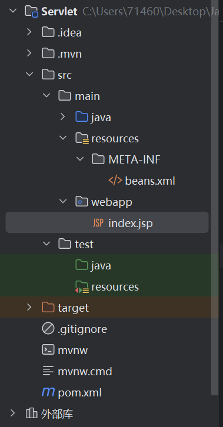
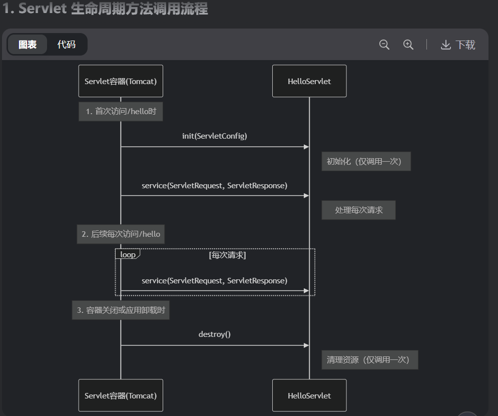
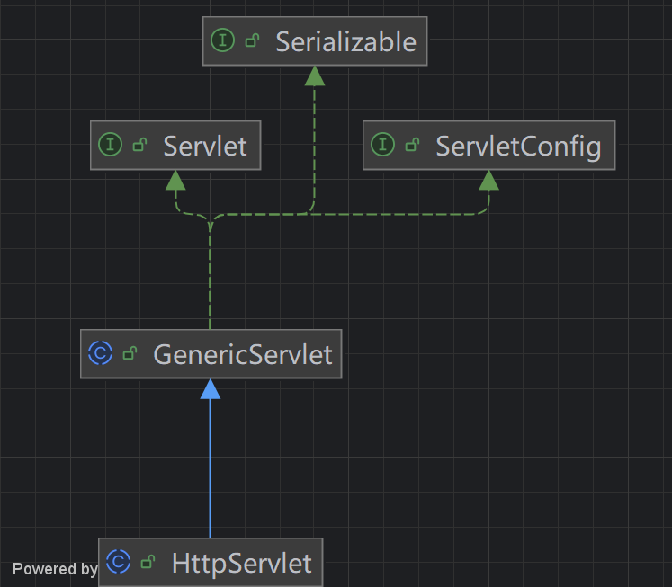
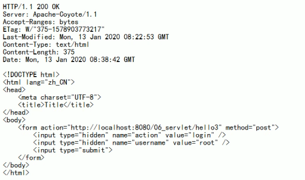
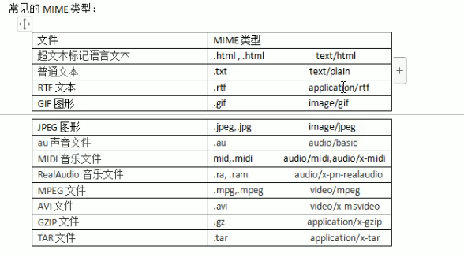

# JavaWeb笔记

之前Maven没有配置好导致了JavaWeb的环境配置比较困难，去大概了解了一下Maven构建的相关知识，现在可以快速通过坐标导入相关的jar包了，马上开始Servlet的学习


## Servlet

### 入门使用

我使用的是Maven构建的Servlet程序，不需要web.xml进行注册，只需要使用@WebServlet注解完成绑定即可访问使用

新建一个类，实现Servlet的接口方法

```java
@WebServlet("/hello")//使用该注解可以绑定访问/hello地址的时候调用Servlet服务
public class HelloServlet implements Servlet
```

```java
@Override
public void init(ServletConfig servletConfig) throws ServletException {

}

@Override
public ServletConfig getServletConfig() {
    return null;
}

@Override
public void service(ServletRequest servletRequest, ServletResponse servletResponse) throws ServletException, IOException {
	//该方法在调用Servlet服务的时候会被调用
    System.out.println("Hello Servlet");
}

@Override
public String getServletInfo() {
    return "";
}

@Override
public void destroy() {

}
```


注意：在Maven构建的Servlet程序中，index.jsp要放在src/main/webapp目录下，才可以被默认访问到



配置完毕的时候，我们运用浏览器访问 http://localhost:8080/ServletTest/hello 即可调用实现servlet接口的实现类中的相关方法


### 运行流程

以下是一个调用的流程图：



1.执行Servlet构造方法

2.执行init初始化方法

3.执行

4.执行destroy销毁方法


前两个方法在初次时调用，第二次访问/hello时，只调用service方法

```
create Servlet
init Servlet
Servlet Running
Servlet Running
```


### sevice方法

用一个html页面运用submit提交，跳转到对应的路径下也会被Servlet捕获并且调用相关方法

```html
<!DOCTYPE html>
<html lang="en">
<head>
    <meta charset="UTF-8">
    <title>Test</title>
</head>
<body>
    <form action="http://localhost:8080/ServletTest/hello" method="post">
        <input type="submit">
    </form>
</body>
</html>
```


```java
@Override
public void service(ServletRequest servletRequest, ServletResponse servletResponse) throws ServletException, IOException {
    System.out.println("Servlet Running");
    HttpServletRequest Request = (HttpServletRequest) servletRequest;
    String method = Request.getMethod();
    System.out.println(method);
}
```

通过ServletRequest servletRequest的子类型的getMethod方法可以得到请求的类型（Post/Get）

```
Servlet Running
GET
```

一般而言，我们在处理两种不同的请求类型的时候进行方法化处理，分别调用不同的处理操作

```java
@Override
public void service(ServletRequest servletRequest, ServletResponse servletResponse) throws ServletException, IOException {
    System.out.println("Servlet Running");
    HttpServletRequest Request = (HttpServletRequest) servletRequest;
    String method = Request.getMethod();
    switch (method) {
        case "GET":
            System.out.println("GET Method");
            doGet();//处理get请求的方法
            break;
        case "POST":
            System.out.println("POST Method");
            doPost();//处理post请求的方法
            break;
    }
}
```


### HttpServlet实现

在实际的开发中，很少通过实现servlet接口实现servlet程序，而是继承其子类HttpServlet来实现

1.编写一个类去集成HttpServlet类

2.根据业务需要重写doGet或者doPost方法

3.到web.xml配置Servlet程序的访问地址（我通过@WebServlet("/test")完成）

```java
@WebServlet("/test")
public class ServletTest extends HttpServlet {
    @Override
    protected void doGet(HttpServletRequest req, HttpServletResponse resp) throws ServletException, IOException {
        System.out.println("Servlet Get Called");
        super.doGet(req, resp);
    }

    @Override
    protected void doPost(HttpServletRequest req, HttpServletResponse resp) throws ServletException, IOException {
        System.out.println("Servlet Post Called");
        super.doPost(req, resp);
    }
}
```


### 继承关系



GenericServlet实现了Servlet接口，并做了一些空实现，持有一个ServletConfig类的引用，并对ServletConfig的使用做一些方法

HttpServlet抽取类实现了service方法，并实现了请求的分发处理

```java
String method = req.getMethod();
```

而其中调用的doGet和doPost默认抛出异常，不支持请求，我们在实际使用的时候根据需要重写方法实现业务逻辑即可


### ServletConfig类

#### 注解Servlet

首先运用注解设置访问地址以及初始化参数

```java
@WebServlet(
        urlPatterns = "/hello",  // 访问路径
        initParams = {
                @WebInitParam(name = "name", value = "John"), 
                @WebInitParam(name = "age", value = "25")      
        }
)
```


从类名来看，是Servlet程序的配置信息类

Servlet程序和ServletConfig对象都是由Tomcat负责创建，我们负责使用

Servlet程序默认是第一次访问的时候创建，ServletConfig是每个Servlet程序创建的时候，就创建一个ServletConfig对象（其中封装了一些信息）

```java
public interface ServletConfig {
    String getServletName();
    ServletContext getServletContext();
    String getInitParameter(String var1);
    Enumeration<String> getInitParameterNames();
}
```


#### 三大作用

1.可以获取Servlet程序的别名servlet-name的值

2.获取初始化参数init-param

3.获取ServletContext对象

传递初始化参数的init方法，以及ServletConfig的使用方法

```java
@Override
public void init(ServletConfig servletConfig) throws ServletException {
    //1.可以获取Servlet程序的别名servlet-name的值
    System.out.println(servletConfig.getServletName());
    //com.servlet.HelloServlet
    //2.获取初始化参数init-param
    System.out.println(servletConfig.getInitParameter("name"));
    //John
    //3.获取ServletContext对象
    System.out.println(servletConfig.getServletContext());
    //org.apache.catalina.core.ApplicationContextFacade@15f00bcd
    System.out.println("init Servlet");
}
```


#### 注意要点

HttpServlet在重写init方法的时候需要调用super.init去获取到父类的config类，否则会发生空指针异常

```java
@Override
public void init(ServletConfig config) throws ServletException {
    super.init(config);
    System.out.println(config.getServletName());
}
```

因为HttpServlet的config没有被赋予GenericServlet的config信息，指向为空

```java
public void init(ServletConfig config) throws ServletException {
    this.config = config;
    this.init();
}
```


### ServletContext类

#### 定义

是一个接口，表示Servlet上下文对象

一个Web工程，只有一个ServletContext对象实例

ServletContext是一个域对象（可以像Map一样存取数据的对象，域指的是存取数据的操作范围）

| 比较   | 存数         | 取数         | 删除数据        |
| ------ | ------------ | ------------ | --------------- |
| Map    | put          | get          | remove          |
| 域对象 | setAttribute | getAttribute | removeAttribute |

ServletContext是在Web工程部署启动的时候创建的，在Web工程停止的时候销毁


#### 作用

1.获取web.xml中配置的上下文参数context-param

2.获取当前的工作路径，格式：/工程路径

3.获取工程部署后在服务器硬盘上的绝对路径

4.像Map一样存取数据


#### 实际使用

由于我的Servlet程序没有设置web.xml，全局上下文变量是通过一个WebListener完成的，其中存储了一个global和一个version

```java
package com.listener;

import javax.servlet.ServletContextEvent;
import javax.servlet.ServletContextListener;
import javax.servlet.annotation.WebListener;

@WebListener
public class ContextListener implements ServletContextListener {
    @Override
    public void contextInitialized(ServletContextEvent sce) {
        sce.getServletContext().setAttribute("global", "Hello World");
        sce.getServletContext().setAttribute("version", "1.0.0");
    }

    @Override
    public void contextDestroyed(ServletContextEvent sce) {
        System.out.println("contextDestroyed");
    }
}
```

而要在Servlet程序中调用，则通过getServletContext获取到上下文，再通过getAttribute类似map一样的操作取出对应的值

以下是HttpServlet的实现类，其中有一个getServletContext的封装方法以调用

```java
@WebServlet("/new")
public class NewServlet extends HttpServlet {
    @Override
    protected void doGet(HttpServletRequest req, HttpServletResponse resp) throws ServletException, IOException {
        String global = (String)getServletContext().getAttribute("global");
        String version = (String)getServletContext().getAttribute("version");
        System.out.println("Servlet Get Called" + global + " " + version);
    }
}
```

我们还可以通过Context获取工作路径与部署绝对路径

**注意事项**：getRealPath方法在一些 **非文件系统部署（比如 WAR 包部署到云服务器）中可能返回 null**，因此用需要额外小心

```java
@Override
protected void doGet(HttpServletRequest req, HttpServletResponse resp) throws ServletException, IOException {
    String contextPath = getServletContext().getContextPath();
    String realPath = getServletContext().getRealPath("/");
    System.out.println(contextPath);
    System.out.println(realPath);
    //ServletTest
    //C:\Users\71460\Desktop\Java\Maven\Servlet\target\Servlet-1.0-SNAPSHOT\
}
```


### HTTP协议

指客户端和服务端通信时发送数据需要遵守的规则，HTTP协议中的数据称为报文，其中的请求分为GET请求和POST请求


#### GET请求

1.请求行：请求的方式，请求的资源路径，请求的协议和版本号

2.请求头： key:value 组成，不同的键值对表示不同的含义


#### Post请求

1.请求行：请求的方式，请求的资源路径，请求的协议和版本号

2.请求头： key:value 组成，不同的键值对表示不同的含义


空行：请求头和请求体之间有空行

3.请求体：===>>>就是发送给服务器的数据

这里表单中有隐藏数据login username，将这两个信息发送给服务器


#### 常见的请求头

Accept：告诉服务器，客户端可以接收的数据类型

Accept-Language：告诉服务器客户端可以接收的语言类型，zh_CN、zh_ENG

User-Agent：浏览器的信息

Accept-Encoding：告诉服务器，客户端可以接收的数据编码（压缩）格式

Host：表示请求的服务器ip和端口号

Connection：告诉服务器当前连接如何处理，常见的有两种，Keep-Alive和Closed

Referer：表示请求发起时，浏览器地址栏中的地址从哪里来

Content-Type：表示发送的数据类型（图中的表示多段数据提交，以流形式提交）

Content-Length：发送的数据长度

Cache-Control：表示如何控制缓存，no-cache表示不缓存


#### Get请求和Post请求区分

Get：

form method=get  a标签  link标签引入css  script引入js文件  img标签引入图片  iframe引入html页面  在浏览器地址栏中输入访问地址回车

Post：

form method=post


### 响应HTTP协议格式

#### 格式

1.响应行：响应的协议与版本号  响应状态码  响应状态描述符

2.响应头： key:value 不同的响应头，有不同的含义

空行

3.响应体：--->>>回传给客户端的数据




#### 常见响应码

200：表示请求成功

302：表示请求重定向

404：表示请求被服务器收到，但是预期数据不存在（请求地址出错）

500：表示服务器已经收到请求，但是服务器内部错误（代码错误，发生不可预期的错误）


### MIME

MIME是HTTP协议中的数据类型，全称为多功能internet邮件扩充服务，MIME类型的格式是“大类型/小类型”，并与某一种文件的扩展名相对应


