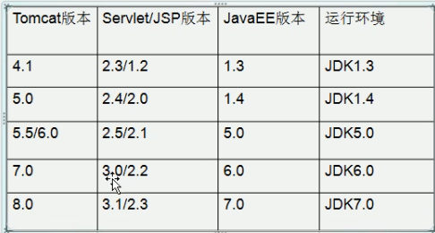
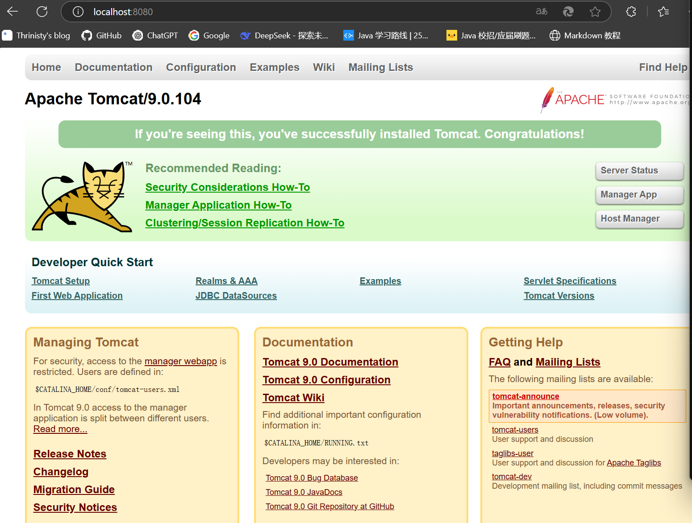
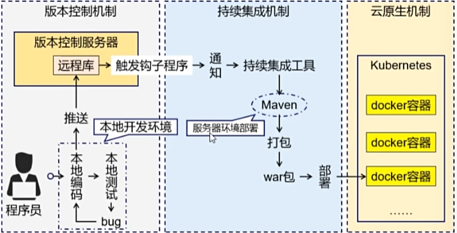
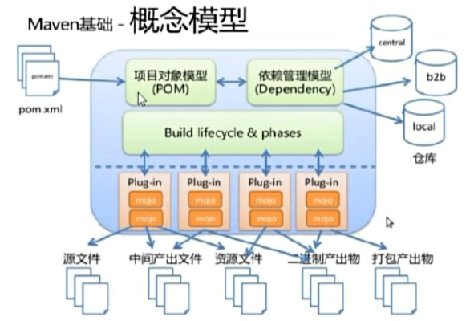

# JavaWeb笔记


## Tomcat

JavaWeb：所用通过Java语言编写可以通过浏览器访问的程序的总称，基于请求和响应来开发的

Web资源：根据资源实现的技术和呈现的效果不同，分为静态资源和动态资源

静态资源：html，css，js，txt，mp4，jpg

动态资源：jsp页面，Servlet程序

常见的服务器：Tomcat，Jboss，GlassFish，Resin，WebLogic


### 安装启动

版本对应



我使用的是tomcat9.0+Servlet4.0+JDK8

将Tomcat解压到你想要的路径下

在安装的bin目录下双击startup启动tomcat服务器，在浏览器中输入以下网址开启Tomcat服务页面

```
http://localhost:8080
```



如果在启动的时候出现黑框立马闪退，有可能是没有设置系统变量

变量：JAVA_HOME   值：安装的JDK目录

关闭：双击shutdown.bat关闭

在config目录下有一个server.xml配置文件，在其中可以修改端口号8080，可以改为一个你想要用的其他端口号替换，再重启Tomcat服务器即可完成修改


### 部署Web

#### 第一种方式

是需要把Web工程目录放入Tomcat的webapps目录下即可，这种方式比较方便

```web
http://localhost:8080/test/123.html
```

输入路径即可访问，其中的 http://localhost:8080 代表的就是webapps目录

在其他的设备通过输入部署的网络IP地址可以远程访问Web页面，例如

```
http://192.168.104.29:8080/test/123.html
```


#### 第二种方式

找到Tomcat下的conf目录apache-tomcat-9.0.104\conf\Catalina\localhost，创建配置文件，在其中设置路径即可访问对应路径下的Web工程，这种方式较为灵活

访问服务器的时候，只填入网址端口默认访问ROOT工程，没有地址名，访问index.html


### 动态web工程

使用详见

https://blog.csdn.net/weixin_45791445/article/details/104574239

可以在IDEA上创建动态的Web项目，并使用Tomcat部署Web服务


## Maven

推荐教程：可以快速上手，理解Maven相关概念以及使用方式

【一小时Maven教程】https://www.bilibili.com/video/BV1uApMeWErY?p=12&vd_source=586d101621a2629c1796f59df9143dff

Maven是一个依赖管理工具

通过Maven可以实现批量编译，组织文件结构，批量复制jar包




**依赖管理**

Maven可以管理项目依赖，包括自动下载依赖库，自动下载依赖之间没有冲突，以来版本管理，用户只需要编写配置即可

**构建管理**

项目构建是将源代码，配置文件，资源文件等转化为能够运行或者部署的应用程序或库的过程




Package定义规则

jar：代表普通的java工程，打包为jar结尾的文件

war：代表java的web工程

porn：代表不会打包，用以做继承的父工程

而maven通过pom.xml配置执行打包以及构建，其中仓库存放jar包（仓库又分为本地仓库，私服仓库，中央仓库）

setting.xml配置

```
<settings>
  <!-- 原有镜像配置保持不变 -->
  <mirrors>
    <mirror>
      <id>aliyunmaven</id>
      <url>https://maven.aliyun.com/repository/public</url>
      <mirrorOf>central</mirrorOf>
    </mirror>
  </mirrors>

  <!-- 新增以下配置 -->
  <profiles>
    <profile>
      <id>disable-remote-archetype</id>
      <properties>
        <!-- 强制使用本地 archetype 缓存 -->
        <archetypeCatalog>internal</archetypeCatalog>
      </properties>
    </profile>
  </profiles>

  <!-- 激活配置 -->
  <activeProfiles>
    <activeProfile>disable-remote-archetype</activeProfile>
  </activeProfiles>
</settings>
```

父子模块管理

在父工程中的pom文件下添加的依赖可以被子模块中使用，所有将公共的依赖放置在父工程中可以简化依赖，也可以设置为不默认继承依赖，而是手动集成父工程依赖
