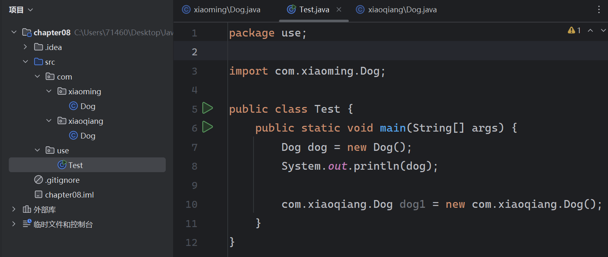

# 听课笔记

## IDEA的使用

IDEA支持30天试用，如果是学生或者教师可以在官网使用学校邮箱或者学信网获取授权使用

IDEA之中各种快捷键，定义模板，变量名，自动补全，自动添加导入可以极大地增加开发的效率

## Java中的包

包的本质是创建不同的文件夹来保存类文件

包有三个重大的作用

1.可以区分相同名字的类

2.当类很多的时候可以高效的管理类

3.控制访问范围

### 包的基本语法

package com.thrinisty

package 关键字 表示打包

com.thrinisty 表示包名

以下是一个包的入门案例

建立了两个包 小强的包 小明的包 在各自的包中定义了Dog方法

在use包中定义了主方法，主方法中可以导入小明的Dog类，但是再导入小强的Dog类因为方法同名，可以通过com.xiaoqiang.Dog()使用小强的Dog类



```java
package use;

import com.xiaoming.Dog;

public class Test {
    public static void main(String[] args) {
        Dog dog = new Dog();
        System.out.println(dog);

        com.xiaoqiang.Dog dog1 = new com.xiaoqiang.Dog();
    }
}

```

包的命名

命名规则，只能包含数子，字母，小圆点，但不能够是用数字开头，不能是关键字或保留字

命名规范

一般是小写字母 + 小圆点

com.公司名.项目名.业务模块名

```java
package com.sina.crm.user;
```

### Java中常用的包

1.lang 基本包，默认引入，不需要再次引入

```java
import java.lang.*;
```

2.util 工具包系统提供的工具类，例如Scanner

```java
import java.util.*
```

3.net 网络包，用于网络开发

```java
import java.net.*
```

4.awt 界面开发工具 GUI

```java
import java.awt.*
```

### 导入包

建议需要用哪个类就导入哪个类

```java
import java.util.Scanner;//导入Scanner类
import java.util.Scanner;//导入util下的所有类
```

```java
package com.npu.pkg;

import java.util.Arrays;
public class Import {
    public static void main(String[] args) {
        int[] arr = {13, 35, 16, 67, 33};
        Arrays.sort(arr);
        System.out.println(Arrays.toString(arr));
    }
}
```

用给定的 Arrays 方法排序输出


1.package 作用是声明当前类的包，需要放在类的最上面，一个类中最多只能有一个package

2.import 位置放在package下面，类定义的前面，可以导入多个包方法，且没有顺序要求

## 访问修饰符

1.public 公开 对外公开

2.protected 受保护的 对子类和同一个包公开

3.默认 向同一个包的类公开

4.private 私有的 只有类的本身可以访问，不对外公开


使用的注意事项

1.修饰符可以用来修饰类中的属性，成员方法，以及类的本身

2.只有默认和public才可以修饰类

代码示例：（以属性举例）

A类定义(同一个类中可以访问所有的变量)

```java
package com.npu.modifier;

public class A {
    public int n1 = 100;
    protected int n2 = 200;
    int n3 = 300;
    private int n4 = 400;
    //同一个类下可以访问所有的变量
    public void m1() {
        System.out.println(n1 + " " + n2 + " " + n3 + " " + n4);
    }
}
```

B类

```java
package com.npu.modifier;

public class B {
    public void test() {
        A a = new A();
        System.out.println(a.n1 + " " + a.n2 + " " + a.n3);
        //在同一个包下可以访问 默认 public protected 修饰的变量
        //不可以访问private修饰的n4属性
    }
}
```

C类的子类权限暂时不做验证，在讲完子类后再做演示

D类

```java
package com.npu.pkg;

import com.npu.modifier.A;
public class D {
    public void test() {
        A a = new A();
        System.out.println(a.n1);
        //在不同包下 只可以访问public修饰的属性方法
    }
}
```

主函数调用

```java
package com.npu.modifier;

import com.npu.pkg.D;

public class Main {
    public static void main(String[] args) {
        A a = new A();
        a.test();
        B b = new B();
        b.test();
        D d = new D();
        d.test();
    }
}
```

## 面向对象的三大特征

### 封装 

把抽象出来的属性和方法封装在一起，数据被保护在内部，程序的其他部分只有通过授权的方法才可以对于数据进行操作

好处：

1.可以隐藏实现的细节，不必对外展示，外部直接传入参数即可使用

2.可以对数据进行验证，保证安全合理

### 封装的实现步骤

1.将属性私有化

2.提供一个公共的 set 方法用于对属性进行判断以及赋值(伪代码)

```
public void setNum() {
	if(){
		set(Num);
	} else {
		sout(info)
	}
}
```

3.提供一个公共的 get 方法，用于获取某个属性的值

```
public 类型 getNum(){
	return data;
}
```

以下是一个代码示例

```java
package com.npu.encap;

public class Person {

    public String name;
    private int age;
    private double salary;

    public void setName(String name) {
        if(name.length() < 10) {
            this.name = name;
        } else {
            System.out.println("Name is too long");
        }
    }

    public void setSalary(double salary) {
        if(salary >= 0) {
            this.salary = salary;
        } else {
            System.out.println("illegal Salary");
        }
    }
    public void setAge(int age) {
        if(age >= 0 && age <= 120) {
            this.age = age;
        } else {
            System.out.println("illegal Age");
        }
    }
    public void print() {
        System.out.println("Name: " + name + " Age: " + age + " Salary: " + salary);
    }
}
```

主函数

```java
package com.npu.encap;

public class Main {
    public static void main(String[] args) {
        Person p = new Person();
        p.setSalary(500);
        p.setName("Nikola");
        p.setAge(18);
        p.print();
    }
}
```

也可以将构造器和封装结合起来

```java
public Person(String name, int age, double salary) {
        setName(name);
        setAge(age);
        setSalary(salary);
    }
```

```java
package com.npu.encap;

public class Main {
    public static void main(String[] args) {
        Person p = new Person("lory", 18, 3000);
        p.print();
    }
}
```

一个模拟银行注册的代码案例

主函数调用

```java
package com.npu.encap;

public class AccountTest {
    public static void main(String[] args) {
        Account account = new Account("thrinisy", 2000, "123");
        account.print();
    }
}
```

Account类

```java
package com.npu.encap;

public class Account {
    private String name;
    private double balance;
    private String password;

    public Account(String name, double balance, String password) {
        setName(name);
        setBalance(balance);
        setPassword(password);
    }
    public void setName(String name) {
        if(name.length() == 2 || name.length() == 3|| name.length() == 4) {
            this.name = name;
            System.out.println("设置成功，用户名是" + name);
        } else {
            this.name = "王女士";
            System.out.println("姓名必须要满足2-4位，设置为默认用户名字：王女士");
        }
    }
    public void setBalance(double balance) {
        if(balance > 20) {
            this.balance = balance;
            System.out.println("设置成功，余额为" + balance);
        } else {
            System.out.println("设置失败，余额必须大于20 ，赋初值位6666.6");
            this.balance = 6666.6;
        }
    }
    public void setPassword(String password) {
        if(password.length() == 6) {
            this.password = password;
            System.out.println("设置密码成功");
        } else {
            this.password = "123456";
            System.out.println("设置密码失败，密码必须为六位数，默认设置为123456");
        }
    }
    public void print() {
        System.out.println("name = " + name + ", balance = " + balance + ", password = " + password);
    }
}
```

运行结果

```plaintext
姓名必须要满足2-4位，设置为默认用户名字：王女士
设置成功，余额为2000.0
设置密码失败，密码必须为六位数，默认设置为123456
name = 王女士, balance = 2000.0, password = 123456
```

周末有事耽搁了，本来打算今天对于继承 多态收尾的，就把这两个部分放在明天来学习
