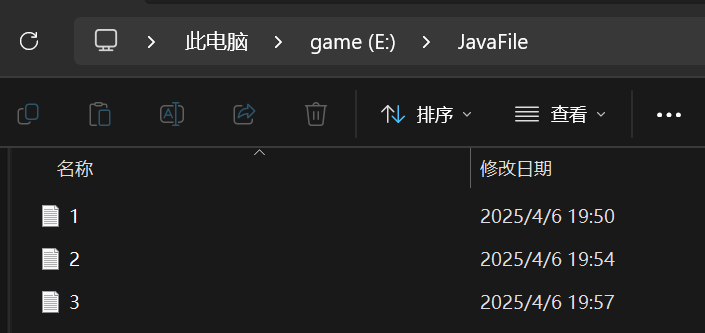
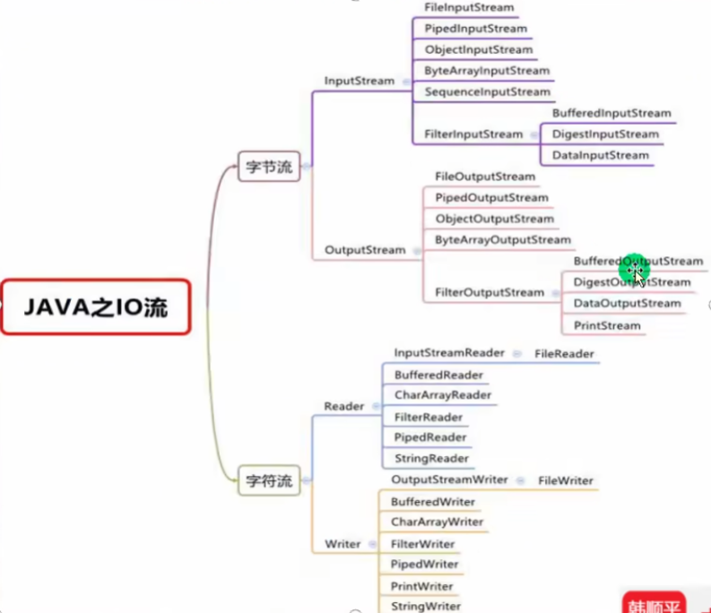
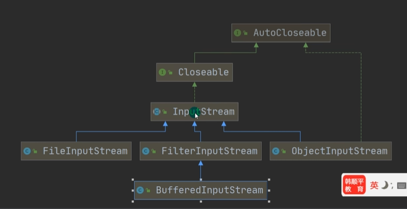
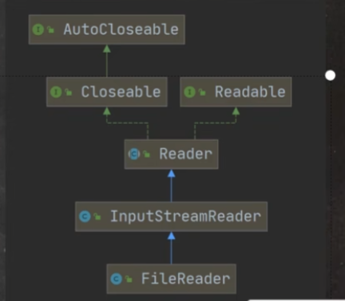
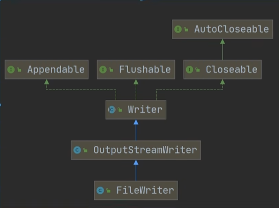
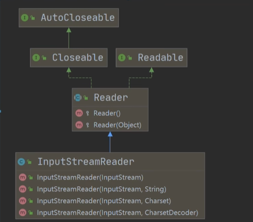
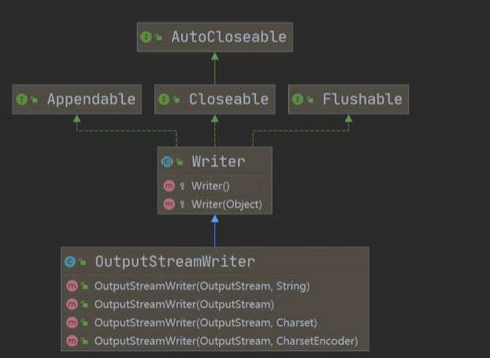
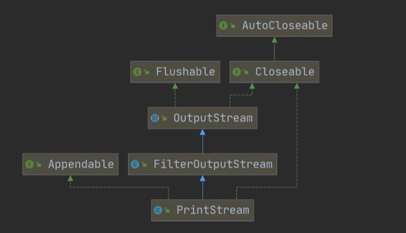
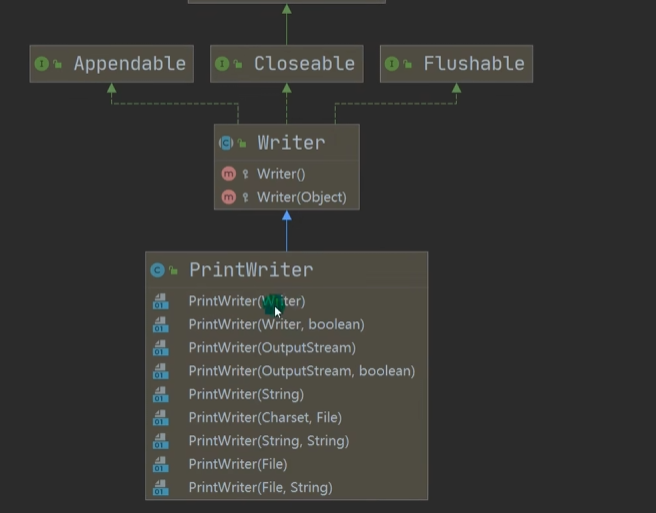

# Java笔记

IO流的部分我打算用两天的时间完成学习，再用一天来结束class以及反射的内容，Java的基础知识点就告一段落。

## 文件基础知识

文件在程序中是以流的形式来操作的

Java程序（内存）——输出流——>文件

文件——输入流——>Java程序（内存）


流：数据在数据源（文件）和程序（内存）之间经历的路径

输入流：数据从文件到程序的路径

输出流：数据从程序到文件的路径


## 常用的文件操作

### 创建文件

创建文件对象相关方法，注意只有调用createNewFile才会创建文件

方式一：通过路径创建文件对象，并创建文件

```java
@Test
    public void create01() {
        String filePath = "e:\\JavaFile\\1.txt";
        File file = new File(filePath);
        try {
            file.createNewFile();
            System.out.println("创建成功");
        } catch (IOException e) {
            System.out.println("创建文件失败");
        }
    }
```

方式二：通过父目录文件对象+文件名创建文件

```java
@Test
public void create02() {
    String filePath = "e:\\JavaFile";
    File file1 = new File(filePath);
    String fileName = "2.txt";
    File file2 = new File(file1, fileName);
    try {
        file2.createNewFile();
        System.out.println("创建成功");
    } catch (IOException e) {
        System.out.println("创建文件失败");
    }
}
```

方式三：通过父目录字符串+文件名创建文件

```java
@Test
public void create03() {
    String filePath = "e:\\JavaFile";
    String fileName = "3.txt";
    File file2 = new File(filePath, fileName);
    try {
        file2.createNewFile();
        System.out.println("创建成功");
    } catch (IOException e) {
        System.out.println("创建文件失败");
    }
}
```

文件都创建成功



### 获取文件名称

getName

```java
@Test
public void info() {
    File file = new File("e:\\1.txt");
    System.out.println(file.getName());//1.txt
}
```

### 获取文件绝对路径

getAbsolutePath

```java
@Test
public void info() {
    File file = new File("e:\\1.txt");
    System.out.println(file.getAbsolutePath());//e:\1.txt
}
```

### 获取父级目录

getParent

```java
@Test
public void info() {
    File file = new File("e:\\1.txt");
    System.out.println(file.getParent());//e:\
}
```

### 获取文件大小

length 字节

```java
    @Test
    public void info() {
        File file = new File("e:\\JavaFile\\1.txt");//6 
        //文件里是 你好 中文字符在UTF-8占三个字节
        System.out.println(file.length());//6 
    }
```

### 检测文件是否存在

exists

```java
@Test
public void info() {
    File file = new File("e:\\JavaFile\\1.txt");
    System.out.println(file.exists());//true
}
```

### 检测是不是文件

isFile

```java
@Test
public void info() {
    File file = new File("e:\\JavaFile\\1.txt");
    System.out.println(file.isFile());//true
}
```

### 检测是不是目录

isDirectory

```java
@Test
public void info() {
    File file = new File("e:\\JavaFile\\1.txt");
    System.out.println(file.isFile());//false
}
```

### 创建目录

#### 创建一级目录

mkdir

```java
@Test
public void mkdir() {
    String filePath = "e:\\JavaFile\\New";
    File file = new File(filePath);
    if (!file.exists()) {
        file.mkdir();
        System.out.println(filePath + " 目录创建");
    } else {
        System.out.println("目录已存在");
    }
}
```

#### 创建多级目录

mkdirs

```java
@Test
public void mkdirs() {
    String filePath = "e:\\JavaFile\\New\\another\\other";
    File file = new File(filePath);
    if (!file.exists()) {
        file.mkdirs();
        System.out.println(filePath + " 目录创建");
    } else {
        System.out.println("目录已存在");
    }
}
```

### 删除空目录或文件

delete

```java
@Test
public void delete() {
    String filePath = "e:\\JavaFile\\1.txt";
    File file = new File(filePath);
    if (file.exists()) {
        file.delete();
        System.out.println(filePath + "被删除");//1.txt被删除
    } else {
        System.out.println("文件不存在");
    }
}
```


## Java IO流原理

1.I/O是Input/Output的缩写，I/O技术是非常实用的技术，用于处理数据传输，如读写文件，网络通讯等

2.Java程序中，对于数据的输入/输出以 流 ”stream“ 的方式进行。

3.java.io包下提供了各种“流”类和接口，以获取不同种类的数据，并通过方法输入或者输出数据

4.输入input：读取外部数据（磁盘，光盘的设备的数据）到程序（内存）中

5.输出output：将程序（内存）数据输出到磁盘，光盘等存储设备中


### 流的分类

按照操作数据单位不同分为：字节流（8bit），字符流（按字符）

按照数据流向分为：输入，输出流

按照流的角色不同分为：节点流，处理流，包装流


### 四个抽象基类

| 抽象基类 | 字节流       | 字符流 |
| -------- | ------------ | ------ |
| 输入流   | InputStream  | Reader |
| 输出流   | OutputStream | Writer |

1.Java的IO流设计40多个类，实际上非常规则，都是从如上的4个抽象基类派生的

2.由这四个派生出来的子类名称都是以其父类民作为子类名后缀。






## 文件输入输出流

### FileInputStream

文件输入流

#### 构造方法

传入文件对象 File

传入文件描述符 

传入文件路径字符串 String


#### 流循环读取单个字节

当文件字节读取完毕时返回-1

```java
public class Stream {
    public static void main(String[] args) {
        String filePath = "e:\\JavaFile\\2.txt";
        int readData = 0;
        InputStream inputstream = null;
        try {
            inputstream = new FileInputStream(filePath);//创建文件对象流

            while ((readData = inputstream.read()) != -1) {
                System.out.print((char)readData);
            }
        } catch (IOException e) {
            System.out.println("没有找到文件...");
        } finally {
            try {
                inputstream.close();
            } catch (IOException e) {
                throw new RuntimeException(e);
            }
        }
    }
}
```


#### 使用字节流数组读取

在read中添加一个byte数组参数，如果读取正常返回一个读取到的字节数

再通过返回的字节数根据buf字节数组用String构造一个字符串（从0到每次读取到的字节数）输出

```java
public class Stream {
    public static void main(String[] args) {
        String filePath = "e:\\JavaFile\\2.txt";
        int readLen = 0;
        byte[] buf = new byte[8];
        InputStream inputstream = null;
        try {
            inputstream = new FileInputStream(filePath);//创建文件对象流
            while ((readLen = (inputstream.read(buf)) )!= -1) {
                System.out.println(new String(buf, 0, readLen));
            }
         //Hello Wo
		//rld!!
        } catch (IOException e) {
            System.out.println("没有找到文件...");
        } finally {
            try {
                inputstream.close();
            } catch (IOException e) {
                throw new RuntimeException(e);
            }
        }
    }
}
```


### FileOutputStream

文件字节输出流

#### 写入单个字符

```java
public class OUTSTREAM {
    public static void main(String[] args) {
        File file = new File("e:\\JavaFile\\4.txt");
        FileOutputStream fos = null;

        try {
            fos = new FileOutputStream(file);
            //如果没有文件会创建文件
            fos.write('A');
        } catch (IOException e) {
            throw new RuntimeException(e);
        } finally {
            try {
                fos.close();
            } catch (IOException e) {
                throw new RuntimeException(e);
            }
        }
    }
}
```

#### 写入一个字节数组

```java
public class OUTSTREAM {
    public static void main(String[] args) {
        File file = new File("e:\\JavaFile\\4.txt");
        FileOutputStream fos = null;
        String target = "Hello World!";
        byte[] buffer = target.getBytes();
        //通过getBytes得到字节数组
        try {
            fos = new FileOutputStream(file);
            fos.write(buffer, 0, buffer.length);
            //后两个参数可选左闭右包，无则将调用如上形式
        } catch (IOException e) {
            throw new RuntimeException(e);
        } finally {
            try {
                fos.close();
            } catch (IOException e) {
                throw new RuntimeException(e);
            }
        }
    }
}
```

#### 追加内容

以上是将目标文件直接进行内容更新，如果要添加内容则需要在构造器里添加第二个boolean参数（设置为true）

```java
fos = new FileOutputStream(file, true);
```

#### 文件拷贝

运用文件输入流和文件输出流来进行文件的拷贝

##### 单个字节流

```java
package com;

import java.io.*;

public class FileCopy {
    public static void main(String[] args) {
        String inputPath = "e:\\JavaFile\\1.jpg";
        String outputPath = "e:\\JavaFile\\New\\3.jpg";
        FileInputStream fis = null;
        FileOutputStream fos = null;
        int target;
        try {
            fis = new FileInputStream(inputPath);
            fos = new FileOutputStream(outputPath);
            while((target = fis.read()) != -1) {
                fos.write(target);
            }
        } catch (IOException e) {
            System.out.println("发生异常");
        } finally {
            try {
                fis.close();
                fos.close();
            } catch (IOException e) {
                throw new RuntimeException(e);
            }
        }
    }
}
```

##### 字节流数组

```java
package com;

import java.io.*;

public class FileCopy {
    public static void main(String[] args) {
        String inputPath = "e:\\JavaFile\\1.jpg";
        String outputPath = "e:\\JavaFile\\New\\3.jpg";
        FileInputStream fis = null;
        FileOutputStream fos = null;
        int bufLength = 0;
        byte[] buffer = new byte[1024];
        try {
            fis = new FileInputStream(inputPath);
            fos = new FileOutputStream(outputPath);
            while((bufLength = fis.read(buffer)) != -1) {
                for (int i = 0; i < bufLength; i++) {
                    fos.write(buffer[i]);
                }
            }
        } catch (IOException e) {
            System.out.println("发生异常");
        } finally {
            try {
                fis.close();
                fos.close();
            } catch (IOException e) {
                throw new RuntimeException(e);
            }
        }
    }
}
```

```java
package com;

import java.io.*;

public class FileCopy {
    public static void main(String[] args) {
        String inputPath = "e:\\JavaFile\\1.jpg";
        String outputPath = "e:\\JavaFile\\New\\4.jpg";
        FileInputStream fis = null;
        FileOutputStream fos = null;
        int bufLength = 0;
        byte[] buffer = new byte[1024];
        try {
            fis = new FileInputStream(inputPath);
            fos = new FileOutputStream(outputPath);
            while((bufLength = fis.read(buffer)) != -1) {
                fos.write(buffer, 0, bufLength);
            }
        } catch (IOException e) {
            System.out.println("发生异常");
        } finally {
            try {
                fis.close();
                fos.close();
            } catch (IOException e) {
                throw new RuntimeException(e);
            }
        }
    }
}
```


## 字符输入输出流

相比于文件字节流而言，当读取到由多个字节组成的字符（例如中文）会将多个字节传为字符读出

### FileReader



相关方法

构造方法:传入文件对象或者文件路径字符串

```java
new FileReader(File\String);
```

read:读取单个字符，返回字符如果读取到-1代表到达文件末尾

```java
public class FileReader01 {
    public static void main(String[] args) {
        String inputPath = "e:\\JavaFile\\2.txt";
        String outputPath = "e:\\JavaFile\\New\\1.txt";
        FileReader filereader = null;
        int target;
        try {
            filereader = new FileReader(inputPath);
            while((target = filereader.read()) != -1) {
                System.out.print((char)target);
            }
        } catch (IOException e) {
            System.out.println("发生异常");
        } finally {
            try {
                filereader.close();
            } catch (IOException e) {
                throw new RuntimeException(e);
            }
        }
    }
}
```

read（char[]）:读取多个字符到字符数组，返回读到的字符数

```java
public class FileReader01 {
    public static void main(String[] args) {
        String inputPath = "e:\\JavaFile\\2.txt";
        String outputPath = "e:\\JavaFile\\New\\1.txt";
        FileReader filereader = null;
        char[] buffer = new char[4];
        int length;
        try {
            filereader = new FileReader(inputPath);
            while((length = filereader.read(buffer)) != -1) {
                String target = new String(buffer, 0, length);
                System.out.print(target);
            }
        } catch (IOException e) {
            System.out.println("发生异常");
        } finally {
            try {
                filereader.close();
            } catch (IOException e) {
                throw new RuntimeException(e);
            }
        }
    }
}
```

### FileWriter



常用方法：

write(int):写入单个字符

write(char[ ]):写入指定数组

write(char[], off, len):写入数组指定部分

write(string):写入整个字符串

write(string, off, len):写入字符串指定部分

注意：当FileWriter使用后，必须要使用close关闭或者flush刷新后才可以写入完成

以下是一个代码示例：

```java
public class FileWriter01 {
    public static void main(String[] args) {
        String outputPath = "e:\\JavaFile\\New\\1.txt";
        FileWriter filewriter = null;
        char[] buffer = "风雨之后，遇见彩虹".toCharArray();
        try {
            filewriter = new FileWriter(outputPath);
            filewriter.write(buffer, 0, buffer.length);
            filewriter.flush();//在完成写之后记得刷入
        } catch (IOException e) {
            System.out.println("发生异常");
        } finally {
            try {
                filewriter.close();
            } catch (IOException e) {
                throw new RuntimeException(e);
            }
        }
    }
}
```

## 节点流和处理流

### 节点流

节点流可以从一个特定的数据源读写数据，例如FileReader，FileWriter

### 处理流

处理流（包装流）是连接已存在的流（节点流或处理流）之上，为程序提供更为强大的读写功能，如BufferedReader，BufferedWriter，更加灵活


处理流具体功能

1.性能的提高：主要以增加缓冲的方式来提高输入输出的效率

2.操作的便捷：处理流可能提供了一系列便捷的方法来一次输入输出大批量的数据，使用更加的灵活


### 区别与联系

1.节点流是底层流/低级流，直接和数据源相接

2.处理流包装节点流，既可以消除不同节点流的实现差异，也可以提供方便的方法来完成输入输出

3.处理流对节点流进行了包装，使用了修饰器设计模式，不会直接与数据源相连接


### 修饰器设计模式示例

我们来模拟一下处理流封装节点流，有点类似于之前提到的代理模式

但是还是有些区别：装饰器关注于动态添加功能，代理关注于控制访问

```java
public class Test {
    public static void main(String[] args) {
        BufferedReader_ bufferedReader = new BufferedReader_(new FileReader_());
        System.out.println("拓展的Read方法");
        bufferedReader.readFiles(3);
    }
}

class BufferedReader_ extends Reader_ {
    private Reader_ reader_;

    public BufferedReader_(Reader_ reader_){
        this.reader_ = reader_;
    }

  	//将原本的reader方法封装在修饰器中
    public void readFile() {
        reader_.readFile();
    }  
  
    //在BufferedReader_中可以添加FileReader_的方法（拓展修饰）
    public void readFiles(int num) {
        for (int i = 0; i < num; i++) {
            reader_.readFile();
        }
    }
}

abstract class Reader_ {
    public void readFile(){}
    public void readString(){}
}

class FileReader_ extends Reader_{
    public void readFile() {
        System.out.println("对文件进行读取...");
    }
}

class StringReader_ extends Reader_{
    public void readString() {
        System.out.println("对字符串进行读取...");
    }
}
```

通过这样的方式我们可以通过构造的处理流来调用更具有便捷性的方法来操作节点流。


### 字符处理流

#### BufferedReader

在其中有属性Reader，可以封装一个节点流（可以是任意的Reader子类），还有一个char数组

```java
public class BufferedReader extends Reader {

    private Reader in;

    private char cb[];
```

以下是一个代码示例，我们将文件的输入字符流放在了创建的读入字符处理流里，通过这个处理流调用读取下一行方法读取内容，并且输出

readLine方法，返回字符串类型，如果读完就返回null

```java
public class BufferedReader01 {
    public static void main(String[] args) {
        String filePath = "e:\\JavaFile\\2.txt";
        FileReader filereader = null;
        BufferedReader bufferedreader = null;

        try {
            filereader = new FileReader(filePath);
            bufferedreader = new BufferedReader(filereader);
            String line;
            while ((line = bufferedreader.readLine()) != null) {
                System.out.println(line);
            }
            System.out.println(line);
        } catch (IOException e) {
            throw new RuntimeException(e);
        } finally {
            try {
                bufferedreader.close();//关闭外层流即可
            } catch (IOException e) {
                throw new RuntimeException(e);
            }
        }
    }
}
```

```
你好！！Hello World!!
我来自于西安
你好
null
```

注意在释放资源的时候只需要关闭外层流即可，在调用的时候会将Reader的in释放

```java
public void close() throws IOException {
    synchronized (lock) {
        if (in == null)
            return;
        try {
            in.close();
        } finally {
            in = null;
            cb = null;
        }
    }
}
```

#### BufferedWriter

在其中有属性Writer，可以封装一个节点流（可以是任意的Writer子类），还有一个char数组

```java
public class BufferedWriter extends Writer {

    private Writer out;

    private char cb[];
```

用处理流写入内容

可以使用newLine插入换行符（根据操作系统对应的换行符）

```java
public class BufferedWriter01 {
    public static void main(String[] args) {
        String filePath = "e:\\JavaFile\\2.txt";
        FileWriter filewriter = null;
        BufferedWriter bufferwriter = null;
        try {
            filewriter = new FileWriter(filePath, true);
            //在节点流设置追加模式
            bufferwriter = new BufferedWriter(filewriter);
            bufferwriter.write("处理流写入");
            bufferwriter.newLine();//插入一个换行符
            bufferwriter.write("处理流写入");
            bufferwriter.newLine();//插入一个换行符
            bufferwriter.write("处理流写入");
            bufferwriter.newLine();//插入一个换行符
            bufferwriter.flush();
        } catch (IOException e) {
            throw new RuntimeException(e);
        } finally {
            try {
                bufferwriter.close();
            } catch (IOException e) {
                throw new RuntimeException(e);
            }
        }
    }
}
```

处理流字符文件拷贝案例（不可以拷贝视频，图片，音频）

```java
package com;

import java.io.*;

public class BufferedWriter01 {
    public static void main(String[] args) {
        String targetFilePath = "e:\\JavaFile\\target.txt";
        FileWriter filewriter = null;
        BufferedWriter bufferwriter = null;

        String srcFilePath = "e:\\JavaFile\\src.txt";
        FileReader filereader = null;
        BufferedReader bufferreader = null;
        try {
            filewriter = new FileWriter(targetFilePath, true);
            bufferwriter = new BufferedWriter(filewriter);
            filereader = new FileReader(srcFilePath);
            bufferreader = new BufferedReader(filereader);
            String line;
            while ((line = bufferreader.readLine()) != null) {
                bufferwriter.write(line);
                bufferwriter.newLine();
            }
            bufferwriter.flush();
        } catch (IOException e) {
            throw new RuntimeException(e);
        } finally {
            try {
                bufferwriter.close();
                bufferreader.close();
            } catch (IOException e) {
                throw new RuntimeException(e);
            }
        }
    }
}
```

### 字节处理流

#### BufferedInputStream

#### BufferedOutputStream

通过拷贝案例说明使用方式

```java
package com;

import java.io.*;

public class BufferedWriter01 {
    public static void main(String[] args) {
        String targetFilePath = "e:\\JavaFile\\2.jpg";
        FileOutputStream fos = null;
        BufferedOutputStream bos = null;

        String srcFilePath = "e:\\JavaFile\\1.jpg";
        FileInputStream fis = null;
        BufferedInputStream bis = null;
        try {
            fos = new FileOutputStream(targetFilePath);
            fis = new FileInputStream(srcFilePath);
            bos = new BufferedOutputStream(fos);
            bis = new BufferedInputStream(fis);
            byte[] buffer = new byte[1024];
            int length;
            while((length = bis.read(buffer)) != -1) {
                bos.write(buffer, 0 , length);
            }
        } catch (IOException e) {
            throw new RuntimeException(e);
        } finally {
            try {
                bos.close();
                bis.close();
            } catch (IOException e) {
                throw new RuntimeException(e);
            }
        }
    }
}
```

## 对象处理流

在实际开发中我们可能会需要保存对象，和从文件中恢复对象（要求保存数据类型）这个时候我们就会需要到 对象处理流（专门用于处理对象）

### 序列化和反序列化

1.序列化就是在保存数据的时候，保存数据的值和数据类型

2.反序列化就是在恢复数据时，恢复数据的值和数据类型

3.需要让某个对象支持序列化机制，我们就必须让其类是可序列化的，类需要实现Serializable接口或者Externalizable接口（推荐使用第一个标记接口，没有方法）（后一个需要实现方法）

### 对象输入输出流

#### ObjectOutputStream

**实际案例**

我们需要保存int型的数据

```java
int n = 100;
```

保存一个Dog类型的数据

```java
Dog dog = new Dog("来福", 18);
```

```java
public class ObjectClass {
    public static void main(String[] args) {
        String filePath = "e:\\JavaFile\\data.dat";
        ObjectOutputStream oos = null;
        FileOutputStream fos = null;
        try {
            fos = new FileOutputStream(filePath);
            oos = new ObjectOutputStream(fos);
            oos.write(100);//保存整形100
            oos.writeObject(new Dog("来福", 18));
            //保存狗类示例对象
        } catch (IOException e) {
            throw new RuntimeException(e);
        } finally {
            try {
                oos.close();
            } catch (IOException e) {
                throw new RuntimeException(e);
            }
        }
    }
}

class Dog implements Serializable {
    String name;
    int age;

    public Dog(String name, int age) {
        this.name = name;
        this.age = age;
    }
    
    @Override
    public String toString() {
        return name + " " + age;
    }
}
```


#### ObjectInputStream

接下来我们来从文件中恢复对象（反序列化）

在回复对象的Java文件下应该也有类的定义，要求类的定义完全相同，因为这里因为在同一个包下，可以不用再打一次（或者建议把Dog单独写成一个共有的类）

```java
public class ObjectClassRead {
    public static void main(String[] args) {
        String filePath = "e:\\JavaFile\\data.dat";
        ObjectInputStream ois = null;
        FileInputStream fis = null;
        try {
            fis = new FileInputStream(filePath);
            ois = new ObjectInputStream(fis);
            int i = ois.read();
            Object obj = ois.readObject();//运行类型是Dog
            System.out.println(i);
            System.out.println(obj);
        } catch (Exception e) {
            throw new RuntimeException(e);
        } finally {
            try {
                ois.close();
            } catch (IOException e) {
                throw new RuntimeException(e);
            }
        }
    }
}
```

```
100
来福 18
```

### 对象处理流的细节

1.读写顺序要求一致（例如前一道题目先传入int再传入Dog，读的时候先int再Dog）

2.要求实现序列化或者反序列化对象（实现Serializable接口）

3.序列化的类中建议添加Serial Version UID 以提高版本的兼容性（修改类的时候会认为是原来的升级版本，而非全新的类）

4.序列化对象的时候，默认将里面的所有属性都进行序列化，但除了static和transient关键字修饰的成员

5.序列化对象时，要求对象属性的类型也都实现了序列化接口

6.序列化具备可继承性，即某类实现了序列化，则它的子类也默认实现了序列化


## 标准输入输出流

### System.in 标准输入

默认设备为键盘

```java
public final static InputStream in = null;
```

我们在使用Scanner的时候传入的就是我们的标准输入流

```java
Scanner scanner = new Scanner(System.in);
```


编译类型为InputStream，运行时类型为BufferedInputStream

```java
public class InputAndOutput {
    public static void main(String[] args) {
        System.out.println(System.in.getClass());
    }
}
```

```cmd
class java.io.BufferedInputStream
```


### System.out 标准输出

默认设备为显示器

```java
public final static PrintStream out = null;
```

我们在用sout打印的时候，用的就是这个输出流到终端


编译类型和运行时类型为PrintStream

```java
public class InputAndOutput {
    public static void main(String[] args) {
        System.out.println(System.out.getClass());
    }
}
```

```
class java.io.PrintStream
```


## 转换流

### 问题引出

我们在读取文件的时候使用的是UTF-8

```java
public class transformation {
    public static void main(String[] args) throws Exception {
        String filePath = "e:\\JavaFile\\2.txt";
        BufferedReader bufferedReader = new BufferedReader(new FileReader(filePath));
        String s = bufferedReader.readLine();
        System.out.println(s);
    }
}
```

如果在读取非UTF-8的时候，可能就会读出乱码

这个时候我们就需要运用转换流将字节流指定格式转为字符流即可解决问题

### InputStreamReader



Reader的子类，可以将InputStream（字节流）包装成为Reader（字符流）

其中有一个非常重要的构造方法（InputStream,Charset）后一个参数指定编码格式

使用方式

```java
public class transformation {
    public static void main(String[] args) throws Exception {
        String filePath = "e:\\JavaFile\\2.txt";
        FileInputStream fis = new FileInputStream(filePath);//获取文件字节流
        InputStreamReader isr = new InputStreamReader(fis, "UTF-8");//将字节流指定编码转为字符流
        BufferedReader bufferedReader = new BufferedReader(isr);//将字符流放入字符处理流
        String s = bufferedReader.readLine();
        System.out.println(s);
        bufferedReader.close();
    }
}
```


### OutputStreamWriter



Writer的子类，可以将OutputStream（字节流）包装成为Writer（字符流）

也有一个构造器（OutputStream,Charset）后一个参数指定编码格式

```java
public class transformation {
    public static void main(String[] args) throws Exception {
        String filePath = "e:\\JavaFile\\2.txt";
        BufferedWriter bufferwrite = new BufferedWriter(new OutputStreamWriter(new FileOutputStream(filePath), "UTF-8"));
        bufferwrite.write("你好！！");
        bufferwrite.close();
    }
}
```


## 打印流

### PrintStream

打印字节流



```java
public class PrintStream_ {
    public static void main(String[] args) {
        PrintStream out = System.out;
        out.print("你好");//运用打印输出流可以输出到显示器
    }
}
```

print调用了write，也可以直接调用write方法进行打印

```java
public void print(String s) {
    if (s == null) {
        s = "null";
    }
    write(s);
}
```

我们也可以调用System.setOut来设置System.out打印输出流的位置

```java
public class PrintStream_ {
    public static void main(String[] args) throws IOException {
        System.setOut(new PrintStream("e:\\JavaFile\\1.txt"));
        PrintStream out = System.out;
        out.write("你好".getBytes());
        out.close();
    }
}
```


### PrintWriter

打印字符流



```java
public class PrintStream_ {
    public static void main(String[] args) throws IOException {
        PrintWriter printWriter = new PrintWriter(System.out);
        printWriter.print("hello");
        printWriter.close();//需要用close关闭后刷入
    }

    @Test
    public void test() throws IOException {
        String filePath = "e:\\JavaFile\\1.txt";
        PrintWriter printWriter = new PrintWriter(new FileWriter(filePath));
        printWriter.print("hello");
        printWriter.close();//需要用close关闭后刷入
    }
}
```

## Properties

在讲集合的时候曾提到过

1.专门用于读写配置文件的集合类，格式如下

```
键=值
键=值
```

2.注意键值对不需要有空格，值不需要用引号括起来，默认类型是String


### 常见方法

#### load 

加载配置文件的键值对到Properties对象

```java
String filePath = "e:\\JavaFile\\mysql.properties";
Properties properties = new Properties();
properties.load(new FileReader(filePath));//加载文件到对象
```


#### list

将数据显示到指定设备

```java
properties.list(System.out);//将键值对打印在控制台
```

```property
user=root
pwd=12345
ip=127.0.0.1
```

#### getProperty(key)

根据键获取值

```java
String user = properties.getProperty("user");
String pwd = properties.getProperty("pwd");
System.out.println(user + " " + pwd);
```

```java
root 12345
```


#### setProperty(key)

根据键值设置到Properties对象

#### store

将Properties的键值对存储到配置文件中

```java
public class IPIP {
    public static void main(String[] args) throws IOException {
        String filePath = "e:\\JavaFile\\another.properties";
        Properties properties = new Properties();
        properties.setProperty("charset", "utf8");
        properties.setProperty("user", "tom");
        properties.setProperty("pwd", "123456");
        properties.store(new FileOutputStream(filePath), null);
    }
}
```


### 使用场景

有一个配置文件mysql.properties如下

```properties
ip = 127.0.0.1
user = root
pwd = 12345
```

#### 传统方式实现

我们需要使用文件IO进行读取ip，user，pwd比较复杂

通过处理流读取每一行字符串数据，再通过字符串拆分处理

```java
public class IPIP {
    public static void main(String[] args) throws IOException {
        String filePath = "e:\\JavaFile\\mysql.properties";
        BufferedReader br = new BufferedReader(new InputStreamReader(new FileInputStream(filePath), "UTF-8"));
        String line;
        while ((line = br.readLine()) != null) {
            String[] targerArr = line.split("=");
            System.out.println(targerArr[0] + " 内容是 " + targerArr[1]);
        }

        br.close();
    }
}
```


#### Properties类实现

我们可以使用Properties类方便实现

```java
public class IPIP {
    public static void main(String[] args) throws IOException {
        String filePath = "e:\\JavaFile\\mysql.properties";
        Properties properties = new Properties();
        properties.load(new FileReader(filePath));//加载配置文件到对象
        properties.list(System.out);//将键值对打印在控制台
        String user = properties.getProperty("user");
        String pwd = properties.getProperty("pwd");
        System.out.println(user + " " + pwd);
    }
}
```

# IO章节作业

## 例题一：

1.判断e盘下是否有文件夹mytemp，没有则创建mytemp

2.再mytemp目录下创建文件hello.txt

3.如果hello.txt存在，就提示已存在，不再重复创建

```java
public class HomeWork01 {
    public static void main(String[] args) {
        File directory = new File("e:\\mytemp");
        File file = new File(directory, "hello.txt");

        if (directory.isDirectory()) {
            System.out.println("已存在该目录");
        } else {
            if (directory.mkdir()) {
                System.out.println("创建成功");
            } else {
                System.out.println("创建失败");
            }
        }

        if (file.exists()) {
            System.out.println("已存在该文件");
        } else {
            try {
                if (file.createNewFile()) {
                    System.out.println("创建成功");
                } else {
                    System.out.println("创建失败");
                }
            } catch (IOException e) {
                throw new RuntimeException(e);
            }
        }
    }
}
```

## 例题二：

用BufferedReader读取一个文本文件，为每行加上行号，再将内容输出到屏幕上

```java
public class Homework02 {
    public static void main(String[] args) throws IOException {
        String filePath = "e:\\JavaFile\\src.txt";
        BufferedReader br = new BufferedReader(new FileReader(filePath));
        String line;
        int count = 1;
        while((line = br.readLine()) != null) {
            System.out.print(count++ + " " + line + "\n");
        }
        br.close();
    }
}
```

运行结果

```
1 这是一个
2 处理流拷贝的
3 测试案例
```

## 例题三：

1.编写一个dog.properties配置文件

```properties
name = tom
age = 5
color = red
```

2.编写Dog（name，age，color）类，创建一个对象，读取dog配置文件中的内容完成初始化，输出

3.将创建的Dog对象序列化输出到dog.txt文件


同理我们也可以将文件反序列化，读出

```java
package com.stander;

import java.io.*;
import java.util.Properties;


public class IPIP {
    public static void main(String[] args) throws IOException, ClassNotFoundException {
        String filePath = "e:\\JavaFile\\dog.properties";
        Properties properties = new Properties();
        properties.load(new FileInputStream(filePath));
        String name = properties.getProperty("name");
        String age = properties.getProperty("age");
        String color = properties.getProperty("color");
        Dog dog = new Dog(name, age, color);
        System.out.println(dog);

        String savePath = "e:\\JavaFile\\save.dat";
        ObjectOutputStream oos = new ObjectOutputStream(new FileOutputStream(savePath));
        oos.writeObject(dog);

        ObjectInputStream ois = new ObjectInputStream(new FileInputStream(savePath));
        Dog another = (Dog) ois.readObject();
        System.out.println(another);
    }
}

class Dog implements Serializable {
    String name;
    String age;
    String color;

    public Dog(String name, String age, String color) {
        this.name = name;
        this.age = age;
        this.color = color;
    }

    @Override
    public String toString() {
        return name + " " + age + " " + color;
    }
}
```
