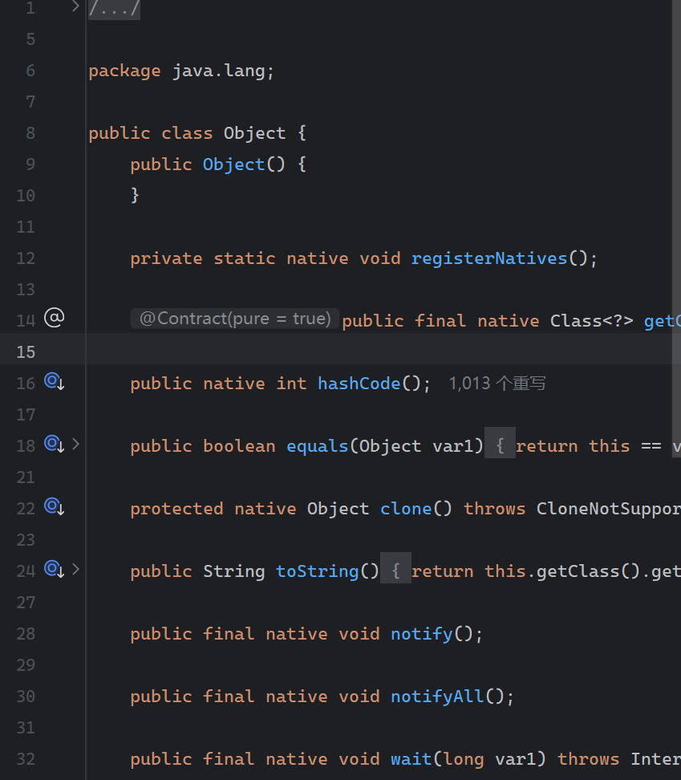
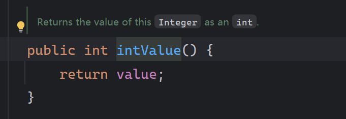

# 听课笔记

## Object类

这一章会介绍object类的方法

通过自动配置或者手动配置后可以运用IDEA查看Object的源代码以及其对应的方法，点击右键跳转，或者ctrl + 左键 跳转



Object的子类String方法进行重写更改为，此时判断的是内容


整形的包装类equals判断方法




查看源码查看方法重写是程序员重要的技能

### equals方法

在不重写equals方法的时候，Person类使用的是父类object的方法，这个时候判断的是两个引用是否指向同一个对象，如果需要用equals判断内容是否一致的时候需要重写方法

```java
package com.npu.object;

public class Equals01 {
    public static void main(String[] args) {
        Person person1 = new Person("l", 1, '女');
        Person person2 = new Person("k", 1, '女');
        if(person2.equals(person1)) {
            System.out.println("Person 1 and Person 2 are equal");
        }
    }
}

class Person {
    private String name;
    private int age;
    private char gender;

    public Person(String name, int age, char gender) {
        this.name = name;
        this.age = age;
        this.gender = gender;
    }
    public boolean equals(Object obj) {
        if(this == obj) {
            return true;
        }
        if(obj instanceof Person) {
            Person person = (Person)obj;
            return person.name == person.name && this.age == person.age && this.gender == person.gender;
        }
        return false;
    }
}
```

### hashCode方法

源码

```java
public native int hashCode();
```

1.两个引用如果指向同一个对象，则哈希值一定是一样的

```java
package com.npu.object;

public class Hashcode {
    public static void main(String[] args) {
        AA aa1 = new AA();
        AA aa2 = new AA();
        AA aa3 = aa1;
        System.out.println(aa1.hashCode());
        System.out.println(aa2.hashCode());
        System.out.println(aa3.hashCode());
    }
}

class AA {}
/*运行结果
	1163157884
	1956725890
	1163157884
*/
```

2.可以提高有哈希结构的容器效率

3.哈希值是根据地址计算而来，但是不能够等价于地址（Java中代码是跑在虚拟机上的，不用关注于底层）

### toString方法

源码

```java
public String toString() {
        return getClass().getName() + "@" + Integer.toHexString(hashCode());
    }
```

全类名 + @ + 类的哈希地址十六进制

全类名为 包名 + 类名

```
com.npu.object.AA@4554617c
```

一般而言我们会将Object类的toString方法进行重写，用于打印各个详细的属性信息

当输出一个对象的时候，我们默认会调用这个对象的toString 方法进行输出

以下是一个代码示例

```java
package com.npu.object;

public class Hashcode {
    public static void main(String[] args) {
        AA aa = new AA();
        System.out.println(aa);
    }
}

class AA {
    int i;
    double m;

    public String toString() {
        return "AA{i=" + i + ", m=" + m + "}";
    }
}
```

### finalize方法

当垃圾回收器检测到没有指向该对象的引用时，系统自动调用该对象的finalize方法，进行资源释放

```java
 AA aa = new AA();
 System.out.println(aa);
 aa = null;
```

当执行完毕的时候 AA的实例变为一个 垃圾 ，垃圾回收器就会被回收分配的堆空间

程序员可以在销毁方法finalize 写一些自己的业务逻辑（通过重写finalize方法完成）

```java
package com.npu.object;

public class Hashcode {
    public static void main(String[] args) {
        AA aa = new AA();
        aa = null;
        System.out.println("代码结束");
    }
}

class AA {
    int i;
    double m;

    public String toString() {
        return "AA{i=" + i + ", m=" + m + "}";
    }
    @Override
    protected void finalize() throws Throwable {
        System.out.println("Finalize called");
        super.finalize();
    }
}
```

当回收的时候会输出对应的提示信息

但是如上代码不会输出信息，因为回收调用回收方法的时候不是在置空引用后立即执行

我们可以注定调用回收 System.gc( )

```java
public class Hashcode {
    public static void main(String[] args) {
        AA aa = new AA();
        aa = null;
        System.gc();//主动调用回收器
        System.out.println("代码结束");
    }
}
```

输出结果

```
代码结束
Finalize called
```

代码结束输出在前

因为gc方法不会阻塞代码

## 断点调试

1.在实际开发中要查找错误的时候，断点调试是很重要的一步，可以一步一步的看代码执行的过程，从而纠错

2.在断点调试的时候是运行的，是以对象的运行类型来执行的

3.断点调试也可以帮我们查看java底层源代码的执行过程，提高Java水平

###  断点调试中常用的快捷键

F7 跳入

F8 跳过

shift + F8 跳出方法

F9 跳到下一个断点 支持动态添加断点，可以添加到自写代码或者jdk源码中

force step into 强制进入jdk源码 alt + shift + F7

面向对象编程中级内容到此结束，明天将进行零钱通项目的综合运用
