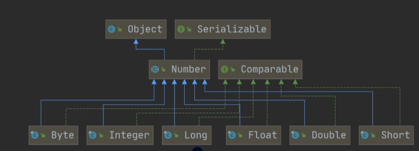
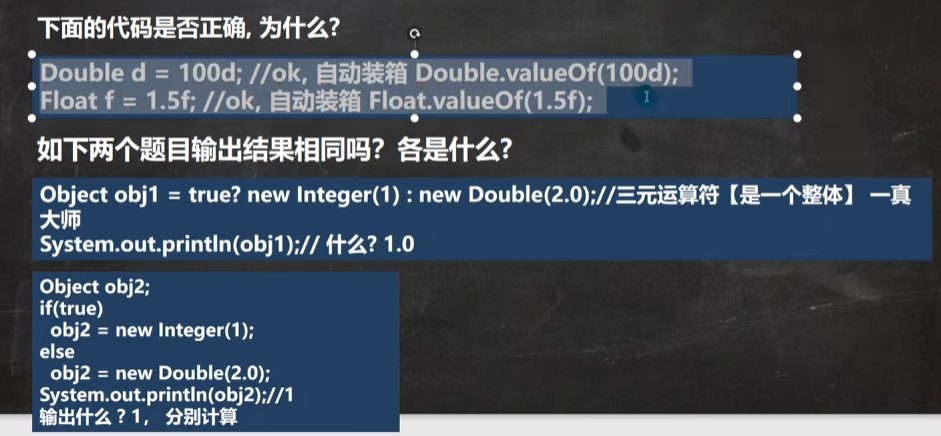
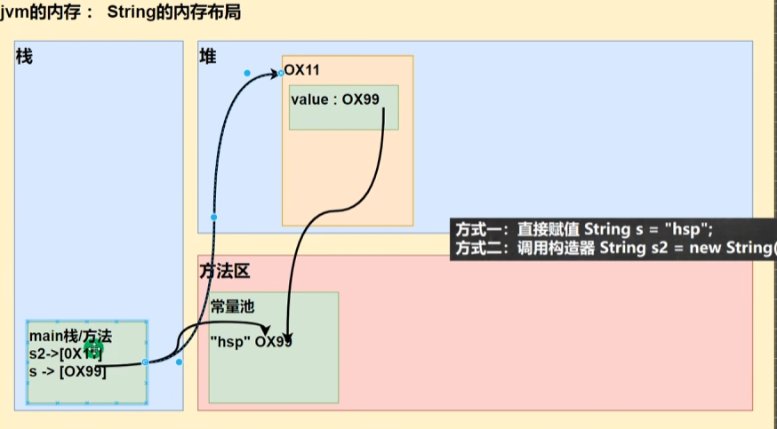
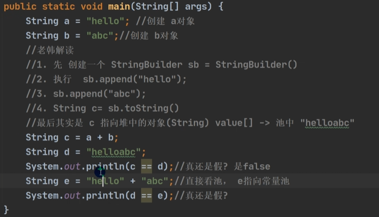
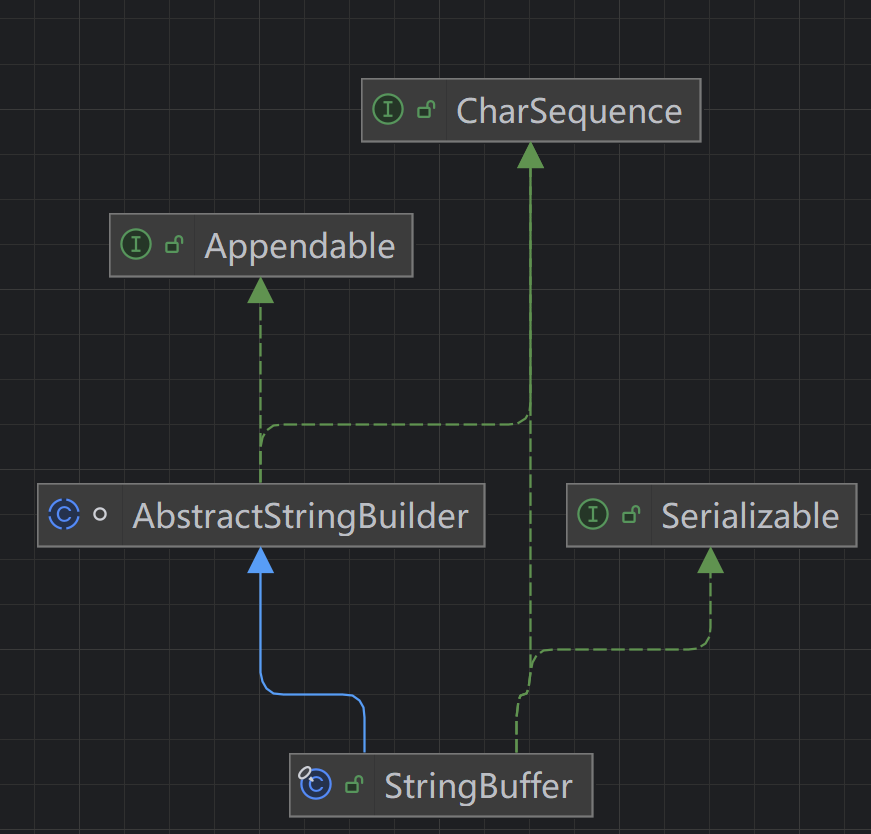

# Java笔记

## 包装类

Wrapper（包装器）

### 定义

针对八种基本的数据类型类型响应的引用类型

有类的特点，可以调用类的方法

除了 int -> Integer char- > Character 其余的六个都是将首字母大写就是对应的包装类

Boolean  Byte Short Long Float Double

Boolean 与 Character 二者是实现了比较和可序列化的接口的Object子类

```java
public final class Boolean implements java.io.Serializable,
                                      Comparable<Boolean>
```

```java
class Character implements java.io.Serializable, Comparable<Character>
```

而这些数字的类型一般都是继承了Number类，而Number类是实现了可序列化的接口的Object子类，数字类型直接实现比较接口

图标如下



### 装箱与拆箱

自动拆装箱，本质上和手动没有区别，由编译器自动调用方法

```java
public class WrapperType {
    public static void main(String[] args) {
        //jdk5以前是用手动装箱,拆箱
        int i = 10;
        Integer pack = new Integer(i);
        Integer pack2 = Integer.valueOf(i);

        int j = pack.intValue();//手动拆箱

        //jdk5以后支持自动拆装箱
        int k = 200;
        Integer pack3 = k;//自动装箱
        int k1 = pack3;//自动拆箱
        //本质上和手动没有区别，由编译器自动调用方法
    }
```

一道比较经典的面试题目



### 包装类型和String转换

```java
public class WrapperType {
    public static void main(String[] args) {
        Integer i = 127;
        String s1 = i + "";//包装类转字符串
        String s2 = i.toString();
        /* 包装类的toString方法
        public String toString() {
                return toString(value);
            }
         */
        System.out.println(s1);

        Integer i1 = Integer.parseInt(s1);//字符串转包装类
        Integer i2 = Integer.valueOf(s1);//会调用parseInt

        System.out.println(i2);
    }
}
```

### 一些常用的方法

即查即用，不用特殊记忆

返回最小值 最大值

```java
public class WrapperType {
    public static void main(String[] args) {
        Integer i = 127;
        System.out.println(i.MIN_VALUE);
        System.out.println(Integer.MIN_VALUE);
    }
}
```

判断是不是数字，是不是字母，是不是大写，是不是小写，是不是空格，转成大写，转成小写（查询使用即可，或者可以自己实现）

### Integer的面试题

之前也涉及到过，在前面的数据类型中我曾写过

```java
public class WrapperType {
    public static void main(String[] args) {
        Integer i1 = new Integer(12);
        Integer i2 = new Integer(12);
        System.out.println(i1 == i2);//false
	//创建新的对象，指向的地址肯定不同
        Integer i3 = 12;//Integer.valueOf(12);
        Integer i4 = 12;//Integer.valueOf(12);
        System.out.println(i3 == i4);//true
	//Integer自动包装调用valueOf()，其中涉及到常量池的概念
        Integer i5 = 128;
        Integer i6 = 128;
        System.out.println(i5 == i6);//false
    }
}
```

```java
public static Integer valueOf(int i) {
    if (i >= IntegerCache.low && i <= IntegerCache.high)
        return IntegerCache.cache[i + (-IntegerCache.low)];
    return new Integer(i);
}
```

存在一个cache，-128—127，在范围外才会创建对象

已经静态的创建好了一个Integer包装数组，将-128—127，在范围内直接用引用指向即可

还有一个，这里涉及到的是基本数据类型，比较的是值是否相等


## String

### 定义

支持可序列化接口，比较接口，可读的字符序列接口

```java
public final class String
    implements java.io.Serializable, Comparable<String>, CharSequence { ... }
```

1.String 对象是用来保存字符串的，是一组字符序列

2.字符串常量对象使用双引号括起的字符序列

3.字符串的字符使用的是Unicode字符编码，一个字符占用两个字节

4.String类较为常用的构造方法有以下:多种构造器

```java
()

(String original)

(char[] a)

(char[] a, int startIndex, int count)

(byte[] b)
```

String 有属性private final char value[ ] :用于存储字符串内容，final代表value指向的地址不可以被修改（而地址存储的单个字符内容可以变化），以下是一个代码示例

```java
public class String1 {
    public static void main(String[] args) {
        final char[] target = {'1','2','5'};
        target[0] = '4';
        char[] target1 = {'1','2','3'};
        //target = target1;
    }
}
```

### 创建String对象方式

```java
public class String1 {
    public static void main(String[] args) {
        String str1 = "abc";//方式一
        String str2 = new String("abc");//方式二
    }
}
```

方式一：查看常量池中是否有"abc"的数据空间，如果有直接指向，如果没有则在常量池中创建，最后指向的是常量池中的空间地址

方式二：在堆中创建空间，如果里面维护了value属性，指向常量池中的"abc"空间，如果常量池中没有"abc"重新创建，如果有直接通过value指向，最终指向的是堆中的空间地址，堆中的引用指向常量池中的地址

以下是示例图片



虽然指向的最终都是到常量池中的字符，但是二者指向的第一个地址不一样（一个在堆中，另一个在常量池中）

```java
public class String1 {
    public static void main(String[] args) {
        String str1 = "abc"
        String str2 = new String("abc");
        System.out.println(str1 == str2);//false
    }
}
```

调用intern方法时，如果常量池中已经包含了对应的字符串，就返回池中的字符串地址，否则先添加String对象添加到池中，并返回池中的地址

一个测试题目



最后一个e指向常量池，true，优化为e = "helloabc";

### String的常用方法

#### equals

 //判断是否相等

```java
String str1 = new String("abc");
String str2 = new String("abccdff");
System.out.println(str1.equals(str2));//false
```

#### equalsIgnoreCase 

//忽略大小写判断是否相等

```java
String str1 = new String("abc");
String str2 = new String("ABC");
System.out.println(str1.equalsIgnoreCase(str2));//true
```

#### length

 //字符个数，字符串长度

```java
System.out.println(str1.length());//3
```

#### indexOf 

//获取第一个对应对应字符的索引，无则返回-1

注意可以传入字符串

```java
System.out.println(str1.indexOf("bc"));//2
System.out.println(str2.lastIndexOf('B'));//2
```

#### lastIndexOf 

//获取最后一个对应字符的索引，无则返回-1

同上类似

#### substring

 //截取指定范围的字串

一个参数

```java
public String substring(int beginIndex) {
    if (beginIndex < 0) {
        throw new StringIndexOutOfBoundsException(beginIndex);
    }
    int subLen = value.length - beginIndex;
    if (subLen < 0) {
        throw new StringIndexOutOfBoundsException(subLen);
    }
    return (beginIndex == 0) ? this : new String(value, beginIndex, subLen);
}
```

两个参数

```java
public String substring(int beginIndex, int endIndex) {
    if (beginIndex < 0) {
        throw new StringIndexOutOfBoundsException(beginIndex);
    }
    if (endIndex > value.length) {
        throw new StringIndexOutOfBoundsException(endIndex);
    }
    int subLen = endIndex - beginIndex;
    if (subLen < 0) {
        throw new StringIndexOutOfBoundsException(subLen);
    }
    return ((beginIndex == 0) && (endIndex == value.length)) ? this
            : new String(value, beginIndex, subLen);
}
```

#### concat 

//拼接字符串

```java
System.out.println(str1.concat(str2));//abcABC
```

#### replace 

//替换字符串

```java
System.out.println(str1.replace("a", "b"));//bbc
```

#### toUpperCase 

//向上取大写

```java
System.out.println(str1.toUpperCase());//ABC
```

#### toLowerCase 

//取向下小写

```java
System.out.println(str2.toLowerCase());//abc
```

#### split 

//以（）为标准分割字符串内容

转移字符需要在前加 \

```java
String str3 = new String("abc,ABe,CDE");
String[] stringArr = str3.split(",");
String str4 = stringArr[0];
System.out.println(str4);//abc
```

#### toCharArray 

//转换为字符数组

```java
char[] a = str1.toCharArray();
System.out.println(a[1]);//b
```

#### compareTo 

//比较大小

```java
String str1 = new String("abc");
String str2 = new String("ABC");
System.out.println(str1.compareTo(str2));//32
```

当区分不出大小且，长度不一样时有不同返回值，详见源码

```java
public int compareTo(String anotherString) {
    int len1 = value.length;
    int len2 = anotherString.value.length;
    int lim = Math.min(len1, len2);
    char v1[] = value;
    char v2[] = anotherString.value;

    int k = 0;
    while (k < lim) {
        char c1 = v1[k];
        char c2 = v2[k];
        if (c1 != c2) {
            return c1 - c2;
        }
        k++;
    }
    return len1 - len2;
}
```

#### trim 

//去前后空格

```java
String str1 = new String("  ab c  ");
System.out.println(str1.trim());//ab c
```

#### format

//字符串格式化拼接

类似于C语言中printf

```java
String str1 = new String("abc");
String str2 = new String("ABC");
String str3 = String.format("你好 %s 和 %s", str1, str2);
System.out.println(str3);//你好 abc 和 ABC
```

有点太多了，没必要全记，记不得在查，早晚会熟练使用的

## StringBuffer

### 定义

是一种增强的String支持增删改，直接父类是AbstractStringBuilder，实现了可序列化的接口，是一个final类型，不可被继承



```java
abstract class AbstractStringBuilder implements Appendable, CharSequence {
    char[] value;
```

其中有value char数组，存放在堆中

StringBuffer相较于String保存的字符串常量（值无法修改），StringBuffer不用在修改内容的时候更改地址（除非内存不足时重新扩容复制），所以效率上高于String

### 常用的构造器

默认的无参构造器（创建一个16字符的空间）

```java
public class StringBuffer01 {
    public static void main(String[] args) {
        StringBuffer sb = new StringBuffer();
    }
}
```

传入int参数构造器，其中容量为32个字符

```java
public class StringBuffer01 {
    public static void main(String[] args) {
        StringBuffer sb = new StringBuffer(32);
    }
}
```

传入String常量

```java
public class StringBuffer01 {
    public static void main(String[] args) {
        StringBuffer sb = new StringBuffer("StringBuffer01");
    }
}
```

jdk源码，其中先new一个同样大小的数组，再通过append拼接+16的容量

```java
public StringBuffer(String str) {
    super(str.length() + 16);
    append(str);
}
```

```java
AbstractStringBuilder(int capacity) {
    value = new char[capacity];
}
```

### 与String的转化

转为String

```java
public class StringBuffer01 {
    public static void main(String[] args) {
        String str = "hello";
        StringBuffer sb1 = new StringBuffer(str);//对原先的str没有影响
        StringBuffer sb2 = new StringBuffer();
        sb2.append(str);//通过添加完成
    }
}
```

转为StringBuffer

```java
public class StringBuffer01 {
    public static void main(String[] args) {
        StringBuffer sb = new StringBuffer("Hello");
        String str1 = sb.toString();
        String str2 = new String(sb);
    }
}
```

### StringBuffer常用方法

#### append

在末尾添加字符

```java
public class StringBuffer01 {
    public static void main(String[] args) {
        StringBuffer sb = new StringBuffer("Hello");
        sb.append(" World!!");
        System.out.println(sb);//Hello World!
    }
}
```

#### delete

删除 [1，3）的内容

```java
public class StringBuffer01 {
    public static void main(String[] args) {
        StringBuffer sb = new StringBuffer("Hello");
        sb.delete(1, 3);
        System.out.println(sb.toString());//Hlo
    }
}
```

#### replace

替换，有三个参数，从 [1，3）的内容用参数 3 替换

```java
public class StringBuffer01 {
    public static void main(String[] args) {
        StringBuffer sb = new StringBuffer("Hello");
        sb.replace(1, 3, "世界");
        System.out.println(sb.toString());//H世界lo
    }
}
```

#### indexOf

返回查找内容的索引（第一个）传入字符串

```java
public class StringBuffer01 {
    public static void main(String[] args) {
        StringBuffer sb = new StringBuffer("Hello");
        System.out.println(sb.indexOf("l"));//2
    }
}
```

#### insert

在（第一个参数的位置）插入内容

```java
public class StringBuffer01 {
    public static void main(String[] args) {
        StringBuffer sb = new StringBuffer("Hello");
        sb.insert(1, "插入");
        System.out.println(sb);//H插入ello
    }
}
```

#### length

返回长度

```java
public class StringBuffer01 {
    public static void main(String[] args) {
        StringBuffer sb = new StringBuffer("Hello");
        System.out.println(sb.length());
    }
}
```

### 常见的例题

使用append传入null字符串

当为null的时候返回appendNull，而返回的值是一个null字符串

```java
public class StringBuffer01 {
    public static void main(String[] args) {
        StringBuffer sb = new StringBuffer();
        String str = null;
        sb.append(str);
        System.out.println(sb.length());//4
        System.out.println(sb.toString());//null
    }
}
```

```java
public AbstractStringBuilder append(String str) {
    if (str == null)
        return appendNull();
    int len = str.length();
    ensureCapacityInternal(count + len);
    str.getChars(0, len, value, count);
    count += len;
    return this;
}
```

```java
private AbstractStringBuilder appendNull() {
    int c = count;
    ensureCapacityInternal(c + 4);
    final char[] value = this.value;
    value[c++] = 'n';
    value[c++] = 'u';
    value[c++] = 'l';
    value[c++] = 'l';
    count = c;
    return this;
}
```


第二种情况：使用构造器传入null

```java
public class StringBuffer01 {
    public static void main(String[] args) {
        String str = null;
        StringBuffer sb = new StringBuffer(str);//抛出异常
    }
}
```

```java
public StringBuffer(String str) {
    super(str.length() + 16);//在源码这里因为null抛出异常
    append(str);
}
```

一个在价格中增添，的代码示例

```java
public class StringBuffer01 {
    public static void main(String[] args) {
        Scanner sc = new Scanner(System.in);
        String price = sc.nextLine();//输入一个价格，在小数点前每隔3位用,隔离开
        StringBuffer sb = new StringBuffer(price);//123456.78
        int index = sb.indexOf(".");
        for(int i = index - 3; i > 0; i -= 3) {
            sb.insert(i, ",");
        }
        System.out.println(sb);
    }
}
```


## StringBuilder

### 定义

```java
public final class StringBuilder
    extends AbstractStringBuilder
    implements Serializable, CharSequence
{
```

是一个可变的字符序列，提供与StringBuffer兼容的API，但是不保证线程安全，被设计为StringBuffer的简易替换，用在字符串缓冲区被单个线程使用的时候

如果可能优先使用StringBuilder，因为它的效率大多都要比StringBuffer快

在StringBuilder上的主要操作时append和insert方法，可以重载这些方法用以接收任意类型的数据

StringBuffer继承了AbstractStringBuilder类，可串行化，可以保存在文件，是一个final类型，不可被继承

```java
abstract class AbstractStringBuilder implements Appendable, CharSequence {

    char[] value;
```

字符存放在堆中

StringBuilder的方法没有作互斥的处理，没有synchronization关键字，只能在单线程中使用


## String三者比较

1.StringBuilder和StringBuffer类似，均代表可变字符序列，方法一致

2.String是不可变字符序列，效率低，但是复用率高

3.StringBuffer是可变字符序列，效率较高（增删），线程安全

4.StringBuilder是可变字符序列，效率最高，线程不安全


# 课后练习

String str = new String("hello") + new String("word")过程中产生了几个对象

在Java中，当你使用`+`运算符进行字符串拼接时，编译器会自动进行优化，底层实际上是使用`StringBuilder`来实现的。这是出于性能和内存效率的考虑。

```java
String str = new String("hello") + new String("word");
```

编译器会将其转换为类似以下的字节码：

```java
StringBuilder sb = new StringBuilder();
sb.append(new String("hello"));
sb.append(new String("word"));
String str = sb.toString();
```

1.反转字符串（将指定的部分反转）

```java
public class Homework {
    public static void main(String[] args) {
        String str = new String("HelloWorld");
        str = reverse(str, 0, str.length() - 1);
        System.out.println(str.toString());
    }

    public static String reverse(String str, int start, int end) {
        char[] arr = str.toCharArray();
        for (int i = start, j = end; i < j; i++, j--) {
            char temp = arr[i];
            arr[i] = arr[j];
            arr[j] = temp;
        }
        return new String(arr);
    }
}
```

2.判断账号密码是否正确

```java
public class Homework {
    public static void main(String[] args) {
        String input = new Scanner(System.in).nextLine();
        String[] strArray = input.split(",");
        if(strArray[0].length() == 2 || strArray[0]
                .length() == 3 || strArray[0].length() == 4) {
            System.out.println("用户名正确");
        }
        if(strArray[1].length() == 6 && isDigital(strArray[1])) {
            System.out.println("密码正确");
        }
    }
    public static boolean isDigital(String str) {
        char[] chars = str.toCharArray();
        for (int i = 0; i < chars.length; i++) {
            if (!Character.isDigit(chars[i])) {
                return false;
            }
        }
        return true;
    }
}

```

```cmd
100,123456
用户名正确
密码正确
```

