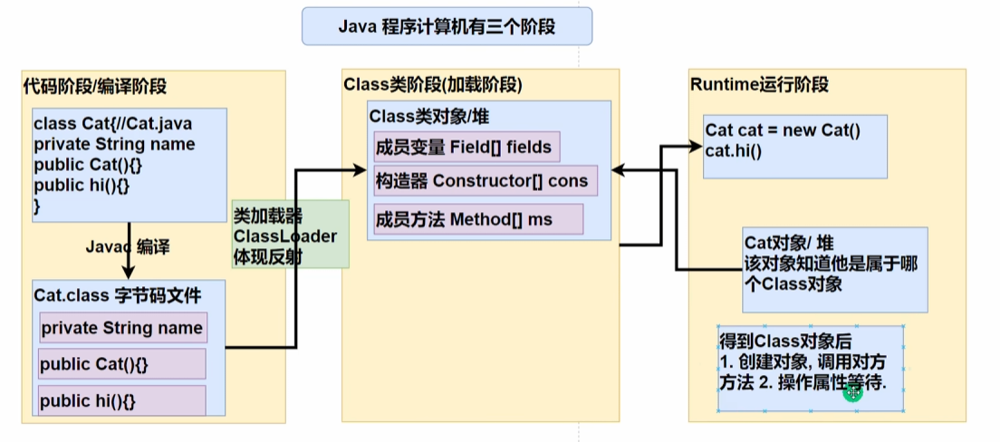
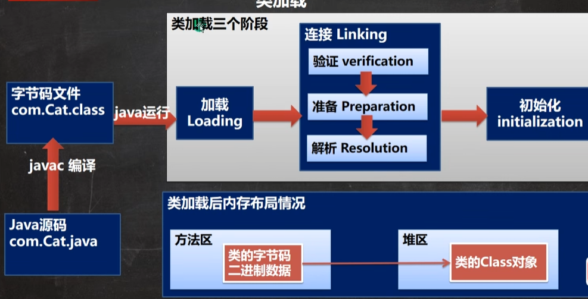

# Java笔记

## 反射

reflection

### 引出反射

我们需要怎样才可以读出配置文件的内容，并调用配置文件的方法

**配置文件**

```properties
classPath = com.reflection.Cat
method = hi
```

**目标类文件**

```java
package com.reflection;


public class Cat {
    public void hi() {
        System.out.println("hi");
    }
}
```

**问题实现**

第一点很容易，我们通过创建properties在进行加载，就可以很容易的得到配置中的内容

```java
public class ReflectionQuestion {
    public static void main(String[] args) throws IOException {
        String filePath = "src\\re.properties";
        Properties properties = new Properties();
        properties.load(new FileInputStream(filePath));
        String classPath = properties.getProperty("classPath");
        String method = properties.getProperty("method");
        System.out.println(classPath + " " + method);
    }
}
```

但是我们要怎样取创建配置文件中的对象，和调用对应的方法呢？

我们暂时还没有在不通过在不修改源码的情况下控制程序的办法，在这里我们就需要使用到反射机制来解决，以下是一个快速入门


### 快速入门

我们需要以下的几个步骤

1.加载类，返回Class类型的对象

```java
//加载类运用一个Class的对象接收类的路径
Class cls = Class.forName(classPath);
```

2.通过类得到你加载的类Cat对象实例

```java
//通过Class对象的实例调用newInstance获取到对应类路径下对象的实例
//（编译类型是一个Object）（运行类型是对应的类型）
Object obj = cls.newInstance();
```

3.通过类对象调用getMethod方法得到对应参数名称的方法，存在Method对象中（将方法视为一个对象）

```java
//通过cls类调用方法getMethod获取方法
Method method01 = cls.getMethod(method);
```

4.最后通过方法对象调用invoke传入对象,完成调用

```java
//最后通过方法对象调用invoke传入对象,完成调用
method01.invoke(obj);
```


**完整代码**

可以实现不修改源码的基础上修改程序的内部逻辑

```java
public class ReflectionQuestion {
    public static void main(String[] args) throws Exception {
        String filePath = "src\\re.properties";
        Properties properties = new Properties();
        properties.load(new FileInputStream(filePath));
        String classPath = properties.getProperty("classPath");
        String method = properties.getProperty("method");

        Class cls = Class.forName(classPath);
        Object targetClass = cls.newInstance();
        Method targetMethod = cls.getMethod(method);
        targetMethod.invoke(targetClass);
    }
}
```

输出结果

```
class com.reflection.Cat
hi
```


**修改测试**

通过修改配置文件，创建一个狗类，调用其中的say方法

**配置文件**

```properties
classPath = com.reflection.Dog
method = say
```

**狗类**

```java
package com.reflection;
public class Dog {
    public void say () {
        System.out.println("大狗大狗叫叫叫~~");
    }
}
```

**运行结果**

```
大狗大狗叫叫叫~~
```


### 反射机制原理

#### **原理**

1.反射机制允许程序在程序执行期间借助Reflection API获取任何类的内部信息（包括成员变量，构造器，成员方法），并能够操作对象的属性以及方法（反射在设计模式和底层框架都会用的到

2.加载完类后，堆中产生了一个Class类型的对象（一个类只有一个Class对象），这个对象包含了类的完整结构信息，通过这个对象得到类的结构。而这个对象就像是一面镜子，透过这个镜子可以看到类的结构（所以称之为反射）


#### **反射机制原理图**



反射（Reflection）的核心来源是 Java 的 Class 对象，这个对象是程序在 Class 类阶段（加载阶段） 通过 `ClassLoader` 类加载器，加载后创建的。


**在底层编译时**

类加载器（`ClassLoader`）会将字节码文件加载到 JVM 中，并转换为 **Class 类对象**，其中包含：

- **字段信息（Field[] fields）**
- **构造器信息（Constructor[] cons）**
- **方法信息（Method[] ms）**

**这些信息是 Java 反射的基础**，通过 `Class` 对象，Java 代码可以动态地获取类的详细结构，并在运行时操作类的成员（方法、变量等）。


**对用户而言**

Java 允许开发者使用反射机制操作 Class 对象

**反射的方式：**

- 通过 `Class` 对象获取类的信息（字段、方法、构造器）。
- 通过 `Field` 访问类的字段。
- 通过 `Method` 调用类的方法。
- 通过 `Constructor` 创建对象实例。


#### 反射的优缺点

1.优点：可以动态的创建和使用对象（也是框架的底层核心），使用灵活，没有反射机制，框架就会失去底层支持

2.使用反射基本是解释执行，对执行速度有影响（和传统方式时间差距很大）

有一个setAccessible方法可以操作访问安全检查的开关以此来提升反射的效率


### 反射相关的类

#### Class

代表一个类，Class对象表示在某个类加载后在堆中的对象

```java
Class cls = Class.forName(classPath);
//创建Class对象
Object obj = cls.newInstance();
//通过Class对象获取对应实例
```

1.Class也是类，继承于Object类

2.Class类对象不是new实例化出来的，而是系统创建的

3.对于某个类的Class类对象，在内存中只有一份，因为类只加载一次

4.每个类的实例都会记得自己是由哪一个Class实例所生成的

5.通过Class对象可以完整的得到一个类的完整结构（API调用）

6.Class对象是存放在堆中的

7.类的字节码二进制数据，是放在方法区的，称之为类的元数据（包括方法代码，变量名，方法名，访问权限等）


#### Method

代表类的方法，Method对象表示某个类的方法

```java
Method method01 = cls.getMethod(method);
//获取方法对象
method01.invoke(obj);
//通过invoke传入类对象实例调用方法
```


#### Field

代表类的成员变量，Field对象表示某个类的成员变量

```java
Field nameField = cls.getField("name");
//获取成员变量对象
System.out.println(nameField.get(obj));
```


#### Constructor

代表类的构造方法，Constructor对象表示某个类的构造器

```java
Constructor constructor1 = cls.getConstructor();
//不带参数的构造器
System.out.println(constructor1);

Constructor constructor2 = cls.getConstructor(String.class);
//带参数的构造器需要传入String类的Class对象
System.out.println(constructor2);
```

当然也可以调用构造器对象构造类的对象实例


### Class常用方法(入门)

#### forName

获取类的对象

```java
Class<?> cls = Class.forName("com.reflection.Cat");
```

```java
Class cls = Class.forName("com.reflection.Cat");
System.out.println(cls);//class com.reflection.Cat
System.out.println(cls.getClass());//class java.lang.Class
```

前一个输出是哪一个类的Class对象，后一个输出类对象

#### getPackage

获取类的包名

```java
System.out.println(cls.getPackage());
//package com.reflection
```

#### getName

获取类的全路径

```java
System.out.println(cls.getName());
//com.reflection.Cat
```

#### newInstance

通过类实例创建对应类的实例

```java
Object obj = cls.newInstance();
Cat cat = (Cat)obj;
cat.hi();
```

#### getField

获取类的属性（无法获取私有属性）

```java
Field field = cls.getField("name");
System.out.println(field.get(obj));
```

获取所有属性

```java
Field[] fields = cls.getFields();
for(Field field : fields) {
    System.out.println(field.get(obj));
}
```

#### set

设置类属性的值

```java
Object obj = cls.newInstance();
Field field = cls.getField("name");
field.set(obj, "来福");
System.out.println(field.get(obj));
```


### 获取Class对象方式

在编程的时候一共可以有六种方式可供程序员使用获取Class对象


#### **代码阶段**

forName

使用前提：已知一个类的全类名，且类在类的路径下，可以通过Class的静态方法forName获取（可能会抛出ClassNotFound异常）

应用场景：多用于配置文件，获取类全路径，加载类

```java
Class<?> cls = Class.forName("com.reflection.Cat");
```


#### **加载阶段**

类.class

从类加载器中获取

使用前提：已知具体的类，通过类的class方法获取，该方式是最为可靠的，程序性能最高

应用场景：多用于参数传递，比如通过反射得到对应构造器对象

```java
Class cls = Cat.class;
```


#### **运行阶段**

对象.getClass

使用前提：某一个类的实例已经存在，通过该实例的getClass方法获取Class对象

应用场景：通过创建好的对象获取Class对象

```java
Cat cat = new Cat();
Class cls = cat.getClass();
```


#### **通过类加载器**

调用类加载器的loadClass方法获取

```java
ClassLoader classLoader = cat.getClass().getClassLoader();
Class<?> cls = classLoader.loadClass();
```


#### **基本数据类型类对象**

数据类型.class

```java
Class<Integer> cls = int.class;
System.out.println(cls);//int 这里隐含了自动拆装箱
```


#### **包装型类对象**

调用包装类的静态属性TYPE获取

```java
Class<?> cls = Integer.TYPE;
```


## 类加载

反射机制是Java实现动态语言的关键，也就是通过反射实现动态加载


### 动态加载与静态加载

#### 静态加载

编译时加载相关的类，如果没有则报错，依赖性较高

#### 动态加载

运行时加载需要的类，如果没有用到缺失的类，就不会报错，降低了依赖性


#### 代码示例

以下是一个动态加载的代码示例：

例如我有一个Cat类，一个House类，但是实际上只有Cat类是在代码中声明，我们利用静态加载一个Cat 和一个House类，代码不通过编译

```java
Cat cat = new Cat();
House house = new House();//编译报错，没有House类
```

但是我们可以通过类加载实现动态加载，只有在运行的时候没有获取到对应的类时候才会发出运行时错误

```java
public class Class01 {
    public static void main(String[] args) throws Exception {
        Scanner scanner = new Scanner(System.in);
        char key = scanner.next().charAt(0);
        switch (key) {
            case 1:
                Class cls = Class.forName("com.reflection.Cat");
                Object obj1 = cls.newInstance();
                break;
            case 2:
                Class cls2 = Class.forName("com.reflection.House");
                Object obj2 = cls2.newInstance();
                break;
        }
    }
}
```

在输入2的时候报错

```
java.lang.ClassNotFoundException: com.reflection.House
```


### 类加载的流程图



#### 加载阶段（由JVM控制）

JVM机将字节码从不同的数据源（class文件、jar包，网络）转化为二进制字节流加载到内存中，并且生成代表该类的java.lang.Class对象


#### 连接阶段（由JVM控制）

##### 验证

确保Class字节流中的信息符合当前虚拟机的要求，并且不会危害虚拟机的安全（这个阶段是可以手动关闭的）

在编译运行的时候：使用-Xverify:none参数关闭大部分的类验证措施，以缩短虚拟机类加载的时间


##### 准备

JVM在该阶段对静态变量，分配内存，并默认初始化（0，null，false等），这些变量所使用的内存都在方法区中进行分配

以一个类来举例 

```java
class A {
	public int n1 = 10;
	//n1是实例属性，不是静态变量，在准备阶段是不会分配内存的
	public static int n2 = 20;
	//n2是静态变量，分配内存，初始化为0，在后续才会进行赋值
	public static final int n3 = 30;
	//n3是一个常量，分配内存，初始直接进行赋值30
}
```


##### 解析阶段

虚拟机将常量池中的符号引用替换为直接引用的过程


#### 初始化（由程序员控制）

1.到初始化阶段才开始执行类中定义的Java程序代码，此阶段执行的是<clinit>()方法的过程

2.<clinit>()方法是由编译器按语句在源代码中出现的顺序，以此自动收集类中所有静态变量的复制动作，和静态代码块中的语句，并进行合并

3.虚拟机会保证一个类的<clinit>()方法在多线程环境中被正确的加锁，同步，如果多个线程去同时初始化一个类，那么只会有一个线程去执行这个类的<clinit>()方法，其他线程都需要阻塞等待

正是通过3的线程加锁，才保证了某一个类的对象在堆中只存在一个


在代码编写的时候：有一个setAccessible（爆破）方法可以操作访问安全检查的开关以此来提升反射的效率


## 获取类信息

### 相关方法

现有一个类Person

```java
@Deprecated
public class Person extends AA implements IL{
    public int pub = 0;
    int def = 0;
    private int pri = 0;

    public Person() {}

    public Person(int pub, int def, int pri) {
        this.pub = pub;
        this.def = def;
        this.pri = pri;
    }

    public void say(){}
    void hi(){}
}
```

#### Class类

##### getName

获取全类名

```java
Class cls = Class.forName("com.reflection.Person");
System.out.println(cls.getName());
//com.reflection.Person
```

##### getSimpleName

获取简单类名

```java
Class cls = Class.forName("com.reflection.Person");
System.out.println(cls.getSimpleName());//Person
```

##### getFields

获取所有public修饰的属性，包含本类以及父类

```java
Field[] fields = cls.getFields();
for(Field field : fields) {
    System.out.println(field);
}
```

```
public int com.reflection.Person.pub
```


##### getDeclaredFields

获取本类中所有属性

```java
Field[] fields = cls.getDeclaredFields();
for(Field field : fields) {
    System.out.println(field);
}
```

```
public int com.reflection.Person.pub
int com.reflection.Person.def
private int com.reflection.Person.pri
```

##### getMethods

获取本类中由public修饰的所有方法，包含本类以及父类

```java
    Class cls = Class.forName("com.reflection.Person");
    Method[] methods = cls.getMethods();
    for(Method method : methods) {
        System.out.println(method.getName());
    }
```

```
say
wait
wait
wait
equals
toString
hashCode
getClass
notify
notifyAll
```


##### getDeclaredMethods

获取本类中所有方法

```java
Class cls = Class.forName("com.reflection.Person");
Method[] methods = cls.getDeclaredMethods();
for(Method method : methods) {
    System.out.println(method);
}
```

```java
void com.reflection.Person.hi()
public void com.reflection.Person.say()
```


##### getConstructors

获取public修饰的构造器，包含本类

```java
Class cls = Class.forName("com.reflection.Person");
Constructor[] connstructors = cls.getConstructors();
for(Constructor connstructor : connstructors) {
    System.out.println(connstructor);
}
```

```
public com.reflection.Person()
public com.reflection.Person(int,int,int)
```


##### getDeclaredConstructors

获取本类所有的构造器

```
public com.reflection.Person()
public com.reflection.Person(int,int,int)
```


##### getPackage

以Package的形式返回包信息

```java
Class cls = Class.forName("com.reflection.Person");
System.out.println(cls.getPackage());
//package com.reflection
```

##### getSuperclass

以Class的形式返回父类的信息

```java
public static void main(String[] args) throws Exception {
    Class cls = Class.forName("com.reflection.Person");
    System.out.println(cls.getSuperclass());
    //class com.reflection.AA
}
```


##### getInterfaces

以Class的形式返回接口信息

```java
public class Class01 {
    public static void main(String[] args) throws Exception {
        Class cls = Class.forName("com.reflection.Person");
        Class[] interfaces = cls.getInterfaces();
        for(Class anInterface : interfaces)
        System.out.println(anInterface);
        //interface com.reflection.IL
    }
}
```

##### getAnnotations

以Annotation数组的形式返回注解信息

```java
public static void main(String[] args) throws Exception {
    Class cls = Class.forName("com.reflection.Person");
    Annotation[] annotations = cls.getAnnotations();
    for(Annotation annotation : annotations)
    System.out.println(annotation);
    //@java.lang.Deprecated()
}
```


#### Filed类

##### getModifiers

以int形式返回修饰符

默认修饰符0  ，public 1 ， private 2 ， protected 4 ，static 8 ，final 16 public+static 9（1 + 8）  

```java
Field field = cls.getField("pub");
//注意通过getField只能获取public修饰的属性
System.out.println(field.getModifiers());//1 (public)
```


##### getType

以Class形式返回类型

```java
Class<?> cls = Class.forName("com.reflection.Person");
Field field = cls.getField("pub");
System.out.println(field.getType());//int
```


##### getName

返回属性名

```java
Class<?> cls = Class.forName("com.reflection.Person");
Field field = cls.getField("pub");
System.out.println(field.getName());//pub
```


#### Method类

##### getModifiers

以int形式返回修饰符

```java
Class<?> cls = Class.forName("com.reflection.Person");
Method method = cls.getMethod("say");
System.out.println(method.getModifiers());//1
```

##### getReturnType

以Class形式返回类型

```java
Class<?> cls = Class.forName("com.reflection.Person");
Method method = cls.getMethod("say");
System.out.println(method.getReturnType());//void
```

##### getName

返回方法名

```java
Class<?> cls = Class.forName("com.reflection.Person");
Method method = cls.getMethod("say");
System.out.println(method.getName());//say
```

##### getParameterTypes

以Class数组返回参数类型数组

```java
Class<?> cls = Class.forName("com.reflection.Person");
Method method = cls.getMethod("say");
Class<?>[] parameterTypes = method.getParameterTypes();
```


#### Constructor类

和Method类基本一致，没有getReturnType方法（没有返回值）


## 反射爆破


### 反射爆破创建实例

有以下几个构造器

```java
public Person() {}

public Person(int pub) {
    this.pub = pub;
}

public Person(int pub, int def, int pri) {
    this.pub = pub;
    this.def = def;
    this.pri = pri;
}

private Person(int pub, int def) {
    this.pub = pub;
    this.def = def;
}
```


大体分为两种方式

方式一：调用类中pulic修饰的无参构造器

方式二：调用类中的指定构造器


#### Constructor类相关方法

##### setAccessible

是Java程序设计者留的后门，可以破解私有构造器的限制

爆破（暴力破解）

```java
constructor.setAccessible(true);
```


##### newInstance

调用构造器

```java
 Object obj = constructor.newInstance(10);//通过构造器创建对象
```


#### Class类相关方法

##### newInstance

调用类中的无参构造器，获取对应类的对象

```java
Object obj = cls.newInstance();
```

##### getConstructor

根据参数列表，获取对应的构造器对象（获取public构造器对象）

```java
Constructor<?> constructor = cls.getConstructor(int.class);//获取到公有的构造器
```

##### getDecalaredConstructor

根据参数列表，获取对应的构造器对象（获取本类所有的构造器对象）

用普通的方式无法通过private修饰的构造器创建对象实例，但是通过反射可以实现

但是后续调用私有构造器需要爆破（暴力破解private）（单独使用newInstance会发生运行错误）

```java
Constructor<?> constructor = cls.getDeclaredConstructor(int.class,int.class);//获取到所有的构造器
```


#### 通过爆破使用私有构造器

```java
Constructor<?> constructor = cls.getDeclaredConstructor(int.class,int.class);//获取到所有的构造器
constructor.setAccessible(true);
Object obj = constructor.newInstance(10, 29);//通过构造器创建对象
System.out.println(obj);//pub 10 def 29 pri 0
```


### 反射爆破操作属性

#### 访问属性的相关方法

##### 获取Field对象

Field f = class对象.getDeclaredField(属性名称)

```java
Field field = cls.getDeclaredField("pri");
```

##### 爆破

```
field.setAccessible(true);
```


##### 访问

设置属性值

f.set(obj, 值)

```java
field.set(obj, 100);
```


获取属性值

f.get(obj)

```java
field.get(obj)
```

如果是静态属性，则set和get中的obj参数可以写为null


#### private修饰的属性值

```java
public class Class01 {
    public static void main(String[] args) throws Exception {
        Class<?> cls = Class.forName("com.reflection.Person");
        Constructor<?> constructor = cls.getDeclaredConstructor(int.class, int.class, int.class);
        //获取到所有的构造器

        Object obj = constructor.newInstance(10, 29, 101);//通过构造器创建对象
        Field field = cls.getDeclaredField("pri");
        field.setAccessible(true);
        field.set(obj, 100);
        System.out.println(field.get(obj));//100
    }
}
```


### 反射爆破操作方法

#### 访问方法相关方法

##### getDeclaredMethod

获取类所有的方法

```java
Method method = cls.getDeclaredMethod("hi");
```

##### setAccessible

设置方法爆破

```java
method.setAccessible(true);
```

##### invoke

传入class类对象实例调用方法

如果是静态方法传入null即可

invoke方法参数后是一个可变参数，可供传入参数

```java
Object returnValue = method.invoke(obj);//静态方法hi
```

在反射中如果有返回值统一返回Object类型的值


#### 通过反射调用private方法

```java
public class Class01 {
    public static void main(String[] args) throws Exception {
        Class<?> cls = Class.forName("com.reflection.Person");
        Constructor<?> constructor = cls.getDeclaredConstructor(int.class, int.class, int.class);//获取到所有的构造器

        Object obj = constructor.newInstance(10, 29, 101);//通过构造器创建对象
        Method method = cls.getDeclaredMethod("hi");
        method.setAccessible(true);
        method.invoke(obj);//静态方法hi
    }
}
```

# 课后习题

## 例题一

1.定义PrivateTest类，由私有属性name，属性值为hellokitty

2.提供getName公共方法

3.创建PrivateTest类，利用Class类得到私有属性name属性，修改name属性值

4.使用getName方法打印name属性值


### 题解

写出PrivateTest类

```java
package com.reflection;

public class PrivateTest {
    private String name = "hellokitty";

    public String getName() {
        return name;
    }
}
```

主方法调用

```java
public class Test01 {
    public static void main(String[] args) throws Exception{
        Class<?> cls = Class.forName("com.reflection.PrivateTest");
        Object obj = cls.newInstance();

        Field name = cls.getDeclaredField("name");
        name.setAccessible(true);
        name.set(obj, "New name");

        Method getName = cls.getMethod("getName");
        Object invoke = getName.invoke(obj);
        String target = (String) invoke;

        System.out.println(target);//New name
    }
}
```

## 例题二

1.利用Class类的forName方法得到File类的class对象

2.在控制台打印出File类的所有构造器

3.通过newInstance的方法创建File对象，并创建 E:\\mynew.txt 文件

```java
public class FileTest{
    public static void main(String[] args) throws Exception{
        Class<?> cls = Class.forName("java.io.File");
        Constructor<?>[] constructors = cls.getDeclaredConstructors();
        for(Constructor<?> constructor : constructors) {
            System.out.println(constructor);
        }
        Constructor<?> constructor = cls.getDeclaredConstructor(String.class);
        Object obj = constructor.newInstance("e:\\JavaFile\\mynew.txt");
        Method method = cls.getMethod("createNewFile");
        method.invoke(obj);
    }
}
```
