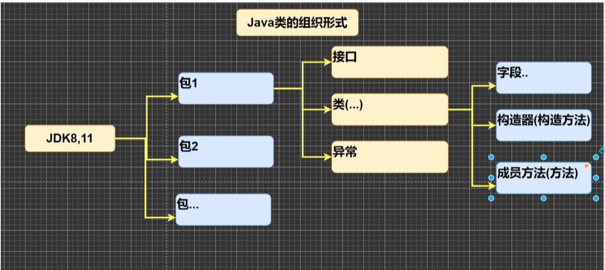

# 听课笔记

## Java中的变量

在这一个部分因为本人有C语言的相关基础，只记录Java 中与C 不同的部分，以及重点部分

Java中的“+”的使用方式，1.当左右两边都是数值的时候，做加法运算，当有一方是字符串时，做拼接运算

```java
public class Test{
	
	public static void main(String[] args){
		System.out.println(100 + 11);			//111
		System.out.println(1 + "100");			//1100
		System.out.println(100 + 11 + "100");	//111100
		System.out.println("100" + 100 + 11);	//10010011
	}
}
```

## Java中的数据类型

分为基本数值类型和引用数据类型

### 基本数值类型

数值型 byte short int long float double

字符型 char 占两个字节（因为有中文等的存在需要更多的空间存储）

布尔型 boolean

### 引用数据类型

类   class

接口 interface

数组 [ ]

## 整数类型

在java上整数类型有着固定的范围和字段长度，不受具体的操作系统的影响，保证了可移植性。

java中整形常量默认为int 型，声明long型需要在数据后加上 L 或者 l （以下为一个具体的例子）

```java
long b = 127;
System.out.println(b);
```

`127`是一个`int`类型的常量，但由于`long`类型的范围比`int`类型大，Java会自动将`127`转换为`long`类型，然后赋值给变量`b`。因此，这段代码可以通过编译并正常运行。

如果你要将一个超出`int`范围的常量赋值给`long`类型的变量，那么你必须在常量后面加上`L`或`l`来明确指定这是一个`long`类型的常量。例如：

```java
long b = 2147483648L;  // 这个值超出了int的范围，必须加上L
System.out.println(b);
```

在这种情况下，如果不加`L`，编译器会报错，因为`2147483648`超出了`int`类型的范围（`int`的范围是`-2147483648`到`2147483647`），而Java不会自动将超出`int`范围的常量转换为`long`类型。


## 浮点类型

与整型相同，java中浮点类型有着固定的范围和字段长度，不受操作系统的影响。

java中浮点类型常量默认为double 型，声明float型需要在数据后加上 f 或者 F

```java
public class Test{
	
	public static void main(String[] args){
		
		float num1 = 1.1;//错误 浮点数默认存储是double类型
         double num2 = 1.1;//可以，没有类型的转换
		System.out.println(b);	
	}
}
```


## 特殊的数值表示

.123 表示 0.123

科学计数法 e大小写都可以

3.14e2 表示 314.0

3.14E-1 表示 0.314

在使用浮点类型推荐使用double类型

在判断两个浮点数是否相等时往往取二者的差值是否小于一定的范围，而非直接 == 判断

## 字符类型

char型，两个字节，可以存放汉字

```java
public class Test{
	
	public static void main(String[] args){
		
		char num1 = '李'; 		//汉字
		char num2 = '\n'; 		//转义字符
		char num3 = 'a';  		//字母
		char num4 = 20013;  	//中的Unicode编码为20013
		System.out.println(num1);
		System.out.println(num2);
		System.out.println(num3);
		System.out.println(num4);
	}
}
```

字符类型的单个字符运用的 Unicode 进行编码，char 类型也可以参与运算，取其 Unicode编码

```java
System.out.println('a' + 1);	//结果为98 a 的ASCII编码为 97
```

### ASCII

American Standard Code for Information Interchange，美国信息交换标准代码

是最早的字符编码标准之一。它使用 7 位二进制数（即 1 个字节中的低 7 位）来表示字符，总共可以表示 128 个字符，注意在这里只用了 128 个字符，实际加上 8 位可以表示 256 个字符

Unicode 是一个国际化的字符编码标准，旨在为世界上所有的字符提供一个唯一的编号（称为 **码点**，Code Point）。

### Unicode 

使用 **16 位或更多位** 来表示字符，理论上可以表示超过 100 万个字符。

Unicode 完全兼容 ASCII，即 ASCII 字符的 Unicode 码点与 ASCII 码相同。

还有一些其他常用的编码


#### UTF-8

是在互联网中使用最广的一种Unicode实现方式，也是对Unicode编码的一种改进

它是一种变长的编码方式，支持使用 1 到 6 个字节表示一个符号，根据不同的符号来变化字节长度

## 布尔类型

boolean 类型 只允许取置 true 与 false

```java
public class Test{
	
	public static void main(String[] args){
		
		boolean isPass = true;
		if(isPass == true) {
			System.out.println("pass");
		} else {
			System.out.println("No pass");
		}
	}
}
```

在 java 中不允许用 0 和 非 0 来代替 true 与 false

## 基本数据类型转换

从左到右可以自动类型转换

char  int  long  float  double

byte  short  int  long  float  double

```java

public class Test{
	
	public static void main(String[] args){
	
			int a = 'a';	//char 转 int
			char b = a;		//int 转 char 不可实现
			double c = 12;	//int 转 double
			float d = 10; 	//int 转 float 
			float e = 10.0; //double 转 float 不可实现
	}
}
```

### 数据类型转换重点

1.有多种类型的混合运算时，将所有的类型转化为数据类型精度最大的后在进行运算

2.byte short 与 char 类型间不可以发生自动的精度转换

3.boolean 类型不参与类型自动转换

4.byte short char 三者可以计算，先将三者转化为 int 类型 再参与运算

```java
public class Test{
	
	public static void main(String[] args){
	
			char a = 'a';
			short b = 2;
			byte c = 1;
			int c = a + b + c; //三者参与运算时转为 int 类型
	}
}
```

```java
public class Test{
	
	public static void main(String[] args){
			byte a = 1;
			byte b = 1;
			byte c = a + b; //三者参与运算时转为 int 不可转为byte 编译错误
	}
}

```

5.自动提升原则：表达式结果的类型自动提升为操作数中最大的类型

## 强制类型转换

自动类型转换的逆过程，将精度大的转为小的，使用强制类型转换符（） ，会造成精度的降低或溢出

```java

public class Test{
	
	public static void main(String[] args){
			int num1 = (int)1.9;
			System.out.println(num1);	//发生截断 结果为 1
			int num2 = 2000;
			byte flag = (byte)num2;
			System.out.println(flag);	//发生溢出 结果为 -48
	}
}
```

## 基本数据类型和 String 类型的转换

将基本数据类型转化为 String 类型

加上 " " 即可实现

```java

public class Test{
	
	public static void main(String[] args){
			int num1 = 100;
			float num2 = 2.1f;
			double num3 = 3.1;
			boolean num4 = true;
			String s1 = num1 + "";
			String s2 = num2 + "";
			String s3 = num3 + "";
			String s4 = num4 + "";
        	System.out.println(s1 + s2 + s3 + s4);
	}
}
```

将String 类型转化为 基本数据类型

通过 parse 方法实现转换

```java

public class Test{
	
	public static void main(String[] args){
			
			String s1 = "100";
			String s2 = "23.2";
			String s3 = "23.1";
			String s4 = "true";
			
			int n1 = Integer.parseInt(s1);
			double n2 = Double.parseDouble(s2);
			float n3 = Float.parseFloat(s3);
			boolean n4 = Boolean.parseBoolean(s4);
			char n5 = s4.charAt(0);	//得到字符串的第一个字符
			
			System.out.println(n1);
			System.out.println(n2);
			System.out.println(n3);
			System.out.println(n4);
			System.out.println(n5);
	}
}

```

把字符串转为字符指的是将字符串中第一个字符取出转化为 char 类型

假设将 hello 字符串转化为 int 类型则会发生解析错误，在这里编译的时候不会发生错误，但是运行的时候会报错

```java

public class Test{
	public static void main(String[] args) {	
			String s1 = "true";
			int n1 = Integer.parseInt(s1);
	}
}
```


## Java API 文档

Application Programming Interface 

提供了大量的基础类，官方给了相应的API文档，用于告诉开发者如何使用相关类以及方法

在这里提供一个java8 中文文档

https://www.matools.com/api/java8

## Java类 的组织形式

java 中类以包的形式包装，JDK 中有很多的包，包下面有很多的接口，类，异常

类下面有字段，（构造器）构造方法，（成员方法）方法



通过文档可以方便的查找需要的 API

## Java 中的算数运算符

/ 号在处理 int 数据时会发生截断

```java

public class Test{
	
	public static void main(String[] args){
			double n1 = 10 / 4;    
			System.out.println(n1);//结果是2.0 将int 2 转为 2.0
	}
}
```

取模公式 a % b = a - a / b * b 

java中面试题

```java
int i = 1;
i = i++; // 1.temp = i;  2. i = i + 1;  3.i = temp;
System.out.println(i) //i = 1;
```

```java
int i = 1;
i = ++i; // 1.i = i + 1;  2. temp = i;  3.i = temp;
System.out.println(i) //i = 2;
```

## Java中的逻辑运算符

&& 短路与 & 与

|| 短路或 | 或

! 取反

a ^ b 逻辑异或 a与b不同时为 true ，相同时为 true

## 赋值运算符

注意在使用赋值运算符计算byte char short 类型的时候会发生类型的转换，计算得到的 int 类型 会转化为 byte类型

```java

public class Test{
	
	public static void main(String[] args){
			byte b = 3;
			b += 2;	//等价于 b = (byte)(b + 2);
			b++;	//等价于 b = (byte)(b + 1);
	}
}
```

## 运算符优先级大致分类

1.（）{}

2.单目运算符++ --

3.算术运算符 + - % /

4.位移运算符 >>>

5.比较运算符 > == 

6.逻辑运算符 || && ^

7.三元运算符 ？ ：

8.赋值运算符 =

## Java中的标识符

### 标识符的命名规则

1.由26个英文字母大小写，0—9，_ ，$ 组成

2.不可以以数字开头如 int 2ab = 1;

3.不可以使用关键字或者保留字，但是可以包含关键字和保留字

4.java 中严格区分大小写，在长度上无限制

5.标识符不含空格 如 int a b = 1;

### 标识符的命名规范

可以使得代码的编写更加专业

1.包名：多单词组成时，所有字母小写

2.类名与接口名：多单词组成时，所有首字母大写，如 StudentClass（大驼峰法）

3.变量名与方法名：多单词组成时，第一个单词首字母小写，其余的单词首字母大写，如 studentName（小驼峰法）

4.常量命名：所有字母大写，再多单词组成时之间用 _ 链接，STUDENT_NAME_CLASS

## Java中的键盘输入

再 java 编程中需要接收用户输入数据时需要键盘输入语句类获取内容时

我们需要使用到 java.util.*包中的扫描器 Scanner

使用步骤：

1.导入类所在包

2.创建类的对象

3.调用类方法

```java
import java.util.Scanner; 							//1.导入类所在包

public class Input{
	public static void main(String[] args){
		Scanner myScanner = new Scanner(System.in);	 //2.创建类的对象
		System.out.println("请输入名字：");
		String name = myScanner.next();				//3.调用类方法
		System.out.println("请输入年龄：");
		int ages = myScanner.nextInt();				//3.调用类方法
		System.out.println("请输入成绩：");
		double grades = myScanner.nextDouble();		 //3.调用类方法
		System.out.println("信息如下：" + name + ages + grades);
	}
}

```

