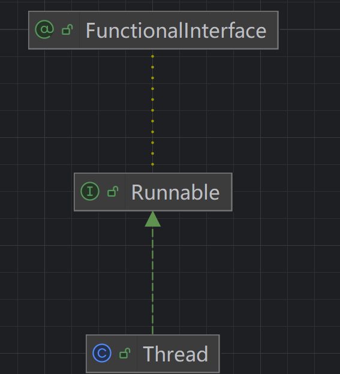
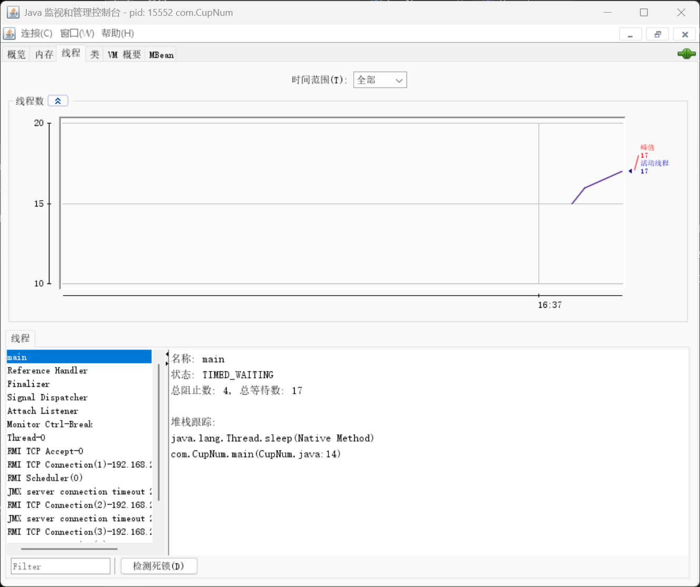
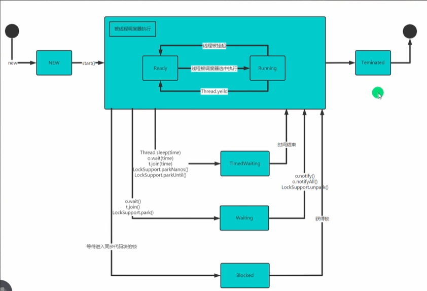

# Java笔记

在韩顺平老师的Java课程中会结合一个坦克大战的实战项目，我急功近利，就不写坦克大战的编写了，只学Java中最核心的几个知识点


**java绘图坐标体系**

基本概念

在Java中坐标原点位于左上角，以像素为单位，x坐标代表距离竖坐标向右x个像素，而y代表位于横坐标的下y个像素


**Java事件处理机制**

java事件处理采取的是"委派事件模型"，当事件发生的时候，产生事件的对象，会把此信息传递给事件的监听者进行处理，事件在代码中体现为一个事件对象。

事件源：是一个产生事件的对象，比如按钮，窗口等

事件：事件就是承载事件源状态改变时的对象，比如说键盘事件，鼠标事件，窗口事件等等，会生成一个事件对象，保存当前事件的很多信息。


## 多线程基础

单线程：同一个时刻只允许执行一个线程

多线程：同一个时刻可以执行多个线程，例如QQ打开多个聊天窗口

并发：同一个时刻，多个任务交替执行，给人以同时进行的错觉（单线程多任务）

并行：同一个时刻，多个任务同时进行（多核CPU可以支持并行）

可通过Java写一个返回可用CPU数量的代码

```java
public class CupNum {
    public static void main(String[] args) {
        Runtime runtime = Runtime.getRuntime();
        int cupNums = runtime.availableProcessors();
        System.out.println(cupNums);//16
    }
}
```

## 线程的基本使用

在Java中线程有两种使用方式

继承关系，其中Thread类实现了Runnable接口



1.继承Thread类，重写run方法

```
//1.当一个类继承了Thread类，该类就可以被当作线程使用
//2.一般我们会重写run方法，写上自己的业务代码
//3.run Thread 类实现了 Runnable 接口的run方法
```

2.实现Runnable接口，重写run方法

我们先用thread实现run

### 继承Thread

以下是一个代码示例，启动一个猫叫的线程，输出5次

```java
public class CupNum {
    public static void main(String[] args) {
        Cat cat = new Cat();//对于一个继承了Thread类的类
        cat.start();//我们可以把它当作一个线程来启动
    }
}

class Cat extends Thread {
    private int times = 0;

    @Override
    public void run() {
        while (times < 5) {
            System.out.println("我是猫猫");
            times++;
            try {
                Thread.sleep(1000);
            } catch (InterruptedException e) {
                e.printStackTrace();
            }
        }
    }
}
```

```shell
我是猫猫 第0次 线程名 Thread-0
我是猫猫 第1次 线程名 Thread-0
我是猫猫 第2次 线程名 Thread-0
我是猫猫 第3次 线程名 Thread-0
我是猫猫 第4次 线程名 Thread-0
```

可以看到以上的代码中我们重写了Cat的run方法，但是在cat的实例中我们调用的是start方法，实际运行的也是run方法，这就涉及到了线程启用的机制

### 实现Runnable

1.因为Java是单继承的，我们有的时候仅仅依靠继承Thread类，是没有办法将一个子类再去继承Thread来实现多线程

2.Java的设计者提供了另外的一个方式创建线程，就是通过Runnable接口来创建线程

Runnable中没有start方法，而且不能够使用run来启动线程（因为直接调用run方法是阻塞的），我们需要创建线程对象将实现了Runnable接口的对象放入，再通过线程的start方法启用线程

```java
public class Hi {
    public static void main(String[] args) {
        Dog dog = new Dog();
        Thread thread = new Thread(dog);
        thread.start();
    }
}

class Dog implements Runnable {
    @Override
    public void run () {
        while(true) {
            System.out.println("大狗大狗叫叫叫~");
            try {
                Thread.sleep(1000);
            } catch (InterruptedException e) {
                System.out.println("捕获异常");
            }
        }
    }
}
```

这里的底层使用了一个名为代理模式(静态代理)的设计模式

模拟实现Runnable接口开发线程的机制（没有实现start0的多线程）

```java
class ThreadProxy implements Runnable {
    //Thread将Proxy当作一个线程类
    private Runnable target = null;

    @Override
    public void run() {
        if (target != null) {
            target.run();
        }
    }

    public ThreadProxy(Runnable target) {
        this.target = target;
    }

    public void start() {
        start0();
    }

    public void start0(){//真正实现多线程的方法
        run();
    }
}
```

这个时候我们有一个继承了父类的子类，我们就可以把这个子类实现Runnable接口，再去重写一个run方法（而通过动态绑定机制我们就可以调用run方法），将子类传给代理者，通过start方法就会开始启用多线程调用多线程子类的run方法。

### 多个子线程启用

```java
public class Hi {
    public static void main(String[] args) {
        Dog dog1 = new Dog("来福");
        Dog dog2 = new Dog("旺财");
        Thread thread1 = new Thread(dog1);
        Thread thread2 = new Thread(dog2);
        thread1.start();
        thread2.start();
    }
}

class Dog implements Runnable {
    private int count = 0;
    private String name;

    public Dog(String name) {
        this.name = name;
    }

    @Override
    public void run() {
        while (count < 10) {
            System.out.println("大狗 " + name + " 叫叫叫~");
            count++;
            try {
                Thread.sleep(1000);
            } catch (InterruptedException e) {
                System.out.println("捕获异常");
            }
        }
    }
}
```

```
大狗 旺财 叫叫叫~
大狗 来福 叫叫叫~
大狗 来福 叫叫叫~
大狗 旺财 叫叫叫~
大狗 旺财 叫叫叫~
大狗 来福 叫叫叫~
大狗 旺财 叫叫叫~
大狗 来福 叫叫叫~
大狗 来福 叫叫叫~
大狗 旺财 叫叫叫~
...
```

其中并不是完全交替执行的，其原因和底层CPU调用机制有关

用jconsole监视线程，发现main线程很快退出，而两个子线程继续执行，并在各个线程结束后消散，最后进程结束

Thread和Runnable

1.之间本质上都没有什么区别，都是通过了start0方法去创建一个线程运行，而通过源码上来看发现Thread类本身也实现了Runnable的接口

2.实现Runnable接口方式更加适合多个线程共享一个资源的情况，并且避免了单继承的限制

```java
Dog dog = new Dog();
Thread thread1 = new Thread(dog);
Thread thread2 = new Thread(dog);
thread1.start();
thread2.start();
```

## 线程启用的机制

### 线程的运行与生命周期

在我们运行代码的时候，我们会开启一个进程，在这个进程中我们会开启一个主线程，在主线程又会开启Thread-0子线程，用这种方式启动子线程后，主线程不会阻塞，会继续执行

```java
public class CupNum {
    public static void main(String[] args) {
        Cat cat = new Cat();
        cat.start();
        for(int i = 0; i < 3; i++) {
            System.out.println("主线程 " + i);
            try{
                Thread.sleep(1000);
            } catch (Exception e) {
                System.out.println("捕获主线程异常");
            }
        }
    }
}

class Cat extends Thread {
    private int times = 0;

    @Override
    public void run() {
        while (times < 5) {
            System.out.println("我是猫猫 第" + times + "次 线程名 " + Thread.currentThread().getName());
            times++;
            try {
                Thread.sleep(1000);
            } catch (InterruptedException e) {
                System.out.println("捕获子线程异常");
            }
        }
    }
}
```

直观上来看，子线程，主线程交替执行，直到线程执行完毕

```java
主线程 0
我是猫猫 第0次 线程名 Thread-0
主线程 1
我是猫猫 第1次 线程名 Thread-0
主线程 2
我是猫猫 第2次 线程名 Thread-0
我是猫猫 第3次 线程名 Thread-0
我是猫猫 第4次 线程名 Thread-0
```

为了直观的看到线程的创建，我们使用jconsole来监视线程



当子线程执行完后Thread就会被挂了，而主线程继续执行，或者如果主线程先挂，子线程也会继续执行，这就意味着主方法执行完毕的时候，可能进程任然在工作。（当所有的线程执行完毕的时候，进程才会被挂）

### 为什么时用start而不是run

当直接调用run方法启动代码的时候其实没有启用一个线程，实际上会发生阻塞，并不能实现我们预期中多线程

1.先调用start方法，其中包含了start0方法

```java
public synchronized void start() {
    if (threadStatus != 0)
        throw new IllegalThreadStateException();
    group.add(this);

    boolean started = false;
    try {
        start0();
        started = true;
    } finally {
        try {
            if (!started) {
                group.threadStartFailed(this);
            }
        } catch (Throwable ignore) {
        
        }
    }
}
```

2.在使用start方法的时候会调用start0（JVM）方法，这个方法由底层实现，实现了多线程，使用多线程的方法调用run，而run加载到可运行的线程中，由CPU进行执行

```java
private native void start0();
```


## 实际案例（缺省版）

在后续同步机制中补完

我们模拟一个三个窗口售票的情景

```java
package com;

public class SellTicket {
    public static void main(String[] args) {
        SellTicket01 sell = new SellTicket01();
        Thread t1 = new Thread(sell);
        Thread t2 = new Thread(sell);
        Thread t3 = new Thread(sell);
        t1.start();
        t2.start();
        t3.start();
    }
}

class SellTicket01 implements Runnable {
    private static int ticketNum = 10;

    @Override
    public void run() {
        while(true) {
            if(ticketNum <= 0) {
                System.out.println("票售完");
                break;
            }

            try {
                System.out.println("售出一张票");
                ticketNum--;
                System.out.println("剩余" + ticketNum + "张票");
                Thread.sleep(5000);
            } catch (Exception e) {
                System.out.println("捕获异常");
            }
        }
    }
}
```

运行结果如下：我们会发现虽然设置了当票数<=0的时候需要break，但是在没有来得及对于票数进行减少的前提下，线程中的判断条件就已经执行（判断还剩余票，可以继续售卖），就会导致了票数超卖的情况

```
售出一张票
售出一张票
剩余8张票
售出一张票
剩余7张票
剩余9张票
售出一张票
剩余6张票
售出一张票
剩余5张票
售出一张票
剩余4张票
售出一张票
剩余3张票
售出一张票
剩余2张票
售出一张票
剩余1张票
售出一张票
剩余0张票
售出一张票
剩余-1张票
售出一张票
剩余-2张票
票售完
票售完
票售完
```

我们需要使用线程的同步互斥来解决这个问题

## 线程的退出

1.当线程完成任务的时候，线程会自动退出

2.还可以使用变量来控制run方法的退出的方式停止线程，及通知方式

以下代码通过修改flag判断条件退出线程

```java
package com;

public class Exit01 {
    public static void main(String[] args) {
        T t = new T();
        Thread thread = new Thread(t);
        thread.start();
        try {
            Thread.sleep(6000);
        } catch (InterruptedException e) {
            throw new RuntimeException(e);
        }
        t.flag = false;//设置为不再运行
    }
}

class T implements Runnable {
    public boolean flag = true;
    @Override
    public void run() {
        while(flag) {
            System.out.println("持续运行");
            try {
                Thread.sleep(2000);
            } catch (InterruptedException e) {
                System.out.println("捕获异常");
            }
        }
    }
}
```

```
持续运行
持续运行
持续运行
```

## 线程常用的方法

### setName

设置线程名称，使与参数name同名

```java
public class Thread01 {
    public static void main(String[] args) {
        M m = new M();
        Thread t = new Thread(m);
        t.setName("线程1");
    }
}
```

### getName

获取当前线程名称


### setPriority

更改线程优先级

分为1， 5， 10 从低到高

```java
public class Thread01 {
    public static void main(String[] args) {
        M m = new M();
        Thread t = new Thread(m);
        t.setName("线程1");
        t.setPriority(Thread.MIN_PRIORITY);//设置优先级为最低
    }
}
```

### getPriority

获取线程优先级

```java
public final static int MIN_PRIORITY = 1;
public final static int NORM_PRIORITY = 5;
public final static int MAX_PRIORITY = 10;
```

### sleep

暂停当前线程进入休眠

### interrupt

中断线程，没有结束线程，一般用于中断正在休眠的线程（用于唤醒休眠线程）

```java
public class Thread01 {
    public static void main(String[] args) {
        M m = new M();
        Thread t = new Thread(m);
        t.setName("线程1");//设置线程名字
        t.setPriority(Thread.MIN_PRIORITY);//设置优先级为最低
        System.out.println(t.getName());//获取线程名字
        t.start();
        try {
            Thread.sleep(5000);
        } catch (InterruptedException e) {
            throw new RuntimeException(e);
        }
        t.interrupt();
    }
}

class M implements Runnable {
    public boolean flag = true;

    @Override
    public void run() {
        System.out.println("线程运行");
        try {
            System.out.println("线程休眠20s");
            Thread.sleep(20000);
        } catch (InterruptedException e) {
            System.out.println("休眠被中断");
        }
        System.out.println("线程结束");
    }
}
```

```
线程1
线程运行
线程休眠20s
休眠被中断
线程结束
```

### 线程插队

### yield

线程礼让，让出CPU，让其他的线程执行，但是礼让的时间不确定，所以也不一定礼让成功

### join

线程的插队，插队的线程一旦插队成功，则肯定先在执行完插入的线程的所有任务

### 使用join

代码示例（不加入插队的情况），两个线程交替进行

```java
public class Thread02 {
    public static void main(String[] args) {
        System.out.println("主线程开始运行");
        N n = new N();
        Thread thread1 = new Thread(n);
        thread1.start();
        for(int i = 0; i < 20; i++) {
            System.out.println("主线程占用" + i);
            try {
                Thread.sleep(2000);
            } catch (InterruptedException e) {
                throw new RuntimeException(e);
            }
        }
    }
}

class N implements Runnable {
    @Override
    public void run() {
        System.out.println("子线程开始运行");
        for(int i = 0; i < 20; i++) {
            System.out.println("子线程占用" + i);
            try {
                Thread.sleep(2000);
            } catch (InterruptedException e) {
                throw new RuntimeException(e);
            }
        }
    }
}
```

```
主线程开始运行
主线程占用0
子线程开始运行
子线程占用0
子线程占用1
主线程占用1
主线程占用2
子线程占用2
主线程占用3
子线程占用3
主线程占用4
子线程占用4
子线程占用5
主线程占用5
```

主线程加入join，让子线程插队

```java
for(int i = 0; i < 20; i++) {
    System.out.println("主线程占用" + i);
    try {
        if(i == 2) {
            thread1.join();//在判断主线程执行3次的时候，让子线程插队
        }
        Thread.sleep(500);
    } catch (InterruptedException e) {
        throw new RuntimeException(e);
    }
}
```

运行结果

```java
主线程开始运行
主线程占用0
子线程开始运行
子线程占用0
主线程占用1
子线程占用1
主线程占用2
子线程占用2
子线程占用3
子线程占用4
子线程占用5
子线程占用6
子线程占用7
子线程占用8
子线程占用9
子线程占用10
......
```

当子线程结束后，主线程再继续执行

### 使用yield

（调用静态方法）

而使用yield在资源不紧张的情况下可以使得继续同步执行

```java
for(int i = 0; i < 20; i++) {
    System.out.println("主线程占用" + i);
    try {
        if(i == 2) {
            Thread.yield();
        }
        Thread.sleep(500);
    } catch (InterruptedException e) {
        throw new RuntimeException(e);
    }
}
```

运行结果：仍然继续同步执行

```
主线程开始运行
主线程占用0
子线程开始运行
子线程占用0
主线程占用1
子线程占用1
子线程占用2
主线程占用2
子线程占用3
主线程占用3
子线程占用4
主线程占用4
主线程占用5
子线程占用5
主线程占用6
```

### 线程插队例题

1.主线程每间隔1s输出hi，一共10次

2.当输出5次hi后，启动一个子线程，每隔1s输出hello （要求使用join插队）

3.在子线程执行完毕后继续输出主线程的hi

```java
package com;
public class Homework {
    public static void main(String[] args) throws InterruptedException {
        AA aa = new AA();
        Thread thread = new Thread(aa);
        for (int i = 1; i < 11; i++) {
            System.out.println("hi " + i);
            if (i == 5) {
                thread.start();
                thread.join();
            }
            Thread.sleep(1000);
        }
        System.out.println("主线程结束");
    }
}

class AA implements Runnable {
    @Override
    public void run() {
        for (int i = 1; i < 11; i++) {
            System.out.println("hello " + i);
            try {
                Thread.sleep(1000);
            } catch (InterruptedException e) {
                throw new RuntimeException(e);
            }
        }
        System.out.println("子线程结束");
    }
}
```

## 用户线程和守护线程

1.用户线程：也被称为工作线程，当线程的任务执行完成或通知方式结束

2.守护线程：一般是为了工作线程服务的，当所有的用户线程结束的时候，守护线程自动结束

3.常见的守护线程：垃圾回收机制

我们接下来模拟一个守护线程，这个线程在主线程运行完毕之后退出，只需要将子线程设置为守护线程即可

```java
package com;

public class Thread03 {
    public static void main(String[] args) {
        B b = new B();
        Thread thread = new Thread(b);
        thread.setDaemon(true);
        //设置守护线程 注意先设置再启动
        thread.start();
        for (int i = 0; i < 10; i++) {
            System.out.println("主线程工作中...");
            try {
                Thread.sleep(500);
            } catch (InterruptedException e) {
                throw new RuntimeException(e);
            }
        }
    }
}

class B implements Runnable {
    @Override
    public void run() {
        while(true) {
            try {
                Thread.sleep(1000);
            } catch (InterruptedException e) {
                throw new RuntimeException(e);
            }
            System.out.println("守护线程工作中...");
        }
    }
}
```

运行结果：可见使用setDaemon关键字进行设置守护线程

```
主线程工作中...
主线程工作中...
主线程工作中...
守护线程工作中...
主线程工作中...
主线程工作中...
守护线程工作中...
主线程工作中...
主线程工作中...
守护线程工作中...
主线程工作中...
守护线程工作中...
主线程工作中...
主线程工作中...
守护线程工作中...
```

## 线程的生命周期

在JDK文档中有一个State的枚举类型，用于表示线程的六种状态

NEW 尚未启动的线程位于此状态

RUNNABLE 在Java虚拟机中执行的线程位于此状态

BLOCKED 被阻塞等待监视器锁定的线程位于此状态

WAITING 正在等待另一个线程执行特定动作的线程位于此状态

TIMED_WAITING 正在等待另一个线程执行特定动作到指定的等待时间的线程位于此状态

TERMINATED 已退出的线程位于此状态

在有一些说法中有七种状态之说：其实是RUNNABLE细化为了READY和RUNNING，取决于是否真正在运行



其中RUNNABLE会通过三种不同的操作进入WAITING TIMED_WAITING BLOCKED 而在特定的条件下返回RUNNABLE

在以前提到的wait和join实际上就是将线程的状态切换为WAITING 或者 TIMED_WAITING（取决于加不加参数），而yeild是将RUNING状态尝试着切换到Ready状态，从而让出CPU时间 

代码示例

```java
public class Thread03 {
    public static void main(String[] args) {
        B b = new B();
        Thread thread = new Thread(b);
        System.out.println("thread 的状态为 " + thread.getState());//再启动前输出状态（1）
        thread.start();
        //在状态不为结束的时候重复输出状态
        while(Thread.State.TERMINATED != thread.getState()) {
            System.out.println("thread 的状态为 " + thread.getState());//在RUNNABLE的状态输出（2）
            try {
                Thread.sleep(1000);
            } catch (InterruptedException e) {
                throw new RuntimeException(e);
            }
        }
        System.out.println("thread 的状态为 " + thread.getState());//在线程结束时输出状态（3）
    }
}
```

```java
thread 的状态为 NEW（1）
thread 的状态为 RUNNABLE
线程工作中...
线程工作中...
thread 的状态为 RUNNABLE
线程工作中...
线程工作中...
thread 的状态为 RUNNABLE
线程工作中...
线程工作中...
thread 的状态为 RUNNABLE
线程工作中...
线程工作中...
thread 的状态为 TIMED_WAITING//在子线程启用sleep时进入了TIMED_WAITING
线程工作中...
线程工作中...
thread 的状态为 RUNNABLE
thread 的状态为 TERMINATED（3）
```

## 线程同步机制

还记得我们之前的售票问题吗？因为没有办法预期什么时候票售完，而导致了过量销售票的问题，现在我们要来解决这个问题

### 同步

1.在多线程编程中，一些敏感的数据不允许被多个线程同时访问，此时就要使用同步访问技术，保证数据在任何一个时刻最多只能有一个线程访问它，保证数据的完整性

2.从内存上而言，线程同步是当有一个线程对特定的内存进行操作时，其他线程都不可以对这个内存地址进行操作，直到该线程完成操作


### Synchronized关键字

1.同步代码块

```java
synchronized(对象){	//得到对象的锁之后才可以操作代码
	//需要被同步的代码;
}
```

2.运用synchronized放在方法声明

```java
public synchronized void m () {
	//需要被同步的代码;
}
```


### 互斥锁

1.Java中，引入了对象互斥锁的概念，来保证共享数据操作的完整性

2.每个对象都对应于一个可称为“互斥锁”的标记，这个标记用于保证在任一时刻，只能有一个线程访问该对象

3.关键字synchronized来与对象的互斥锁联系，当某个对象用synchronized装饰的时候，表明该对象在任一时刻只能由一个线程访问

4.同步的局限性：导致程序的执行效率降低

5.同步方法（非静态的）的锁可以是this，也可以是其他对象（要求是同一个对象）

6.同步方法（静态的）的锁为当前类本身

### 解决方法

#### 解决方法1

在方法上直接加锁，加上synchronized关键字

```java
class SellTicket01 implements Runnable {
    private static int ticketNum = 10;
    private boolean loop = true;
    @Override
    public void run() {
        while(loop) {
            sell();
        }
    }

    public synchronized void sell() {
        if(ticketNum <= 0) {
            System.out.println("票售完");
            loop = false;
            return;
        }

        try {
            System.out.println(Thread.currentThread().getName() + "售出一张票");
            ticketNum--;
            System.out.println("剩余" + ticketNum + "张票");
            Thread.sleep(5000);
        } catch (Exception e) {
            System.out.println("捕获异常");
        }
    }
}
```

运行结果：

```
Thread-0售出一张票
剩余9张票
Thread-1售出一张票
剩余8张票
Thread-2售出一张票
剩余7张票
Thread-2售出一张票
剩余6张票
Thread-1售出一张票
剩余5张票
Thread-1售出一张票
剩余4张票
Thread-1售出一张票
剩余3张票
Thread-1售出一张票
剩余2张票
Thread-1售出一张票
剩余1张票
Thread-0售出一张票
剩余0张票
票售完
票售完
票售完
```


#### 解决方法2

在代码块上加锁

```java
class SellTicket01 implements Runnable {
    private static int ticketNum = 10;
    private boolean loop = true;
    @Override
    public void run() {
        while(loop) {
            sell();
        }
    }

    public void sell() {
        synchronized(this) {
            if(ticketNum <= 0) {
                System.out.println("票售完");
                loop = false;
                return;
            }

            try {
                System.out.println(Thread.currentThread().getName() + "售出一张票");
                ticketNum--;
                System.out.println("剩余" + ticketNum + "张票");
                Thread.sleep(5000);
            } catch (Exception e) {
                System.out.println("捕获异常");
            }
        }
    }
}
```

#### 改进

其实还可以改进一下，将模拟的sleep放在所代码块的外面，这样可以模拟每一个售票窗口每5s售一张票，而不是没5s只有一个售票口出一张票（其实这里在实际编程中不会加入sleep休眠，只是增强一下对锁的理解，sleep休眠的时间是不受this锁的影响）

```java
class SellTicket01 implements Runnable {
    private static int ticketNum = 10;
    private boolean loop = true;
    @Override
    public void run() {
        while(loop) {
            sell();
        }
    }

    public void sell() {
        synchronized(this) {
            if(ticketNum <= 0) {
                System.out.println("票售完");
                loop = false;
                return;
            }
                System.out.println(Thread.currentThread().getName() + "售出一张票");
                ticketNum--;
                System.out.println("剩余" + ticketNum + "张票");
        }

        try {
            Thread.sleep(5000);
        } catch (InterruptedException e) {
            throw new RuntimeException(e);
        }
    }
}
```


### 注意细节

1.同步方法如果没有使用static修饰：默认锁对象为this

2.如果方法使用static修饰，默认锁对象：当前类.class

3.要求多个线程的锁对象为同一个


### 线程死锁

多个线程都占用了对方的锁资源，但是不肯相让，导致了死锁

例如：A要B的b资源，但是b资源被B占用，而B要等到A的a资源释放后才可以继续运行完毕释放b资源，导致了A也无法获取到b资源，从而释放a。

以下是一个发生死锁的代码示例，两个Object资源由static修饰，两个新创建的对象共享资源

```java
package com;

public class DeadLock {
    public static void main(String[] args) {
        Thread thread1 = new Thread(new DeadLockDemo(true));
        Thread thread2 = new Thread(new DeadLockDemo(false));
        thread1.start();
        thread2.start();
    }
}

class DeadLockDemo implements Runnable {
    static Object resource1 = new Object();
    static Object resource2 = new Object();

    boolean flag;

    public DeadLockDemo(boolean flag) {
        this.flag = flag;
    }

    @Override
    public void run() {
        if (flag) {
            synchronized (resource1) {
                try {
                    System.out.println(Thread.currentThread().getName() + "获取资源1,下一步获取资源2");
                    Thread.sleep(5000);
                } catch (InterruptedException e) {
                    throw new RuntimeException(e);
                }
                synchronized (resource2) {
                    try {
                        System.out.println(Thread.currentThread().getName() + "获取资源2");
                        Thread.sleep(5000);
                    } catch (InterruptedException e) {
                        throw new RuntimeException(e);
                    }
                }
            }
        } else {
            synchronized (resource2) {
                try {
                    System.out.println(Thread.currentThread().getName() + "获取资源2,下一步获取资源1");
                    Thread.sleep(5000);
                } catch (InterruptedException e) {
                    throw new RuntimeException(e);
                }
                synchronized (resource1) {
                    try {
                        System.out.println(Thread.currentThread().getName() + "获取资源1");
                        Thread.sleep(5000);
                    } catch (InterruptedException e) {
                        throw new RuntimeException(e);
                    }
                }
            }
        }
    }
}
```

发生死锁

```
Thread-0获取资源1,下一步获取资源2
Thread-1获取资源2,下一步获取资源1
```


### 释放锁

#### 会释放锁的情况

1.当前线程的同步方法、同步代码块执行完毕

2.当前线程在同步方法、同步代码块中遇到了break、return

3.当前线程在同步方法、同步代码块中遇到了异常

4.当前线程在同步方法、同步代码块中调用了线程对象的wait方法，使线程暂停

#### 不会释放锁的情况

1.当前线程在同步方法、同步代码块中使用了Thread.sleep/yield方法

2.线程执行同步代码块中，其他线程调用了该线程的suspend( )方法，将该线程挂起，该线程不会释放锁。（不推荐使用suspend和resume进行编程）

# 多线程编程作业

## 例题一

1.在main方法中启动两个线程

2.在第一个线程中随机循环打印100以内的整数

3.直到第二个线程中从键盘读取了Q命令


解题思路：

我将线程2设置为守护线程，当线程1结束时，守护线程2自动结束

而线程2中可以去设置线程1类的loop从而终止线程1

```java
public class Homework01 {
    public static void main(String[] args) {
        Thread thread1 = new Thread(new Task1());
        Thread thread2 = new Thread(new Task2());
        thread2.setDaemon(true);
        thread1.start();
        thread2.start();
    }
}

class Task1 implements Runnable {
    public static boolean loop = true;

    @Override
    public void run() {
        while (loop) {
            System.out.println((int) (Math.random() * 100));
            try {
                Thread.sleep(500);
            } catch (InterruptedException e) {
                throw new RuntimeException(e);
            }
        }
    }
}

class Task2 implements Runnable {
    @Override
    public void run() {
        while (true) {
            Scanner scanner = new Scanner(System.in);
            char c = scanner.next().charAt(0);
            if (c == 'Q' || c == 'q') {
                Task1.loop = false;
            }
        }
    }
}
```

或者你也可以在判断条件下直接break Task2，就不用守护线程了

## 例题二

1.有两个用户分别从一个卡上取钱（总额1000元）

2.每次取1000块，当余额不足时就不能取了

我对题目稍做了一些更改：每次随机取（0-1000元），使其更符合生活实际

```java
package com;

public class HomeWork02 {
    public static void main(String[] args) {
        Bank bank = new Bank();
        Thread thread1 = new Thread(bank);
        Thread thread2 = new Thread(bank);
        thread1.start();
        thread2.start();
    }
}

class Bank implements Runnable {
    public static int money = 10000;
    static final Object obj = new Object();

    @Override
    public void run() {
        while (true) {
            synchronized (obj) {
                int getMoney = (int) (Math.random() * 1000);
                if (money - getMoney < 0) {
                    System.out.println("钱不够取 剩余 " + money);
                    break;
                } else {
                    System.out.println(Thread.currentThread().getName() + " 取出 " + getMoney + " 剩余 " + money);
                    money -= getMoney;
                }
            }
            try {
                Thread.sleep(500);
            } catch (InterruptedException e) {
                throw new RuntimeException(e);
            }
        }
    }
}
```

结果为：

```
Thread-0 取出 153 剩余 10000
Thread-1 取出 82 剩余 9847
Thread-0 取出 852 剩余 9765
Thread-1 取出 727 剩余 8913
Thread-1 取出 857 剩余 8186
Thread-0 取出 765 剩余 7329
Thread-1 取出 904 剩余 6564
Thread-0 取出 766 剩余 5660
Thread-1 取出 901 剩余 4894
Thread-0 取出 440 剩余 3993
Thread-1 取出 430 剩余 3553
Thread-0 取出 5 剩余 3123
Thread-1 取出 726 剩余 3118
Thread-0 取出 293 剩余 2392
Thread-0 取出 655 剩余 2099
Thread-1 取出 372 剩余 1444
Thread-0 取出 874 剩余 1072
钱不够取 剩余 198
钱不够取 剩余 198
```

