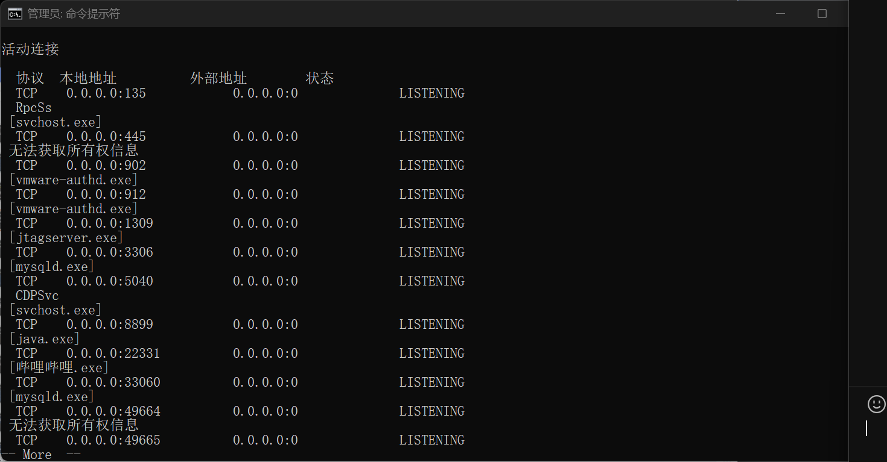

# 听课笔记

## 文件传输

Java中利用套接字在服务器与客户端间进行文件传输

在这里需要使用到文件的输入输出流

客户端上：

客户端接收文件的输入流，用工具类转化为字节流进行传输


服务器上

在服务器端上我们要将收到的输入流使用功能类转化为字节流

再将转化后的字节数组用文件输出流送到一个特定的位置

客户端代码

```java
package com.file;

import java.io.*;
import java.net.InetAddress;
import java.net.ServerSocket;
import java.net.Socket;

public class Client {
    public static void main(String[] args) throws Exception {
        Socket socket = new Socket(InetAddress.getLocalHost(),8899);
        String filePath = "C:\\Users\\71460\\Desktop\\2.jpg";
        BufferedInputStream bis = new BufferedInputStream(new FileInputStream(filePath));
        byte[] bytes = StreamUtils.streamToByteArray(bis);

        BufferedOutputStream bos = new BufferedOutputStream(socket.getOutputStream());
        bos.write(bytes);
        bos.flush();
        bis.close();
        socket.shutdownOutput();

        InputStream inputStream = socket.getInputStream();
        BufferedReader bufferedReader = new BufferedReader(new InputStreamReader(inputStream));

        String reBack = bufferedReader.readLine();
        System.out.println("收到服务器回复: " + reBack);
        bufferedReader.close();
        socket.close();
        bos.close();
    }
}
```

服务端代码

```java
package com.file;

import java.io.*;
import java.net.ServerSocket;
import java.net.Socket;

public class Server {
    public static void main(String[] args) throws Exception {
        ServerSocket serverSocket = new ServerSocket(8899);
        Socket socket = serverSocket.accept();

        BufferedInputStream bis = new BufferedInputStream(socket.getInputStream());
        byte[] bytes = StreamUtils.streamToByteArray(bis);

        String target = ".\\target.jpg";
        BufferedOutputStream bos = new BufferedOutputStream(new FileOutputStream(target));
        bos.write(bytes);
        bos.close();

        OutputStream outputStream = socket.getOutputStream();
        BufferedWriter bufferedWriter = new BufferedWriter(new OutputStreamWriter(outputStream));

        bufferedWriter.write("收到图片");
        bufferedWriter.newLine();
        bufferedWriter.flush();
        bufferedWriter.close();
        bis.close();
        socket.close();
        serverSocket.close();

    }
}
```

使用到的工具包

```java
package com.file;

import java.io.ByteArrayOutputStream;
import java.io.InputStream;

public class StreamUtils {
    //将输入流转化为字节流，可以将文件的内容读入到byte数组中
    public static byte[] streamToByteArray(InputStream is) throws  Exception{
        ByteArrayOutputStream bos = new ByteArrayOutputStream();
        byte[] buffer = new byte[1024];
        int len = 0;
        while((len=is.read(buffer))!=-1){
            bos.write(buffer,0,len);
        }
        byte[] array = bos.toByteArray();
        bos.close();
        return array;
    }
}
```

## netstat指令

netstat -an 可以查看当前主机网络情况，包括端口监听情况和网络连接情况

netstat -an | more 可以分页显示

Listening代表有某个端口在监听

如果有一个外部程序链接到端口就会显示一条连接信息

再管理员权限下可以使用netstat -anb 来观察是哪一个程序监听端口



其中的8899端口所对应的就是我们的运行的文件传输服务器程序

## TCP链接中的细节

TCP连接中，服务端监听了一个端口，再客户端和服务端建立链接的时候，客户端中也会有一个由TCP协议分配的一个端口
