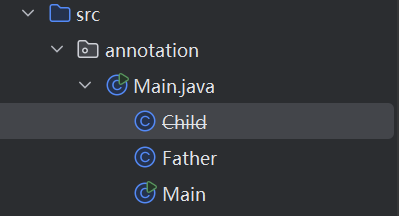
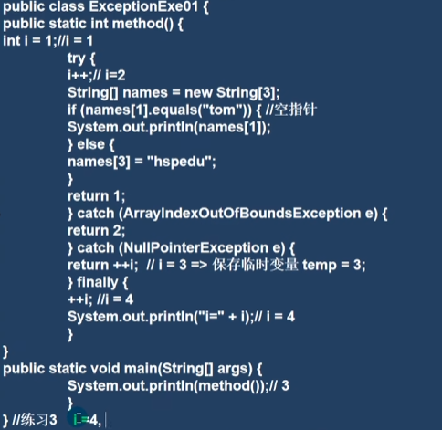
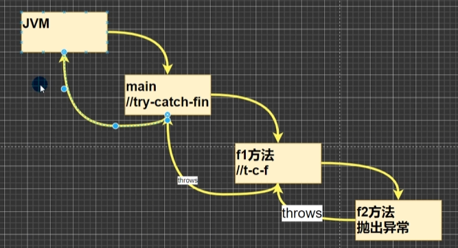

# Java笔记

## 枚举类

在设计一个季节对象的时候，我们可以用传统的方式实现

```java
public class Enumeration {
    Season season = new Season("春天", "温暖");
}

class Season {
    private String season;
    private String description;
    Season(String season, String description) {
        this.season = season;
        this.description = description;
    }
}
```

但是众所周知，季节只有四季，不能体现只有四个这个特征，为了解决这个问题，我们可以使用枚举类来定义季节，设计几个有限的值

### 枚举定义

是一组常量的集合：枚举是一种特殊的类，里面只包含一组有限的特定对象


自定义枚举

1.不需要提供set方法，因为枚举对象通常是只读的

2.写枚举对象/属性的使用一般用final + static 修饰

3.枚举对象名通常用大写来命名，常量的命名规范

4.枚举对象根据需要也可以拥有多个属性


### 使用方式1

1.私有化构造器，防止直接new

2.删去set方法，防止属性修改

3.在Season内部直接创建固定对象

```java
public class Enumeration {
    Season season = Season.SPRING;
}

class Season {
    private String season;
    private String description;

    public static final Season SPRING = new Season("春天", "温暖");
    public static final Season SUMMER = new Season("夏天", "炎热");
    public static final Season AUTUMN = new Season("秋天", "凉爽");
    public static final Season WINTER = new Season("冬天", "寒冷");
    
    private Season(String season, String description) {
        this.season = season;
        this.description = description;
    }
}
```

### 使用方式2

使用关键字enum

使用细节

1.要将枚举对象放在枚举类的行首

2.常量之间用“，”间隔

3.常量通过构造器构造，必须知道用哪一个构造器

4.使用无参构造器的时候可以省略形参列表和小括号

```java
public class Enumeration {
    Season season = Season.SPRING;
}

enum Season {
    SPRING("春天", "温暖"),
    SUMMER("夏天", "炎热"),
    AUTUMN("秋天", "凉爽"),
    WINTER("冬天", "寒冷");

    private String season;
    private String description;

    private Season(String season, String description) {
        this.season = season;
        this.description = description;
    }
}
```

5.当使用enum关键字开发一个枚举类的时候，默认继承了Enum类

这里可以运用反编译来进行证明

```cmd
PS C:\Users\71460\Desktop\Java\IDEA\chapter11\out\production\chapter11\com\enum_> javap Season.class
Compiled from "Enumeration.java"
final class com.enum_.Season extends java.lang.Enum<com.enum_.Season> {
  public static final com.enum_.Season SPRING;
  public static final com.enum_.Season SUMMER;
  public static final com.enum_.Season AUTUMN;
  public static final com.enum_.Season WINTER;
  public static com.enum_.Season[] values();
  public static com.enum_.Season valueOf(java.lang.String);
  static {};
}
```

### Enum类

关键enum字修饰的类隐式的继承了Enum类，这个类中有一些常用的方法

挨个解释有点麻烦，这里直接上代码示例

```java
public class Enumeration {
    public static void main(String[] args) {
        Season season = Season.WINTER;
        System.out.println(season.toString());// WINTER 输出枚举的名字
        System.out.println(season.name());// WINTER 输出枚举的名字
        System.out.println(season.ordinal());// 3 输出枚举对象的次序，从0开始编号
        for (Season s : Season.values()) {
            System.out.println(s.toString()); // 输出一个枚举常量的数组
        }
        Season season2 = Season.valueOf("SPRING");// 用valueOf可以将字符串转为枚举常量
        System.out.println(season2.compareTo(season));
        //-3 比较两个枚举类型，return self.ordinal - other.ordinal;
    }

}

enum Season {
    SPRING("春天", "温暖"),
    SUMMER("夏天", "炎热"),
    AUTUMN("秋天", "凉爽"),
    WINTER("冬天", "寒冷");

    private String season;
    private String description;

    private Season(String season, String description) {
        this.season = season;
        this.description = description;
    }
}
```

Enum使用细节

1.enum不可以继承其他类，因为已经继承了Enum父类

2.枚举类和普通类一样可以实现接口

```java
public class Homework {
    public static void main(String[] args) {
        Week week = Week.TUESDAY;
        week.doSomething();
    }
}

interface Doing {
    void doSomething();
}

enum Week implements Doing {
    MONDAY("星期一"),
    TUESDAY("星期二"),
    WEDNESDAY("星期三");

    private String name;
    private Week(String name) {
        this.name = name;
    }

    @Override
    public void doSomething() {
        System.out.println(name);
    }

    @Override
    public String toString() {
        return name;
    }
}
```

## 注解

### 定义

注解（Annotation）也被称为元数据（Metadata）

1.用于修饰包，类，方法，属性，构造器，局部变量的数据信息

2.和注释一样，注解不影响程序逻辑，但是注解可以被编译运行，相当于嵌入在代码中的补充信息

3.在JavaSE中，注解使用的目的比较简单，例如标记过过时的功能，忽略警告等

4.在JavaEE中注解占据了更加重要的角色，例如配置应用程序的任何切面，代替JavaEE旧版中所遗留的，繁冗代码和XML配置等

### 三个基本的Annotation

#### @Override

限定某个方法，是重写父类方法，该注解只可以用于方法

源码中的override注解说明，其中@target是注解注解的注解

```java
@Target(ElementType.METHOD)
@Retention(RetentionPolicy.SOURCE)
public @interface Override {
}
```

加上了这个注解，编译器会检查子类是否重写父类方法，如果没有重写会报错

```java
class Father {
    public Father() {}
    public void Print() {
        System.out.println("Father");
    }
}

class Child extends Father {
    public Child() {}
    @Override//加上了override注解
    public void Print() {
        System.out.println("Child");
    }
}
```

#### @Deprecated

可以做版本过渡使用（保证了兼容性）

用于表示某个程序元素（类，方法等）已过时，可以修饰方法，字段，包，参数，类，局部变量，类型等

```java
@Documented
@Retention(RetentionPolicy.RUNTIME)
@Target(value={CONSTRUCTOR, FIELD, LOCAL_VARIABLE, METHOD, PACKAGE, PARAMETER, TYPE})
public @interface Deprecated {
}
```

在以下代码中表示Child类以及过时，但是还是可以使用，只是不建议使用



```java
@Deprecated
class Child extends Father {
    public Child() {}
    @Override
    public void Print() {
        System.out.println("Child");
    }
}
```

#### @SuppressWarnings

抑制编译器警告

```java
@Target({TYPE, FIELD, METHOD, PARAMETER, CONSTRUCTOR, LOCAL_VARIABLE})
@Retention(RetentionPolicy.SOURCE)
public @interface SuppressWarnings {
    String[] value();
}
```

在编写代码的时候，往往会出现一些黄色的线条勾选部分代码，如果在合理的范围中你不想见到这一些警告，你可以使用@SuppressWarnings不显示一些警告信息

```java
public class Main {
    public static void main(String[] args) {
        List list = new ArrayList();
        list.add("her");
        list.add("he");
        list.add("it");
        System.out.println(list.get(0));
    }
}
```

以下是使用方式

```java
public class Main {
    @SuppressWarnings({"all"})//忽略编译警告
    public static void main(String[] args) {
        List list = new ArrayList();
        list.add("her");
        list.add("he");
        list.add("it");
        System.out.println(list.get(0));
    }
}
```

在{ }中填入对应需要忽略的警告信息，有点类似字符串数组的静态创建（其实本质就是一个字符串数组，可以查看jdk源码验证）

```java
 String[] value();
```

另外该注解的作用范围和注解的位置有关，像如上代码中抑制的范围是main方法中，或者更大的范围可以放在类上

### JDK中的元注解

修饰注解的注解，再查看注解源码的时候可以用元注解了解注解相应作用即可

@Retention注解的作用范围

@Target使用位置

@Documented 是否在javadoc中体现

@inherited 子类会继承父类注解（使用较少）

以下是一个例子

```java
@Documented//会显示在javadoc文档
@Retention(RetentionPolicy.RUNTIME)//注解的注解范围（源码，类，运行时）
@Target(value={CONSTRUCTOR, FIELD, LOCAL_VARIABLE, METHOD, PACKAGE, PARAMETER, TYPE})//注解的使用场景
public @interface Deprecated {
}
```

## 异常

### 概念

#### 异常的概念

在Java中，将程序执行过程中发生的不正常情况称为异常

分为两大类：Error错误以及Exception

Error： Java 虚拟机无法解决的严重问题例如JVM系统内部错误，资源溢出

Exception：由于编程错误或者偶然的外在因素导致的一般性问题，可以使用针对性地代码进行处理，异常又分为两大类，一种是编译时异常，另一种是运行时异常。

#### 异常体系图

异常中又分为编译时异常（javac），运行时异常（java）


#### 异常处理概念

如果程序员认为代码会出现异常，可以使用try-catch异常处理机制来解决

在程序运行的过程中有可能会发送各种异常，而发生程序异常的时候，程序往往发成崩溃

```java
public class Exception01 {
    public static void main(String[] args) {
        int num1 = 10;
        int num2 = 0;
        System.out.println(num1 / num2);
        System.out.println("程序运行完毕");
    }
}
```

这一段代码不会输出最后运行完毕的提示消息，在写程序的时候不应该因为一个微小地异常而导致整个程序崩溃，我们可以通过运用异常处理机制来解决这个问题

用ctrl alt + t -> 选中try-catch，如果异常处理，即使出现异常程序也可以正常执行

```java
public class Exception01 {
    public static void main(String[] args) {
        int num1 = 10;
        int num2 = 0;
        try {
            System.out.println(num1 / num2);
        } catch (Exception e) {
            System.out.println("异常被捕获");
        }
        System.out.println("程序运行完毕");
    }
}
```

输出结果

```java
异常被捕获
程序运行完毕
```

### 常见的异常

#### 运行时异常

空指针异常 NullPointerExceprion

```java
public class Exception01 {
    public static void main(String[] args) {
        String name = null;
        try {
            name.toString();
        } catch (NullPointerException e) {
            System.out.println("异常被捕获");
        }
        System.out.println("程序运行完毕");
    }
```

算数异常 ArithmeticException

```java
public class Exception01 {
    public static void main(String[] args) {
        int num1 = 10;
        int num2 = 0;
        try {
            System.out.println(num1 / num2);
        } catch (ArithmeticException e) {
            System.out.println("异常被捕获");
        }
        System.out.println("程序运行完毕");
    }
}
```

数组越界访问异常 ArrayIndexOutOfBoundsException

```java
public class Exception01 {
    public static void main(String[] args) {
        int[] arr = {1, 3, 4, 6, 7};
        try {
            System.out.println(arr[5]);
        } catch (ArrayIndexOutOfBoundsException e) {
            System.out.println("异常被捕获");
        }
        System.out.println("程序运行完毕");
    }
}
```

类型转换异常 ClassCastException

解释说明：当将对象试图转换为不是实例的子类的时候会发生该异常

```java
public class Exception01 {
    public static void main(String[] args) {
        A a = new B();
        B b = (B) a;
        try {
            C c = (C) a;
        } catch (ClassCastException e) {
            System.out.println("异常被捕获" + e.getMessage());
        }
        System.out.println("程序运行完毕");
    }
}

class A {
}

class B extends A {
}

class C {
}
```

但是这里没有捕获到异常，程序崩溃（暂时未知原因，丢给AI解释说是和开发环境以及缓存有关，后续会查证）

数字格式不正确 NumberFormatException

```java
public class Exception01 {
    public static void main(String[] args) {
        String name = "thrinisty";
        try {
            int num = Integer.parseInt(name);
        } catch (NumberFormatException e) {
            System.out.println("异常被捕获" + e.getMessage());
        }
        System.out.println("程序运行完毕");
    }
}
```

#### 编译时异常

在编译期间就必须要处理的异常，否则代码不通过编译

例如无对应文件异常，数据库异常等，在后续学习文件IO时候会进行补充


### 处理异常的方式

二选一即可

#### try-catch-finally

程序员在代码中捕获发送的异常，自行处理

```java
try {
   	//代码可能会出现异常，将异常封装为Exception对象e，传递catch
} catch (Exception e) {
   	//异常传递给catch
   	//用e来进行自定义处理
} finally {
    //（可以不写finally）
   	//不管try代码块是否有异常，始终要执行finally
    //一般是用来在这里进行资源关闭
}
```

使用细节：

1.如果异常发生，则catch中异常后的代码不再执行

```java
package com.npu;

/**
 * @author 李昊轩
 * @version 1.0
 */
public class Exception01 {
    public static void main(String[] args) {
        String name = "thrinisty";
        try {
            int num = Integer.parseInt(name);
            System.out.println("try 异常之后的代码");//不执行
        } catch (NumberFormatException e) {
            System.out.println("异常被捕获" + e.getMessage());
        } finally {

        }
        System.out.println("程序运行完毕");
    }
}
```

2.如果没有发生异常，catch代码块不会被执行

3.finally中的内容无论异常是否被接收都会被执行，一般用于释放资源

4.可以有多个catch语句，捕获不同的异常，要求父异常写在后，子异常在前例如

```java
package com.npu;

/**
 * @author 李昊轩
 * @version 1.0
 */
public class Exception01 {
    public static void main(String[] args) {
        String name = "thrinisty";
        try {
            int num = Integer.parseInt(name);
            System.out.println("try 异常之后的代码");
        } catch (NumberFormatException e) {
            System.out.println("转换异常被捕获" + e.getMessage());
        } catch (Exception e) {
            System.out.println("异常发生");
        } finally {
            System.out.println("finally");
        }
        System.out.println("程序运行完毕");
    }
}
```

5.try-finally配合使用：用于执行一段代码，之后无论异常是否发生，都会执行finally代码块

一个容易出错的题目：



#### throws

将发生的异常抛出，交给调用者（方法）来进行处理，最顶端的处理者是JVM



假如在代码中没有进行throw显示的处理，而发生了异常，就会默认的抛出异常依次传递直到JVM处理异常，退出程序

代码示例

```java
package com.npu;

import java.io.FileInputStream;
import java.io.FileNotFoundException;
import java.util.Scanner;

/**
 * @author 李昊轩
 * @version 1.0
 */
public class Exception01 {
    public static void main(String[] args) {
        try {
            m1();
        } catch (FileNotFoundException e) {
            System.out.println("File not found");
        }
    }

    public static void m1() throws FileNotFoundException {
        FileInputStream fis = new FileInputStream("cd");
    }
}
```

异常交予main函数进行处理，抛出的异常可以是一个列表，对应的异常，异常的父异常

#### 异常使用细节

1.编译异常必须处理

2.对于运行时异常，程序中没有进行处理默认为throws方式处理

3.子类重写父类方法的时候，要么抛出异常的规定，子类重写方法，所抛出的异常类型要和父类抛出的异常一致，要么为父类抛出异常类型的子类型

```java
class Father {
    public void sayHello() throws Exception {}
}

class Son extends Father {
    public void sayHello() throws IOException {}
}//子类不可以扩大异常范围
```

4.运行异常可以默认处理，但是编译异常必须显示的处理

### 课堂练习

输入整数，不是整数就继续输入

```java
public class Exception01 {
    public static void main(String[] args) {
        Scanner sc = new Scanner(System.in);
        int num = 0;
        System.out.print("输入一个整数 ");
        while (true) {
            try {
                num = Integer.parseInt(sc.nextLine());
                break;
            } catch (Exception e) {
                System.out.println("请重新输入...");
            }
        }
        System.out.println(num);
    }
}
```

### 自定义异常

使用步骤：

1.定义类：自定义异常类名，继承Exception或者RuntimeException

2.继承Exception属于编译异常

3.继承RuntimeException是运行异常

通过throw关键字抛出对应的自定义异常，并运用构造器传入异常信息

```java
public class Exception01 {
    public static void main(String[] args) {
        int age = 15;
        try {
            test(age);
        } catch (TypeException e){
            System.out.println(e.getMessage());
        }
    }

    public static void test(int age) {
        if(age < 18) {
            throw new TypeException("年龄要在18岁以上");
        }
    }
}

class TypeException extends RuntimeException {
    public TypeException(String message) {
        super(message);
    }
}
```

### throw与throws


到此枚举类，注解，异常处理的部分结束
