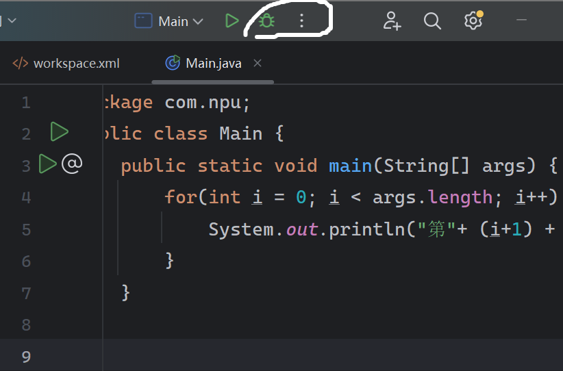
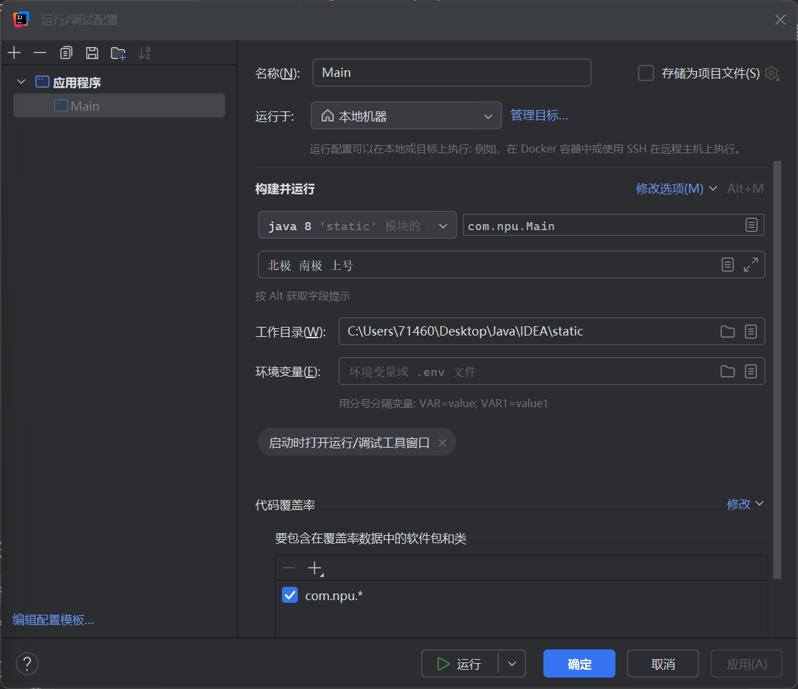

# 听课笔记

## 初级部分学习完成

终于完成了Java网络通讯的大作业，将整个项目的大致流程掌握，可以熟练的使用socket套接字进行TCP，UDP的网络编程，但是由于在进行项目的时候没有进行前置知识的学习，导致在多线程，异常处理，IO流的部分仍然无法自己独立完成，从这一课我将开始进入Java编程高级部分。

## 类变量和类方法

### 类变量

以下是一个代码示例

```java
package com.npu.static_;

public class ChildGame {
    public static void main(String[] args) {
        int count = 0;//记录有几个小孩加入游戏

        Child child1 = new Child("1");
        child1.join();
        count++;
        Child child2 = new Child("2");
        child2.join();
        count++;
        Child child3 = new Child("3");
        child3.join();
        count++;

        System.out.println("一共有 " + count + " 小孩");
    }

}

class Child {
    private String name;

    public Child(String name) {
        this.name = name;
    }

    public void join() {
        System.out.println(this.name + " join");
    }
}
```

我们会很容易发现这样做count（独立于对象）没有办法在类方法中使用，我们必须要将这个计数的功能单独提取出来，这会弱化代码的可读性（没有面向对象）较为麻烦，这个时候我们就要将count设置为类变量（静态变量）

使用static关键字可以修饰一个可以供所有类同时享用的变量

语法定义：

```
访问修饰符 static 数据类型 变量名 ; [推荐使用]
static 访问修饰符 数据类型 变量名 ;
```

使用方式：

```
对象名.静态变量
类名.静态变量 [推荐使用]
```


```java
package com.npu.static_;

public class ChildGame {
    public static void main(String[] args) {


        Child child1 = new Child("1");
        Child child2 = new Child("2");
        Child child3 = new Child("3");

        child1.join();
        child2.join();
        child3.join();

        System.out.println("一共有 " + Child.count + " 小孩");
    }

}

class Child {
    private String name;
    public static int count = 0;

    public Child(String name) {
        this.name = name;
    }

    public void join() {
        System.out.println(this.name + " join");
        count++;
    }
}

```

各个孩子对象实例访问到的count都是同一个，加强count和Child类的联系


### 类变量在内存中的布局

类变量在不同版本有不同的存放方式，有存放在Class实例尾部中（堆），也有存放在方法区的静态域之中，但是在运用的时候，只需要了解静态变量可以供所有的（同一个类）对象共享，在类加载的时候生成

```java
package com.npu.static_;

public class VisitStatic {
    public static void main(String[] args) {
        System.out.println(A.count);
        //无需创建类即可访问，因为是类加载的时候count就被创建
    }
}

class A {
    public static int count = 0;
}
```

### 类方法

类方法也叫静态方法

定义形式

```
访问修饰符 static 数据返回类型 方法名 () {} [推荐使用]
static 访问修饰符 数据返回类型 方法名 () {} 
```

类方法的调用

```
类名.类方法名()[推荐使用]
对象名.类方法名()
```

### 类方法的使用场景

1.同类变量一样，在没有创建对象实例前可以通过类名来调用类方法

代码示例

```java
package com.npu.static_;

public class VisitStatic {
    public static void main(String[] args) {
        System.out.print("收钱前：");
        Stu.showFee();
        Stu tom = new Stu("Tom");
        Stu.payFee(100);
        Stu sony = new Stu("Sony");
        Stu.payFee(100);
        System.out.print("收钱后：");
        Stu.showFee();
    }
}

class Stu {
    private String name;
    private static double fee = 0.0;

    public Stu(String name) {
        this.name = name;
    }

    public static void payFee(double fee) {
        Stu.fee += fee;
    }

    public static void showFee() {
        System.out.println(fee);
    }
}
```

2.当方法中不涉及任何和对象相关的成员，可以将方法设计成为静态方法，提高开发效率（例如 Math 类），自己制作工具类的时候也推荐这样做

```java
package com.npu.static_;

public class VisitStatic {
    public static void main(String[] args) {
        System.out.println(Math.abs(-3));
    }
}
```

Math源码中的abs静态方法

```java
public static int abs(int a) {
    return (a < 0) ? -a : a;
}
```

### 类方法细节

1.类方法会随着类的加载而加载，将结构信息存放在方法区

2.类方法中没有this super参数，不允许使用和对象有关的关键字

3.类方法只能访问类方法类变量，不可以使用普通成员和普通方法

4.普通成员方法可以使用类变量，也可以使用静态方法


## main方法

一个常见的main方法

```java
public class Main {
    public static void main(String[] args) {
    }
}
```

1.main方法由java虚拟机调用，访问权限必须为public

2.java虚拟机在执行main（）方法的时候不会创建对象，所以方法由static修饰

3.该方法接收String类型的数组参数，该数组中保存执行java命令时所传递给所有运行类的参数，接收参数

```java
package com.npu;

public class Main {
    public static void main(String[] args) {
        for(int i = 0; i < args.length; i++) {
            System.out.println("第"+ (i+1) + "个参数" + args[i]);
        }
    }
}
```

在运用终端java运行class的时候，通过终端传入参数

```
java 运行类名 第一个参数 第二个参数 第三个参数
```

静态变量和静态方法可以被对应的类直接使用，我们可以在main中使用在类中定义的静态方法和静态变量

```java
package com.npu;
public class Main {
    private static String name = "Hello";
    private static void Print() {
        System.out.println(name);
    }
    public static void main(String[] args) {
        Print();
    }
}
```

注意这里不可以在main方法中使用非静态的方法变量，要使用的前提是新创建一个main的实例，通过实例对象来进行调用

在IDEA继承的开发环境中可以通过如下设置传递命令行参数



输入对应的参数



运行结果


## 代码块

代码块又称为初始化块，属于类中的成员是类的一部分，类似于方法，将逻辑语句封装在方法体中，通过{ } 包围起来

和方法不同没有方法名，没有返回没有参数，只有方法体，不能够通过对象或者类显式调用，而是在加载类的时候，或者创建对象的时候隐式的调用

使用基本语法

```java
[修饰符]{
	代码部分
};//;可选写或者不写
```

修饰符可选static修饰，分别称作（static）静态代码块，普通代码块

### 代码块的使用场景

1.普通代码块相当于另外一种形式的构造器，可以进行初始化的操作

```java
package com.npu;
public class Main {
    public static void main(String[] args) {

    }
}

class Movie {
    private String title;
    private String director;
    private int year;

    public Movie(String title, String director, int year) {
        System.out.println("Movie");
        this.title = title;
        this.director = director;
        this.year = year;
    }

    public Movie(String title) {
        System.out.println("Movie");
        this.title = title;
    }
}
```

如上的两个构造器都有输出，我们可以把相同的语句放入代码块中，在构造的时候会统一调用代码块（先调用普通代码块，后调用构造器），去除冗余

代码示例如下

```java
package com.npu;
public class Main {
    public static void main(String[] args) {
        Movie movie = new Movie("2");
    }
}

class Movie {
    private String title;
    private String director;
    private int year;

    {
        System.out.println("Movie");
    }
    
    public Movie(String title, String director, int year) {
        this.title = title;
        this.director = director;
        this.year = year;
    }

    public Movie(String title) {
        this.title = title;
    }
}
```

### 代码块的使用细节

#### 1.静态代码块在类加载的时候执行，只会执行一次，如果是普通代码块每创建一个对象就执行一次

```java
package com.npu;

public class CodeBlock {
    public static void main(String[] args) {
        new AA();
       
    }
}

class AA {
    static {
        System.out.println("AA静态代码块");
    }
}
```


#### 2.类什么时候被加载（只会加载一次）

 创建对象实例的时候 

 创建子类对象实例父类会被加载 

 使用类的静态成员变量的时候，代码块被加载

```java
package com.npu;

public class CodeBlock {
    public static void main(String[] args) {
        new BB();
    }
}

class AA {
    static {
        System.out.println("AA静态代码块");
    }
}

class BB extends AA {
    static {
        System.out.println("BB静态代码块");
    }
}
```

先加载父类代码块，在加载子类代码块

#### 3.普通代码块在创建对象实例的时候被隐式调用，创建多少次调用多少次，但是在使用静态成员的时候，普通代码块不会被执行

```java
package com.npu;

public class CodeBlock {
    public static void main(String[] args) {
        System.out.println(AA.i);
    }
}

class AA {
    static {
        System.out.println("AA静态代码块");
    }

    {
        System.out.println("AA的普通代码块");
    }

    public static int i;
}
```

如上输出为（因为没有创建对象不调用普通代码块）

```
AA静态代码块
0
```

#### 4.创建一个对象的时候，在一个类的调用顺序是：

1调用静态代码块，和静态属性初始化 优先级一致（和前后顺序有关）

2调用普通代码块和普通属性的初始化

3调用构造方法

```java
package com.npu;

public class CodeBlock {
    public static void main(String[] args) {
        AA a = new AA();
    }
}

class AA {
    public static int i = getN1();
    private int j = getJ();

    public AA(){
        System.out.println("构造器");
    }

    public static int getN1() {
        System.out.println("静态方法调用");
        return 100;
    }

    public int getJ() {
        System.out.println("普通方法调用");
        return 200;
    }

    static {
        System.out.println("AA静态代码块");
    }

    {
        System.out.println("AA的普通代码块");
    }
}
```

输出

```
静态方法调用
AA静态代码块
普通方法调用
AA的普通代码块
构造器
```

#### 5.构造器的最前端隐含了super和普通代码块

```java
package com.npu;

public class CodeBlock {
    public static void main(String[] args) {
        BB b = new BB();
    }
}

class AA {
    {
        System.out.println("AA普通代码块");
    }

    public AA () {
        //super
        //本类的普通代码块
        System.out.println("AA构造器被调用");
    }
}

class BB extends AA {
    {
        System.out.println("BB普通代码块");
    }

    public BB() {
        //super
        //本类的普通代码块
        System.out.println("BB构造器被调用");
    }
}
```

输出

```
AA普通代码块
AA构造器被调用
BB普通代码块
BB构造器被调用
```

#### 6.静态代码块只能调用静态成员，普通代码块可以调用任意成员


## 设计模式（单例）

设计模式是在大量的实践和总结下优选的代码结构，编程风格，以及解决问题的思考方式，设计模式类似于经典的棋谱，使用的时候套公式是最好的方式

单例模式：要求采用一定的方法保证在整个的软件系统中，对某个类只能存在一个对象实例，并且该类只提供一个取得其对象实例的方法

单例模式有两种：饿汉式，懒汉式

### 饿汉式

1.将构造器私有化（防止new）

2.类的内部构造对象

3.向外暴露一个静态的公共方法getInstance

以下是代码具体实现

```java
package com.npu;

public class CodeBlock {
    public static void main(String[] args) {
        Game instance = Game.getInstance();
        String string = instance.toString();
        System.out.println(string);
    }
}

class Game {
    private String name;
    //将构造器私有化
    private Game (String name) {
        this.name = name;
    }
    //初始化创建静态实例
    private static Game game = new Game("饿汉");
    //提供对外静态调用方法
    public static Game getInstance() {
        return game;
    }

    public String toString() {
        return name;
    }
}
```

就算调用接口再建立一个Game引用指向的也是由静态创建的实例

之所以是饿汉式，是因为如果要调用Game中的静态成员，就会提前自动创建对象实例，可能会造成资源的浪费(对象实例没有被使用)

例如

```java
package com.npu;

public class CodeBlock {
    public static void main(String[] args) {
        int j = Game.i;
    }
}

class Game {
    public static int i = 0;
    private String name;
    //将构造器私有化
    private Game (String name) {
        System.out.println("构造器被调用");
        this.name = name;
    }
    //初始化创建静态实例
    private static Game game = new Game("饿汉");
    //提供对外静态调用方法
    public static Game getInstance() {
        return game;
    }

    public String toString() {
        return name;
    }
}
```

构造器被调用，结果输出

```
构造器被调用
```

### 懒汉式

事实上是懒汉式的改进

1.将构造器私有化

2.定义一个static静态属性对象（没用new创建实例）

3.提供一个public的static方法，在方法中创建实例

以下是代码示例

```java
package com.npu;

public class CodeBlock {
    public static void main(String[] args) {
        Game instance = Game.getInstance();
        String string = instance.toString();
        System.out.println(string);
    }
}

class Game {
    private String name;
    //将构造器私有化
    private Game (String name) {
        System.out.println("构造器调用");
        this.name = name;
    }
    //初始化创建静态实例
    private static Game game;
    //提供对外静态调用方法
    public static Game getInstance() {
        if (game == null) {
            game = new Game("懒汉");
        }
        return game;
    }

    public String toString() {
        return name;
    }
}
```

在类加载的时候不会立即创建实例对象，而是通过静态的方法中创建

而通过判断语句可以使得只创建一个实例对象

这样就可以省去单例对象资源的浪费

```java
package com.npu;

public class CodeBlock {
    public static void main(String[] args) {
        System.out.println(Game.i);
    }
}

class Game {
    private String name;
    public static int i = 0;
    //将构造器私有化
    private Game (String name) {
        System.out.println("构造器调用");
        this.name = name;
    }
    //初始化创建静态实例
    private static Game game;
    //提供对外静态调用方法
    public static Game getInstance() {
        if (game == null) {
            game = new Game("懒汉");
        }
        return game;
    }

    public String toString() {
        return name;
    }
}
```

### 补充内容

饿汉式不存在线程安全问题，而懒汉式存在线程安全问题（多个线程同时判断game == null 从而创建多个对象）


## final关键字

final可以修饰类，属性，方法，局部变量

### 使用场景

#### 1.当不希望类被继承的时候使用

```java
package com.npu;

public class final_ {
    public static void main(String[] args) {

    }
}

final class A {
//用final修饰
}

class B extends A {
//错误
}
```

#### 2.当不希望父类的某个方法被子类覆盖（重写），可以用final修饰

```java
package com.npu;

public class final_ {
    public static void main(String[] args) {

    }
}

class A {
    final public void Print(){//final修饰，不允许重写
        System.out.println(1);
    }
}

class B extends A {
    @Override//报错
    public void Print(){
        System.out.println(2);
    }
}
```

#### 3.当不希望类的某个值被修改，可以用final修饰

```java
package com.npu;

public class final_ {
    public static final double Pi = 3.14;
    public static void main(String[] args) {
        Pi = 9;//报错，final修饰的属性不允许修改
    }
}
```

#### 4.当不希望某个局部变量被修改

```java
package com.npu;

public class final_ {
    public static void main(String[] args) {

    }
}

class Tool {
    public void test() {
        final double i = 2.0;
        i = 1.0;//报错，不允许修改final修饰的局部变量
    }
}
```

### final细节

1.final修饰的属性被称作常量，一般用XX_XX_XX_XX来命名

2.final修饰的属性需要在定义的时候初始化（定义时，构造器，代码块选择其一）

3.如果final修饰的属性使静态的，则初始化的位置只能是在定义时，静态代码块（注意不可以是在构造器中初始化，因为静态变量的赋值在构造器之前）

4.如果不是final类，但是含有final方法，不可以重修final方法，但是类可以被继承

5.一般来说类用final修饰，就没有必要将类中的方法用final修饰了

6.final不能修饰构造器

7.final和static往往搭配使用，效率更高，不会导致类的加载，例如

```java
package com.npu;

public class final_ {
    public static void main(String[] args) {
        int num = Tool.num;
    }
}

class Tool {
    public final static int num = 10000;
    static {
        System.out.println("static block");
    }
}
```

编译器优化，不会加载静态代码块

8.包装类例如Integer，Double，Float，Boolean都是final类

今天的内容就此结束，明天将会学习抽象类，接口，内部类
