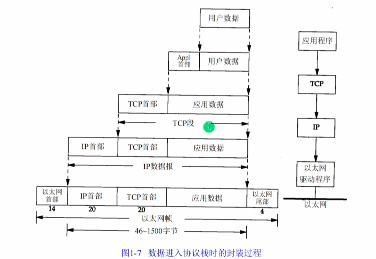
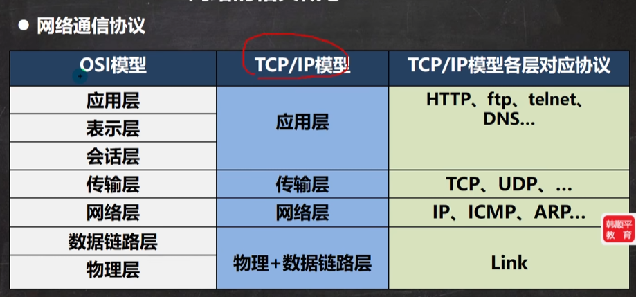
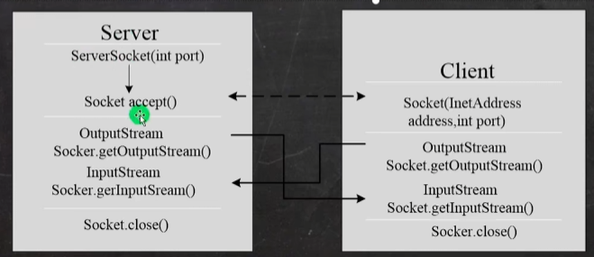

# Java网络多线程

## IP地址

定义：用于唯一标识网络中的每一台计算机

查看IP地址的指令：ipconfig

IP地址组成：网络地址 + 主机地址

A类地址 0 + 7位网络号 + 24位主机号

B类地址 b10 + 14位网络号 + 16位主机号

C类地址 b110 + 21位网络号 +8位主机号

D类 b1110 + 28位多播组号

E类 b11110 + 27位保留位

## 域名

www.baidu.com

将ip地址映射为域名，方便记忆

## 端口号

概念：用于标识计算机上某个特定的网络程序

通过IP + 端口即可访问一个特定网络上的特定程序

表示形式：以整数形式表示：0—65535 （两个字节）

0-1024被占用（在实际开发中不使用这一些端口）

## 网络通讯协议

在网络编程中数据的组织形式就是协议

TCP/IP传输控制协议/因特网互联协议，又称网络通讯协议



网络层级以及对应协议



## TCP与UDP

### TCP

通过三次握手建立连接，四次握手释放连接

TCP协议进行通信的两个应用进程：客户端、服务端

### UDP

将数据，源，目的封装为数据包，不需要建立连接

每一个数据包的大小限制为64K以内

## InetAddress类

相关方法

1.获取本机的InetAddress对象  getLocalHost

2.根据指定的主机名/域名获取ip地址对象  getByName

3.获取InetAddress对象的主机名  getHostName

4.获取InetAddress对象的地址  getHostAddress

以下是一个代码示例

```java
package com.api;
import java.net.InetAddress;
import java.net.UnknownHostException;

public class Api {
    public static void main(String[] args) throws UnknownHostException {
        //1.获取本机的InetAddress对象
        InetAddress localHost = InetAddress.getLocalHost();
        System.out.println(localHost);

        //2.更具指定的主机名 获取InetAddress对象
        InetAddress host = InetAddress.getByName("thrinisty");
        System.out.println(host);

        //3.根据域名返回InetAddress对象
        InetAddress baidu = InetAddress.getByName("www.baidu.com");
        System.out.println(baidu);

        //4.通过 InetAddress对象，获取对应地址
        String baiduIp = baidu.getHostAddress();
        System.out.println(baiduIp);

        //5.通过InetAddress对象，获取域名或者主机名
        String baiduName = baidu.getHostName();
        System.out.println(baiduName);
    }
}
```

## socket套接字

1.套接字在网络开发中广泛的被采用，成为了事实上的标准

2.通信的两端都需要有socket，是两台机器通信的端点

3.网络通信实际上就是socket之间的通信

4.socket允许程序把网络连接当成一个流，数据在两个socket之间通过IO进行传输

5.一般是主动发起通信的应用程序是客户端，等待通信请求的是服务端

getOutputStream()获取输出流

getInputStrean()获取输入流

通信流程



## TCP数据传输案例

### 1.使用字节流进行传输

服务端：

1.在本机的9999端口监听，等待连接

2.当没有客户端连接时阻塞等待连接

3.通过socket.getInputStream() 获取管道中的数据

```java
package com.api;

import java.io.IOException;
import java.io.InputStream;
import java.net.ServerSocket;
import java.net.Socket;

public class SocketTCP01Server {
    public static void main(String[] args) throws IOException {
        ServerSocket serverSocket = new ServerSocket(9999);
        System.out.println("Server start listening on port 9999");
        Socket socket = serverSocket.accept();//如果有客户端连接返回Socket对象，退出阻塞
        System.out.println("socket = " + socket.getClass());
        InputStream inputStream = socket.getInputStream();
        byte[] buffer = new byte[1024];
        int readLen = 0;
        while ((readLen = inputStream.read(buffer)) != -1) {
            System.out.println(new String(buffer, 0, readLen));
        }
        inputStream.close();
        socket.close();
        serverSocket.close();
    }
}

```

客户端：

1.连接服务器

2.连接上后生成socket套接字，通过socket.getOutputStream()获取到输入流

3.通过输出流，写数据到数据通道

```java
package com.api;

import java.io.IOException;
import java.io.OutputStream;
import java.net.InetAddress;
import java.net.Socket;
import java.net.UnknownHostException;

public class SocketTCP01Client {
    public static void main(String[] args) throws IOException {
        Socket socket = new Socket(InetAddress.getLocalHost(), 9999);
        System.out.println("socket返回 " + socket.getClass());

        OutputStream outputStream = socket.getOutputStream();
        outputStream.write("Hello!!".getBytes());
        outputStream.close();
        socket.close();
        System.out.println("客户端退出");
    }
}
```

尝试在双端进行双向传递数据

```java
package com.api;

import java.io.IOException;
import java.io.InputStream;
import java.io.OutputStream;
import java.net.InetAddress;
import java.net.Socket;
import java.net.UnknownHostException;

public class SocketTCP01Client {
    public static void main(String[] args) throws IOException {
        Socket socket = new Socket(InetAddress.getLocalHost(), 9999);
        System.out.println("socket返回 " + socket.getClass());

        OutputStream outputStream = socket.getOutputStream();
        outputStream.write("Hello!!".getBytes());

        InputStream inputStream = socket.getInputStream();
        byte[] buffer = new byte[1024];
        int length = 0;
        while((length = inputStream.read(buffer)) != -1) {
            System.out.println(new String(buffer, 0, length));
        }
        //socket.shutdownOutput();结束标记
        System.out.println("接收服务器数据完毕");

        inputStream.close();
        outputStream.close();
        socket.close();
        System.out.println("客户端退出");
    }
}
```

```java
package com.api;

import java.io.IOException;
import java.io.InputStream;
import java.io.OutputStream;
import java.net.ServerSocket;
import java.net.Socket;

public class SocketTCP01Server {
    public static void main(String[] args) throws IOException {
        ServerSocket serverSocket = new ServerSocket(9999);
        System.out.println("Server start listening on port 9999");
        Socket socket = serverSocket.accept();//如果有客户端连接返回Socket对象，退出阻塞
        System.out.println("socket = " + socket.getClass());
        InputStream inputStream = socket.getInputStream();
        byte[] buffer = new byte[1024];
        int readLen = 0;
        while ((readLen = inputStream.read(buffer)) != -1) {
            System.out.println(new String(buffer, 0, readLen));
        }
        OutputStream outputstream = socket.getOutputStream();
        outputstream.write("Hello client!".getBytes());
        //socket.shutdownOutput();结束标记
        System.out.println("发送完毕");

        outputstream.close();
        inputStream.close();
        socket.close();
        serverSocket.close();
    }
}
```

这是一开始写的一段程序，但是运行会发现，程序没有按照预期的方式运行：服务器端会送消息到客户端（实际上并没有）

这是因为缺少了结束的标记，导致了客户端认为服务端的消息还没有发送完毕，任然在等待服务端消息发送完毕

需要使用结束标记，在原先代码上取消相关注释即可

### 2.使用字符流进行传输

需要使用转换流OutputStreamWriter，将OutputStream字节流转换为字符流

使用转换流InputStreamWriter，将InputStream字节流转换为字符流

```java
OutputStream outputStream = socket.getOutputStream();
BufferedWriter bufferedWriter = new BufferedWriter(new OutputStreamWriter(outputStream));
bufferedWriter.write("字符流");
bufferedWriter.newLine();//插入一个换行符，表示写入内容结束，要使对方也读一个readline
bufferedWriter.flush();//使用字符流，需要手动刷新
System.out.println("发送字符流完毕");

bufferedWriter.close();//这个时候关闭外层流即可
```

```java
InputStream inputStream = socket.getInputStream();
BufferedReader bufferedReader = new BufferedReader(new InputStreamReader(inputStream));
String s = bufferedReader.readLine();
System.out.println(s);
System.out.println("接收数据完毕");

bufferedReader.close();//关闭外层流
```

以下是一个完整程序

服务器端

```java
package com.test;

import java.io.*;
import java.net.ServerSocket;
import java.net.Socket;

public class Server {
    public static void main(String[] args) throws IOException {
        ServerSocket serverSocket = new ServerSocket(8888);
        System.out.println("服务器开始监听端口8888");
        Socket socket = serverSocket.accept();
        System.out.println("链接建立");

        InputStream inputStream = socket.getInputStream();
        BufferedReader bufferedReader = new BufferedReader(new InputStreamReader(inputStream));

        String target = bufferedReader.readLine();
        System.out.println("收到消息 " + target);

        bufferedReader.close();
        socket.close();
        System.out.println("服务器程序结束");

    }
}
```

客户端

```java
package com.test;

import java.io.BufferedWriter;
import java.io.IOException;
import java.io.OutputStream;
import java.io.OutputStreamWriter;
import java.net.InetAddress;
import java.net.Socket;
import java.net.UnknownHostException;

public class Client {
    public static void main(String[] args) throws IOException {
        Socket socket = new Socket(InetAddress.getLocalHost(), 8888);
        System.out.println("链接建立完毕");

        OutputStream outputStream = socket.getOutputStream();
        BufferedWriter bufferedWriter = new BufferedWriter(new OutputStreamWriter(outputStream));

        bufferedWriter.write("字符流数据");
        bufferedWriter.newLine();
        bufferedWriter.flush();
        System.out.println("字符发送完毕");

        bufferedWriter.close();
        socket.close();
        System.out.println("客户端程序结束");
    }
}
```

