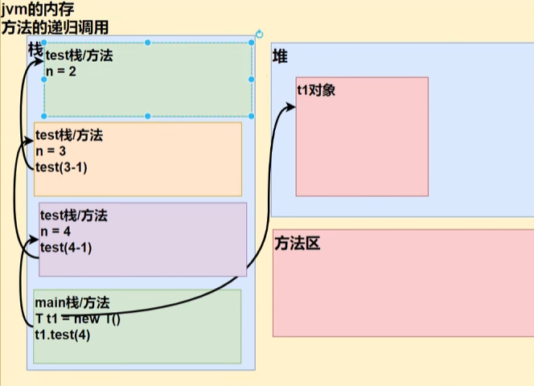

# 听课笔记

## Java中的递归

递归在算法中属于比较复杂的一类了，在这里也希望在 java 的学习中复习算法

一个简单的入门案例

```java
public class Object{
	public static void main(String[] args) {
		Tool Mytool = new Tool();
		Mytool.test(4);
	}
}

class Tool{
	public void test(int n) {
		if(n > 2) {
			test(n - 1);
		}
		System.out.println(n);
	}
}


```



运行结果

```
2
3
4
```

要等递归的方法结束后才执行递归调用主体函数中的输出，所以结果是从2到4

计算阶乘

```java
public class Object{
	public static void main(String[] args) {
		Tool Mytool = new Tool();
		System.out.println(Mytool.Printni(3));
	}
}

class Tool{
	public int Printni(int n) {
		if(n == 1) {
			return 1;
		} else {
			return Printni(n - 1) * n;
		}
	}
}
```

## 递归的要点

1.执行方法的时候会生成一个新的独立的栈空间

2.方法的局部变量是独立的不会相互影响

3.如果方法中使用的是引用类型的数据变量，就会共享该引用类型的数据

4.递归必须得指定退出的条件，在执行时也必须向退出的条件逼近

5.当一个方法执行完毕的时候，或 return 就会返回到调用函数中

## 递归的经典例题

### 斐波那契数列

```java
import java.util.Scanner;
public class Object{
	public static void main(String[] args) {
		Scanner myScanner = new Scanner(System.in);
		System.out.println("请输入斐波那契数列的第几个数");
		int target = myScanner.nextInt();
		Tool myTool = new Tool();
		System.out.println("斐波那契的第"+ target + "个数是" + myTool.test(target));
	}
}

class Tool{
	public int test(int n) {
		if(n == 1 || n == 2) {
			return 1;
		} else {
			return test(n - 1) + test(n - 2);
		}
		
	}
}
```

### 猴子吃桃问题

猴子每天吃一般的桃子 再额外吃一个，第十天的时候有1个桃子可以吃，问第一天的时候有几个桃子

递推式：第n天的桃子 = (第 n - 1 个桃子 / 2)-  1

反递推式：第n天的桃子  =（第n + 1天的桃子 + 1） * 2

```java
import java.util.Scanner;
public class Object{
	public static void main(String[] args) {
		int target = 10;
		Tool myTool = new Tool();
		System.out.println(myTool.peace(1));
	}
}

class Tool{
	public int peace(int day) {
		if(day == 10){
			return 1;
		} else {
			return (peace(day + 1) + 1) * 2;
		}
	}
}
```

### 经典的回溯算法走迷宫题目

```java
public class Object{
	public static void main(String[] args) {
		int arr[][] = new int[8][7];
		Tool myTool = new Tool();
		for(int j = 0; j < arr[0].length; j++) {
			arr[0][j] = 1;
			arr[arr.length - 1][j] = 1;
		}			
		for(int i = 0; i < arr.length; i++) {
			arr[i][0] = 1;
			arr[i][arr[0].length - 1] = 1;
		}
		arr[3][1] = 1;
		arr[3][2] = 1;
		arr[2][2] = 1;
		myTool.Print(arr);
		System.out.println();
		myTool.findWay(arr, 1, 1);
		myTool.Print(arr);
	}
}

class Tool{
	public void Print(int arr[][]) {
		for(int i = 0; i < arr.length; i++) {
			for(int j = 0; j < arr[i].length; j++) {
				System.out.print(arr[i][j] + " ");
			}
			System.out.println();
		}
	}

	/*
		如果找到迷宫路径就返回true，否则就返回false
		i 和 j 代表了小球的位置，初始化为 1，1
		0 表示可以走， 1 表示障碍物， 2 表示这条路可以走 3 表示这条路走过但是不可达
		当map[6][5] = 2 表示走通，退出递归
	*/
	public boolean findWay(int map[][], int i, int j) {
		if(map[6][5] == 2) {
			return true;
		} else {
			if(map[i][j] == 0) {
				map[i][j] = 2;
				//假定为可以走通
				if(findWay(map, i + 1, j)) {
					return true;
				} else if(findWay(map, i, j + 1)) {
					return true;
				} else if(findWay(map, i - 1, j)) {
					return true;
				} else if(findWay(map, i, j - 1)) {
					return true;
				} else {
					map[i][j] = 3;
					return false;
				}
			} else {
				return false;
			}

		}
	}
}
```

### 汉诺塔

简单的递归问题，一共分为三步，就和把大象塞进冰箱一样

1.打开冰箱（将A盘上的 n-1 个塔放在B盘）

2.放入大象（将A盘的最大盘放在C盘）

3.关闭冰箱（将B盘上的 n-1 个塔放在C盘）

在这里有一个值得注意的递归终止条件仅仅剩余一个盘，直接放入即可

```java
import java.util.Scanner;

public class Object{
	public static void main(String[] args) {
		Hanoi myHanoi = new Hanoi();
		Scanner myScanner = new Scanner(System.in);
		System.out.println("请输入汉诺塔的层数");
		int count = myScanner.nextInt();
		myHanoi.moveTower(count, 'A', 'B', 'C');
	}
}

class Hanoi{
	public void moveTower(int n, char a, char b, char c) {
		if(n == 1) {
			System.out.println("将" + a + "盘上的第一个塔移动到" + c);
		} else {
			moveTower(n - 1, a, c, b);
			System.out.println("将" + a + "盘上的第一个塔移动到" + c);
			moveTower(n - 1, b, a, c);
		}
	}
}
```

### 八皇后问题

将这一道例题分解为了三个部分来完成

1.设计了一个一维数组结构用于存放八个皇后，数组的下标代表了放置的行号，对应的数值部分是皇后放置的列数

2.八皇后递归的主体部分，要注意先将对应的皇后放入一维数组，在进行后续的递归调用

3.将递归的主体部分的结果返回至一个引用传回结果自增

```java
public class Object {
    public static void main(String[] args) {
        Queen myQueen = new Queen();
		int map[] = new int[8];
		int result[] = {0};
		myQueen.placeQueen(map, 0, result);
		System.out.println(result[0]);
    }
}

class Queen {
	public void placeQueen(int arr[], int row, int rst[]) {
		if(row == 8) {
			rst[0]++;
			return;
		}
		for(int col = 0; col < 8; col++) {
			if(canPlace(arr, row, col)){
				arr[row] = col;
				placeQueen(arr, row + 1, rst);
			}
		}
	}
   
   	public boolean canPlace(int arr[], int row, int col) {
		for(int i = 0; i < row; i++) {
			if(arr[i] == col || arr[i] + i == col + row || arr[i] - i == col - row) {
				return false;
			}
		}
		return true;
  	}
}
```

递归的例题完成，接下来是Java中方法的重载，可变参数，构造器的笔记
