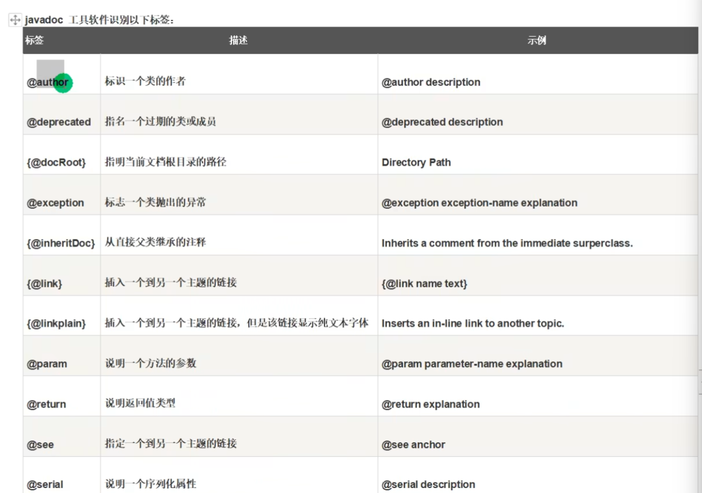
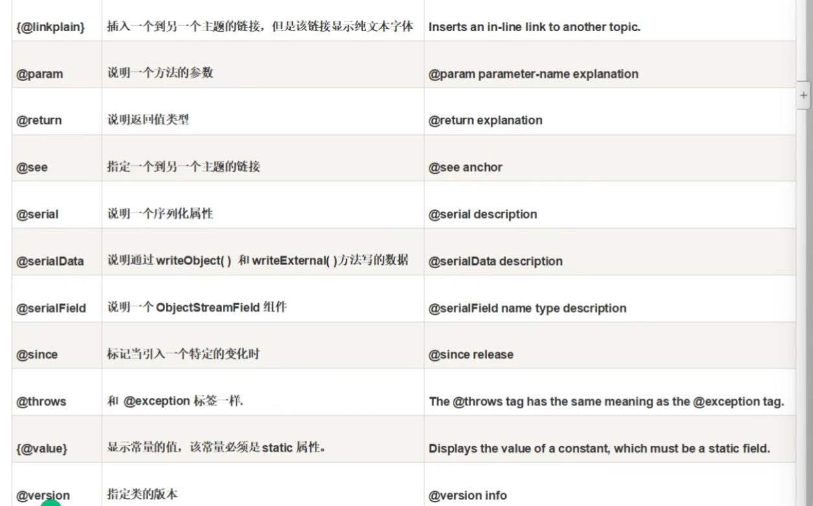

# 听课笔记

目前在听韩顺平老师的java课程，准备以此来巩固自己的java基础，以下是一些我听课程时候所记录的笔记

## Java技术体系平台

1.java SE标准版

2.java EE企业版

3.java ME小型版

## Java的重要特点

1.面向对象

2.java的健壮性，java强类型机制，异常处理，垃圾自动收集保证了java的健壮性

3.java的跨平台性质的

可以通过.java文件生成.class文件

class可以在Windows又可以在Linux上运行，并不需要再重新编译.java文件(利用了JVM虚拟机可以在三大操作系统上执行）

4.java语言是解释性语言，解释性语言在编译之后需要解释器来进行执行，编译性语言（二进制）可以被机器直接执行。

Win+s可以直接打开windows的搜索栏，ctrl + l 可以快速清除命令行中的内容,再命令行中用Tab键补全

## java虚拟机 JVM包含于jdk

全称java virtual machine

是一个虚拟的计算机，具有指令集并使用不同的存储区域，负责的执行指令管理数据内存寄存器都包含在jdk中

Test.java -编译javac（需要用到java开发工具）-> Test.class -运行java（只需要JRE运行环境）-> JVM of op_system

## JDK java开发工具包 Java Development Kit

JDK = JRE + java开发工具

## JRE (运行.class必要的环境)

java运行环境 Java Runtime Environment

JRE = JVM + Java核心类库 Java SE标准类库

## 运行第一个Java程序

注意中文编码问题需要使用 javac -encoding UTF-8 Test.java

```java
//表示Hello类的开始与结束
public class Test{
	
	//编写一个主方法，即程序的入口
	public static void main(String[] args){
		System.out.println("Hello world!!");
	}
}
```

.java文件   源文件

.class文件 字节码文件

执行的本质是将.class文件装载到jvm机器执行，所以修改后的源文件需要通过重新编译生成新的.class文件才可以输出正确的预期结果

## java开发注意事项以及细节说明

1.java应用程序执行入口是main（）方法，有着固定的书写格式：public static void main(String[] args)

2.一个源文件中最多只有一个public类， 其他的类个数不做限制

3.如果源文件中包含一个public类，则文件名必须按照该类名进行命名

4.习惯上因为{}成对出现，所以先写括号再填内容

5.如果源文件中包含一个public类，则文件名必须按照该类名进行命名，也可以将main方法写在非public，这样入口java执行非public的main方法。

```java
//java的快速入门，演示开发过程
//表示Hello类的开始与结束
public class Test{
	
	//编写一个主方法，即程序的入口
	public static void main(String[] args){
		System.out.println("Thrinisty正在学习！！\n");
	}
}

class Cat{
	public static void main(String[] args){
		System.out.println("修狗！！\n");
	}
}

class Dog{public static void main(String[] args){
		System.out.println("猫猫！！\n");
	}
}
```

在技术学习方法方面，老师有一点说的很好，在之后工作之中学习新技术的时候，先掌握基本原理与基本语法，之后再补充细节上的部分。

## Java转义字符

\t  可以实现对齐功能(字表位)

\n 可以实现换行功能

要想输出 \  字符需要使用 \\ \ 进行转义

 \r 可以实现回车功能(将光标定在当前行的第一个字符，之后输入的字符将替换后续的内容)

```java

public class ChangeChar{

	public static void main(String[] args){
		System.out.println("北京\t上海\t天津\n");
		
		System.out.println("C:\\Users\\71460\\Desktop\\Java\\class2");
		
		System.out.println("书名 \"北京\"");
		
		System.out.println("书名是\r北京");
        //输出的结果为 北京是
	}
}
```


## Java注释

```java
//单行注释

//多行注释
/*	测试文字
	测试文字
	测试文字
	测试文字
*/

```

注意！！Java不支持嵌套多行注释！！


## 注释文档

```java
/**
 *@author thrinisty
 *@version 1.0
 */

public class Test{

	public static void main(String[] args){
		System.out.println("北京\t上海\t天津\n");
		
	}
}

```

javadoc -d D:\temp -author -version Test.java 指令生成了对应的文档

java文档标签示例





## Java中的代码规范

1.类，方法的注释，要以javadoc的方式来写

2.非java doc的注释用单行注释来进行描述

3.注意运用Tab来进行代码对齐，提高代码的美观性（运用tab向右移动，shift + tab 向左移动）

4.运算符与数具之间留有空格 a = b + c 来替代a=b+c

5.源文件使用UTF-8来进行存储

6.行宽不大于80个字符

7.代码编写次行风格与行尾风格（都可以使用）

```java
/**
 *行尾风格
 */
 
 public class Test{
	public static void main(String[] args){
		System.out.println("北京\t上海\t天津\n");		
	}
}


/**
 *次行风格
 */
 public class Test
 {
	public static void main(String[] args)
	{
		System.out.println("北京\t上海\t天津\n");
	}
}
```

## Dos指令相关内容

dir 查看当前目录下有些什么内容。也可以用ls 来进行查看

cd 改变文件目录，与linux 相关操作同理，在这里不多做叙述，可查看linux相关指令那一篇文

cls 清除所有显示的内容

md 创建文件夹 rd删除文件

copy 拷贝文件 del 删除文件  

echo 输入内容到文件

move 移动文件

exit 退出命令行
