# Kafka笔记

## 基本介绍

**特性**

吞吐量好

伸缩性好，支持在线水平扩展

容错性和可靠性

与大数据生态紧密结合，对接hadoop、strom、spark


**应用场景**

异步处理、系统解耦、流量削峰、日志处理


**主要组成**

Producers：将消息放入集群中

Consumers：将消息数据从集群中拉出来

Connectors：连接器可以将数据库中的数据导入Kafka，也可以将数据导出到数据库中

Stream Processors：流处理器可以从Kafka中拉取数据，也可以将数据写入Kafka


**消息模型**

消息存储于Topic主题（半结构化数据）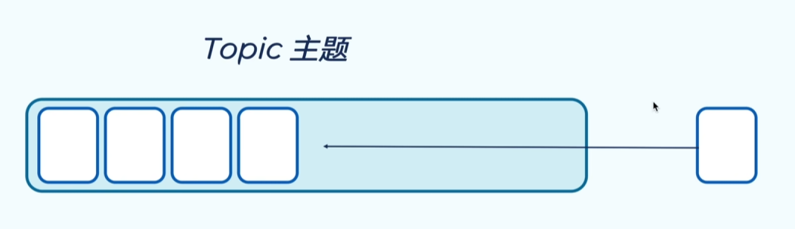

主题包含多个Partition分区（扩展性基础）

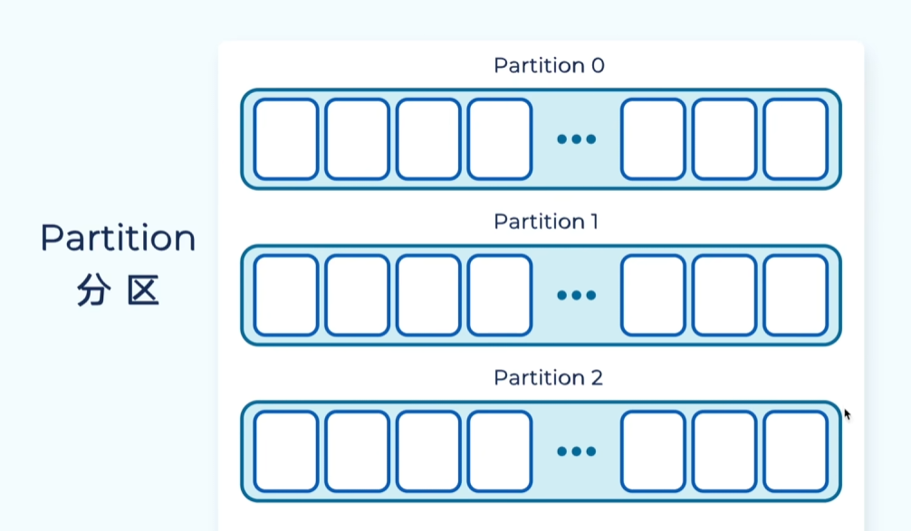

信箱中消息不可变，给每条消息分配offset，记录位置，更具offset进行取出

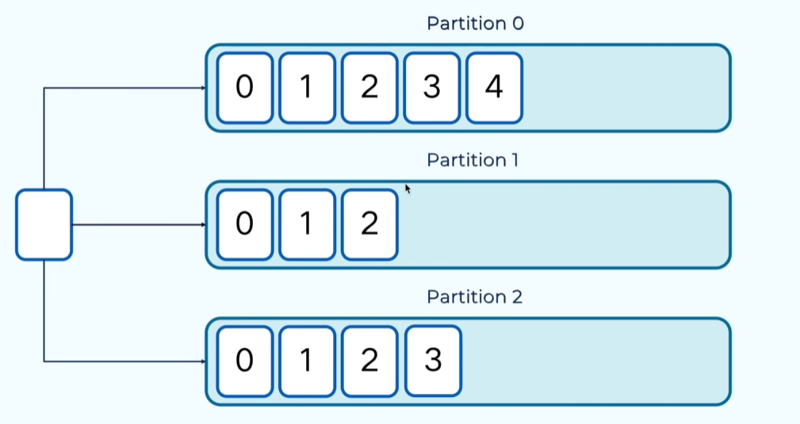

Record消息记录是key-value结构

如果不指定绑定采取轮询将消息写入每个分区，如果指定绑定消息key则采用一定规则发送到分区

分区副本拓展：保证可靠性（通过设置replication-factor=3设置数量）

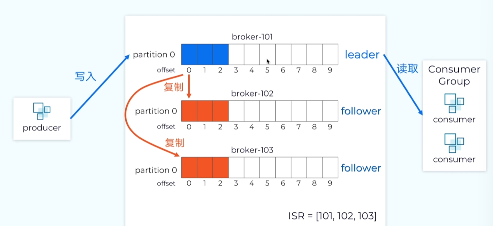

Kafka集群通过多个Broker（消息代理）组成，Broker负责消息读写，在每个服务器启动一个实例

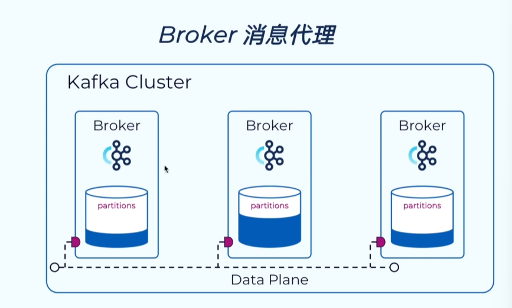

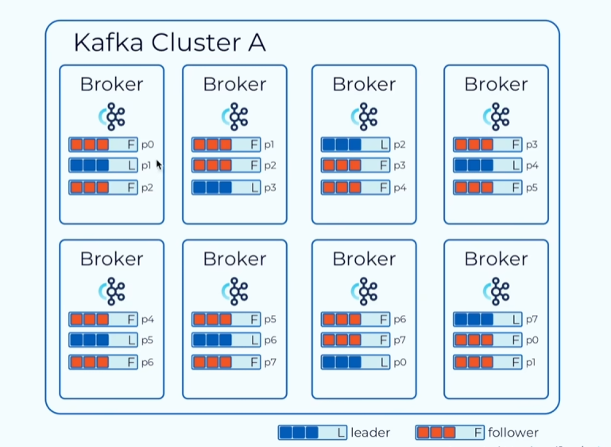


## 消息模型

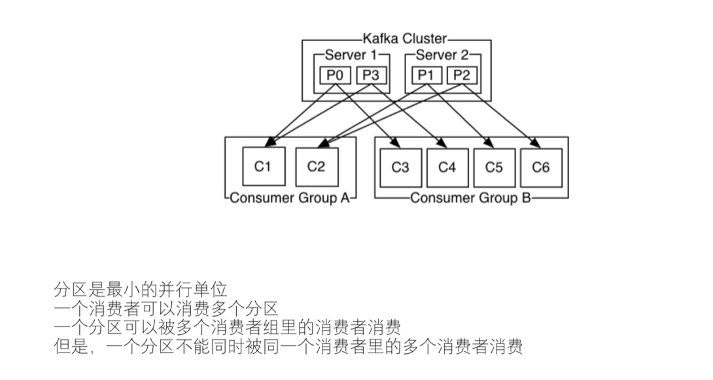

点对点

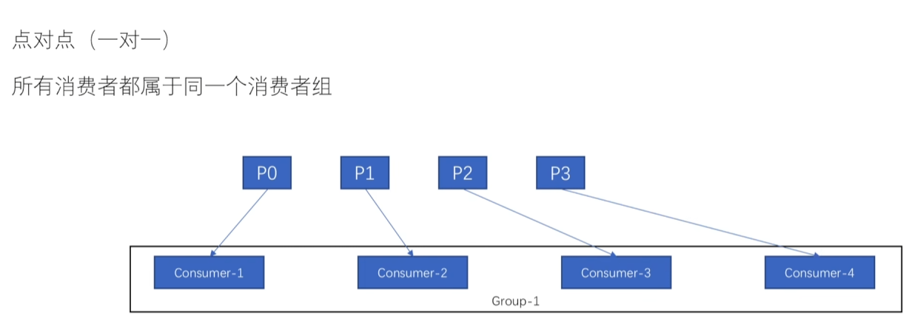

发布订阅模式


分区与信息顺序

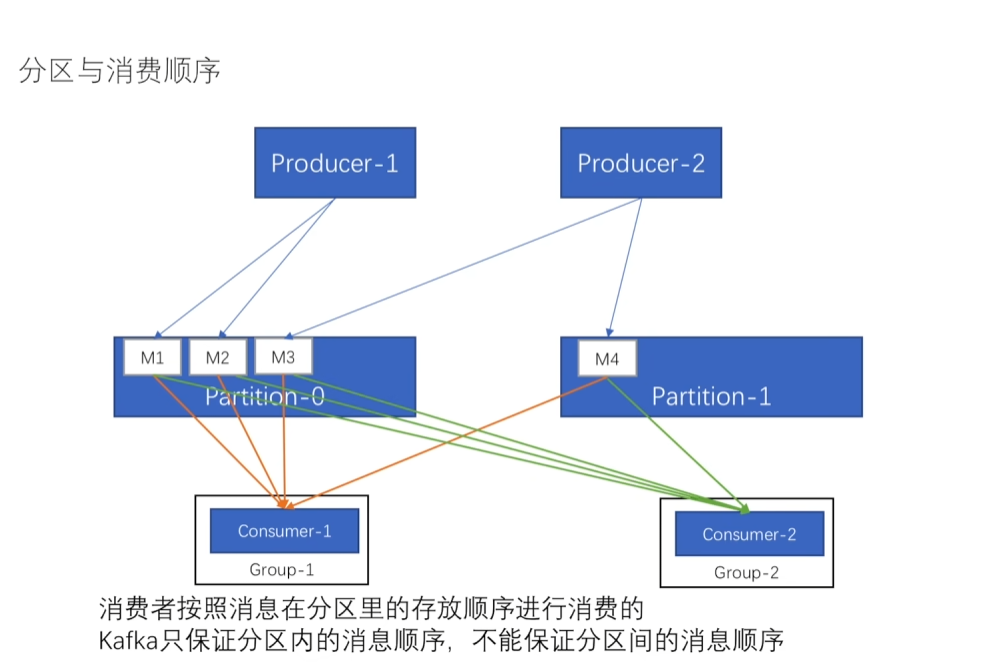

消息传递语义（至少一次、最多一次、精确一次）

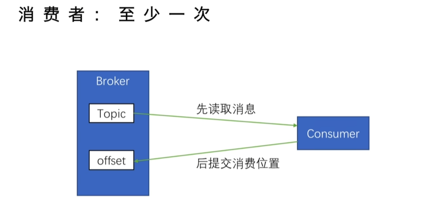

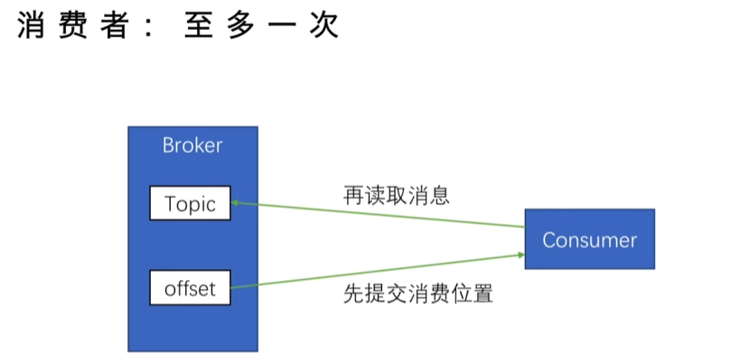


## 基础使用

进入Docker kafka

```
docker exec -it kafka bash
```

在查看kafka版本信息

```
cf3ed4078e2d:/opt/kafka/bin$ ./kafka-topics.sh --version
4.1.0
```

查看主题

```
./kafka-topics.sh --bootstrap-server localhost:9092 --list
```

更详细的信息

```
./kafka-topics.sh --bootstrap-server localhost:9092 --describe
```

创建主题

```
./kafka-topics.sh --create --bootstrap-server localhost:9092 --topic my_topic --partitions 1 --replication-factor 1
```

删除主题

```
# 删除名为 "my_topic" 的主题
./kafka-topics.sh --delete \
    --bootstrap-server localhost:9092 \
    --topic my_topic
```

发送消息

```
./kafka-console-producer.sh \
    --bootstrap-server localhost:9092 \
    --topic my_topic
```

接收消息

```
./kafka-console-consumer.sh \
    --bootstrap-server localhost:9092 \
    --topic my_topic \
    --from-beginning
```

输出示例

```
cf3ed4078e2d:/opt/kafka/bin$ ./kafka-console-producer.sh \
    --bootstrap-server localhost:9092 \
    --topic my_topic
>1
>2
>3
>4
>5
>q
>^Ccf3ed4078e2d:/opt/kafka/bi./kafka-console-consumer.sh \h \
    --bootstrap-server localhost:9092 \
    --topic my_topic \
    --from-beginning
1
2
3
4
5
q

```

**GUI工具**

```
docker run -d -p 8080:8080 -e DYNAMIC_CONFIG_ENABLED=true --name kafka-ui provectuslabs/kafka-ui:latest
```


## SpringBoot

基本配置

```yaml
spring:
    application:
        name: kafka
    kafka:
        bootstrap-servers: 106.75.145.128:9092  # Kafka 服务器地址
        producer:
            key-serializer: org.apache.kafka.common.serialization.StringSerializer
            value-serializer: org.apache.kafka.common.serialization.StringSerializer
        consumer:
            group-id: my-group  # 消费者组ID
            auto-offset-reset: earliest  # 从最早的消息开始消费
            key-deserializer: org.apache.kafka.common.serialization.StringDeserializer
            value-deserializer: org.apache.kafka.common.serialization.StringDeserializer
```

消费者实现

消费topic中的数据

```java
@Service
public class KafkaConsumerService {

    @KafkaListener(topics = "my-topic", groupId = "my-group")
    public void listen(String message) {
        System.out.println("Received message: " + message);
    }
}
```

生产者实现

指定主题以及发送的消息，通过send方法将数据发送至topic

```java
@Service
public class KafkaProducerService {
    private final KafkaTemplate<String, String> kafkaTemplate;
    public KafkaProducerService(KafkaTemplate<String, String> kafkaTemplate) {
        this.kafkaTemplate = kafkaTemplate;
    }
    public void sendMessage(String topic, String message) {
        kafkaTemplate.send(topic, message);
        System.out.println("Sent message: " + message);
    }
}
```

