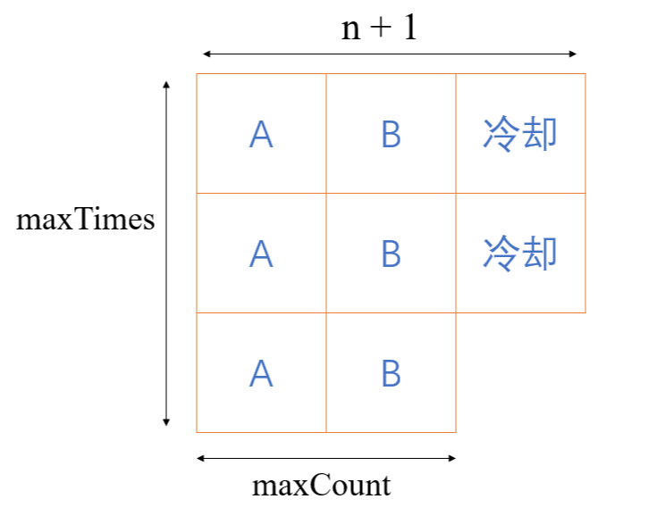

# 任务调度器

## 题目描述

给你一个用字符数组 `tasks` 表示的 CPU 需要执行的任务列表，用字母 A 到 Z 表示，以及一个冷却时间 `n`。每个周期或时间间隔允许完成一项任务。任务可以按任何顺序完成，但有一个限制：两个 **相同种类** 的任务之间必须有长度为 `n` 的冷却时间。

返回完成所有任务所需要的 **最短时间间隔** 。

 

**示例 1：**

**输入：**tasks = ["A","A","A","B","B","B"], n = 2

**输出：**8

**解释：**

在完成任务 A 之后，你必须等待两个间隔。对任务 B 来说也是一样。在第 3 个间隔，A 和 B 都不能完成，所以你需要待命。在第 4 个间隔，由于已经经过了 2 个间隔，你可以再次执行 A 任务。

 

**示例 2：**

**输入：**tasks = ["A","C","A","B","D","B"], n = 1

**输出：**6

**解释：**一种可能的序列是：A -> B -> C -> D -> A -> B。

由于冷却间隔为 1，你可以在完成另一个任务后重复执行这个任务。

**示例 3：**

**输入：**tasks = ["A","A","A","B","B","B"], n = 3

**输出：**10

**解释：**一种可能的序列为：A -> B -> idle -> idle -> A -> B -> idle -> idle -> A -> B。

只有两种任务类型，A 和 B，需要被 3 个间隔分割。这导致重复执行这些任务的间隔当中有两次待命状态。

**提示：**

- `1 <= tasks.length <= 104`
- `tasks[i]` 是大写英文字母
- `0 <= n <= 100`


## 题解

建立一个长度为26的数组存储各个任务出现的次数，因为人物之间等效，直接用sort进行排序，从最后一个数组元素取出最多任务出现的次数，再从后向前依次遍历得出出现次数最多的任务数量，利用下图进行求解（将任务出现次数最多的任务先进行排列，让剩余的任务进行填充）注意这里是最大任务数的空位多余可以填空的情况



```java
class Solution {
    public int leastInterval(char[] tasks, int n) {
        int[] array = new int[26];
        for(char c : tasks) {
            array[c - 'A']++;
        }
        Arrays.sort(array);
        int maxTimes = array[25];
        int maxCount = 1;
        for(int i = 24; i >= 0; i--) {
            if(array[i] == array[i + 1]) {
                maxCount++;
            } else {
                break;
            }
        }
        int result = (maxTimes - 1) * (n + 1) + maxCount;
        return Math.max(result, tasks.length);
    }
}
```

此外，如果任务种类很多，在安排时无需冷却时间，只需要在一个任务的两次出现间填充其他任务，然后从左到右从上到下依次执行即可，由于每一个任务占用一个时间单位，我们又正正好好地使用了tasks中的所有任务，而且我们只使用tasks中的任务来占用方格（没用冷却时间）。因此这种情况下，所需要的时间即为tasks的长度。

由于这种情况时再用上述公式计算会得到一个不正确且偏小的结果，因此，我们只需把公式计算的结果和tasks的长度取最大即为最终结果。

# 字符串解码

## 题目描述

给定一个经过编码的字符串，返回它解码后的字符串。

编码规则为: `k[encoded_string]`，表示其中方括号内部的 `encoded_string` 正好重复 `k` 次。注意 `k` 保证为正整数。

你可以认为输入字符串总是有效的；输入字符串中没有额外的空格，且输入的方括号总是符合格式要求的。

此外，你可以认为原始数据不包含数字，所有的数字只表示重复的次数 `k` ，例如不会出现像 `3a` 或 `2[4]` 的输入。

 

**示例 1：**

```
输入：s = "3[a]2[bc]"
输出："aaabcbc"
```

**示例 2：**

```
输入：s = "3[a2[c]]"
输出："accaccacc"
```

**示例 3：**

```
输入：s = "2[abc]3[cd]ef"
输出："abcabccdcdcdef"
```

**示例 4：**

```
输入：s = "abc3[cd]xyz"
输出："abccdcdcdxyz"
```


## 题解

运用递归求解，当前字符为数字的时候 count = count * 10 + (c - '0') 计算重复次数，为 [ 的时候跳过，并递归地进行解码子字符串，并在最后重复子字符串count次，为 ] 的时候返回字符串，并跳过，其余情况为普通字符串，直接拼接到结果上即可

```java
class Solution {
    private int index = 0;
    
    public String decodeString(String s) {
        StringBuilder result = new StringBuilder();
        int count = 0;
        while(index < s.length()) {
            char c = s.charAt(index);
            if(c >= '0' && c <= '9') {
                index++;
                count = count * 10 + (c - '0');
            } else if(c == '[') {
                index++;
                String subString = decodeString(s);
                for(int i = 0; i < count; i++) {
                    result.append(subString);
                }
                count = 0;
            } else if(c == ']') {
                index++;
                return result.toString();
            } else {
                index++;
                result.append(c);
            }
        }
        return result.toString();
    }
}
```

这一题也是字节面试的算法题目（有所变化），虽然改了一小部分，但感觉还是字节地题目更加综合一点，[abc]{3}大概是这样的，需要得到字符串后再进行字符的重复而且需要处理{}
