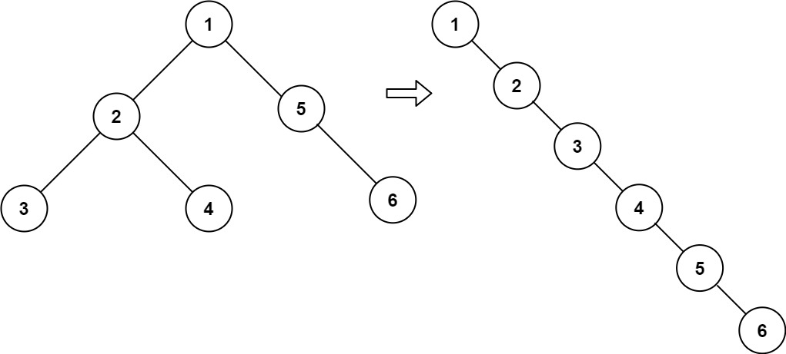

# 反转链表

## 题目描述

给你单链表的头节点 `head` ，请你反转链表，并返回反转后的链表。

**示例 1：**


```
输入：head = [1,2,3,4,5]
输出：[5,4,3,2,1]
```

**示例 2：**


```
输入：head = [1,2]
输出：[2,1]
```

**示例 3：**

```
输入：head = []
输出：[]
```

## 题解

设立一个哨兵节点result，其之后的链表为我们需要存储的结果

通过p指针依次遍历head链表，将遍历到的每一个节点通过头插法插入result中即可实现链表反转

```java
class Solution {
    public ListNode reverseList(ListNode head) {
       ListNode result = new ListNode();
       ListNode p = head;
       ListNode temp;
       while(p != null) {
        temp = p.next;
        p.next = result.next;
        result.next = p;
        p = temp;
       }
       return result.next;
    }
}
```


# 二叉树展开为链表

## 题目描述

给你二叉树的根结点 `root` ，请你将它展开为一个单链表：

- 展开后的单链表应该同样使用 `TreeNode` ，其中 `right` 子指针指向链表中下一个结点，而左子指针始终为 `null` 。
- 展开后的单链表应该与二叉树 [**先序遍历**](https://baike.baidu.com/item/先序遍历/6442839?fr=aladdin) 顺序相同。

 

**示例 1：**



```
输入：root = [1,2,5,3,4,null,6]
输出：[1,null,2,null,3,null,4,null,5,null,6]
```

**示例 2：**

```
输入：root = []
输出：[]
```

**示例 3：**

```
输入：root = [0]
输出：[0]
```

 

## 题解

通过先序遍历，将二叉树的节点放置于List链表中，再遍历List链表，将节点一次通过右孩子连接，而左孩子置为空

```java
class Solution {
    public void flatten(TreeNode root) {
        List<TreeNode> list = new ArrayList();
        fun(root, list);
        int n = list.size();
        for(int i = 1; i < n; i++) {
            TreeNode node1 = list.get(i - 1);
            TreeNode node2 = list.get(i);
            node1.left = null;
            node1.right = node2;
        }
    }

    public void fun(TreeNode root, List<TreeNode> list) {
        if(root == null) {
            return;
        }
        list.add(root);
        fun(root.left, list);
        fun(root.right, list);
    }
}
```


# 只出现一次的数字

## 题目描述

给你一个 **非空** 整数数组 `nums` ，除了某个元素只出现一次以外，其余每个元素均出现两次。找出那个只出现了一次的元素。

你必须设计并实现线性时间复杂度的算法来解决此问题，且该算法只使用常量额外空间。

**示例 1 ：**

**输入：**nums = [2,2,1]

**输出：**1

**示例 2 ：**

**输入：**nums = [4,1,2,1,2]

**输出：**4

**示例 3 ：**

**输入：**nums = [1]

**输出：**1


## 题解

第一种：最直观暴力的方式，遍历nums数组，依次判断list集合中是否存在相同的数字，有则删除，没有则放入，最后剩下的那一个就是只出现过一次的数字，这种解法的思想有点类似于 抽乌龟 卡牌游戏

```java
class Solution {
    public int singleNumber(int[] nums) {
        List<Integer> list = new ArrayList<>();
        int n = nums.length;
        for(int i = 0; i < n; i++) {
            if(list.contains(nums[i])) {
                list.remove(new Integer(nums[i]));
            } else{
                list.add(nums[i]);
            }
        }
        return list.get(0);
    }
}
```


第二种：通过异或位运算求解，涉及到了数学方法，非常简单，大致思路是证明，2n + 1个数组的集体求异或，利用交换律，可以得出结果就是 0 ^ (target) = target 即我们需要的结果

```java
class Solution {
    public int singleNumber(int[] nums) {
        int result = 0;
        int n = nums.length;
        for(int i = 0; i < n; i++) {
            result = result ^ nums[i];
        }
        return result;
    }
}
```

