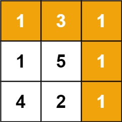

# 最小路径和

## 题目描述

给定一个包含非负整数的 `*m* x *n*` 网格 `grid` ，请找出一条从左上角到右下角的路径，使得路径上的数字总和为最小。

**说明：**每次只能向下或者向右移动一步。

**示例 1：**



```
输入：grid = [[1,3,1],[1,5,1],[4,2,1]]
输出：7
解释：因为路径 1→3→1→1→1 的总和最小。
```

**示例 2：**

```
输入：grid = [[1,2,3],[4,5,6]]
输出：12
```

 

**提示：**

- `m == grid.length`
- `n == grid[i].length`
- `1 <= m, n <= 200`
- `0 <= grid[i][j] <= 200`

## 题解

使用动态规划求解，创建一个结果二维数组，赋予初始行列累加值，遍历剩余数组元素，取上左中小的结果加上目标数组对应的值，即为到该元素位置的最短路径

```java
class Solution {
    public int minPathSum(int[][] grid) {
        if(grid == null || grid.length == 0 || grid[0].length == 0) {
            return 0;
        }
        int row = grid.length;
        int col = grid[0].length;
        int[][] result = new int[row][col];
        result[0][0] = grid[0][0];
        for(int i = 1; i < row; i++) {
            result[i][0] = result[i - 1][0] + grid[i][0];
        }
        for(int j = 1; j < col; j++) {
            result[0][j] = result[0][j - 1] + grid[0][j];
        }
        for(int i = 1; i < row; i++) {
            for(int j = 1; j < col; j++) {
                result[i][j] = Math.min(result[i - 1][j], result[i][j - 1]) + grid[i][j];
            }
        }
        return result[row - 1][col - 1];
    }
}
```


# 不同的二叉搜索树

## 题目描述

给你一个整数 `n` ，求恰由 `n` 个节点组成且节点值从 `1` 到 `n` 互不相同的 **二叉搜索树** 有多少种？返回满足题意的二叉搜索树的种数。

 

**示例 1：**


```
输入：n = 3
输出：5
```

**示例 2：**

```
输入：n = 1
输出：1
```


## 题解

1.动态规划求解

```java
class Solution {
    public int numTrees(int n) {
        int[] G = new int[n + 1];
        G[0] = 1;
        G[1] = 1;
        for(int i = 2; i <= n; i++) {
            //遍历到n的每一个结果数组，赋予对应的结果值
            for(int j = 1; j <= i; j++) {
                //j为节点，依次遍历对应编号的节点
                int leftNum = G[j - 1];
                //左侧有就j-1个节点，复用G中的结果情况
                int rightNum = G[i - j];
                //右侧有i-j个节点，复用其对应长的的结果
                G[i] += leftNum * rightNum;
                //求左右两侧的乘积，代表选取对应节点的情况总数
                //最后在依次对每个节点所对应的可能进行累加
            }
        } 
        return G[n];
    }
}
```

2.数学公式求解

```java
class Solution {
    public int numTrees(int n) {
        // 提示：我们在这里需要用 long 类型防止计算过程中的溢出
        long C = 1;
        for (int i = 0; i < n; ++i) {
            C = C * 2 * (2 * i + 1) / (i + 2);
        }
        return (int) C;
    }
}
```

