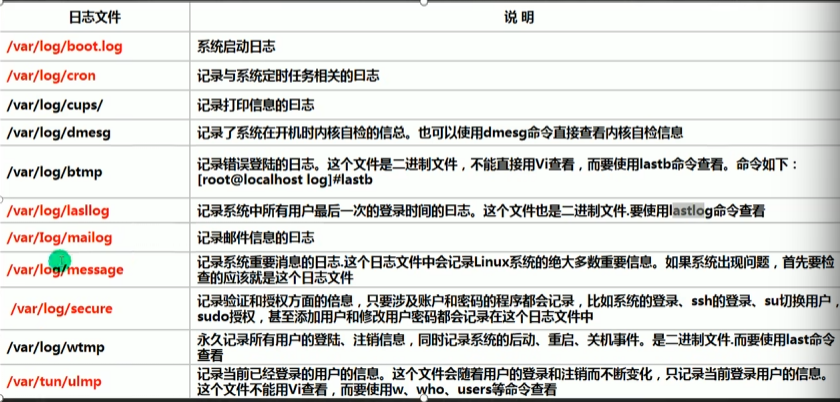
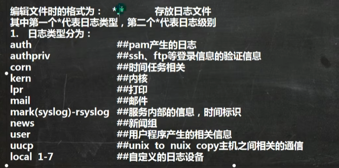
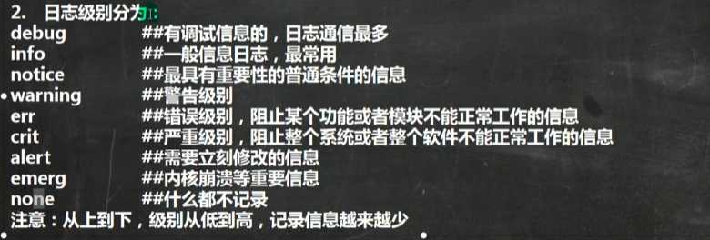
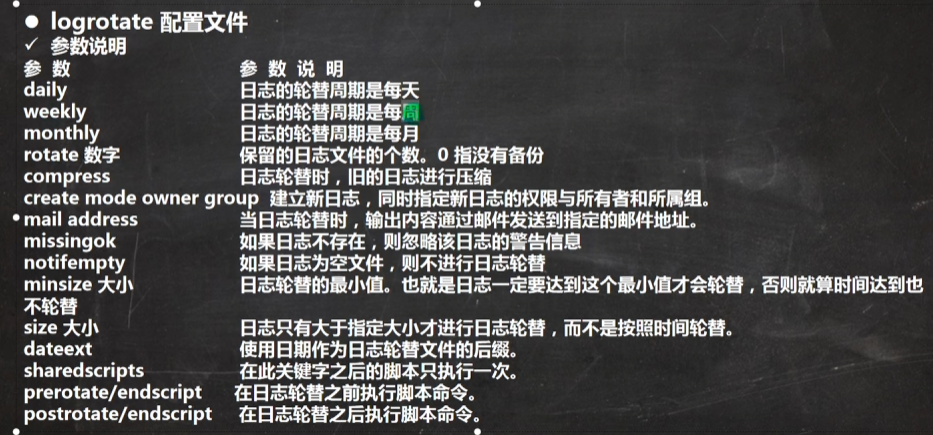

# Linux笔记

## 日志管理

### 基本介绍

日志记录很多重要的系统事件，包括用户的登录信息、系统的启动信息、系统的安全信息、邮件的相关信息、各种服务的相关信息

系统的相关日志一般被保存在 /var/log/ 目录下，以CentOS为例


### 日志管理服务

CentOS7.6的日志服务是rsyslogd相比于国王的syslogd更为强大，在运行的时候rsyslogd程序帮助我们记录日志

查看rsyslogd服务是否启用

```
ps -ef | grep "rsyslog" | grep -v "grep" 
```

查询服务的自启动状态

```
systemctl list-unit-files | grep rsyslog
```


### 日志配置文件

/etc/rsyslog.conf 文件是该程序的配置文件，在这里配置日志记录的位置

日志级别


### 日志轮替

我们记录日志不可能一直保留记录的日志，我们需要按照一定策略管理超时的日志，防止日志过大，或者将日志放到别处

通过修改 /etc/logrotate.conf 配置文件来进行全局日志轮替策略的修改

weekly 	保存四份日志文件，当新的日志文件建立的时候，旧的将会被删除

rotate 4	在日志轮替后，创建新的空日志文件

create		使用日期作为日志轮替后的后缀

dateext		日志文件是否压缩，如果取消注释，则日志在转储的同时进行压缩

也可以单独指定一个日志的配置，用大括号进行配置，或者把轮替规则写到/etc/logrotate.d目录下




### 内存日志

journalctl	可以查看内存日志，默认查看全部

-n 3	查看最新三条内存日志

--since 19:00 --until 19:10:10	查看起始时间到结束时间的日志，可追加日期

-p err	查看报错日志

-o verbose	日志详细内容

_PID=1245 _COMD=sshd	查看特定程序的日志
