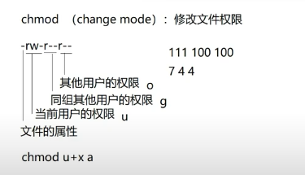

# Linux笔记

## 组管理

在linux中每个用户必须属于一个组，不能独立于组外

在linux中文件有所有者、所在组、其他组的概念


### 所有者

一般为文件的创建者，谁创建了该文件，就自然的成为了该文件的所有者

可以通过指令	ls -ahl 	查看文件的所有者

也可以通过指令修改文件的所有者	chown 用户名 文件名

(可以通过带上-R参数实现递归权限修改)

### 所在组 	

当一个用户创建了一个文件，这个文件所在组就是该用户所在的组

可以通过指令	chgrp 组名 文件名	来修改文件的所在组


### 其他组	

除了文件的所有者和所在组的用户外，系统的其他用户都是文件的其他组


有关于组的实用指令

通过 usermod -g  组名  用户名可以改变用户所在组

还可以通过usermod -d  目录名称  用户名 	来改变用户登陆到的初始目录（要求该用户有权限进入目标的目录）


## 权限管理

### 文件类型

第0为指的是文件的类型（d、-、l、c、b）

d为目录	l是链接	c是字符设备	b是块设备	-是普通文件

```
fox@lavm-5q4wdiilrx:~$ ls -al
total 24
drwxr-xr-x  6 root      root      4096 Sep 23 16:53 .
drwxr-xr-x 19 root      root      4096 Sep 19 15:50 ..
drwxr-x---  3 fox       sudo      4096 Sep 23 17:07 fox
drwxr-x---  2 lory      lory      4096 Sep 19 15:12 lory
drwxr-x---  3 test      admin     4096 Sep 19 16:59 test
drwxr-x---  3 thrinisty thrinisty 4096 Sep 19 17:01 thrinisty
```


### 文件权限

1-9为是文件的权限，分别对应着所有者、所在组、其他组对该文件的权限

**修改文件权限** 	chmod （change mode）

可以通过chmod 744 文件名 对文件所有者赋予读写权限（110）	对所在组用户赋予读权限（100）	对其他组赋予读权限（100）

另外一种赋（夺）权方式

chmod u+x 文件	对所有者附加x（执行）权限

chmod g-r  文件	对所有组的用户删除r（读）权限

chmod o+w 文件	对其他组增加w（写）权限

chmod a-x   文件	全部用户删除可执行权限




## 任务调度

crond：可以通过任务调度定时执行指令或者运行脚本

任务调度：是指系统在某个时间执行的特定命令或程序
任务调度分为系统工作和个别用户工作


### crontab指令

进行定时周期任务的设置	

基本语法	crontab [参数]

-e 编辑定时crontab任务	-l 查询任务	-r 删除当前用户的所有crontab任务


例如我们想要每分钟执行ls -l /home >> /home/wukong/console.txt

在文件中编辑添加：*/1 * * * * ls -l /home >> /home/wukong/console.txt

常见案例：


### at指令

at [选项] [时间]		Ctrl + D 结束at命令输入

at命令是一次性定时计划任务，at的守护进程atd会以后台模式运行，检查作业队列来运行，在使用at命令的时候，一定要保证atd进程的启动

atd每隔60s就会检查job队列中是否有符合匹配的条件的指令或者shell脚本，有则执行并从队列中删除对应的作业

可选参数


时间定义


可以通过atq查看job队列中的任务

```
1	Sat Sep 27 17:25:00 2025 a root
```

通过atrm [编号] 删除队列中指定的任务
