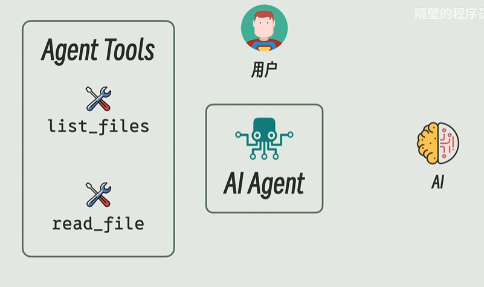

# MCP笔记

## AI Agent——AI

### System Prompt

System Prompt：预先设计的一段文本或指令，用于定义AI Agent的角色、能力和行为边界

User Prompt：用户实际输入的请求或问题，是AI生成响应的直接依据

Agent Tools：AI Agent可调用的 **外部工具或API**，用于扩展能力（如搜索、计算、数据库查询）

AI Agent：自主的软件实体，能 **理解目标、调用工具、决策行动**，并持续学习

### Function Calling

- **传统AI**：仅能生成文本，无法执行实际操作（如“查股票价格”只能编造）。
- **带Function Calling的AI**：
  - **解析用户意图** → **生成结构化请求** → **调用外部工具** → **返回真实数据**。
  - 例如：
    - 用户问：“上海明天天气如何？”
    - AI生成请求：`get_weather(location="上海", date="2023-10-05")`
    - 调用天气API后返回真实结果。

总而言之就是在AI Agent之间改用结构化的请求格式，使得访问内容更加精确，返回的结果正确率高，减少重复访问的过程，用户的Token开销

## AI Tools——AI Agent

最简单的方式就是将list_files和read_file和AI Agent写在同一进程中，直接通过函数调用即可以实现

但是tool功能通用的情况下，可以将Agent Tools变成服务统一的托管，让所有的Agent对齐进行调用，这就是MCP

其中Tools的部分是MCP Server，Agent部分是MCP Client

## 流程图

