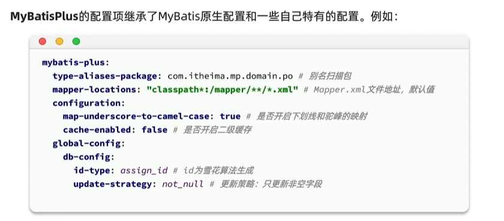

# MyBatis-plus笔记

MyBatisPlus是MyBatis的增强版，旨在简化单表SQL的编写

## 基本使用

```yaml
spring:
  application:
    name: **

  datasource:
    driver-class-name: com.mysql.jdbc.Driver
    url: jdbc:mysql://thrinisty.fun:3306/thrina
    username: root
    password: **
```

相关依赖：这个依赖可以直接替代原先的MyBatis依赖

```xml
<dependency>
    <groupId>com.baomidou</groupId>
    <artifactId>mybatis-plus-spring-boot3-starter</artifactId>
    <version>3.5.7</version>
</dependency>
<dependency>
    <groupId>mysql</groupId>
    <artifactId>mysql-connector-java</artifactId>
    <version>8.0.33</version>
</dependency>
```

User用TableName注解指定表格

```java
@Data
@TableName("tb_user")
public class User {
    private int id;
    private String phone;
    private String password;
    private String nickName;
    private String icon;
    private LocalDateTime createTime;
    private LocalDateTime updateTime;	
}
```

对于Mapper我们通过继承BaseMapper<User>即可实现增删改查的基本功能，且不会影响我们原先实现的MyBatis方法（非侵入式）

```java
@Mapper
public interface UserMapper extends BaseMapper<User> {
    @Select("SELECT id, phone, password, nick_name AS nickName, icon, create_time AS createTime," +
            " update_time AS updateTime FROM tb_user WHERE id = #{id}")
    User getUserById(int id);
}
```

```java
@Test
void contextLoads() {
    User user = userMapper.getUserById(1);
    System.out.println(user);
}

@Test
void testMybatisPlus() {
    User user = userMapper.selectById(1);
    System.out.println(user);
}
```


**常用注解**

MyBatisPlus是通过扫描实体类，并基于反射获取实体类信息作为数据库表信息

```
类名驼峰转下划线作为表名
名为id的字段作为主键
变量名驼峰转下划线作为表的字段名称
```

但是如果不符合以上的配置我们就需要手动使用注解进行配置

@TableName：指定表名，我们还可以

@TableId：指定表的主键字段信息，我们还可以使用type指定主键id的生成策略

@TableField：指定表的普通字段信息

如下是一个完整的配置entity对象，有一些字段或者id是可以省略的，因为符合约定的配置

```java
@Data
@TableName("tb_user")
public class User {
    @TableId("id")
    private int id;

    @TableField("phone")
    private String phone;

    @TableField("password")
    private String password;

    @TableField("nick_name")
    private String nickName;

    @TableField("icon")
    private String icon;

    @TableField("create_time")
    private LocalDateTime createTime;

    @TableField("update_time")
    private LocalDateTime updateTime;
}
```

加入我们的字段属于SQL中的关键字，我们可以使用TableField来加上``字符包裹

我们如果一个对象中有不是数据库的字段我们可以通过设置exist=false来进行设置

```java
@Data
@TableName("tb_user")
public class User {
    @TableId(value = "id", type = IdType.AUTO)
    private int id;

    @TableField("phone")
    private String phone;

    @TableField("password")
    private String password;

    @TableField("nick_name")
    private String nickName;

    @TableField("icon")
    private String icon;

    @TableField("create_time")
    private LocalDateTime createTime;

    @TableField("update_time")
    private LocalDateTime updateTime;

    @TableField(exist = false)
    private LocalDateTime LogicTime;
}
```


**常见配置**

这配置中可以进行一些参数的设置




## 核心功能

### 条件构造器

MyBatisPlus支持各种各样的复杂where条件，可以满足日常开发的所有需求

我们有这样一个结构

```java
@Data
@TableName("tb_shop")
public class Shop {
    @TableId(type = IdType.AUTO)
    int id;
    String name;
    int typeId;
    String images;
    String area;
    String address;
    double x;
    double y;
    int avgPrice;
    int sold;
    int comments;
    int score;
    String openHours;
    LocalDateTime createTime;
    LocalDateTime updateTime;
}
```


现在我们需要用MyBatis完成如下功能

1.查询avg_price大于50且得分小于40的商店的id，name，area字段

如果是SQL写为如下，用QueryWrapper实现

```
select id, name, area from tb_shop where score < 40 and avg_price > 50
```

```java
@Test
void testMybatisPlus() {
    QueryWrapper<Shop> wrapper = new QueryWrapper<>();
    wrapper.select("id", "name", "area")
            .lt("score", 40)
            .gt("avg_price", 50);
    List<Shop> shops = shopMapper.selectList(wrapper);
    for(Shop shop : shops) {
        System.out.println(shop);
    }
}
```

```
Shop(id=10, name=开乐迪KTV（运河上街店）, typeId=0, images=null, area=运河上街, address=null, x=0.0, y=0.0, avgPrice=0, sold=0, comments=0, score=0, openHours=null, createTime=null, updateTime=null)
```

在实际开发中我们其实更加推荐于使用Lambda的形式获取属性名称而非硬编码的方式

```java
@Test
void testMybatisPlus() {
    LambdaQueryWrapper<Shop> wrapper = new QueryWrapper<Shop>().lambda();
    wrapper.select(Shop::getId, Shop::getName, Shop::getArea)
            .lt(Shop::getScore, 40)
            .gt(Shop::getAvgPrice, 50);
    List<Shop> shops = shopMapper.selectList(wrapper);
    for(Shop shop : shops) {
        System.out.println(shop);
    }
}
```


2.更新103茶餐厅的x为101.02，y为120.01

```
update tb_shop set x = 101.02, y = 120.01 where name = "103茶餐厅"
```

```java
@Test
void contextLoads() {
    Shop shop = new Shop();
    shop.setX(101.02);
    shop.setY(120.01);
    QueryWrapper<Shop> wrapper = new QueryWrapper<>();
    wrapper.eq("name", "103茶餐厅");
    int update = shopMapper.update(shop, wrapper);
    System.out.println(update);
}
```


3.更新1、2、4商店，使其score得分加10

```
update tb_shop set score = score + 10 where id in (1,2,4)
```

我们给予UpdateWrapper实现

```java
@Test
void contextLoads() {
    UpdateWrapper<Shop> wrapper = new UpdateWrapper<>();
    wrapper.setSql("score = score + 10").in("id", List.of(1, 2, 4));
    shopMapper.update(null, wrapper);
}
```


### 自定义SQL

可以利用MyBatisPlus的Wrapper来构建复杂的where条件，然后自定义SQL语句中的剩下一个部分

我们在上述的时候用的UpdateWrapper是在业务层进行代码的编写的，但是在实际开发的过程中我们往往规定SQL只能在Mapper中提供方法供以Service层调用，这个时候我们就需要使用到自定义SQL

需求：将id指定范围内的用户余额扣除指定值，在业务层指定查询条件，SQL语句构造在xml文件中

```java
@Test
void contextLoads() {
    List<Integer> idList = List.of(1, 2, 4);
    LambdaUpdateWrapper<Shop> wrapper = new UpdateWrapper<Shop>().lambda();
    wrapper.in(Shop::getId, idList);
    int amount = 5;
    shopMapper.updateScoreByIds(wrapper, amount);
}
```

写上对应的接口mapper，注意这里一定要ew标注wrapper

```java
@Mapper
public interface ShopMapper extends BaseMapper<Shop> {
    void updateScoreByIds(@Param("ew") LambdaUpdateWrapper<Shop> wrapper, @Param("amount") int amount);
}
```

在Mapper中进行拼接

```
<update id="updateScoreByIds">
    update tb_shop set score = score + #{amount} where ${ew.sqlSegment}
</update>
```


### Service接口

Service业务层使用Mapper层级的接口进行业务的编写，MyBatisPlus帮助我们实现了很对Service的方法，我们使用对应服务的接口继承IService接口即可使用相关的方法，我们的实现类继承于业务接口但是因为没有实现IService接口的相关方法我们还需要用业务的实现类去继承ServiceImpl的实现方法


```java
public interface ShopService extends IService<Shop> {
}
```

```java
@Service
public class UserServiceImpl extends ServiceImpl<ShopMapper, Shop> implements ShopService {
}
```


此时我们注入ShopService就可以使用其下的方法，其方法基于ShopMapper实现

```java
@Test
void testShopService() {
    Shop shop = shopService.getById(1);
    System.out.println(shop);
}
```

**网络请求示例**

```java
@Service
public class ShopServiceImpl extends ServiceImpl<ShopMapper, Shop> implements ShopService {
    @Autowired
    private ShopMapper shopMapper;

    @Override
    public void updateScore(int id, int amount) {
        //实现以下updateScore方法
        LambdaUpdateWrapper<Shop> wrapper= new UpdateWrapper<Shop>().lambda();
        wrapper.eq(Shop::getId, id);
        shopMapper.updateScoreByIds(wrapper, amount);
    }
}
```

```java
@RestController
@RequestMapping("shop")
public class ShopController {
    @Autowired
    private ShopService shopService;

    @PostMapping
    public void addShop(@RequestBody Shop shop) {
        shopService.save(shop);
    }

    @DeleteMapping("{id}")
    public void deleteShop(@PathVariable int id) {
        shopService.removeById(id);
    }

    @GetMapping("{id}")
    public Shop getShop(@PathVariable int id) {
        return shopService.getById(id);
    }

    @GetMapping
    public List<Shop> getShops(@RequestParam("id") List<Integer> list) {
        QueryWrapper<Shop> wrapper = new QueryWrapper<>();
        wrapper.in("id", list);
        return shopService.list(wrapper);
    }

    @PutMapping("/score/{id}/{amount}")
    public void updateScore(@PathVariable int id, @PathVariable int amount) {
        shopService.updateScore(id, amount);
    }
}
```


### Lambda查询

我们在之前多条件查询使用的是动态SQL来进行条件的选择性过滤，现在基于Lambda查询我们也可以做到相同的功能

常规方式：通过动态SQL进行查询

```java
@Override
public List<Shop> multiQuery(ShopQueryEntity query) {
    return shopMapper.multiSelect(query);
}
```

```xml
<select id="multiSelect" resultType="com.nwpu.mybatistest.entity.Shop">
    SELECT id, name, type_id, images, area, address, x, y, avg_price,
           sold, comments, score, open_hours, create_time, update_time
    FROM tb_shop
    <where>
        <if test="id != null">
            AND id = #{id}
        </if>
        <if test="name != null">
            AND name like #{id}
        </if>
        <if test="typeId != null">
            AND type_id = #{typeId}
        </if>
    </where>
</select>
```

而我们Lambda查询实现如下：在业务层使用lambdaQuery传入条件，最后的结果以list返回，同样的我们也可以count计算数量，one返回一个，page分页返回，方法非常多样

```java
@Override
public List<Shop> multiQueryByLambda(ShopQueryEntity query) {
    List<Shop> list = lambdaQuery().eq(query.getId() != null, Shop::getId, query.getId())
            .like(query.getName() != null, Shop::getName, query.getName())
            .eq(query.getTypeId() != null, Shop::getTypeId, query.getTypeId())
            .list();
    return list;
}
```


同样的我们也可以进行一些其他逻辑的编写：当amount小于100的时候才会用amount更新指定id的score，记得最后update

```java
@Override
public void updateScoreByLambda(int id, int amount) {
    lambdaUpdate()
            .set(amount < 100, Shop::getScore, amount)
            .eq(Shop::getId, id)
            .update();
}
```


### 批量新增

通过saveBatch，传入list集合，可以一次性传入多条数据，性能部分提升

```java
List<Shop> shops = List.of(shop);
shopService.saveBatch(shops);
```

但是我们批处理性能最好的应该是如下的方式，这会将value写在一条SQL中

```yaml
url: jdbc:mysql://thrinisty.top:3306/redis?useSSL=false&serverTimezone=UTC&characterEncoding=UTF-8&rewriteBatchedStatements=true
```

代码不需要改变，加上rewriteBatchedStatements=true配置即可，加上这一条配置数据库驱动就会把一条条SQL合并为一条SQL执行


## 拓展功能

### 静态工具

在使用上和分层的注入对象大体类似，只是不需要去注入，只需要Db的静态方法传入对象字节码对象即可使用，用这个静态工具我们可以放置一些业务层之间的注入依赖，但是在实际尽量还是使用分层，更加符合规范

```java
public void addUserPoints(List<Long> userIds, int points) {
    Db.lambdaUpdate(User.class)
       .in(User::getId, userIds)
       .setSql("points = points + " + points)
       .update();
}
```


### 逻辑删除

逻辑删除是基于代码的逻辑模拟删除的效果，不会真的删除数据，可以定义一个字段为1代表该数据被删除，当增改查的时候只对于字段标记为0的数据进行操作

我们后续如果误删数据也可以及时恢复，将对应逻辑删除字段设置成为0即可

```java
@Data
public class User {
    @TableId
    private Long id;
    private String name;
    
    @TableLogic
    private Integer deleted;  // 1表示已删除，0表示未删除（类型可以是int/boolean/String等）
}

```

```yaml
mybatis-plus:
  global-config:
    db-config:
      logic-delete-field: deleted  # 全局逻辑删除字段名（与实体类字段名一致）
      logic-not-delete-value: 0    # 未删除的值
      logic-delete-value: 1        # 已删除的值
```

配置完成后我们的方法逻辑就会改变，符合逻辑删除的方式

```java
userMapper.deleteById(1L);  
// SQL: UPDATE user SET deleted=1 WHERE id=1 AND deleted=0
List<User> list = userMapper.selectList(null); 
// SQL: SELECT * FROM user WHERE deleted=0
```

当然也会有危险：垃圾数据越来越多，SQL中全部都需要对逻辑字段做一个判断，影响查询效率。

ps：但是从我实习的公司看来，似乎逻辑删除还是很重要滴，在大的互联网厂或者网络安全公司，数据的价值往往被放的非常高


### 枚举处理器

解决枚举转换


### Json处理器

1.给对应属性添加实体，添加注解，添加Json处理器

2.给表添加autoResultMap设置为True

```java
@Data
@TableName(value = "product", autoResultMap = true)
public class Product {
    private Long id;

    // 方案1：使用 MyBatis-Plus 内置的 Jackson 处理器
    @TableField(typeHandler = JacksonTypeHandler.class)
    private Map<String, Object> attributes;

    // 方案2：映射到具体 POJO
    @TableField(typeHandler = JacksonTypeHandler.class)
    private ProductDetail detail;
}

@Data
public class ProductDetail {
    private String color;
    private Integer weight;
}
```


## 分页插件

用原先的PageHelper实现分页，我们引入依赖后发生冲突，我们需要手动的排除mybatis依赖（PageHelper 引入了旧版 MyBatis，与 MyBatis-Plus 的 MyBatis 版本冲突）

```xml
<dependency>
    <groupId>com.github.pagehelper</groupId>
    <artifactId>pagehelper-spring-boot-starter</artifactId>
    <version>2.1.0</version>
    <exclusions>
        <!-- 排除潜在的冲突依赖 -->
        <exclusion>
            <groupId>org.mybatis</groupId>
            <artifactId>mybatis</artifactId>
        </exclusion>
        <exclusion>
            <groupId>org.mybatis</groupId>
            <artifactId>mybatis-spring</artifactId>
        </exclusion>
    </exclusions>
</dependency>
```

之后我们采用常规的方式即可完成分页查询

```java
@Override
public PageInfo<Shop> multiQuery(ShopQueryEntity query, int pageNum, int pageSize) {
    PageHelper.startPage(pageNum, pageSize);
    List<Shop> shops = shopMapper.multiSelect(query);
    PageInfo<Shop> pageInfo = new PageInfo<>(shops);
    return pageInfo;
}
```

