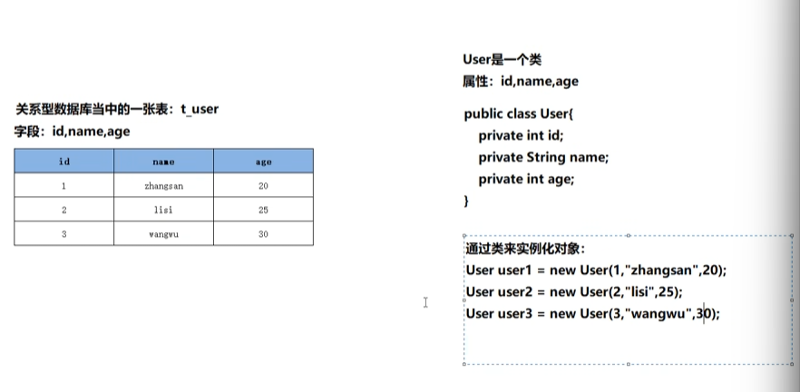

# MyBatis笔记

接下来的几天开始MyBatis的学习，用到的课程式动力节点杜老师的B站网课

<iframe 
    width="100%" 
    height="468" 
    src="//player.bilibili.com/player.html?bvid=BV1JP4y1Z73S&p=1&autoplay=false" 
    scrolling="no" 
    border="0" 
    frameborder="no" 
    framespacing="0" 
    allowfullscreen="true">
</iframe>

本来打算用尚硅谷的课程，但是18年的视频对现在来说以及太老了，jar包之类的都是通过手动引入的，非常的不方便，而且老师的课程也算是细康，讲的挺深入的

话不多说开始今天的学习


## ORM对象关系映射

O：Object，指的是JVM中的Java对象

R：Relational，关系型数据库

M：Mapping，映射

例如现在有一张数据库表，其中有数条记录，其列字段可以对应到JavaBean类对象的属性，而每一行的记录映射到Java中就是一个类的实例，其中存在一种转换关系，其中的Class对象被称为 pojo、bean、domain




MyBatis是一个半自动化的ORM，因为MyBatis框架中的SQL语句需要程序员手动编写，而Hibernate是一个全自动的ORM


## MyBatis入门使用

:::warning

在MyBatis的配置一般通过XML文件实现，另外还有一种基于注解的开发

:::

相对于JDBC，MyBatis对于JDBC进行了封装，可以避免JDBC的一些缺陷，例如sql语句写死，违反OCP开闭原则

另外对于?的赋值非常繁琐，通过反射机制可以轻松实现对象的复制，参数的传入


### SQL建表

用SQL语句新建立一个数据库表

```sql
create table t_car(
	id int primary key auto_increment,
	car_num varchar(100),
	brand varchar(100),
	guide_price decimal(20,2),
	produce_time date,
	car_type varchar(100)
);
```

插入若干条语句

```sql
insert into t_car values
(4, 301, "大众", 32.00, "2022-09-01", "燃油车"),
(5, 302, "一汽", 42.00, "2012-04-01", "电车");
```


### 使用步骤

1.引入相关依赖

在使用的时候可以通过Maven进行MyBatis的导入

```html
<dependencies>
    <!-- MySQL JDBC 驱动 -->
    <dependency>
        <groupId>mysql</groupId>
        <artifactId>mysql-connector-java</artifactId>
        <version>8.0.33</version> <!-- 可替换为最新版本 -->
    </dependency>
    <dependency>
        <groupId>org.mybatis</groupId>
        <artifactId>mybatis</artifactId>
        <version>3.5.13</version> <!-- 以最新版本为准 -->
    </dependency>
</dependencies>
```


2.从XML中构建SqlSessionFactory

MyBatis中有一个对象SqlSessionFactory，其需要XML进行配置，其名称一般为mybatis-config.xml，其下有两个重要的配置，一个是数据库的配置信息，林一个是UserMapper.xml，专门用于编写SQL语句的配置文件（一般一个表格对应一个）

```html
<?xml version="1.0" encoding="UTF-8"?>
<!DOCTYPE configuration
        PUBLIC "-//mybatis.org//DTD Config 3.0//EN"
        "http://mybatis.org/dtd/mybatis-3-config.dtd">
<configuration>
    <environments default="dev">
        <environment id="dev">
            <transactionManager type="JDBC"/>
            <dataSource type="POOLED">
                <property name="driver" value="com.mysql.cj.jdbc.Driver"/>
                <property name="url" value="jdbc:mysql://localhost:3306/mybatis?useSSL=false&amp;serverTimezone=UTC"/>
                <property name="username" value="root"/>
                <property name="password" value="654321"/>
            </dataSource>
        </environment>
    </environments>
    <mappers>
<!--        用于编写SQL语句的文件-->
        <mapper resource="CarMapper.xml"/>
    </mappers>
</configuration>
```


3.编写XxxMapper.xml文件

在这个文件中编写SQL语句，并在config中指定这个文件

```html
<?xml version="1.0" encoding="UTF-8"?>
<!DOCTYPE mapper
        PUBLIC "-//mybatis.org//DTD Mapper 3.0//EN"
        "http://mybatis.org/dtd/mybatis-3-mapper.dtd">
<mapper namespace="com.example.mapper.UserMapper">
    <insert id="insertValue">
        insert into t_car values
        (5, 301, "大众", 32.00, "2022-09-01", "燃油车");
    </insert>
    <delete id="deleteValue">
        delete from t_car where id = 4 or id = 5;
    </delete>
</mapper>
```


4.编写MyBatis程序

连接数据库，操作数据库

:::note

SqlSession是Java程序和MySQL数据库之间的会话

SqlSession通过SqlSessionFactory创建

SqlSessionFactoryBuilder对象的build方法可以获取到SqlSessionFactory对象

:::

```java
public class MyBatisIntroduction {
    public static void main(String[] args) throws Exception {
        SqlSessionFactoryBuilder builder = new SqlSessionFactoryBuilder();
        InputStream is = Resources.getResourceAsStream("mybatis-config.xml");//用工具类生成输入流对象
        //其本质是底层用系统的类加载器获取到文件的流对象
        SqlSessionFactory factory = builder.build(is);//传入输入流
        SqlSession sqlSession = factory.openSession();//通过工厂获得SqlSession
        int i = sqlSession.insert("insertValue");//传入Mapper中配置的sql语句id
        System.out.println("插入了" + i + "条记录");
        sqlSession.commit();//这里需要手动提交
    }
}
```

数据被提交成功

```
插入了1条记录
```

:::tip

一些MyBatis的小细节

1. MyBatis中的SQL语句结尾的 ; 可以被省略
2. 带Resources一般的都是从类根路径下开始加载数据
3. 传入流的时候也可以使用new FileInputStream，但是需要考虑操作系统
4. 在配置传入Mapper的时候也可以用 file:///+绝对路径 进行使用

:::


### 事务管理机制

在之前的时候我们需要手动提交使用commit方法才可以正确的提交数据，这是取决于事务管理器的，除了JDBC还何以使用MANAGED（大小写都可以）

```
<transactionManager type="JDBC"/>
<transactionManager type="MANAGED"/>
```

JDBC： MyBatis框架管理事务，用setAutoCommit(false)开启事务，commit()提交事务，两者都是在底层调用用连接对象的对应方法

MANAGER： MyBatis不再负责管理事务，事务交付于其他容器负责，例如Spring，我们之后使用Spring集成MyBatis的时候可以使用，现在暂时不多介绍


通过设置 openSession(true) 可以在底层指定自动提交为true

```java
public class MyBatisIntroduction {
    public static void main(String[] args) throws Exception {
        SqlSessionFactoryBuilder builder = new SqlSessionFactoryBuilder();
        InputStream inputStream = Resources.getResourceAsStream("mybatis-config.xml");
        SqlSessionFactory sqlSessionFactory = builder.build(inputStream);
        SqlSession sqlSession = sqlSessionFactory.openSession(true);
        int i = sqlSession.insert("insertValue");
        System.out.println(i);
    }
}
```

在JDBC中默认的是true，自动提交，而在MyBatis中默认创建的sqlSession对象，是开启事务的，其自动提交属性为false（在底层会根据boolean的变量进行分支判断，false则会调用setAutoCommit(false)开启事务）

在MyBatis的实际使用的时候，建议开启事务，在完成后提交


### 完整MyBatis程序

包括了异常处理，关闭session资源

```java
public static void main(String[] args) {
    SqlSession sqlSession = null;
    try {
        SqlSessionFactoryBuilder builder = new SqlSessionFactoryBuilder();
        SqlSessionFactory sqlSessionFactory = builder.build(Resources.getResourceAsStream("mybatis-config.xml"));
        sqlSession = sqlSessionFactory.openSession();
        int update = sqlSession.insert("insertValue");
        sqlSession.commit();
    } catch (Exception e) {
        if (sqlSession != null) {
            sqlSession.rollback();//发生异常使回滚
        }
        e.printStackTrace();
    } finally {
        if (sqlSession != null) {
            sqlSession.close();
        }
    }
}
```


## 集成日志组件

可以对于MyBatis集成测试组件，使测试起来更加的方便

常见的日志组件：SLF4J、LOG4J、STDOUT_LOGGING等，其中STDOUT_LOGGING是标准日志，MyBatis以及实现了这种标准日志，开启使用即可

在MyBatis核心的配置文件中可以通过setting标签开启日志，注意这个标签应该在environments前面

```html
<?xml version="1.0" encoding="UTF-8"?>
<!DOCTYPE configuration
        PUBLIC "-//mybatis.org//DTD Config 3.0//EN"
        "http://mybatis.org/dtd/mybatis-3-config.dtd">
<configuration>
    
    <settings>
        <setting name="logImpl" value="STDOUT_LOGGING"/>
    </settings>
    
    <environments default="dev">
        <environment id="dev">
            <transactionManager type="JDBC"/>
            <dataSource type="POOLED">
                <property name="driver" value="com.mysql.cj.jdbc.Driver"/>
                <property name="url" value="jdbc:mysql://localhost:3306/mybatis?useSSL=false&amp;serverTimezone=UTC"/>
                <property name="username" value="root"/>
                <property name="password" value="654321"/>
            </dataSource>
        </environment>
    </environments>
    <mappers>
<!--        用于编写SQL语句的文件-->
        <mapper resource="CarMapper.xml"/>
    </mappers>
</configuration>
```

这个时候运行代码就会出现日志信息

```
Opening JDBC Connection
Created connection 1144068272.
==>  Preparing: insert into t_car values (4, 301, "大众", 32.00, "2022-09-01", "燃油车");
==> Parameters: 
<==    Updates: 1
1
```


SLF4J日志组件

如果想要更加详细的信息，还可以继承其他的组件

```html
<settings>
    <setting name="logImpl" value="SLF4J"/>
</settings>
```

引入logback依赖

```html
<dependency>
    <groupId>ch.qos.logback</groupId>
    <artifactId>logback-classic</artifactId>
    <version>1.4.11</version>
</dependency>
```

引入xml配置文件logback.xml或logback-test.xml，在这里可以配置日志的相关信息，以及输出的方式 控制台输出 或者也可以 在文件中保存

```html
<?xml version="1.0" encoding="UTF-8"?>
<configuration>

    <!-- 控制台输出 -->
    <appender name="STDOUT" class="ch.qos.logback.core.ConsoleAppender">
        <encoder>
            <pattern>%d{yyyy-MM-dd HH:mm:ss.SSS} [%thread] %-5level %logger{36} - %msg%n</pattern>
        </encoder>
    </appender>

    <!-- 设置根日志级别 -->
    <root level="INFO">
        <appender-ref ref="STDOUT" />
    </root>

    <!-- MyBatis SQL 日志 -->
    <logger name="org.apache.ibatis" level="DEBUG" />

    <!-- MyBatis SQL 绑定参数日志 -->
    <logger name="org.apache.ibatis.logging.jdbc.BaseJdbcLogger" level="TRACE" />

    <!-- 如果使用 MyBatis-Spring，可加上这条 -->
    <logger name="org.mybatis.spring" level="DEBUG" />

</configuration>
```


输出信息

```
SLF4J(I): Connected with provider of type [ch.qos.logback.classic.spi.LogbackServiceProvider]
2025-06-10 22:12:01.937 [main] DEBUG o.apache.ibatis.logging.LogFactory - Logging initialized using 'class org.apache.ibatis.logging.slf4j.Slf4jImpl' adapter.
2025-06-10 22:12:01.940 [main] DEBUG o.apache.ibatis.logging.LogFactory - Logging initialized using 'class org.apache.ibatis.logging.slf4j.Slf4jImpl' adapter.
2025-06-10 22:12:01.972 [main] DEBUG o.a.i.d.pooled.PooledDataSource - PooledDataSource forcefully closed/removed all connections.
2025-06-10 22:12:01.973 [main] DEBUG o.a.i.d.pooled.PooledDataSource - PooledDataSource forcefully closed/removed all connections.
2025-06-10 22:12:01.973 [main] DEBUG o.a.i.d.pooled.PooledDataSource - PooledDataSource forcefully closed/removed all connections.
2025-06-10 22:12:01.973 [main] DEBUG o.a.i.d.pooled.PooledDataSource - PooledDataSource forcefully closed/removed all connections.
2025-06-10 22:12:02.060 [main] DEBUG o.a.i.t.jdbc.JdbcTransaction - Opening JDBC Connection
2025-06-10 22:12:02.330 [main] DEBUG o.a.i.d.pooled.PooledDataSource - Created connection 271379554.
2025-06-10 22:12:02.330 [main] DEBUG o.a.i.t.jdbc.JdbcTransaction - Setting autocommit to false on JDBC Connection [com.mysql.cj.jdbc.ConnectionImpl@102cec62]
1
2025-06-10 22:12:02.354 [main] DEBUG o.a.i.t.jdbc.JdbcTransaction - Committing JDBC Connection [com.mysql.cj.jdbc.ConnectionImpl@102cec62]
2025-06-10 22:12:02.364 [main] DEBUG o.a.i.t.jdbc.JdbcTransaction - Resetting autocommit to true on JDBC Connection [com.mysql.cj.jdbc.ConnectionImpl@102cec62]
2025-06-10 22:12:02.364 [main] DEBUG o.a.i.t.jdbc.JdbcTransaction - Closing JDBC Connection [com.mysql.cj.jdbc.ConnectionImpl@102cec62]
2025-06-10 22:12:02.365 [main] DEBUG o.a.i.d.pooled.PooledDataSource - Returned connection 271379554 to pool.
```

