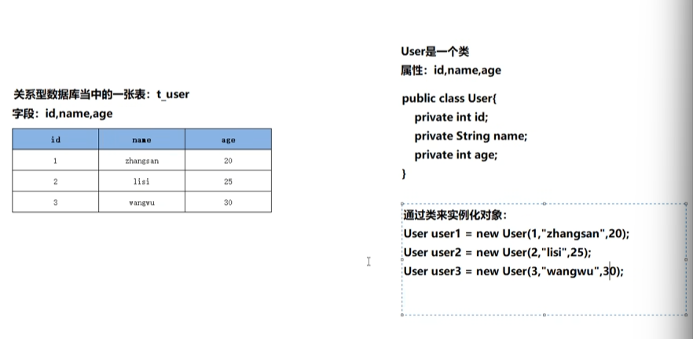
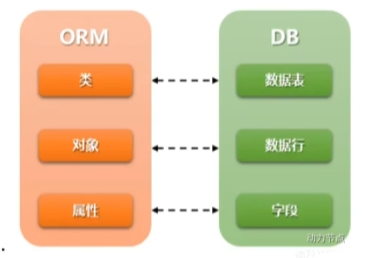

# MyBatis笔记

接下来的几天开始MyBatis的学习，用到的课程式动力节点杜老师的B站网课

<iframe 
    width="100%" 
    height="468" 
    src="//player.bilibili.com/player.html?bvid=BV1JP4y1Z73S&p=1&autoplay=false" 
    scrolling="no" 
    border="0" 
    frameborder="no" 
    framespacing="0" 
    allowfullscreen="true">
</iframe>

本来打算用尚硅谷的课程，但是18年的视频对现在来说以及太老了，jar包之类的都是通过手动引入的，非常的不方便，而且老师的课程也算是细康，讲的挺深入的

话不多说开始今天的学习


## ORM对象关系映射

O：Object，指的是JVM中的Java对象

R：Relational，关系型数据库

M：Mapping，映射

例如现在有一张数据库表，其中有数条记录，其列字段可以对应到JavaBean类对象的属性，而每一行的记录映射到Java中就是一个类的实例，其中存在一种转换关系，其中的Class对象被称为 pojo、bean、domain





MyBatis是一个半自动化的ORM，因为MyBatis框架中的SQL语句需要程序员手动编写，而Hibernate是一个全自动的ORM


## MyBatis入门使用

:::warning

在MyBatis的配置一般通过XML文件实现，另外还有一种基于注解的开发

:::

相对于JDBC，MyBatis对于JDBC进行了封装，可以避免JDBC的一些缺陷，例如sql语句写死，违反OCP开闭原则

另外对于?的赋值非常繁琐，通过反射机制可以轻松实现对象的复制，参数的传入

在使用的时候可以通过Maven进行MyBatis的导入

```html
<dependencies>
    <dependency>
        <groupId>org.mybatis</groupId>
        <artifactId>mybatis</artifactId>
        <version>3.5.13</version> <!-- 以最新版本为准 -->
    </dependency>
</dependencies>
```

用SQL语句新建立一个数据库表

```mysql
create table t_car(
	id int primary key auto_increment,
	car_num varchar(100),
	brand varchar(100),
	guide_price decimal(20,2),
	produce_time date,
	car_type varchar(100)
);
```

