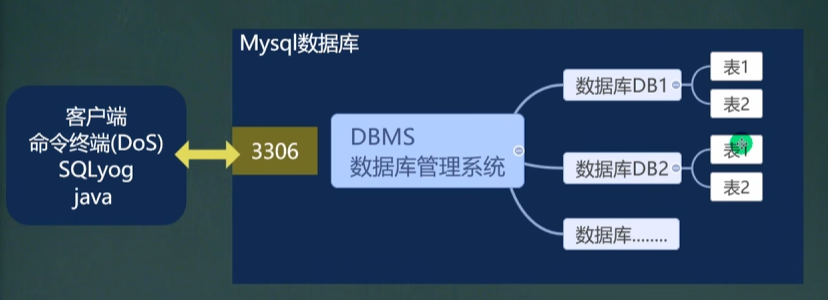
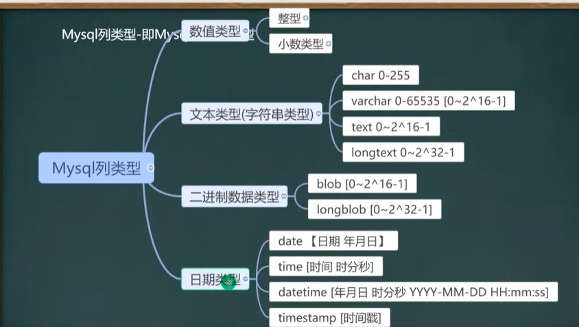

# MySQL

​	经过40天的Java学习，我系统性的学习了Java相关知识点，了解了各个知识点背后的源码逻辑，可以用Java语言实现各类算法，以及解决实际问题，独立的设计，编写相关项目。

​	而从今天开始我将开始数据库的学习，预计5天完成MySQL数据库基本操作的学习，之后运用JDBC完成一个实战项目

​	我在之前选修数据库课程的时候，只是停留在理论上，对于知识的理解也只是限于应付考试，为了更好的理解数据库以及更好的使用数据库，我决定再次回顾相关知识点，并且整理笔记


## MySQL的基本使用

关于MySQL的安装我就不过多赘述，因为之前也安装过了，详见各大网站上的安装使用教程照着安装即可


### MySQL启动服务

在我这里因为安装的时候设置为开机自动启用，所以不用执行该指令

```cmd
net start mysql
```

同样的如果需要停止服务

```cmd
net stop mysql
```


可以通过以下的指令查看数据库服务是否启用（root）

```cmd
sc query MySQL80
```

显示MySQL80在运行状态

```cmd
SERVICE_NAME: MySQL80
        TYPE               : 10  WIN32_OWN_PROCESS
        STATE              : 4  RUNNING
                                (STOPPABLE, PAUSABLE, ACCEPTS_SHUTDOWN)
        WIN32_EXIT_CODE    : 0  (0x0)
        SERVICE_EXIT_CODE  : 0  (0x0)
        CHECKPOINT         : 0x0
        WAIT_HINT          : 0x0
```


### MySQL数据库的本地连接

-h 表示连接的主机 localhost为本地主机

-P 代表的是连接端口

-u 代表的是登录用户名称

-p654321 （输入登录密码，p后不加空格）

```cmd
mysql -h localhost -P 3306 -u root -p654321
```


如果我们需要对于账户和密码进行修改我们可以在链接到数据库后，使用如下的指令对于账户的密码进行修改（654321）

```mysql
ALTER USER 'root'@'localhost' IDENTIFIED BY '你的新密码';
```

其实我们的登录账户名称和账户密码也会被存放在数据库中，我们上述的指令就是对于存放密码的数据库表进行更改操作


## 数据库的三层结构

1.所谓安装Mysql数据库，就是在主机上安装一个数据管理系统（DBMS），这个管理程序可以创建多个数据库

2.一个数据库中可以创建多个表，用以保存数据

3.数据库管理系统，数据库，表之间的关系（三层结构）



数据库和表本质上是文件，存放在内存中

表中的一行称之为一条记录，而在Java中一条记录使用一个对象来表示


# SQL语句分类

DDL：数据定义语句（create 表，库.......）

DML：数据操作语句（增删改查）

DQL：数据查询语句（select）

DCL：数据控制语句（管理数据库：如grant revoke）


## 创建数据库

```mysql
CREATE DATABASE [IF NOT EXISTS] db_name
```

### 例题

1.创建一个名为lory_db01的数据库

```mysql
create database lory_db01;
```

删除数据库

```mysql
drop database lory_db01;
```

2.创建一个使用utf-8字符集的lory_db02的数据库

```mysql
create database lory_db02 character set utf8;
```

3.创建一个使用utf-8字符集并带校对规则的lory_db03的数据库(区分大小写utf8_bin)默认不区分大小写

```sql
create database lory_db03 character set utf8 collate utf8_bin;
```


### 区分大小与否

不区分大小写的情况下使用查询语句

```sql
mysql> select * from students where name = 'b';
+----+------+
| id | name |
+----+------+
| B  | B    |
| d  | b    |
+----+------+
```

区分大小写的情况下（利用COLLARTE指定）

```sql
mysql> SELECT * FROM students WHERE name COLLATE utf8mb4_bin = 'b';
+----+------+
| id | name |
+----+------+
| d  | b    |
+----+------+
1 row in set (0.04 sec)
```


## 查询数据库

### 显示数据库语句

```sql
show databases;
```

```cmd
mysql> show databases;
+--------------------+
| Database           |
+--------------------+
| dbtest             |
| information_schema |
| mysql              |
| performance_schema |
| sakila             |
| student            |
| sys                |
| test               |
| world              |
+--------------------+
9 rows in set (0.06 sec)
```


### 显示数据库创建语句

```sql
show create database db_name;
```

```cmd
mysql> show create database student;

| Database | Create Database                       
| student  | CREATE DATABASE `student` /*!40100 DEFAULT CHARACTER SET utf8mb4 COLLATE utf8mb4_0900_ai_ci */ /*!80016 DEFAULT ENCRYPTION='N' */ |

1 row in set (0.05 sec)
```


### 数据库删除语句

[ ]中内容可选

```sql
drop database [IF EXISTS] db_name;
```


## 备份与恢复

备份是实际工作中非常重要的部分，我们无论是要进行数据库转移还是损坏后的恢复，都需要使用到备份和恢复数据库


### 备份数据库相关指令

#### 备份

mysqldump

(注意是在dos命令行中执行而不是数据库命令行界面)

```sql
mysqldump -u root -p**** -B DB_1 DB_2 ... > File.sql
```

```shell
C:\Windows\System32> mysqldump -u root -p654321 -B dbtest > d:\\test.sql
```

运行后在对应的路径下有一个备份文件，文件中其中存放了一些SQL语句，通过重新执行这些语句我们就可以恢复数据库中的内容（还有一些其他的信息）


#### 恢复

source

(注意在数据库命令行中执行)

```sql
source d:/test.sql;
```

当然你也可以将sql备份文件中的SQL语句直接执行


### 备份数据库表

#### 备份

```sql
mysqldump -u root -p db_01 table_1 table_2 ... > File.sql
```

#### 恢复

```
source d:/test.sql;
```


## 创建数据库表

```mysql
create table table_name
(
	fieldname1 datatype,
	fieldname2 datatype,
	fieldname3 datatype,
)character set 字符集 collate 校对规则 engine 存储引擎
```

field：指定列名  datatype：指定字段类型  character set：不指定则默认为所在数据库字符集	collate：如不指定默认为所在数据库校对规则 engine（讲解待定）

```sql
CREATE TABLE student1 (
    id INT,
    name VARCHAR(255),
    password VARCHAR(255)
)
CHARACTER SET utf8mb4 
COLLATE utf8mb4_bin 
ENGINE=InnoDB;
```


# MySQL列类型

## 类型总览

### 数值类型

| 数据类型             | 说明                             |
| -------------------- | -------------------------------- |
| BIT(M)               | 位类型，M指定位数（1-64）        |
| TINYINY [UNSIGNED]   | 占一个字节                       |
| SAMLLINT [UNSIGNED]  | 占两个字节                       |
| MEDIUMINT [UNSIGNED] | 占三个字节                       |
| INT [UNSIGENED]      | INT类型，占4个字节               |
| BIGINT [UNSIGHNED]   | 占8个字节                        |
| FLOAT [UNSIGHNED]    | 浮点型占4个字节                  |
| DOUBLE [UNSIGHED]    | 浮点型占8个字节                  |
| DECIMAL(M,D)         | 定点数M指定长度，D表示小数点位数 |


### 文本、二进制类型

| 数据类型            | 说明                                     |
| ------------------- | ---------------------------------------- |
| CHAR(size) char(20) | 固定长度字符串，最大255                  |
| VARCHAR(size)       | 可变长度字符串，0-65535                  |
| BLOB LONGBLOB       | 二进制数据 BLOB （2^16）LONGBLOB（2^32） |
| TEXT LONGTEXT       | 文本Text （2^16）LONGTEXT（2^32）        |


### 时间日日期类型

| 数据类型                | 说明                   |
| ----------------------- | ---------------------- |
| DATE/DATETIME/TimeStamp | 日期类型（YYYY-MM-DD） |

TimeStamp表示时间戳，可用于自定记录insert、updata操作的时间



## Mysql常用数据类型

其中用的比较多的有以下几个

int double decimal char varchar text datatime

在实际使用的时候，在满足要求的情况下尽量用小的数据类型


### 整形

#### TINYINT

以tinyint为例，支持-128~127，或者添加无符号参数支持0-255

```sql
CREATE TABLE test(id TINYINT);
CREATE TABLE test(id TINYINT unsigned);
```

#### BIT

1.bit(m) m在1-64

2.添加数据范围按照给定的位数确定，2的m次方

3.显示的时候按照bit

4.查询时任然可以按照数来查询

```sql
CREATE TABLE test01(id BIT(8));
```

插入数据以位的形式存储显示

```sql
INSERT INTO test01 VALUES(13);
```

```
00001101
```


### 浮点型

#### DECIMAL

1.FLOAT/DOUBLE于JAVA一样，单精度浮点数以及双精度

2.DECIMAL可以支持更加精确的小数位，M为小数位数总数，D是小数点后面的位数

3.如果D为0，则没有小数点和小数部分，M最大为65，D最大为30，如果D省略，默认为0，若M省略，默认为10

4.如果希望精度较高推荐使用decimal

```
DECIMAL[M,D][UNSIGNED]
```

```sql
CREATE TABLE test02(num1 DECIMAL(30,20), num2 FLOAT);
```

```sql
INSERT INTO test02 VALUES(88.1324, 133);
```


### 字符串

#### CHAR(size)

固定长度字符串，最大为255字符


#### VARCHAR(size)

可变长度字符串，最大为65532字节（utf-8编码最大21844字符 1-3个字节用于记录大小）

```sql
CREATE TABLE test03(num1 VARCHAR(21844), num2 CHAR(255));
```

```sql
INSERT INTO test03 VALUES('helloworld', '你好');
```


#### 子字符串使用细节

1.char(m)和.varchar(m) m表示的是字符数，无论中英文都最多放m个

2.char(4)是固定长度，即使插入aa，也会占据4个字符的空间，而varchar(4)是变长，会按照实际占用的空间分配，除此之外还需要1-3个字节存放记录内容长度

3.如何选择：如果数据是定长的，例如手机，邮编等就用char，如果是不确定的就用varchar，例如留言，文章等，而在查询速度的上而言char的速度快于varchar

4.在存放文本的时候也可以使用Text数据类型（更利于空间使用例如英文占一个字节，而中文占用三个字节），可以将TEXT列视为VAECHAR列，注意TEXT不可以有默认值，大小为0-2的16次，还需要更多的时候可以选择MEDIUMTEXT 或者 LONGTEXT


### 日期类型

#### 基本使用

时间戳可以设置为更新时的当前时间，这里没有加

```sql
CREATE TABLE test04 ( birthday DATE, job_time DATETIME, login_time TIMESTAMP );
```

```sql
INSERT INTO test04(birthday, job_time) VALUES('2022-2-22', '2022-2-22 10:10:10');
```

```cmd
+------------+---------------------+------------+
| birthday   | job_time            | login_time |
+------------+---------------------+------------+
| 2022-02-22 | 2022-02-22 10:10:10 | NULL       |
+------------+---------------------+------------+
```


以下是一个自动更新的例子

```sql
CREATE TABLE test05 (
  birthday DATE,
  job_time DATETIME,
  login_time TIMESTAMP DEFAULT CURRENT_TIMESTAMP ON UPDATE CURRENT_TIMESTAMP
);
```

```cmd
+------------+---------------------+---------------------+
| birthday   | job_time            | login_time          |
+------------+---------------------+---------------------+
| 2022-02-22 | 2022-02-22 10:10:10 | 2025-04-11 15:35:43 |
| 2022-02-22 | 2022-02-22 10:10:10 | 2025-04-11 15:35:44 |
| 2022-02-22 | 2022-02-22 10:10:10 | 2025-04-11 15:35:45 |
| 2022-02-22 | 2022-02-22 10:10:10 | 2025-04-11 15:35:45 |
+------------+---------------------+---------------------+
```


### 创建表例题

创建一个员工表，选取适当的数据类型

| 字段       | 属性   |
| ---------- | ------ |
| id         | 整形   |
| name       | 字符型 |
| sex        | 字符型 |
| birthday   | 日期型 |
| entry_date | 日期型 |
| job        | 字符型 |
| Salary     | 小数型 |
| resume     | 文本型 |

创建表格

```sql
CREATE TABLE `empty`(
	id INT,
	`name` VARCHAR ( 20 ),
	sex CHAR ( 1 ),
	birthday DATE,
	entry_date DATETIME,
	job VARCHAR ( 20 ),
	Salary DOUBLE,
	`resume` TEXT 
);
```

