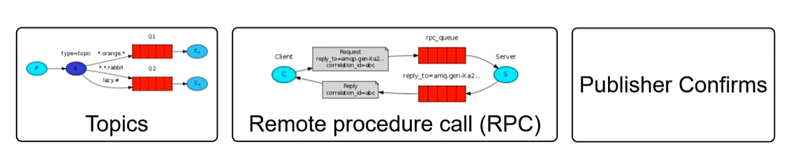

# RabbitMQ笔记

## 消息队列

我们在常规的访问通信是同步的，需要等到B返回响应后才可继续A的操作，而通过消息队列可以异步的继续远程的服务调用，不影响服务A的返回


RabbitMQ结构


## 入门使用

**安装RM**

使用Docker拉取镜像这里注意要下载的是带管理界面的management，默认的好像没有15672端口的管理界面

```
docker pull rabbitmq:management
```

启用Docker运行RabbitMQ

```
docker run -d \
  --name rabbitmq \
  -p 5672:5672 \
  -p 15672:15672 \
  --hostname my-rabbitmq-host \
  -e RABBITMQ_DEFAULT_USER=admin \
  -e RABBITMQ_DEFAULT_PASS=123456 \
  rabbitmq:management
```


**HelloWorld**

引入原生框架依赖

```xml
<dependency>
    <groupId>com.rabbitmq</groupId>
    <artifactId>amqp-client</artifactId>
    <version>5.16.0</version>  <!-- 使用最新稳定版本 -->
</dependency>
```

向交换机中发送消息

```java
public class Main {
    private final static String QUEUE_NAME = "hello";
    public static void main(String[] args) throws Exception {
        // 1. 创建连接工厂
        ConnectionFactory factory = new ConnectionFactory();
        factory.setHost("115.190.182.149"); // RabbitMQ服务器地址
        factory.setPort(5672);
        factory.setUsername("admin"); // 默认用户名
        factory.setPassword("123456"); // 默认密码
        // 2. 创建连接和通道
        try (Connection connection = factory.newConnection();
             Channel channel = connection.createChannel()) {

            // 3. 声明队列（如果不存在则创建）
            channel.queueDeclare(QUEUE_NAME, false, false, false, null);

            // 4. 发送消息
            String message = "Hello RabbitMQ!";
            channel.basicPublish("", QUEUE_NAME, null, message.getBytes());
            System.out.println(" [x] Sent '" + message + "'");
        }
    }
}
```

消费队列中的消息

```java
public class Consumer {
    private final static String QUEUE_NAME = "hello";
    public static void main(String[] args) throws Exception {
        // 1. 创建连接工厂
        ConnectionFactory factory = new ConnectionFactory();
        factory.setHost("115.190.182.149");
        factory.setPort(5672);
        factory.setUsername("admin"); // 默认用户名
        factory.setPassword("123456"); // 默认密码

        // 2. 创建连接和通道
        Connection connection = factory.newConnection();
        Channel channel = connection.createChannel();

        // 3. 声明队列（与生产者一致）
        channel.queueDeclare(QUEUE_NAME, false, false, false, null);
        System.out.println(" [*] Waiting for messages...");
        // 4. 创建消费者回调
        DeliverCallback deliverCallback = (consumerTag, delivery) -> {
            String message = new String(delivery.getBody(), "UTF-8");
            System.out.println(" [x] Received '" + message + "'");
        };

        // 5. 监听队列
        channel.basicConsume(QUEUE_NAME, true, deliverCallback, consumerTag -> {});
    }
}
```


## 工作模式

直接模式、工作队列、发布订阅、路由键


主题模式、RPC同步调用、消息可靠性投递



**工作队列**

当监听同一个队列的时候，消费端竞争消息，谁抢到就是谁消费，在底层创建了一个默认的交换机，发送到特定的队列供消费者竞争消费

**发布订阅模式** 

发布订阅模式，指定一个（Fanout）类型交换机，可以绑定多个队列，对于绑定的所有队列发送收到的消息（广播），再由对应队列的各个消费者消费

**路由模式**

通过路由键绑定队列与交换机，在发送的时候指定路由键，根据路由键匹配发送到对应的队列

**主题模式**

经过统配符完成消息的转发，满足则转发到对应的队列


## SpringBoot整合

引入依赖

```xml
<dependency>
    <groupId>org.springframework.boot</groupId>
    <artifactId>spring-boot-starter-amqp</artifactId>
</dependency>
```

### 创建消费者

在其中运用@RabbitListener注解声明了一个消费者方法，并在注解中设定了队列名称，交换机，路由键，启动后会自动创建队列，交换机和路由键

```java
@Component
@Slf4j
public class MyMessageListener {
    public static final String QUEUE_NAME = "queue.order";
    public static final String EXCHANGE_NAME = "exchange.order";
    public static final String ROUTING_KEY = "order";

    @RabbitListener(bindings = @QueueBinding(
            value = @Queue(value = QUEUE_NAME, durable = "true"),
            exchange = @Exchange(value = EXCHANGE_NAME),
            key = {ROUTING_KEY}
    ))
    public void processMessage(
            String dataString,
            Message message,
            Channel channel) {
        System.out.println("消费端接收到消息： " + dataString);
    }
}
```

如果建立关系，创建完成之后，只用指定队列名称即可

```java
@RabbitListener(queues = QUEUE_NAME)
public void processMessage(
        String dataString,
        Message message,
        Channel channel) {
    System.out.println("消费端接收到消息： " + dataString);
}
```


### 创建生产者

利用RabbitTemplate指定交换机以及路由键，和发送的信息，将消息发送到队列中，由消费者完成消费

```java
@RestController
public class SendController {
//    public static final String QUEUE_NAME = "queue.order";
    public static final String EXCHANGE_NAME = "exchange.order";
    public static final String ROUTING_KEY = "order";

    @Autowired
    private RabbitTemplate rabbitTemplate;

    @GetMapping("/send")
    public void send() {
        rabbitTemplate.convertAndSend(EXCHANGE_NAME, ROUTING_KEY, "Hello Order!");
    }
}
```


## 可靠性传递

### 可靠性问题


在生产者端进行确认，分别对交换机和队列确认，指定备份交换机，投递失败的时候，把消息投递至备份交换机


将消息持久化到硬盘


消费端业务成功返回ACK确认消息，然后消息队列删除该消息

如果失败返回NACK，将消息恢复为待消费状态，这样就可以取回信息重试


### 消息确认

配置文件改写

```yaml
spring:
  application:
    name: MQ
  rabbitmq:
    host: 115.190.182.149
    port: 5672
    username: admin
    password: 123456
    virtual-host: /
    publisher-confirm-type: correlated #交换机确认
    publisher-returns: true #队列确认
```

创建配置类

需要声明回调函数接受RabbitMQ服务器返回的确认消息，其中confirm方法确认消息是否发送到交换机上，returnedMessage确认消息是否发送到队列上

实现两个接口，再将类放入rabbitTemplate中，并通过@PostConstruct注解立即执行方法，配置后的rabbitTemplate就可以进行方法的回调

```java
@Configuration
@Slf4j
public class RabbitConfig implements RabbitTemplate.ConfirmCallback, RabbitTemplate.ReturnsCallback {
    @Autowired
    private RabbitTemplate rabbitTemplate;

    @PostConstruct
    public void initRabbitTemplate() {
        this.rabbitTemplate.setConfirmCallback(this);
        this.rabbitTemplate.setReturnsCallback(this);
    }

    @Override
    public void confirm(CorrelationData correlationData, boolean b, String s) {
        //消息发送后成功或失败都会调用该方法
        System.out.println("confirm:" + correlationData + ", b:" + b + ", s:" + s);
    }

    @Override
    public void returnedMessage(ReturnedMessage returnedMessage) {
        //只有失败的时候会调用
        System.out.println("returnedMessage:" + returnedMessage);
    }
}
```


### 备份交换机

创建备份交换机（fanout，因为无法指定路由键），以及绑定的队列

在创建交换机的时候，指定备份交换机


### 持久化

消息队列中的消息起始默认持久化，重启后消息也不会丢失

```java
/**
 * Specifies if this queue should be durable.
 * By default if queue name is provided it is durable.
 * @return true if the queue is to be declared as durable.
 * @see org.springframework.amqp.core.Queue#isDurable()
 */
String durable() default "";
```


### 手动确认

配置文件使失败的时候进行手动处理，

```yaml
spring:
  application:
    name: MQ
  rabbitmq:
    host: 115.190.182.149
    port: 5672
    username: admin
    password: 123456
    virtual-host: /
    listener:
      simple:
        acknowledge-mode: manual #把消息确认模式改为手动确认模式
```


通过basicNack可以进行消息设置，是否放回队列，第二个参数是是否批量操作

```java
@Component
@Slf4j
public class MyMessageListener {
    public static final String QUEUE_NAME = "queue.order";
    public static final String EXCHANGE_NAME = "exchange.order";
    public static final String ROUTING_KEY = "order";

//    @RabbitListener(bindings = @QueueBinding(
//            value = @Queue(value = QUEUE_NAME, durable = "true"),
//            exchange = @Exchange(value = EXCHANGE_NAME),
//            key = {ROUTING_KEY}
//    ))
    @RabbitListener(queues = QUEUE_NAME)
    public void processMessage(
            String dataString,
            Message message,
            Channel channel) throws IOException {

        try {
            //核心操作
            System.out.println("消费端接收到消息： " + dataString);
            //成功返回ACK
            channel.basicAck(message.getMessageProperties().getDeliveryTag(), false);
        } catch (Exception e) {
            Boolean redelivered = message.getMessageProperties().getRedelivered();
            //失败返回NACK
            if (redelivered) {
                //如果重复投递则不放回队列
                channel.basicNack(message.getMessageProperties().getDeliveryTag(), false, false);
            }
            //如果不是重复投递则放回队列
            channel.basicNack(message.getMessageProperties().getDeliveryTag(), false, true);
        }
    }
}
```
