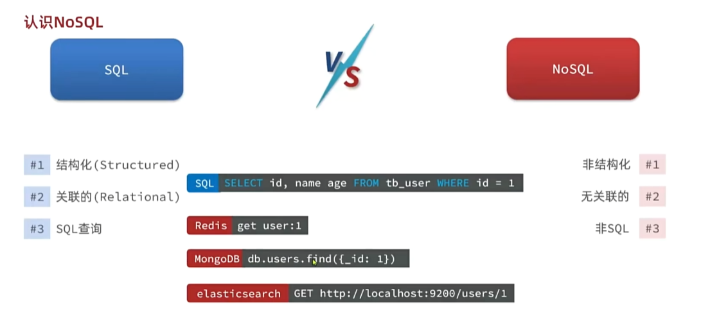
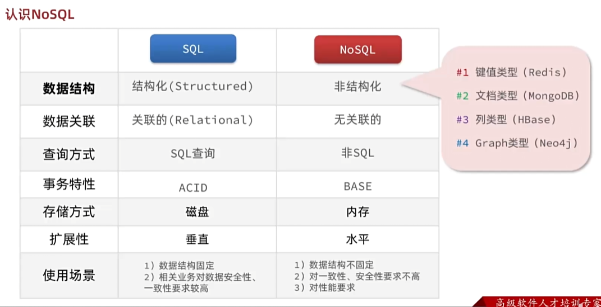
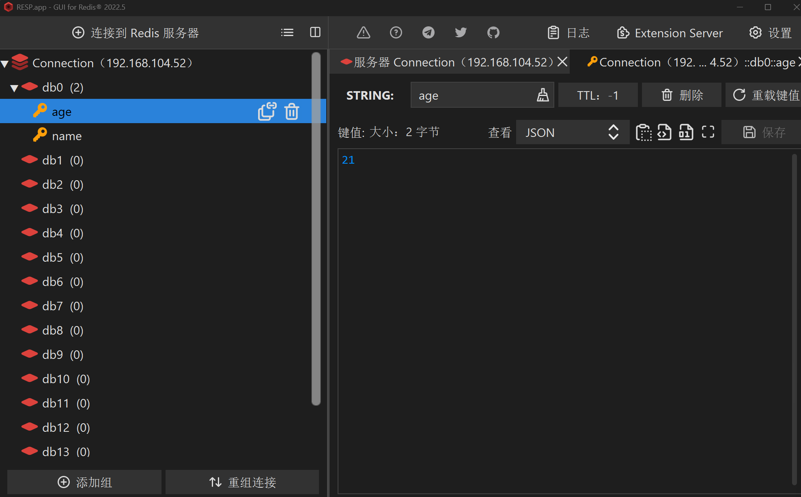
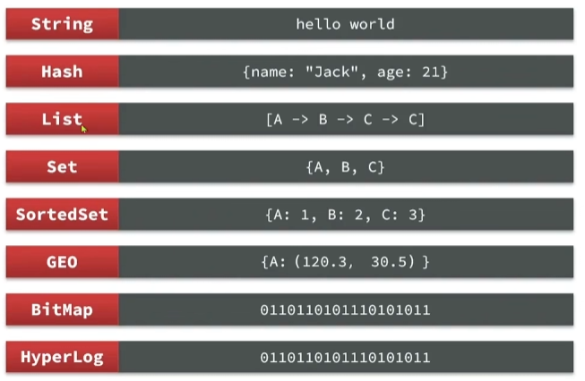

# Redis笔记

花了大概两天完成，Java8内容的学习，比预期的要上了短一些，本来打算按照学习计划先进行Java开发框架的学习，但是发现面试的时候Redis考点会更多一点，所以将Redis部分的学习提前，预定大概10天完成（黑马Redis教程）

教程包括了：八种不同的数据结构，两个消息队列，四个相关的运维操作，Scrip脚本，事务操作


## NoSQL

SQL是关系型数据库，而NoSQL是非关系型数据库

### 与SQL的区别

#### 结构化

SQL高度结构化，每个字段每个值都会有严格的要求，一般难以修改。而NoSQL是非结构化的，对于key没有严格要求，支持自定义，还可以键值类型，列类型，文档存储，Graph存储，相对SQL，结构便于修改


#### 关联性

SQL有外键的约束，数据是相关联的，NoSQL没有关联（程序员手动维护）


#### SQL查询

只要是SQL都可以使用相同的查询语句查询，而NoSQL没有固定的语法格式



每一个类型的数据查询方式不同


#### 事务

SQL有事务满足ACID，而NoSQL只满足BASE


#### 总结




## Redis

### 基本介绍

Remote Dictionary Server 远程词典服务器，是一个基于内存的键值型NoSQL数据库，以下是Redis的基本特征

键值型：value支持多种不同数据结构，功能丰富

单线程：每个命令具备原子性（Redis 6可以多线程处理网络请求）

高性能：低延迟，速度快（基于内存，IO多路复用，良好的编码【C语言编写】）

持久化：内存以往是不持久化的，而Redis定期存入磁盘，支持持久化

高可用：支持主从集群，分片集群

语言支持：支持多种语言的客户端


### 常用命令

我们一般的redis数据库会配置在Linux环境下，之后可以使用Windows的GUI软件RESP来使用Linux下的数据库

再Linux下装好redis后，可以使用如下的指令

命令行客户端

```shell
redis-cli
```

服务端启动脚本

```shell
redis-server
```

哨兵启动脚本

```shell
redis-sentinel
```


可以在redis.conf中设置，允许访问的地址，密码，是否后台运行等

再用如下的指令指定配置文件启动

```
redis-server redis.conf
```

利用如下指令查找开启的进程

```shell
ps -ef | grep redis
```

杀死对应端口的进程

```shell
kill -9 2574
```


用命令行客户端连接redis

```shell
redis-cli -a ******
```

连接成功后，ping和服务端交互

```shell
ping
PONG
```

还可以进行存取数据

```shell
127.0.0.1:6379> set name jack
OK
127.0.0.1:6379> set age 21
OK
127.0.0.1:6379> get name
"jack"
127.0.0.1:6379> get age
"21"
```

再windows宿主机使用如下指令连接（虚拟机网络适配器改为桥接连接模式）

```shell
redis-cli -h 192.168.104.52 -p 6379 -a ******
```


使用GUI客户端连接

网址链接： https://github.com/lework/RedisDesktopManager-Windows




## Redis数据结构

Redis是一个键值对形式存储的数据库，key一般是String类型的，不过Value的类型非常多种多样



其中前五种是基本数据类型，后三种是特殊数据类型

数据类型的具体使用详见 https://redis.io/docs/latest/commands

如果在连接到redis下的客户端中可以使用如下指令获取帮助

```shell
help @数据类型
```

例如查看String的相关指令

```
help @String
```


### Key的层级格式

Redis没有类似MySQL中的Table概念，而所有的键值对都是存储在一起的，怎么区分不同类型的key？

例如需要存储用户，商品信息到redis，一个用户的id是1，而另一个商品id也为1

而为了解决这类的问题，redis引入了key的层级结构：Redis的key允许有多个单词形成层级结构，多个单词之间用：隔开，格式如下

```
项目名称:业务名称:类型:id
```

格式并非固定不变，可以根据需求删除或者添加词条

user相关的key：com.user:1

product相关的key：com.product:1


### Redis通用命令

虽然有非常多的数据类型以及相关操作，但是其中也有一些通用的命令


#### KEYS

查看符合模板的所有key，不建议在Redis服务器端使用，会阻塞所有的其他指令

```
KEYS pattern
```

例如：返回所有的键值

```
KEYS *
```

返回a开头的所有键值

```
KEYS a*
```


#### DEL

删除一个指定的键值(例如age)

```
DEL age
```

也可以删除多个

```
DEL k1 k2 k3
```


#### MSET

批量插入键值对

```shell
MSET k1 v1 k2 v2 k3 v3 k4 v4
```


#### EXISTS

判断是否存在键值

```
EXISTS k4
```


#### EXPIRE

给一个key设置有效期，有效期到达时key会被删除

```
EXPIRE key second
```

```
EXPIRE name 5
```


#### TTL

查看一个键的有效期

```
TTL key
```

其中返回-1代表永久有效 -2为无效，其余为有效的秒数

```
TTL k1
(integer) -1
```


### String类型

是字符串类型，是Redis中最简单的存储类型，value是字符串，根据不同的格式又分为了三类：String 普通字符串  int 整数类型  float  浮点类型

无论是哪一种格式存储，底层都是字节数组形式，只是编码方式不同，字符串类型的最大空间不可以超过512M

以下是String类型常见的命令

#### SET

添加或者修改一个存在的String类型的键值对

```
 set k1 123
```


#### GET

根据key获取String类型的value

```
get k1
"123"
```


#### MSET

批量添加多个String类型的的键值对

```
MSET t1 1 t2 2 t3 3
```


#### MGET

根据多个key获取多个String类型的value

```
MGET k1 k2 k3
1) "v1"
2) "v2"
3) "v3"
```


#### INCR

让一个整型的key自增1

```
get 1
"23"
```

```
INCR 1
(integer) 24
get 1
"24"
```


#### INCRBY

让一个整形的key自增并指定步长，例如incrby num 2让num自增2

在INCR的基础上增加步长

```
INCRBY 1 4
(integer) 28
```


#### INCRBYFLOAT

让一个浮点类型的数字自增并指定步长

```
append 2 3.1415296
(integer) 9
get 2
"3.1415296"
INCRBYFLOAT 2 1.1
"4.2415296"
```


#### SETNX

添加一个String类型的键值对，前提是这个key不存在，否则不执行

k1以及存在，不执行语句

```
SETNX k1 1
(integer) 0
```


#### SETEX

添加一个String类型的键值对，并且指定有效期

```
SETEX key seconds value
```

设置键3值12，持续30每秒

```
SETEX 3 30 12
```

或者可以这么写

```
set 3 12 ex 30
```


### Hash类型

Hash类型，又称为散列，它的value是一个无序字典，类似于Java中的HashMap结构，String结构是将对象序列化为JSON字符串后存储，当需要修改某个字段的时候很不方便


而Hash结构可以将对象中的每个字段独立存储，可以针对单个字段作增删改查


#### HSET 

添加或者修改hash类型key的field值

```
hset key field value
```

```
hset hash1 field value
```


#### HGET

获取一个hash类型的key的field值

```
HGET key field
```

```
hget hash1 field
"value"
```


#### HMSET

批量添加多个hash类型key的field值

```
HMSET hash1 field2 value2 field3 value3
```


#### HMGET

批量获取多个hash类型的key的field值

```
HMGET hash1 field field1 field2
1) "value"
2) "value2"
3) "value2"
```


#### HDEL

删除指定hash中的某个字段

```
HDEL hash fieldString
```


#### HGETALL

获取一个hash类型的key中所有的field和value

```
HGETALL hash1
1) "field"
2) "value"
3) "field1"
4) "value2"
5) "field2"
6) "value2"
7) "field3"
8) "value3"
```


#### HKEYS

获取一个hash类型的所有field

```
HKEYS hash1
1) "field"
2) "field1"
3) "field2"
4) "field3"
```


#### HVALS

获取一个hash类型的所有value

```
HVALS hash1
1) "value"
2) "value2"
3) "value2"
4) "value3"
```


#### HINCRBY

让一个hash类型key的字段值自增，并指定步长

```
HSET hash fieldInt 1
(integer) 1
HINCRBY hash fieldInt 3
(integer) 4
```


#### HSETNX

添加一个hash类型key的field值，前提是field不存在，否则不执行（就是不允许修改存在的键的值）

```
HSETNX hash fieldString HelloWorld
```


### List类型

对于List而言，可以使用该数据类型进行模拟栈：只需要入口和出口在同一边，如LPUSH+LPOP或者RPUSH+RPOP

也可以模拟一个队列：需要入口和出口在不同边即可，如RPUSH+LPOP或者RPUSH+LPOP

阻塞队列的模拟：入口出口不同边，取出采用BLPOP或者BRPOP


基本介绍

Redis中的List类型，和Java中的LinkedList类似，可以看作是一个双向链表的结构，既支持正向检索也可以支持反向检索

特征：有序，元素可以重复，插入和删除较快，查询效率一般

以下是List的常见命令

#### LPUSH

向列表左侧插入一个或者多个元素

```
LPUSH key element ...
```

```
LPUSH list a b c d e f g
```


#### LPOP

移除并返回列表左侧的第一个元素，没有则返回nil

```
LPOP key 
```

```
LPOP list
"g"
```


#### RPUSH

向列表右侧插入一个或者多个元素

```
RPUSH list a b c d e f g h
```


#### RPOP

移除并返回列表右侧的第一个元素

```
RPOP list
"h"
```


#### LRANGE

返回一段角标范围内的所有元素

```
LRANGE key star end
```

```
LRANGE list 1 3
1) "b"
2) "c"
3) "d"
```


#### BLPOP与BRPOP

和LPOP，RPOP类似，只是在没有元素时等待指定时间，而不是返回nil

```
BLPOP list 60
1) "list"
2) "target"
(15.01s)
```

其中list本来没有值，进入阻塞等待最多60s，新创建的客户端加入list 数据 target数据被读到


### Set类型

Redis的Set结构和Java中的HashSet类似，可以看为是一个value为null的HashMap，因为是一个hash表，因此具备和HashSet类似的特征：无序，元素不可重复，查找快，支持交集、并集、差集的功能

以下是Set类型常见的命令


#### SADD

向set中添加一个或者多个元素

```
SADD key member ...
```

```
SADD set a b c d e f g
```


#### SREM

移除set中的指定元素

```
SREM key member ...
```

```
SREM set a b c
```


#### SCARD

返回set中的元素个数

```
SCARD key
```

```
SCARD set
(integer) 4
```


#### SISMEMBER

判断一个元素是否存在于set中

```
SISMEMBER key member
```

```
SISMEMBER set g
(integer) 1
```


#### SMEMBERS

获取set中的所有元素

```
SMEMBERS set
1) "g"
2) "d"
3) "f"
4) "e"
```


前置操作

```
SADD set1 a b c d e f
SADD set2 a b
```


#### SINTER

求两个集合的交集

```
SINTER set1 set2
```

```
1) "b"
2) "a"
```


#### SDIFF

求两个集合的差集

```
SDIFF set1 set2
```

```
1) "c"
2) "e"
3) "f"
4) "d"
```


#### SUNION

求两个集合的并集

```
SUNION set1 set2
```

```
1) "b"
2) "a"
3) "d"
4) "c"
5) "e"
6) "f"
```


### SortedSet类型

Redis的SortedSet是一个可排序的set集合，与Java中的TreeSet有些类似，但是底层数据结构差别巨大，SortedSet中的每一个元素都带有一个score属性，可以基于score属性对元素排序，底层是一个跳表（Skip List）加上hash表

以下是SortedSet的特征：可排序 元素不重复  查询速度快

因为SortedSet的可排序性，经常用于实现排行榜等功能


以下是Sorted的常见命令，所有排名默认为升序，降序在命令Z后加REV即可

```
ZREVRANGE 
```


#### ZADD

添加一个或者多个元素到sorted set，如果与存在则更新其score值

```
ZADD key score member
```

```
ZADD sortedset 1 Hello
```


#### ZREM

删除sorted set中的一个元素

```
ZREM key member
```

```
zrem sortedset HelloWorld
```


#### ZSCORE

获取sorted set中指定元素的score值

```
ZSCORE key member
```

```
ZSCORE sortedset Hello
"1"
```


#### ZRANK

获取sorted set中的指定元素排名

```
ZRANK key member
```

```
ZRANK sortedset Hello
(integer) 0
```


#### ZCARD

获取sorted set中的元素个数

```
ZCARD key
```

```
zcard sortedset
(integer) 2
```


#### ZCOUNT

统计指定范围内元素的个数

```
ZCOUNT key min max
```

```
ZCOUNT sortedset 2 5
(integer) 1
```


#### ZINCRBY

让sorted set 中指定score元素自增，指定步长

```
ZINCRBY key increment member
```

```
ZINCRBY sortedset 4 1
"22"
```


#### ZRANGE

按照score排序后，获取指定排名范围内的元素

```
ZRANGE key min max
```

```
ZRANGE sortedset 0 1
1) "Hello"
2) "World"
```


#### ZRANGEBYSCORE 

按照score排序后，获取指定score范围内的元素

```
ZRANGEBYSCORE key min max
```

```
ZRANGEBYSCORE sortedset 0 44
1) "Hello"
2) "World"
3) "1"
```


#### ZDIFF、ZINTER、ZUNION

求差集、交集、并集

和Set类中的类似，不再过多叙述

