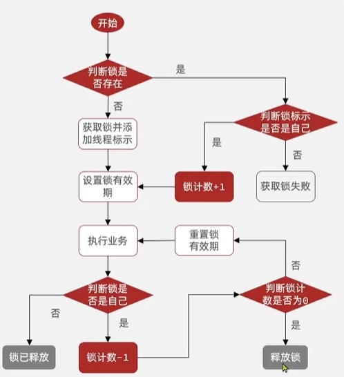
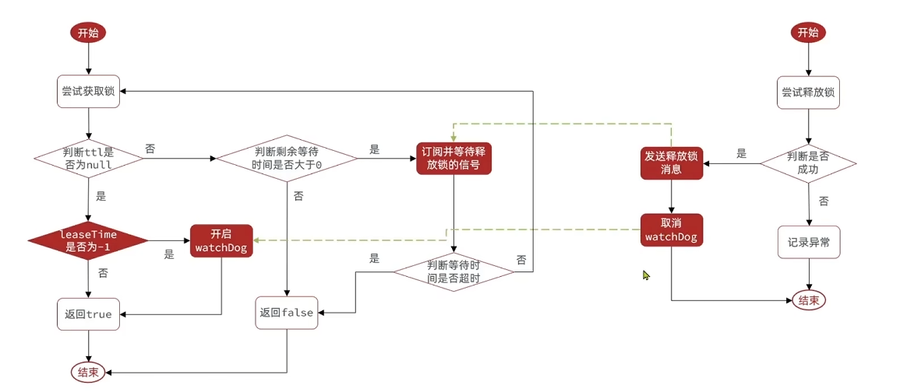
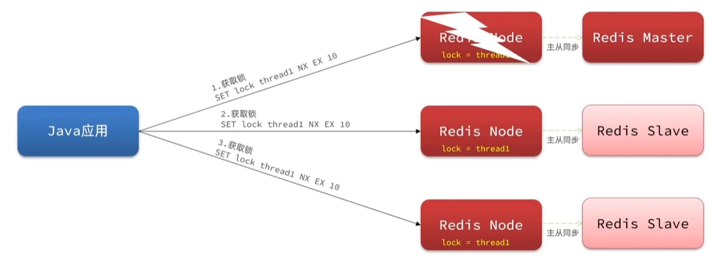

# Redis笔记

## Lua脚本

Redis提供了Lua脚本功能，在一个脚本中编写多条Redis命令，确保多条命令执行的原子性

使用Lua脚本编写Redis命令

```
redis.call('命令名称', 'key', '参数', ...)
```

在Redis中利用EVAL调用Lua脚本

```
EVAL "return redis.call('set', 'name', 'jack')" 0
```

脚本

```lua
-- KEYS[1]: 锁的Key
-- ARGV[1]: 当前客户端持有的锁标识（如UUID）
if redis.call("get", KEYS[1]) == ARGV[1] then
    return redis.call("del", KEYS[1])
else
    return 0
end
```

```java
import org.springframework.data.redis.core.RedisTemplate;
import java.util.Collections;
@Autowired
private RedisTemplate<String, String> redisTemplate;
public boolean releaseLock(String lockKey, String clientId) {
    // 定义脚本（可通过@Bean提前注入）
    DefaultRedisScript<Long> script = new DefaultRedisScript<>();
    script.setScriptText("..."); // 同上
    script.setResultType(Long.class);
    // 执行脚本
    Long result = redisTemplate.execute(
        script,
        Collections.singletonList(lockKey), // KEYS[1]
        clientId                           // ARGV[1]
    );
    // 返回是否释放成功
    return result != null && result == 1L;
}
```


## Redisson

基于setnx实现的分布式锁存在不可重入问题、不可重试问题、超时释放问题、主从一致性问题，Redisson可以解决这些问题

Redission是在Redis基础上实现的Java驻内存数据网格，不仅提供了一系列的分布式Java常用对象，还提供了许多分布式服务，其中包含了各种分布式锁的实现

```xml
<dependency>
    <groupId>org.redisson</groupId>
    <artifactId>redisson-spring-boot-starter</artifactId>
    <version>3.23.4</version>
</dependency>
```

```java
@Configuration
public class RedissonConfig {

    @Bean(destroyMethod = "shutdown")
    public RedissonClient redissonClient() {
        Config config = new Config();
        config.useSingleServer()
              .setAddress("redis://127.0.0.1:6379")
              .setPassword("your-password");
        return Redisson.create(config);
    }
}
```

代码使用

```java
@Autowired
private RedissonClient redissonClient;

public void doSomethingWithLock() {
    RLock lock = redissonClient.getLock("myLock");
    
    try {
        // 尝试加锁，最多等待 10 秒，锁自动释放时间 30 秒
        boolean isLocked = lock.tryLock(10, 30, TimeUnit.SECONDS);
        
        if (isLocked) {
            // 执行业务逻辑
            System.out.println("Lock acquired, doing work...");
        }
    } catch (InterruptedException e) {
        Thread.currentThread().interrupt();
        throw new RuntimeException("Failed to acquire lock", e);
    } finally {
        // 确保锁被释放
        if (lock.isHeldByCurrentThread()) {
            lock.unlock();
        }
    }
}
```


### 可重入锁

用Redis实现



在实际使用的时候用RLock锁实现即可

```java
import org.redisson.Redisson;
import org.redisson.api.RLock;
import org.redisson.api.RedissonClient;
import org.redisson.config.Config;
public class ReentrantLockExample {
    public static void main(String[] args) {
        // 1. 初始化Redisson客户端
        Config config = new Config();
        config.useSingleServer().setAddress("redis://127.0.0.1:6379");
        RedissonClient redisson = Redisson.create(config);
        // 2. 获取锁对象
        RLock lock = redisson.getLock("myReentrantLock");
        // 3. 第一次加锁
        lock.lock();
        try {
            System.out.println("第一次加锁成功，执行主业务逻辑...");
            // 4. 同一线程内第二次加锁（可重入）
            lock.lock();
            try {
                System.out.println("第二次加锁成功，执行嵌套业务逻辑...");
            } finally {
                // 5. 释放第二次加的锁
                lock.unlock();
                System.out.println("释放第二次加的锁");
            }
        } finally {
            // 6. 释放第一次加的锁
            lock.unlock();
            System.out.println("释放第一次加的锁");
        }
        // 7. 关闭Redisson客户端
        redisson.shutdown();
    }
}
```


### 重试自旋



```java
RLock lock = redisson.getLock("spinLock");
long waitTime = 5000; // 最大等待时间（毫秒）
long leaseTime = 30000; // 锁持有时间（毫秒）
long startTime = System.currentTimeMillis();

while (true) {
    // 尝试非阻塞加锁（等待时间0，立即返回）
    boolean isLocked = lock.tryLock(0, leaseTime, TimeUnit.MILLISECONDS);
    if (isLocked) {
        try {
            System.out.println("获取锁成功，执行业务逻辑...");
            break; // 业务完成后退出循环
        } finally {
            lock.unlock();
        }
    } else {
        // 检查是否超时
        if (System.currentTimeMillis() - startTime > waitTime) {
            System.out.println("等待超时，放弃获取锁");
            break;
        }
        // 短暂休眠后重试（避免CPU空转）
        Thread.sleep(100); 
    }
}
```


### 一致性问题




RedLock的CAP属性

```java
import org.redisson.Redisson;
import org.redisson.api.RLock;
import org.redisson.api.RedissonClient;
import org.redisson.config.Config;
import java.util.concurrent.TimeUnit;

public class RedLockExample {

    public static void main(String[] args) {
        // 1. 初始化3个独立的Redisson客户端（连接不同Redis节点）
        RedissonClient client1 = createClient("redis://node1:6379");
        RedissonClient client2 = createClient("redis://node2:6379");
        RedissonClient client3 = createClient("redis://node3:6379");

        // 2. 从每个客户端获取同一个资源的锁
        RLock lock1 = client1.getLock("global_task_lock");
        RLock lock2 = client2.getLock("global_task_lock");
        RLock lock3 = client3.getLock("global_task_lock");

        // 3. 创建RedLock（需至少3个节点）
        RLock redLock = Redisson.createRedLock(lock1, lock2, lock3);

        try {
            // 4. 尝试加锁（等待5秒，锁自动释放时间30秒）
            boolean isLocked = redLock.tryLock(5, 30, TimeUnit.SECONDS);
            if (isLocked) {
                System.out.println("RedLock加锁成功，执行关键业务...");
                // 此处编写需要保护的代码（如唯一任务调度）
            } else {
                System.out.println("获取锁失败，可能因节点不可用或竞争激烈");
            }
        } catch (InterruptedException e) {
            Thread.currentThread().interrupt();
            System.err.println("锁获取被中断");
        } finally {
            // 5. 确保释放锁
            redLock.unlock();
            client1.shutdown();
            client2.shutdown();
            client3.shutdown();
        }
    }

    private static RedissonClient createClient(String address) {
        Config config = new Config();
        config.useSingleServer()
              .setAddress(address)
              .setPassword("your_password")  // 如果有密码
              .setConnectionPoolSize(64)     // 连接池大小
              .setTimeout(3000);             // 操作超时时间
        return Redisson.create(config);
    }
}
```


| **CAP特性**                 | **RedLock的表现**                                      | **说明**                                |
| :-------------------------- | :----------------------------------------------------- | :-------------------------------------- |
| **Consistency (C)**         | **强一致性**（多数派成功才加锁，避免脑裂）。           | 需至少`N/2+1`个节点成功获取锁。         |
| **Availability (A)**        | **分区时可能不可用**（若多数节点不可达，则拒绝加锁）。 | 牺牲部分可用性换取一致性。              |
| **Partition Tolerance (P)** | **支持网络分区**（部分节点故障不影响整体判断）。       | 依赖Redis节点的独立部署（如不同机房）。 |

**结论**：RedLock是典型的**CP系统**，优先保证数据一致性。


MultiLock锁

```java
import org.redisson.Redisson;
import org.redisson.api.RLock;
import org.redisson.api.RedissonClient;
import org.redisson.config.Config;

public class MultiLockExample {
    public static void main(String[] args) throws InterruptedException {
        // 1. 初始化多个Redisson客户端（连接不同Redis节点）
        RedissonClient client1 = Redisson.create(new Config().useSingleServer().setAddress("redis://node1:6379"));
        RedissonClient client2 = Redisson.create(new Config().useSingleServer().setAddress("redis://node2:6379"));

        // 2. 获取多个独立的锁
        RLock orderLock = client1.getLock("order:lock:" + orderId);
        RLock stockLock = client2.getLock("stock:lock:" + itemId);

        // 3. 创建MultiLock（将多个锁合并）
        RLock multiLock = client1.getMultiLock(orderLock, stockLock);

        try {
            // 4. 尝试加锁（等待10秒，锁持有30秒）
            boolean isLocked = multiLock.tryLock(10, 30, TimeUnit.SECONDS);
            if (isLocked) {
                System.out.println("MultiLock加锁成功，执行业务逻辑...");
                // 操作订单和库存（原子性保证）
            } else {
                System.out.println("获取锁失败，处理重试或降级逻辑");
            }
        } finally {
            // 5. 释放锁（自动释放所有子锁）
            multiLock.unlock();
            client1.shutdown();
            client2.shutdown();
        }
    }
}
```

| **特性**       | **MultiLock**                                              | **RedLock**                                            |
| :------------- | :--------------------------------------------------------- | :----------------------------------------------------- |
| **核心目的**   | **合并多个独立的锁为一个逻辑锁**，确保多个资源同时被锁定。 | **通过多节点投票实现高可靠的分布式锁**，避免单点故障。 |
| **一致性模型** | 强一致性（所有子锁必须全部成功）。                         | 强一致性（多数派节点成功即可，N/2+1）。                |
| **CAP属性**    | CP（牺牲可用性）                                           | CP（牺牲可用性）                                       |
| **性能影响**   | 随子锁数量线性增长。                                       | 随Redis节点数量增长。                                  |
