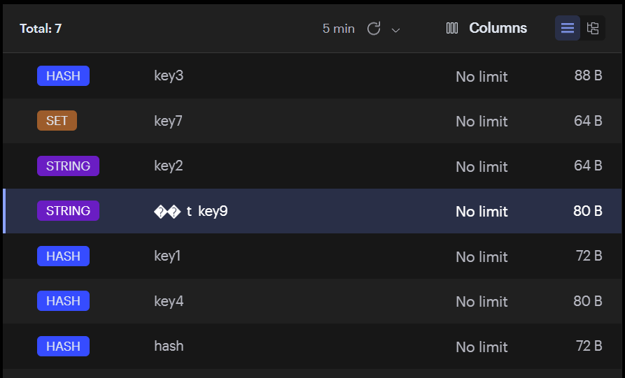

# Redis笔记

## Jedis

我们学Redis最终还是要回到编码上，我们需要使用到Redis提供的客户端，推荐的有Jedis、lettuce、Redisson

Jedis，以Redis命令作为方法名称，学习成本较低，简单实用，但是Jedis实例线程不安全，多线程环境下需要基于连接池来使用

Lettuce，是基于Netty实现的，支持同步，异步，响应式编程方式，线程安全，支持Redis的哨兵模式，集群模式，管道模式

Redisson，是基于Redis实现的分布式，可伸缩的Java数据结构集合，包含了Map、Queue、Lock、Semaphore、AtomicLong等强大功能

而其中Spring Data Redis支持jedis和lettuce

### Jedis使用

用Maven添加如下的依赖

```xml
<dependencies>
    <dependency>
        <groupId>redis.clients</groupId>
        <artifactId>jedis</artifactId>
        <version>5.2.0</version>
    </dependency>

    <dependency>
        <groupId>junit</groupId>
        <artifactId>junit</artifactId>
        <version>4.13.2</version>
        <scope>test</scope>
    </dependency>
    <dependency>
        <groupId>org.junit.jupiter</groupId>
        <artifactId>junit-jupiter</artifactId>
        <version>5.8.1</version>
        <scope>test</scope>
    </dependency>
</dependencies>
```


### 测试代码

```java
package org.example;

public class Main {
    public static void main(String[] args) {
        JedisTest jedis = new JedisTest();
        jedis.setUP();
        jedis.testString();
        jedis.tearDown();
    }
}
```

```java
import java.util.Iterator;
import java.util.Map;
import java.util.Set;

public class JedisTest {
    private Jedis jedis;

    public void setUP(){
        jedis = new Jedis("192.168.104.52", 6379);
        jedis.auth("654321");
        jedis.select(0);
    }

    public void testString() {
        jedis.hset("hash", "test", "value");
        Map<String, String> hash = jedis.hgetAll("hash");
        Set<Map.Entry<String, String>> entrySet = hash.entrySet();
        Iterator<Map.Entry<String, String>> iterator = entrySet.iterator();
        while(iterator.hasNext()) {
            Map.Entry<String, String> entry = iterator.next();
            System.out.println(entry.getKey() + " " + entry.getValue());
        }
    }

    public void tearDown() {
        if(jedis != null) {
            jedis.close();
        }
    }
}
```

```
fieldString1 HelloWorld1
test value
fieldInt 1
fieldString HelloWorld
```

可以看到，所有的jedis指令名称和参数都和redis中的对应，使用起来异常的方便，Hash数据结构中的hgetAll也使用HashMap的形式返回，方便用迭代器进行处理


### Jedis连接池

Jedis本身是线程不安全的，而且频繁地创建和销毁连接会有性能上的损耗，推荐使用Jedis地连接池来替代Jedis地直接连接方式

封装连接池类

```JAVA
public class JedisConnectionFactory {
    private static final JedisPool jedisPool;

    static {
        JedisPoolConfig jedisPoolConfig = new JedisPoolConfig();
        //设置最大连接数
        jedisPoolConfig.setMaxTotal(8);
        //设置最大空闲连接
        jedisPoolConfig.setMaxIdle(8);
        //设置最小空闲连接
        jedisPoolConfig.setMinIdle(8);
        //设置最长等待时间ms
        jedisPoolConfig.setMaxWait(Duration.ofMillis(2000));
        jedisPool = new JedisPool(jedisPoolConfig, "192.168.104.52", 6379, 1000, "654321");
    }
    //1000 是连接 Redis 服务器的超时时间（毫秒）

    public static Jedis getJedis() {
        return jedisPool.getResource();
    }
}
```

```java
public class Main {
    public static void main(String[] args) {
        Jedis jedis = JedisConnectionFactory.getJedis();
        jedis.set("key", "value");
        String s = jedis.get("key");
        System.out.println(s);
    }
}
```


## SpringDataRedis

SpringData是Spring中数据操作的模块，包含对于各种数据库的集成，其中对Redis的集成模块就是SpringDataRedis，总的来说包含了以下的功能

1.提供了对不同Redis客户端的整合（Lettuce和Jedis）

2.提供了RedisTemplate统一API操作Redis

3.支持Redis的发布订阅模型

4.支持Redis哨兵和Redis集群

5.支持基于Lettuce的响应式编程

6.支持基于JDK，JSON，字符串，Spring对象的数据序列化和反序列化

7.支持基于Redis的JDKCollection实现


### 快速入门


配置文件，这里我用的docker redis没有设置密码

```yaml
spring:
  data:
    redis:
      port: 6379
      host: localhost

```

测试代码

```java
@SpringBootTest
class Class01ApplicationTests {

    @Autowired
    private RedisTemplate redisTemplate;

    @Test
    void contextLoads() {
        redisTemplate.opsForValue().set("key9", "value9");
        Object object = redisTemplate.opsForValue().get("key9");
        System.out.println("object: " + object);
    }
}
```

通过注入的redisTemplate我们即可完成数据的存入与取出


### 一个小问题

这里虽然可以取出值，但是我们看到客户端中的key其实不是key9，而是带上了一个乱码前缀



这其实是序列化的问题，Redis接受的是Object对象，将其序列化，而不是String，Spring利用了JDK序列化处理工具将其转化存储

我们要解决这个问题我们就要改变序列化工具，可以使用StringRedisSerializer来getBytes或者GenericJackson2JsonRedisSerializer


用一个配置类来配置我们的redisTemplate

```java
@Configuration
public class RedisConfig {
    @Bean
    public RedisTemplate<String, Object> redisTemplate(RedisConnectionFactory factory) {
        RedisTemplate<String, Object> template = new RedisTemplate<>();
        template.setConnectionFactory(factory);
        template.setKeySerializer(new StringRedisSerializer()); // Key用字符串
        template.setValueSerializer(new GenericJackson2JsonRedisSerializer()); // Value用JSON
        return template;
    }
}
```

除此以外我们还需要引入jackson的相关依赖

```xml
<!-- pom.xml（Maven） -->
<dependency>
    <groupId>com.fasterxml.jackson.core</groupId>
    <artifactId>jackson-databind</artifactId>
    <version>2.17.1</version> <!-- 或使用 Spring Boot 默认版本 -->
</dependency>
```

我们就可以指定Key用的StringRedisSerializer序列化，Value用的GenericJackson2JsonRedisSerializer序列化


### StringRedisTemplate

我们在使用json序列化处理器的时候值会包含类的全路径，这也是json反序列化处理时需要的一部分

```
{"@class":"com.redis.entity.Student","name":"Lory","age":18}
```

但是有的时候为了节省空间我们会使用统一的String序列化器，要求用String类型来存储key和value，而需要存储Java对象的时候再进行手动对对象序列化和反序列化

```java
@SpringBootTest
class Class01ApplicationTests {

    @Resource
    private RedisTemplate redisTemplate;

    @Resource
    private StringRedisTemplate stringRedisTemplate;

    @Test
    void contextLoads() {
        Student student = new Student("Lory", 18);
        String value = JSON.toJSONString(student);
        stringRedisTemplate.opsForValue().set("key9", value);

        String targetString = stringRedisTemplate.opsForValue().get("key9");
        Student stu = JSON.parseObject(targetString, Student.class);
        System.out.println(stu.getName());
    }
}
```

这样存入的就是json字符串

```
{"age":18,"name":"Lory"}
```


### Hash类型操作

```java
void contextLoads() {
        stringRedisTemplate.opsForHash().put("key10", "name", "lory");
        stringRedisTemplate.opsForHash().put("key10", "age", "18");
        Map<Object, Object> key10 = stringRedisTemplate.opsForHash().entries("key10");//获取键对应的Hash结构数据
    }
```


## 短信登录

分为了三个部分：验证码发送，验证码登录/注册，校验登陆状态


### 验证码发送

```java
@RestController
@RequestMapping("/user")
public class LoginController {
    @Autowired
    private UserService userService;
    @GetMapping("/verify")
    public Result<String> verify(@RequestParam("telephone") String telephone, HttpSession session) {
        return userService.sendCode(telephone, session);
    }
}
```

sendCode方法实现

```java
public Result<String> sendCode(@RequestParam("telephone") String telephone, HttpSession session) {
    if(!PhoneValidator.isChinaPhone(telephone)) {
        return Result.error(400, "请输入正确的手机号码");
    }
    String code = RandomUtil.randomNumbers(6);
    session.setAttribute(telephone, code);
    //发送验证码至对应手机，这里做模拟
    log.info("验证码 " + code + " 已发送至 " + telephone);
    return Result.success(code);
}
```

### 验证码登录

```java
public Result<User> login(@RequestParam("telephone") String telephone, String code, HttpSession session) {
    if(!PhoneValidator.isChinaPhone(telephone)) {
        return Result.error(400, "请输入正确的手机号码");
    }
    String telCode = (String)(session.getAttribute(telephone));
    if(!code.equals(telCode)) {
        return Result.error(400, "验证码不一致，请重新输入");
    }
    User user = userMapper.getUserByPhone(telephone);
    if(user == null) {
        user = new User();
        user.setPhone(telephone);
    }
    session.setAttribute(USER_LOGIN_STATUS, user);
    return Result.success(user);
}
```

### 登录验证

通过拦截器进行请求的拦截

我一般使用的AOP对于指定的接口进行Session状态的检测，不登陆报错到异常统一处理，这里不浪费时间了


### Session共享问题

因为如果后续需要拓展服务器集群，Session就不会被服务器之间共享，服务就没有办法找到用户的登录信息，用户体验差。我们可以使用Redis代替Session

对于验证码我们用电话号码作为key存储验证码，而对于用户登陆状态的存储我们使用一个生成的token作为key，并将token返回给前端，前端每次请求的时候附带上这个token请求

我们还需要设置一下TTL有效时间，验证码一般就5min，登陆状态看情况设置，我设定的一天

```java
@Slf4j
@Service
public class UserService {
    @Autowired
    private UserMapper userMapper;

    @Autowired
    private StringRedisTemplate stringRedisTemplate;

    public final static String USER_LOGIN_STATUS = "USER_LOGIN_STATUS";

    public PageInfo<User> getUserByPage(int pageNum, int pageSize) {
        PageHelper.startPage(pageNum, pageSize);
        List<User> users = userMapper.getUsers();
        return new PageInfo<>(users);
    }

    public Result<User> getCurrentUser(@RequestParam("token") String token) {
        String s = stringRedisTemplate.opsForValue().get("user:" + token);
        User user = JSON.parseObject(s, User.class);
        return Result.success(user);
    }

    public Result<String> sendCode(@RequestParam("telephone") String telephone, HttpSession session) {
        if(!PhoneValidator.isChinaPhone(telephone)) {
            return Result.error(400, "请输入正确的手机号码");
        }
        String code = RandomUtil.randomNumbers(6);
//        session.setAttribute(telephone, code);
        stringRedisTemplate.opsForValue().set("login:" + telephone, code, 5, TimeUnit.MINUTES);
        //发送验证码至对应手机，这里做模拟
        log.info("验证码 " + code + " 已发送至 " + telephone);
        return Result.success(code);
    }

    public Result<String> login(@RequestParam("telephone") String telephone, String code, HttpSession session) {
        if(!PhoneValidator.isChinaPhone(telephone)) {
            return Result.error(400, "请输入正确的手机号码");
        }
//        String telCode = (String)(session.getAttribute(telephone));
        String telCode = stringRedisTemplate.opsForValue().get("login:" + telephone);
        if(!code.equals(telCode)) {
            return Result.error(400, "验证码不一致，请重新输入");
        }
        User user = userMapper.getUserByPhone(telephone);
        if(user == null) {
            user = new User();
            user.setPhone(telephone);
            user.setUpdateTime(LocalDateTime.now());
            user.setCreateTime(LocalDateTime.now());
            userMapper.insertUser(user);
        }
//        session.setAttribute(USER_LOGIN_STATUS, user);
        String userString = JSON.toJSONString(user);
        String token = RandomUtil.randomNumbers(8);
        stringRedisTemplate.opsForValue().set("user:" + token, userString, 1, TimeUnit.DAYS);
        return Result.success(token);
    }
}
```
