# Redis笔记

## 秒杀优化

### 流程图

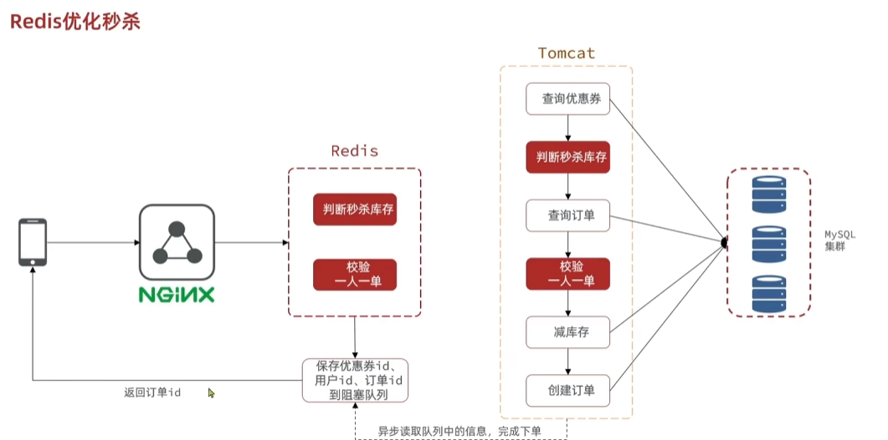


### Redis库存扣减

将库存提前保存在Redis中，在Redis中校验一人一单（运用Set记录id信息）

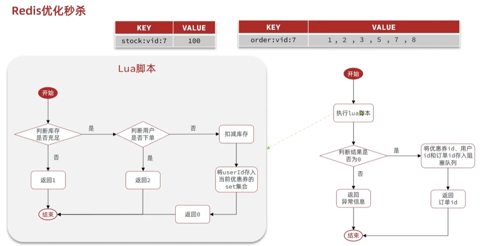

Lua脚本

```lua
-- KEYS[1]: 商品库存key 格式: stock:商品id
-- KEYS[2]: 订单记录Set key 格式: orders:商品id
-- ARGV[1]: 要扣减的库存数量
-- ARGV[2]: 用户id
-- ARGV[3]: 商品id
-- ARGV[4]: 订单记录过期时间(秒)
-- 返回值: 
--   1 表示成功
--   0 表示库存不足
--  -1 表示已经购买过(一人一单限制)
--  -2 表示其他错误

-- 检查用户是否已经购买过该商品
local ordersKey = KEYS[2]
local userId = ARGV[2]
local isMember = redis.call('SISMEMBER', ordersKey, userId)

if isMember == 1 then
    return -1
end

-- 检查库存是否充足
local stockKey = KEYS[1]
local stock = tonumber(redis.call('GET', stockKey))
local num = tonumber(ARGV[1])

if not stock or stock <= 0 then
    return 0
end

-- 扣减库存
local newStock = stock - num
redis.call('SET', stockKey, newStock)

-- 将用户添加到订单Set中(设置过期时间)
redis.call('SADD', ordersKey, userId)
local expireTime = tonumber(ARGV[4])
if expireTime > 0 then
    redis.call('EXPIRE', ordersKey, expireTime)
end

-- 返回成功
return 1
```

读取Lua脚本

```java
@Configuration
public class RedisConfig {
    
    @Bean
    public RedisTemplate<String, Object> redisTemplate(RedisConnectionFactory factory) {
        RedisTemplate<String, Object> template = new RedisTemplate<>();
        template.setConnectionFactory(factory);
        template.setKeySerializer(new StringRedisSerializer());
        template.setValueSerializer(new GenericJackson2JsonRedisSerializer());
        return template;
    }
    
    @Bean
    public DefaultRedisScript<Long> stockDeductionScript() {
        DefaultRedisScript<Long> script = new DefaultRedisScript<>();
        script.setScriptSource(new ResourceScriptSource(new ClassPathResource("scripts/deduct_stock.lua")));
        script.setResultType(Long.class);
        return script;
    }
}
```

```java
@Service
public class StockService {
    
    private final RedisTemplate<String, Object> redisTemplate;
    private final DefaultRedisScript<Long> stockDeductionScript;
    
    public StockService(RedisTemplate<String, Object> redisTemplate, 
                      DefaultRedisScript<Long> stockDeductionScript) {
        this.redisTemplate = redisTemplate;
        this.stockDeductionScript = stockDeductionScript;
    }
    
    public DeductionResult deductStock(String productId, String userId, int quantity, int expireSeconds) {
        List<String> keys = Arrays.asList(
            "stock:" + productId,
            "orders:" + productId
        );
        
        Object[] args = {
            quantity,
            userId,
            productId,
            expireSeconds
        };
        
        Long result = redisTemplate.execute(
            stockDeductionScript,
            new StringRedisSerializer(),
            new GenericToStringSerializer<>(Long.class),
            keys,
            args
        );
        
        if (result == null) {
            return DeductionResult.FAILED;
        }
        
        switch (result.intValue()) {
            case 1: return DeductionResult.SUCCESS;
            case 0: return DeductionResult.NOT_ENOUGH_STOCK;
            case -1: return DeductionResult.ALREADY_ORDERED;
            default: return DeductionResult.FAILED;
        }
    }
    
    public enum DeductionResult {
        SUCCESS("扣减成功"),
        NOT_ENOUGH_STOCK("库存不足"),
        ALREADY_ORDERED("已经购买过"),
        FAILED("操作失败");
        
        private final String message;
        
        DeductionResult(String message) {
            this.message = message;
        }
        
        public String getMessage() {
            return message;
        }
    }
}
```


### 异步处理

我这里觉得使用RabbitMQ会稍微好一点，可以提供更多的确认机制

独立线程异步处理

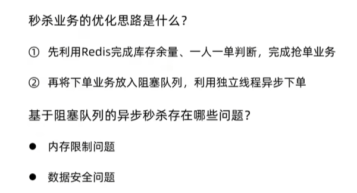


利用Redis实现消息队列

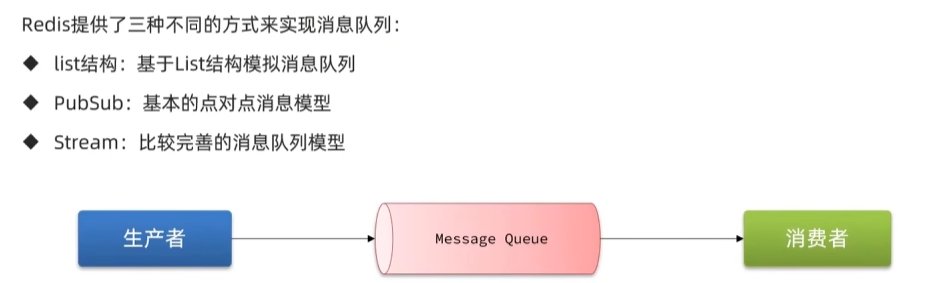

**List实现**

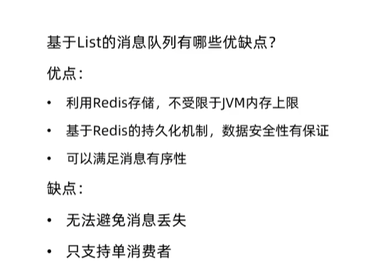

**PubSub**

消息队列实现

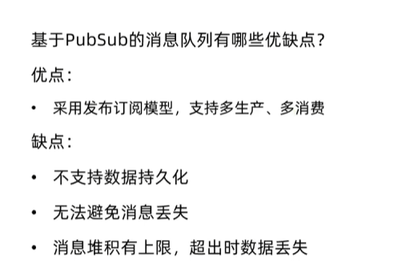

**Stream实现**

发送消息

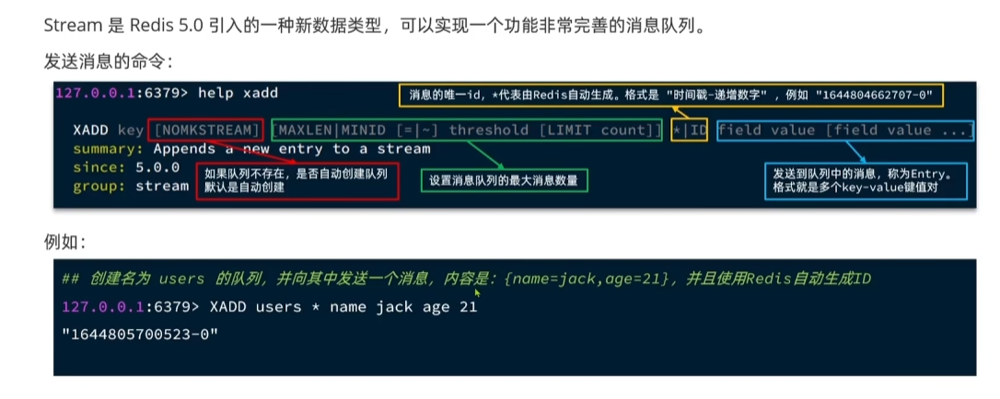

读取消息

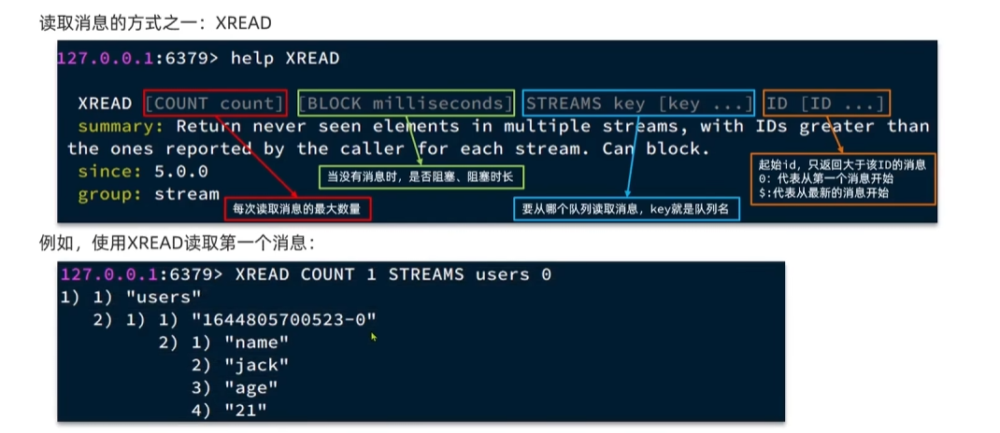

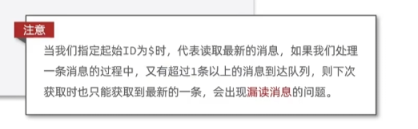

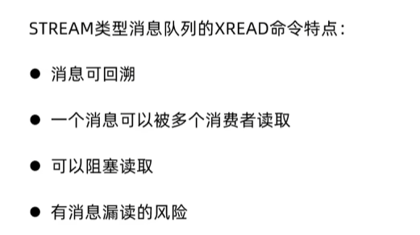


**消费者组**

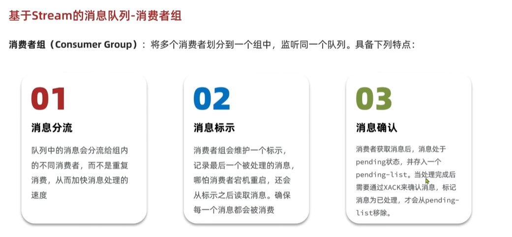

创建/修改消费者组

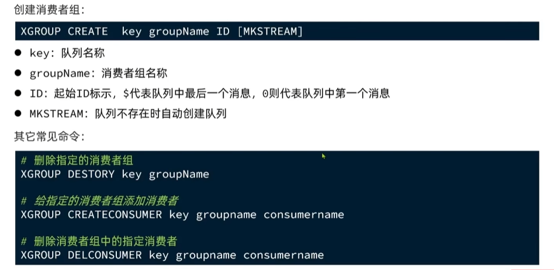

从消费者组中读取信息

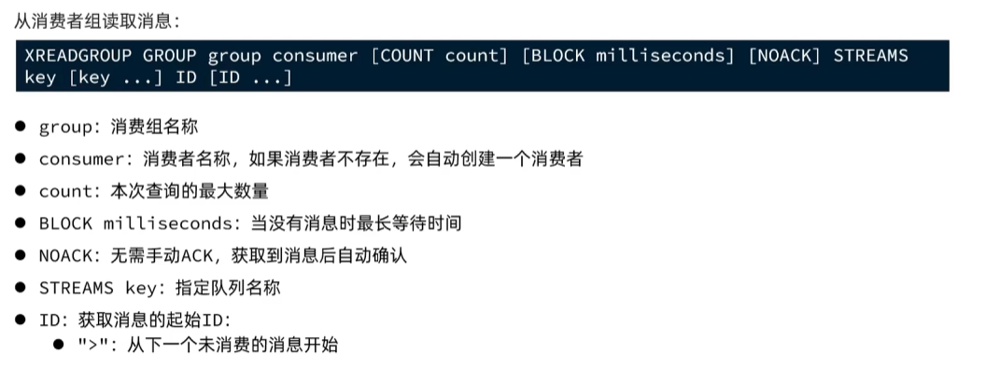

消费者优点

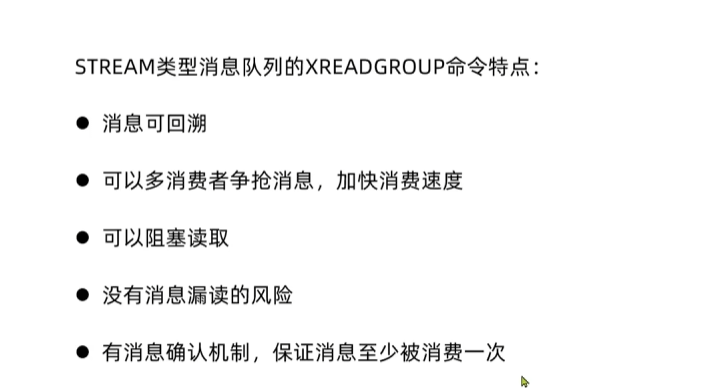

**总结**

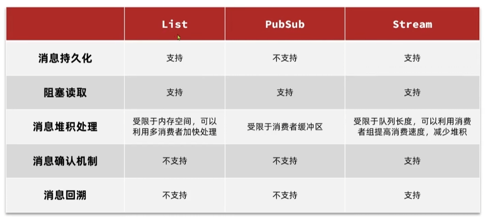


## 持久化

### RDB

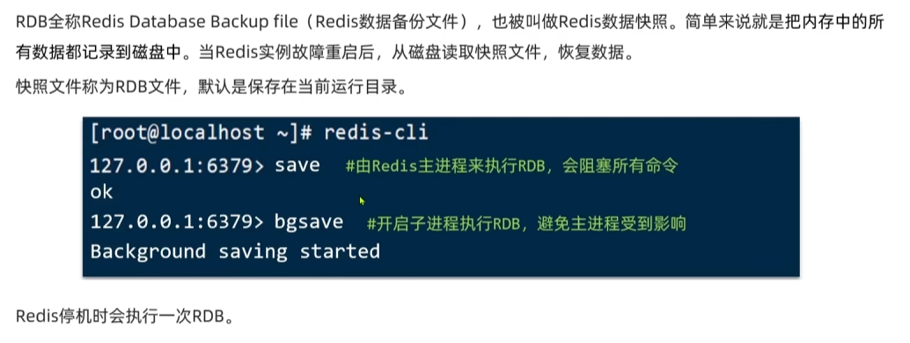

在Redis内部有触发RDB机制

在900s内如果有一个key被修改、300内修改10key，60s内修改10000，就会执行bgsava

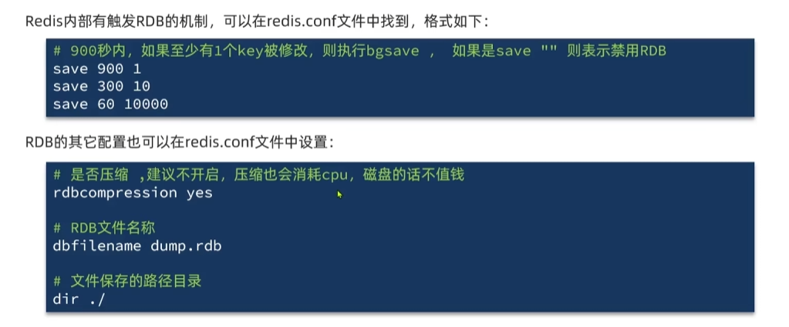

**原理**

bgsave开始时会fork主进程得到子进程，子进程共享主进程的内存数据，完成fork后读取内存数据并写入RDB文件

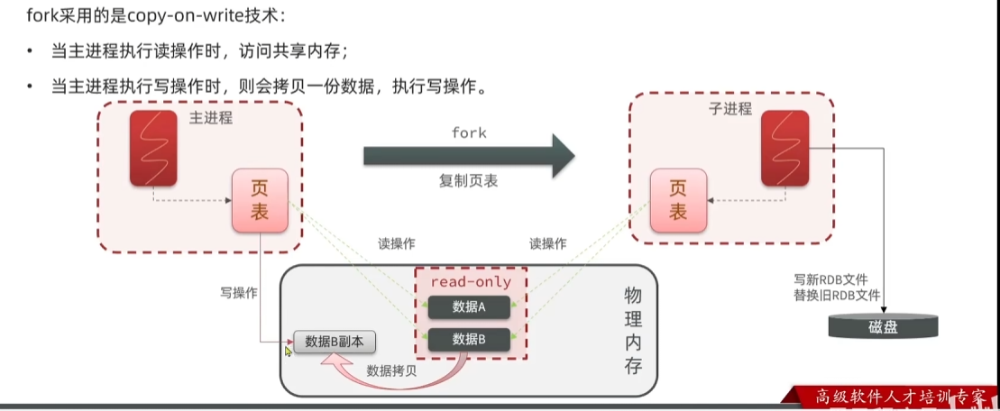

由于两次RDB持久化之间存在时间间隔，可能导致数据的缺失，我们还需要AOF作为补充


### AOF

追加文件，Redis处理的每一个写命令都会被记录在AOF文件中，可以看作是命令的日志文件

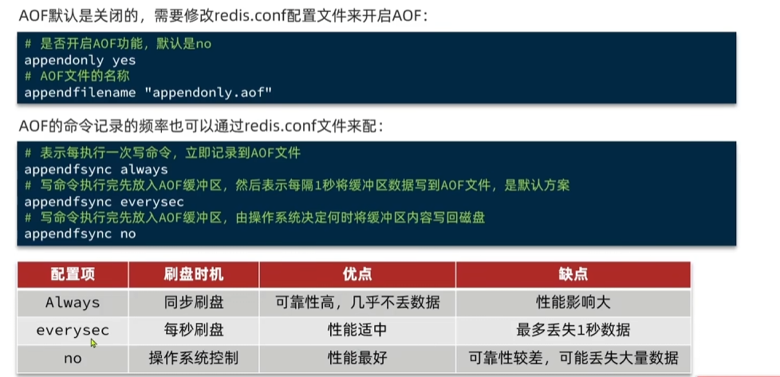

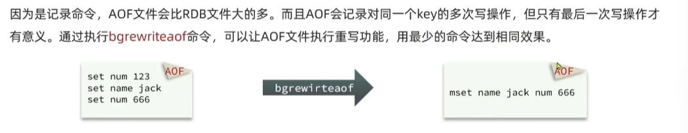

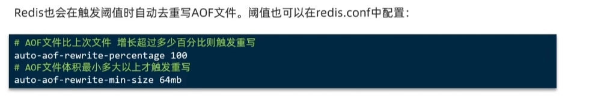


**优缺点**

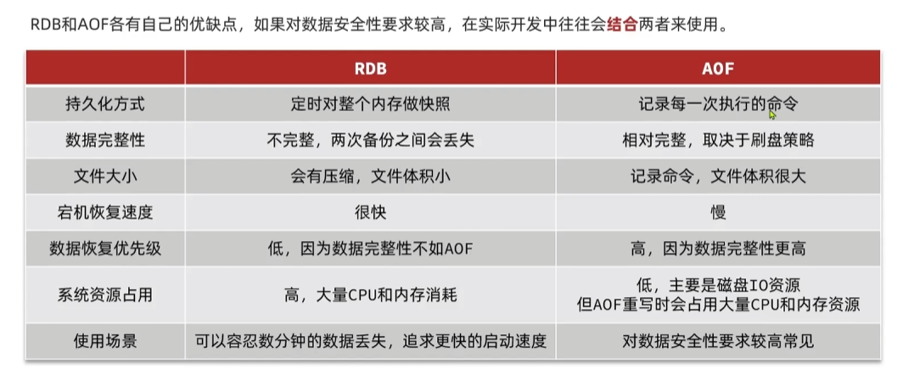


### 集群

**全量同步**

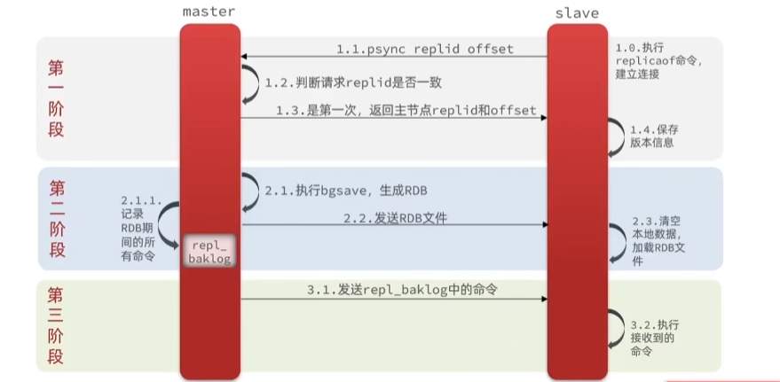

**增量同步**

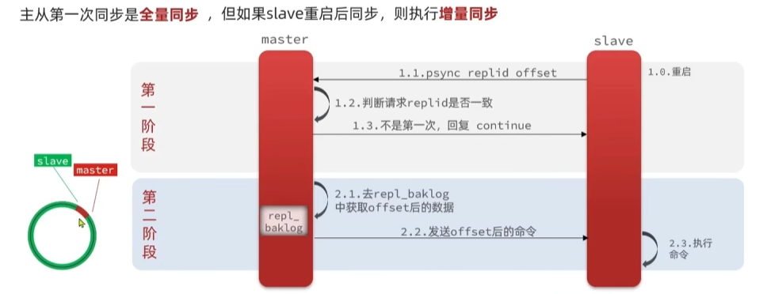

### 哨兵

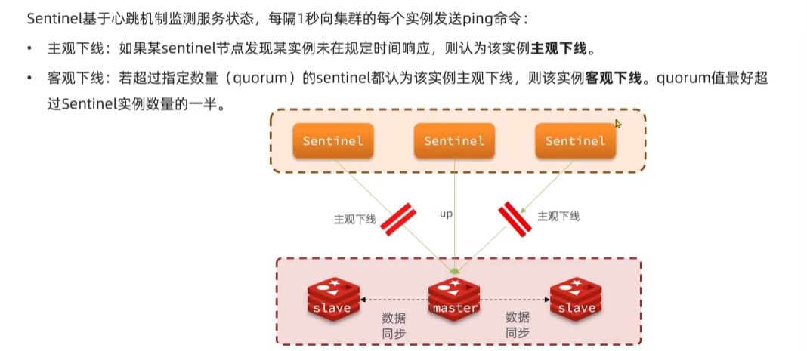

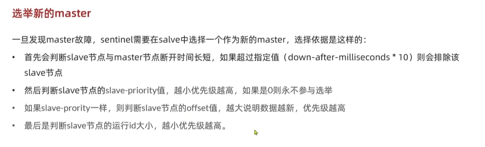

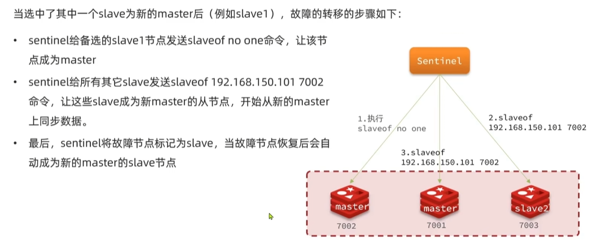


### 分片集群

客户端可以请求任意的节点，路由到正确的redis中

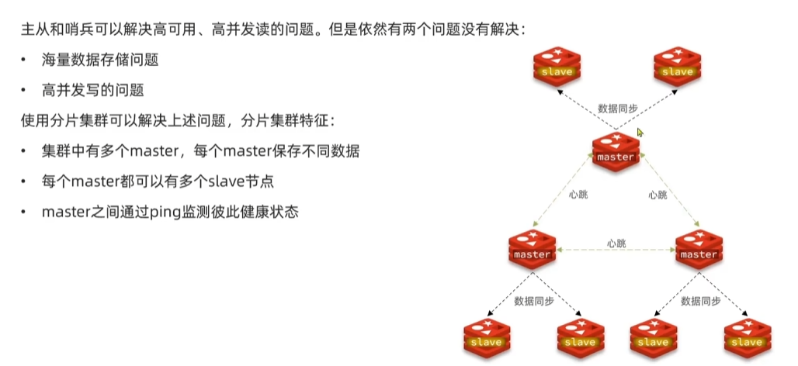

散列插槽

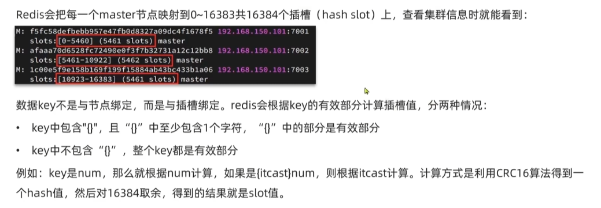

:::note

因为我们后续可能会拓展节点，或者节点有可能会下线，假如key绑定的是master节点，数据就要频繁的解析变更，加上槽就可以解耦，变化槽和节点之间的映射关系即可

:::

| 特性         | 槽机制             | 传统哈希分片         |
| :----------- | :----------------- | :------------------- |
| 扩展性       | 动态迁移槽即可扩容 | 需要重新哈希所有数据 |
| 数据均衡     | 预先分配保证均衡   | 依赖哈希函数质量     |
| 故障恢复     | 只需转移槽         | 需要转移实际数据     |
| 客户端复杂度 | 只需维护槽映射表   | 需要知道完整分片规则 |

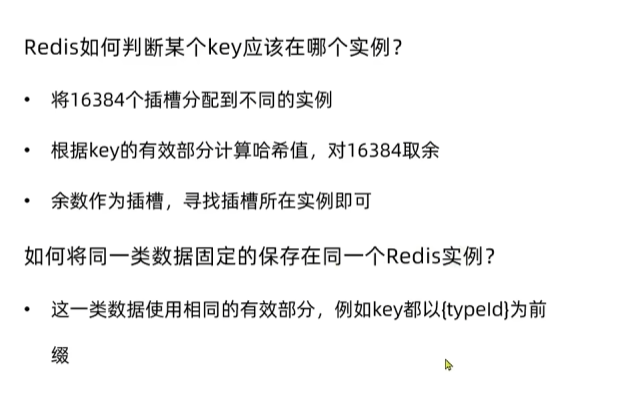
