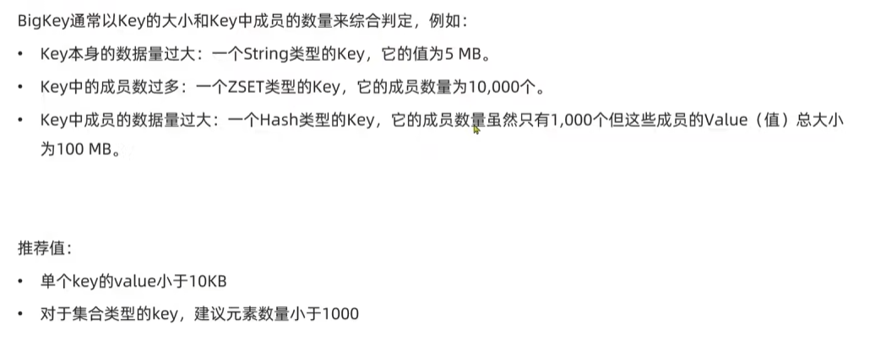
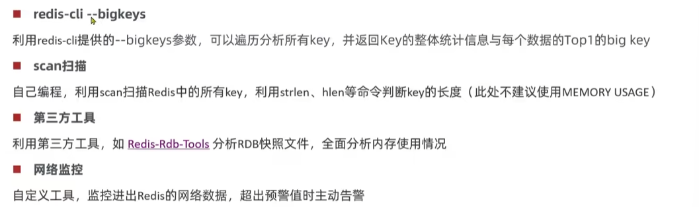
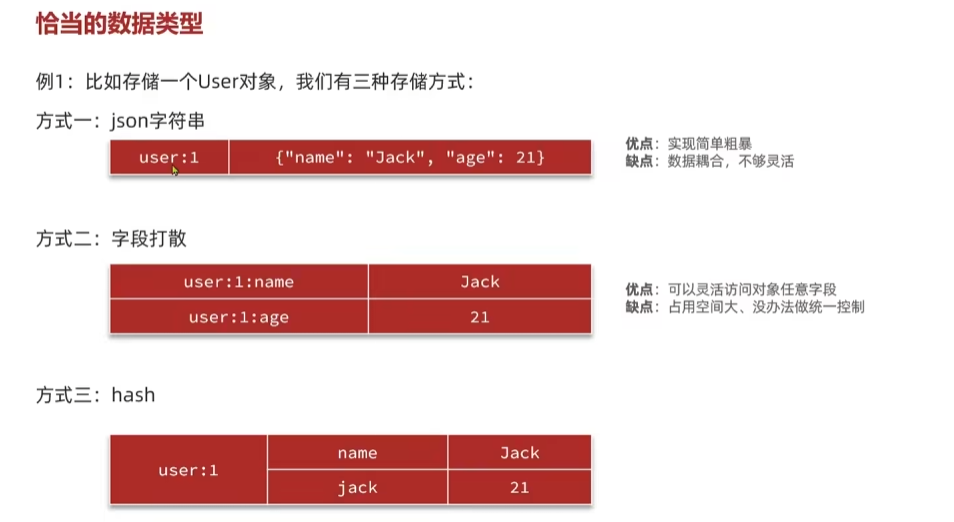
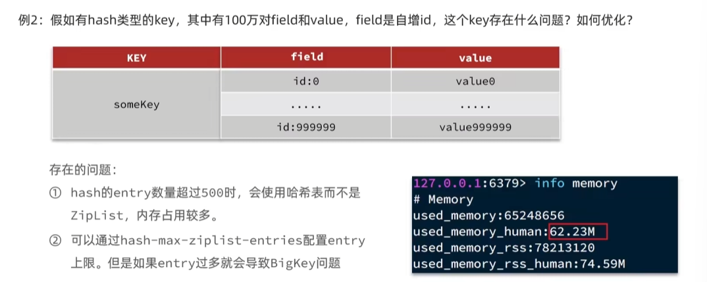
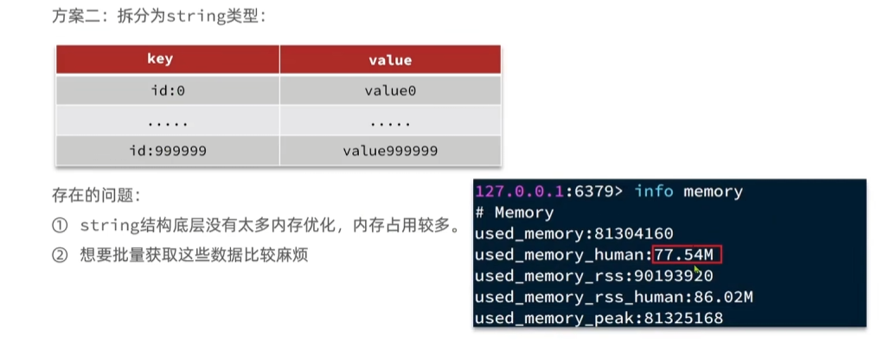
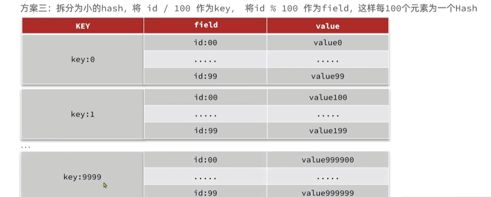
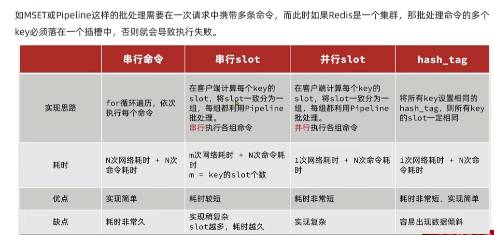
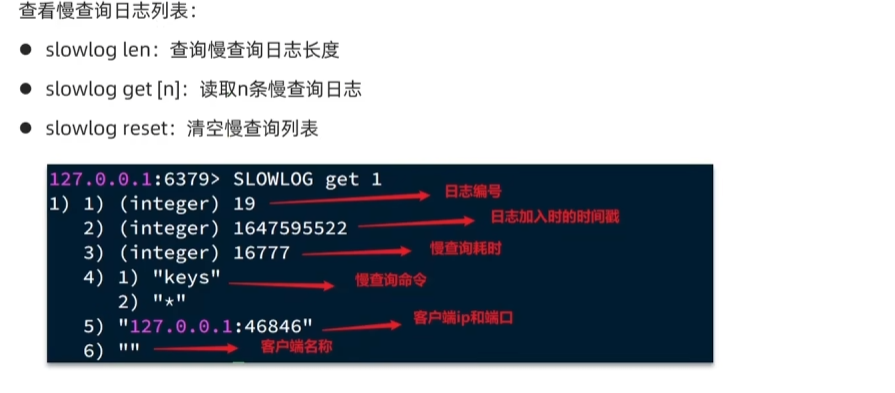
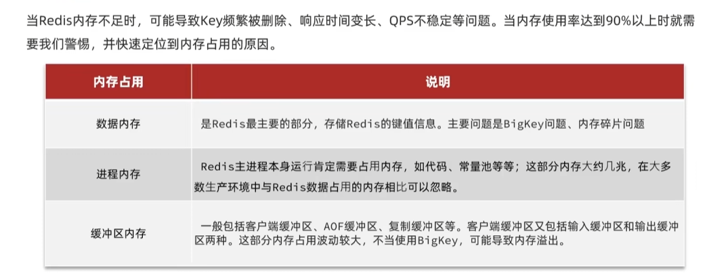
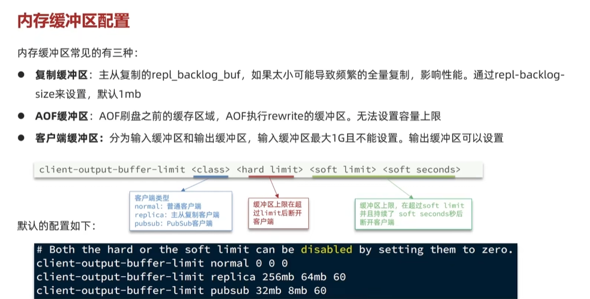

# Redis笔记

## 键值设计

基本格式：[业务名称]:[数据名]:[id]

长度不要超过44字节，不要包含特殊字符

```
例如登陆业务： login:user:10
```

好处：1.可读性强，2.避免key冲突，3.方便管理（在Redis客户端按照文件名统一存储）4.key是String类型，底层包含int、embstr、raw三种，其中embstr在小于44字节的时候采用连续内存空间，内存占用更小


### Big Key



网络阻塞：少量的QPS接可能占满带宽，导致Redis实例，乃至物理机变慢

数据倾斜：Big Key所在的Redis实力内存使用率远超其他实例，导致数据分片的内存资源无法达到均衡

Redis阻塞：对于元素较多的hash、list、zset的运算耗时多，主线程被阻塞

CPU压力：使CPU使用率飙升，影响Redis或者本机




**解决方式**

**删除**

Big Key占用内存耗时多，删除需要耗费很长时间，直接删会出现主线程被阻塞，unlink指令可以异步的删除Big Key，避免阻塞

或者不支持unlink的版本可以使用hscan/zscan/sscan迭代遍历集合，依次删除Big Key即可


### 数据类型



**存储参数设置**

如果出现了Big Key可以优化存储结构



**拆分key**

第一种：按照字段拆分为不同的key value



第二种：拆分为小hash，将id / 100为key，将id % 100作为field，这样每100个元素为一个Hash




## 批处理

处理方案


集群下的批处理方案




## 服务端优化

**持久化策略**


**慢查询**





**安全**


## 内存配置




