# Redis笔记

## 缓存

缓存是数据的缓存区，是存储数据的地方，读写性能高，对于后端可以降低后端的负载，降低响应时间。

也带来了一些数据一致性的成本、代码维护成本、运维成本


以下是代码实现，随便写了一个商店的id查询

```java
@Autowired
ShopMapper shopMapper;
public Result<Shop> getShopById(int id) {
    String shopString = stringRedisTemplate.opsForValue().get(RedisCache.SHOP_CACHE_NAME + id);
    Shop shop;
    if(shopString != null) {
        shop = JSON.parseObject(shopString, Shop.class);
    } else {
        shop = shopMapper.getShopById(id);
        if(shop != null) {
            stringRedisTemplate.opsForValue().set(RedisCache.SHOP_CACHE_NAME + id, JSON.toJSONString(shop), RedisTTL.REDIS_CACHE_TTL_MIN, TimeUnit.MINUTES);
        }
    }
    return Result.success(shop);
}
```

**主动更新缓存策略**


**如何保证缓存和数据库的一致性**


**问题：先更新数据库还是先删除缓存**


在更新数据库后删除缓存，这里用了事务进行控制，防止由于redis宕机，缓存没有删去而导致到数据库不一致（如果宕机在事务的控制下数据库数据回滚）

```java
@Transactional
public Result<String> updateShop(Shop shop) {
    boolean b = shopMapper.updateShop(shop);
    stringRedisTemplate.delete(RedisCache.SHOP_CACHE_NAME + shop.getId());
    return Result.success(b ? "success" : "fail");
}
```


## 缓存常见问题

### 缓存穿透

指的是请求的数据在缓存和数据库都不存在，这一些请求都会被打到数据库

解决方式：缓存空对象、布隆过滤器


**缓存空对象**

缓存空对象实现起来非常简单，把之前的判断SQL查询是否为空的条件添加一个较短的TTL NULL缓存即可

```java
@Autowired
ShopMapper shopMapper;
public Result<Shop> getShopById(int id) {
    String shopString = stringRedisTemplate.opsForValue().get(RedisCache.SHOP_CACHE_NAME + id);
    Shop shop;
    if(shopString != null) {
        shop = JSON.parseObject(shopString, Shop.class);
    } else {
        shop = shopMapper.getShopById(id);
        if(shop != null) {
            stringRedisTemplate.opsForValue().set(RedisCache.SHOP_CACHE_NAME + id, JSON.toJSONString(shop),
                    RedisTTL.REDIS_CACHE_TTL_MIN, TimeUnit.MINUTES);
        } else {
            stringRedisTemplate.opsForValue().set(RedisCache.SHOP_CACHE_NAME + id, JSON.toJSONString(shop),
                    RedisTTL.REDIS_CACHE_NULL_TTL_MIN, TimeUnit.MINUTES);
        }
    }
    return Result.success(shop);
}
```

缺点：

会造成内存的浪费，缓存了大量null的值，这里可以设置更短的TTL做一个优化

会造成短期的不一致，如果后续插入了一个之前缓存过的NULL的id数据，查到的会是NULL结果，我们可以在插入的时候删除缓存来解决这个问题


**布隆过滤**

在Redis层和请求之间加上一个中间层，对于不存在的数据请求直接拒绝，如果存在（可能误报，但是也减少了请求数据库的次数）则继续访问

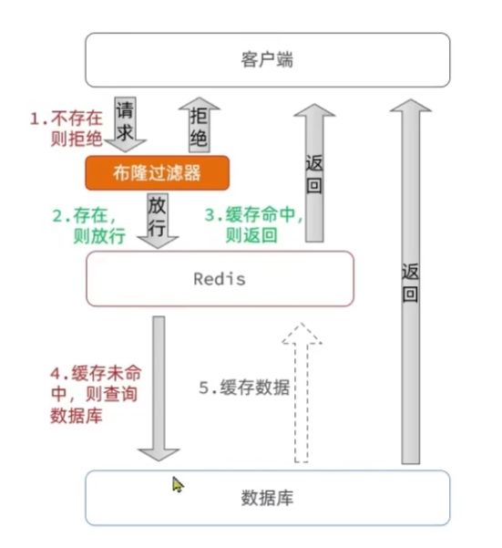

布隆过滤器的实现也较为复杂，我们在实际使用的时候一般用的是缓存空对象的方式

还有一些其他解决或改善缓存穿透的方式

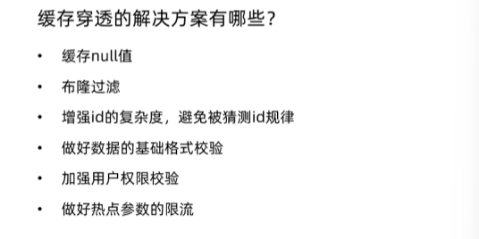


### 缓存雪崩

指的是同一时间缓存大量的key同时失效，或者Redis服务宕机导致大量请求打到数据库，给数据库造成巨大压力

常见的解决方案：给不同的key的TTL添加随机值，使用Redis集群提高可用性，给缓存业务添加降级限流策略，给业务添加多级缓存

最简单的就是TTL加上随机值，在过期时间加上Random

```java
stringRedisTemplate.opsForValue().set(RedisCache.SHOP_CACHE_NAME + id, JSON.toJSONString(shop),
        RedisTTL.REDIS_CACHE_TTL_MIN + (int)(Math.random() * 10), TimeUnit.MINUTES);
```


### 缓存击穿

也称为热点key问题，是一个高并发访问并且缓存重建业务较为复杂的key突然失效，无数请求访问会给数据库带来巨大压力

常见的解决方案如下：互斥锁、逻辑过期

**互斥锁**

优点：没有额外的内存消耗，保证一致性，实现简单

缺点：线程需要等待，性能较差，可能会有死锁风险

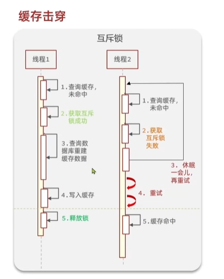

我们可以使用setnx来作为锁，当第一个setnx lock 1后返回1，后续的setnx lock ...会返回0，我们再执行完毕后释放锁即可del lock，在设置锁的时候加上一个10s的有效期，避免死锁

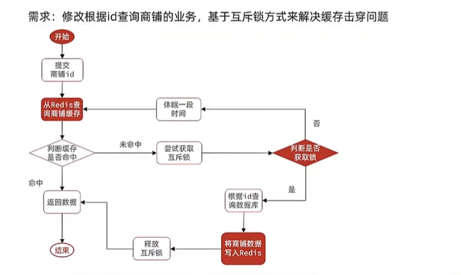

加锁解锁的方法

```java
private boolean tryLock(String key) {
    Boolean flag = stringRedisTemplate.opsForValue().setIfAbsent(key, "1", 10, TimeUnit.SECONDS);
    return flag != null && flag;
}

private void unlock(String key) {
    stringRedisTemplate.delete(key);
}
```

```java
    private static final int MAX_RETRY = 3;
    private static final int BASE_SLEEP_MS = 50;
    public Result<Shop> getShopById(int id) {
        String cacheKey = RedisCache.SHOP_CACHE_NAME + id;
        String lockKey = "shop:lock:" + id;

        // 1. 先查缓存
        String shopJson = stringRedisTemplate.opsForValue().get(cacheKey);
        if (shopJson != null) {
            return "null".equals(shopJson) ?
                    Result.success(null) :
                    Result.success(JSON.parseObject(shopJson, Shop.class));
        }
        // 2. 获取锁
        boolean locked = false;
        try {
            int retryCount = 0;
            while (!(locked = tryLock(lockKey)) && retryCount++ < MAX_RETRY) {
                Thread.sleep(BASE_SLEEP_MS * (1 + retryCount));
            }

            if (!locked) {
                return Result.error(500, "系统繁忙，请稍后再试");
            }
            // 双重检查缓存
            shopJson = stringRedisTemplate.opsForValue().get(cacheKey);
            if (shopJson != null) {
                return "null".equals(shopJson) ?
                        Result.success(null) :
                        Result.success(JSON.parseObject(shopJson, Shop.class));
            }
            // 3. 查询数据库
            Shop shop = shopMapper.getShopById(id);
            // 4. 写入缓存
            if (shop != null) {
                stringRedisTemplate.opsForValue().set(
                        cacheKey,
                        JSON.toJSONString(shop),
                        RedisTTL.REDIS_CACHE_TTL_MIN + ThreadLocalRandom.current().nextInt(30),  // 更大的随机范围
                        TimeUnit.MINUTES
                );
            } else {
                stringRedisTemplate.opsForValue().set(
                        cacheKey,
                        "null",
                        RedisTTL.REDIS_CACHE_NULL_TTL_MIN + ThreadLocalRandom.current().nextInt(10),
                        TimeUnit.MINUTES
                );
            }
            return Result.success(shop);
        } catch (InterruptedException e) {
            Thread.currentThread().interrupt();
            throw new RuntimeException("查询中断", e);
        } catch (Exception e) {
            throw new RuntimeException("查询异常", e);
        } finally {
            if (locked) {
                try {
                    unlock(lockKey);
                } catch (Exception e) {
                    log.error("释放锁失败", e);
                }
            }
        }
    }
```


**逻辑过期**

优点：线程无需等待如果没获取到锁，返回旧数据，性能好

缺点：不保证一致性，有额外的内存消耗（逻辑过期字段），实现复杂

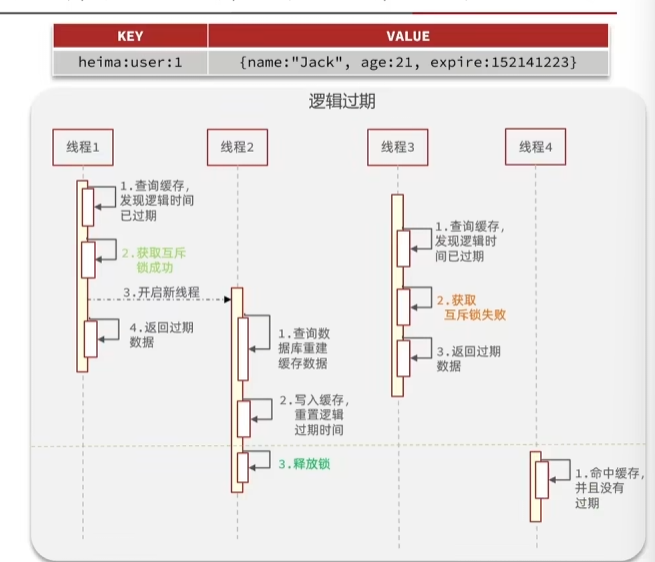

业务流程

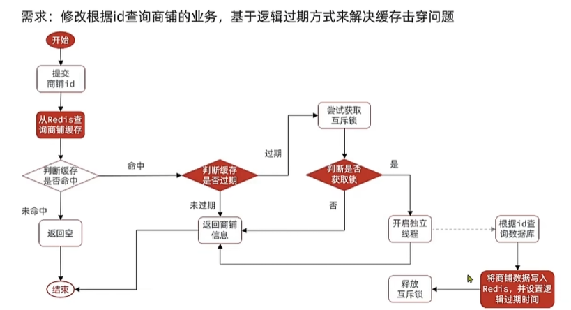

设计一个RedisData，给其添加expireTime逻辑超时字段

```java
@Data
public class RedisData {
    private LocalDateTime expireTime;
    private Object data;
}
```

```java
private static final ExecutorService CACHE_REBUILD_EXECUTOR = Executors.newFixedThreadPool(10);
public Result<Shop> getShopByIdLogic(int id) {
    String logic = "shop:logic:" + id;
    String lockKey = "shop:lock:" + id;
    String shopJson = stringRedisTemplate.opsForValue().get(logic);
    if (shopJson == null) {
        return Result.error(404, "没有找到指定热点数据");
    }
    RedisData data = JSON.parseObject(shopJson, RedisData.class);
    LocalDateTime expireTime = data.getExpireTime();
    Shop shop = (Shop) data.getData();
    if(expireTime.isAfter(LocalDateTime.now())) {
        return Result.success(shop);
    }
    if(tryLock(lockKey)) {
        //开启独立线程异步写入数据至Redis缓存，设置新的过期时间，最后释放互斥锁
        CACHE_REBUILD_EXECUTOR.submit(() -> {
            try {
                RedisData newData = JSON.parseObject(shopJson, RedisData.class);
                Shop newShop = shopMapper.getShopById(id);
                newData.setData(newShop);
                newData.setExpireTime(LocalDateTime.now());
                stringRedisTemplate.opsForValue().set(logic, JSON.toJSONString(newData));
            } finally {
                unlock(lockKey);
            }
        });
    }
    return Result.success(shop);
}
```


## 秒杀实现

### 全局ID生成器

当用户订单的ID自增插入，就会存在一些问题：

1.id规律性太明显

2.受单表数据量的限制

全局ID生成器：是一种在分布式系统下用来生成全局唯一ID的工具，包括了一下的特性：1.唯一性，2.高可用，3.高性能，4.递增性，5.安全性

Redis的INCR自增性可以满足1、2、3、4，而安全性，我们可以不直接使用Redis的自增数值，而是拼接一些其他的信息。

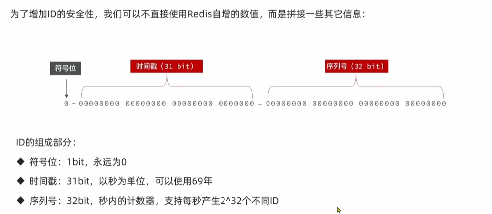

```java
@Component
public class RedisIdWorker {
    @Autowired
    private StringRedisTemplate stringRedisTemplate;
    private static final long BEGIN_TIMESTAMP = 1735689600L;

    public long nextId(String keyPrefix) {
        //生成时间戳
        LocalDateTime time = LocalDateTime.now();
        long second = time.toEpochSecond(ZoneOffset.UTC) - BEGIN_TIMESTAMP;

        //生成序列号
        String date = time.format(DateTimeFormatter.ofPattern("yyyy:MM:dd"));
        long count = stringRedisTemplate.opsForValue().increment("icr:" + keyPrefix + ":" + date);
        return second << 32 | count;
    }

    public static void main(String[] args) {
        LocalDateTime time = LocalDateTime.of(2025, 1, 1, 0, 0, 0);
        long second = time.toEpochSecond(ZoneOffset.UTC);
        System.out.println(second);
    }
}
```


### 实现秒杀功能

下单需要判断两点：

1.秒杀是否满足时间要求

2.库存是否充足，不足则无法下单

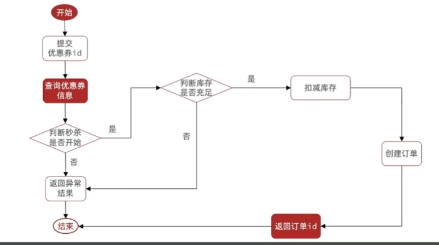

```java
@Override
public Result<VoucherOrder> buyAVoucher(int id) {
    Voucher voucher = voucherMapper.selectById(id);
    if(voucher.getCount() <= 0) {
        return Result.error(400, "库存不足");
    }
    UpdateWrapper<Voucher> wrapper = new UpdateWrapper<>();
    wrapper.setSql("count = count - 1")       // 让数据库直接计算 count - 1
            .eq("id", id);                       // 限定更新的记录
    int updated = voucherMapper.update(null, wrapper);
    //        voucherService.update().setSql("count = count - 1").eq("id", id).update();

    VoucherOrder voucherOrder = new VoucherOrder();
    voucherOrder.setId(redisIdWorker.nextId("order:voucher:"));
    voucherOrder.setUserId(1L);
    voucherOrder.setVoucherId(Long.valueOf(voucher.getId()));
    voucherOrder.setPayType(1);
    voucherOrder.setStatus(1);
    voucherOrder.setCreateTime(LocalDateTime.now());
    voucherOrder.setUpdateTime(LocalDateTime.now());

    voucherOrderMapper.insert(voucherOrder);
    return Result.success(voucherOrder);
}
```


### 超卖问题分析

当我们高并发的情况下是否逻辑也是正确的

我们通过JMeter做压力测试，发现发生了超卖的情况

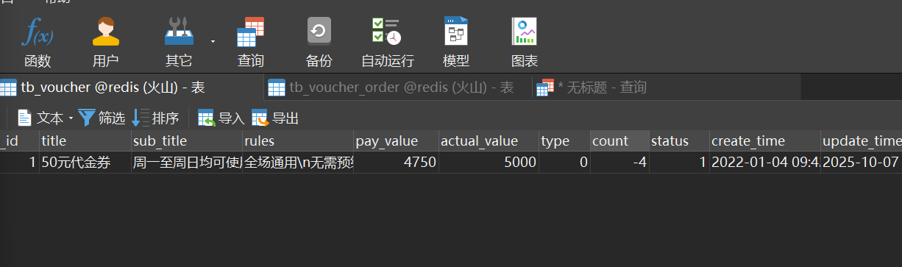

这是由于高并发的情况下，多个线程会同时查询count>0的情况，但是事实上我们的剩余数量并不支持这么多个线程消费

我们对于这样的问题有两种解决方案

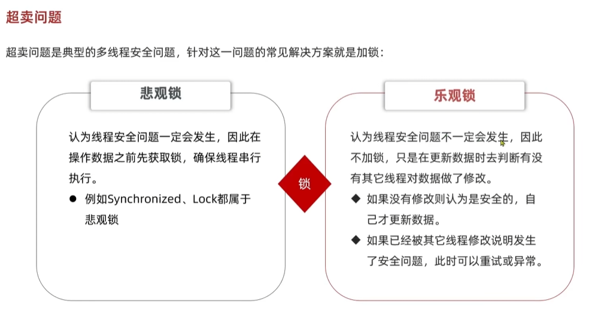

**悲观锁解决方式**

利用select by id for update添加排他锁

```java
@Transactional
    @Override
    public Result<VoucherOrder> buyAVoucher(int id) {
//        Voucher voucher = voucherMapper.selectById(id);
        //用for update查询替代
        Voucher voucher = voucherMapper.selectByIdForUpdate(id);
        if(voucher.getCount() <= 0) {
            return Result.error(400, "库存不足");
        }
        UpdateWrapper<Voucher> wrapper = new UpdateWrapper<>();
        wrapper.setSql("count = count - 1")       // 让数据库直接计算 count - 1
                .eq("id", id);                       // 限定更新的记录
        int updated = voucherMapper.update(null, wrapper);
        //        voucherService.update().setSql("count = count - 1").eq("id", id).update();

        VoucherOrder voucherOrder = new VoucherOrder();
        voucherOrder.setId(redisIdWorker.nextId("order:voucher:"));
        voucherOrder.setUserId(1L);
        voucherOrder.setVoucherId(Long.valueOf(voucher.getId()));
        voucherOrder.setPayType(1);
        voucherOrder.setStatus(1);
        voucherOrder.setCreateTime(LocalDateTime.now());
        voucherOrder.setUpdateTime(LocalDateTime.now());

        voucherOrderMapper.insert(voucherOrder);
        return Result.success(voucherOrder);
    }
```


**乐观锁解决方案**

版本号法：在修改的时候查看之前查询版本号是否被修改，如果修改则不执行语句顺便更新版本号

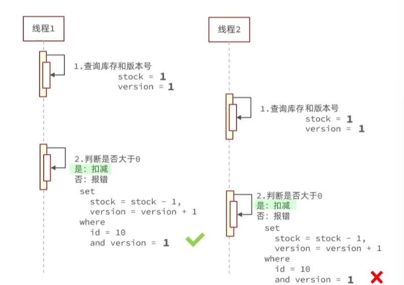

CAS法：

我们也可以用这里都库存代替version，判断修改时候的库存是否和之前的相等

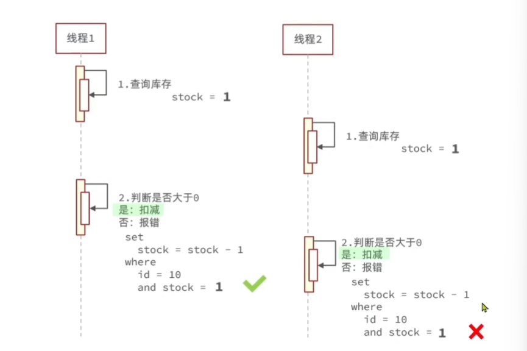

但是乐观锁有一些弊端，容易在高并发的情况下发生冲突，例如1000张票100个人同时抢，理论上都可以抢到，但是由于判断发生了修改，只会有部分的人抢到票，剩余的部分失败或者需要重试

对于秒票的业务而言，较为特殊，我们可以修改的时候判断count>0，如果count>0就允许买票

```java
@Override
    public Result<VoucherOrder> buyAVoucher(int id) {
        Voucher voucher = voucherMapper.selectById(id);
//        Voucher voucher = voucherMapper.selectByIdForUpdate(id);
        if(voucher.getCount() <= 0) {
            return Result.error(400, "库存不足");
        }
        UpdateWrapper<Voucher> wrapper = new UpdateWrapper<>();
        wrapper.setSql("count = count - 1")       // 让数据库直接计算 count - 1
                .eq("id", id)
                .gt("count", 0);
        int updated = voucherMapper.update(null, wrapper);
        //        voucherService.update().setSql("count = count - 1").eq("id", id).update();
        if(updated == 0) {
            return Result.error(400, "库存不足");
        }
        VoucherOrder voucherOrder = new VoucherOrder();
        voucherOrder.setId(redisIdWorker.nextId("order:voucher:"));
        voucherOrder.setUserId(1L);
        voucherOrder.setVoucherId(Long.valueOf(voucher.getId()));
        voucherOrder.setPayType(1);
        voucherOrder.setStatus(1);
        voucherOrder.setCreateTime(LocalDateTime.now());
        voucherOrder.setUpdateTime(LocalDateTime.now());

        voucherOrderMapper.insert(voucherOrder);
        return Result.success(voucherOrder);
    }
```


### 一人一单

我们要实现一人一单我们就需要在创建订单的前面加上对于订单表中是否有对应优惠卷并且userid对应的数据，有则返回错误，但是和之前一样我们需要进行线程安全的处理，这里的解决思路是使用悲观锁，（乐观锁没有办法处理查的操作）将对应userid上锁，在所的范围内取进行存在性的查询，保证了对应userid的原子性

我们在使用synchronized关键字只能在单台服务器上进行处理，如果拓展到多台服务器也会有线程安全问题，之后的内容由于需要用到分布式系统的处理，目前没有接触过在多台服务器上部署项目的经验，我想先进行Docker和Nginx的学习后再进行Redis进度的推进。
