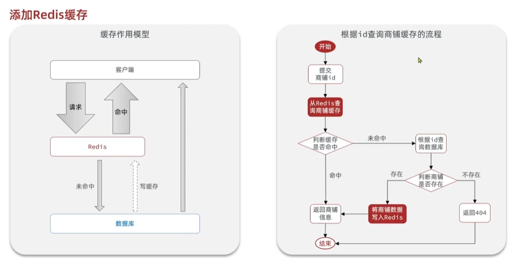
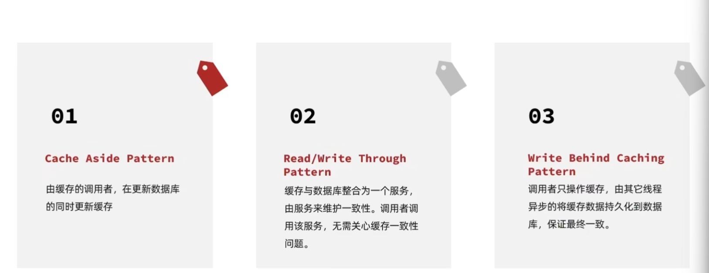
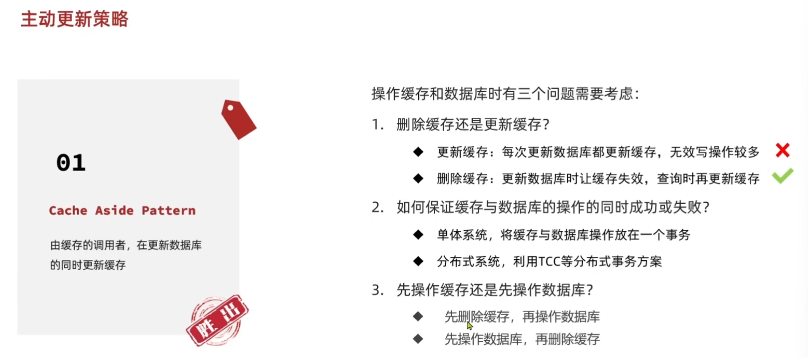
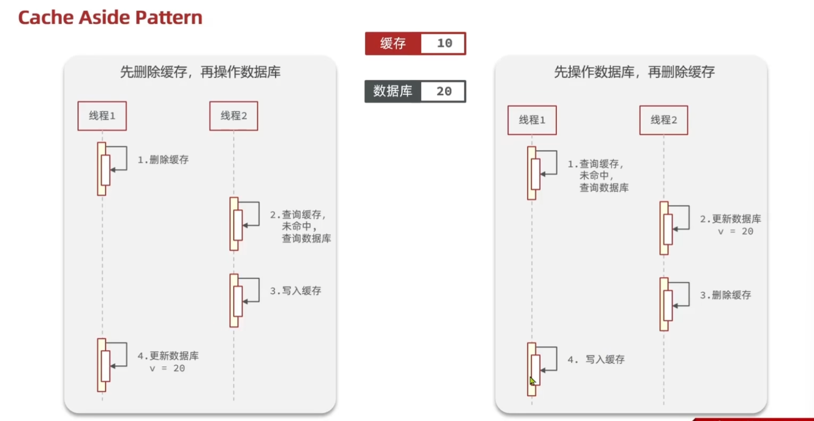

# Redis笔记

## 缓存

缓存是数据的缓存区，是存储数据的地方，读写性能高，对于后端可以降低后端的负载，降低响应时间。

也带来了一些数据一致性的成本、代码维护成本、运维成本



以下是代码实现，随便写了一个

```java
public Result<User> getUserByPhone(String phone) {
        User user;
        String s = stringRedisTemplate.opsForValue().get("getUser:" + phone);
        if (s == null) {
            user = userMapper.getUserByPhone(phone);
        } else {
            user = JSON.parseObject(s, User.class);
        }
        if (user == null) {
           return Result.error(404, "不存在用户");
        }
        stringRedisTemplate.opsForValue().set("getUser:" + phone, JSON.toJSONString(user), 10, TimeUnit.MINUTES);
        return Result.success(user);
    }
```


**主动更新缓存策略**




**如何保证缓存和数据库的一致性**




**问题：先更新数据库还是先删除缓存**


