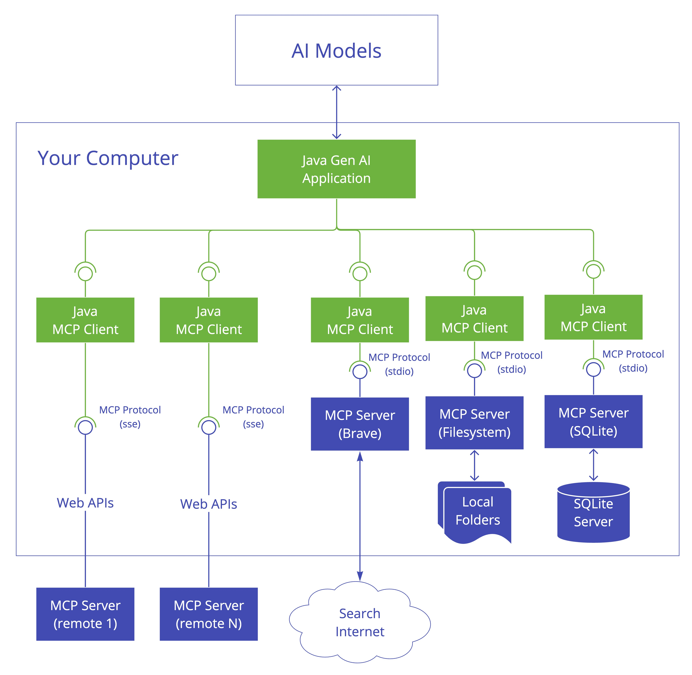
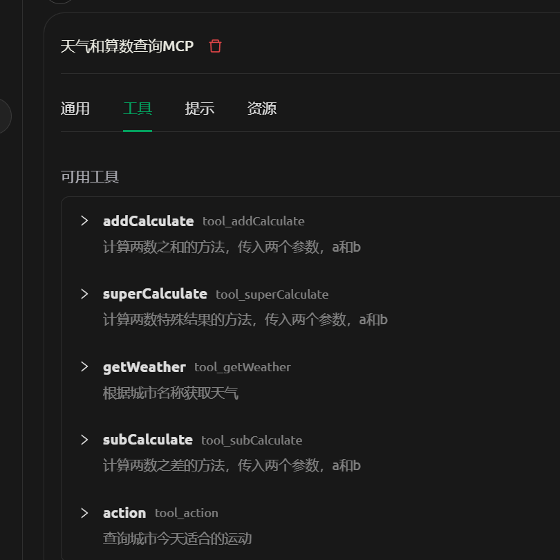
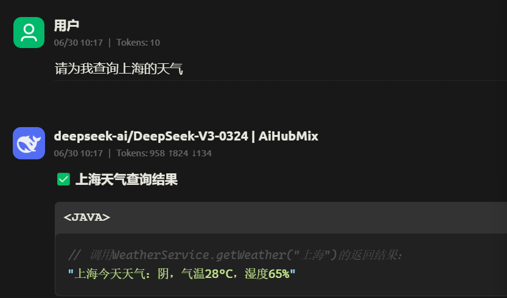

# SpringAI笔记

## MCP

模型上下文协议

是一种标准化协议，使 AI 模型能以结构化方式与外部工具及资源交互。它支持多种传输机制，以适应不同环境的灵活性需求。



[MCP Java SDK](https://modelcontextprotocol.io/sdk/java) 提供 MCP 的 Java 实现，支持通过同步和异步通信模式与 AI 模型及工具进行标准化交互。

**Spring AI MCP** 通过集成 Spring Boot 扩展了 MCP Java SDK，同时提供 [客户端](https://springdoc.cn/spring-ai/api/mcp/mcp-client-boot-starter-docs.html) 和 [服务端](https://springdoc.cn/spring-ai/api/mcp/mcp-server-boot-starter-docs.html) Starter。使用 [Spring Initializer](https://start.springboot.io/)可快速构建支持 MCP 的 AI 应用。


## MCPService

### 引入相关依赖

引入仓库依赖

```html
<repositories>
    <repository>
       <id>spring-snapshots</id>
       <name>Spring Snapshots</name>
       <url>https://repo.spring.io/snapshot</url>
       <releases>
          <enabled>false</enabled>
       </releases>
    </repository>
    <repository>
       <name>Central Portal Snapshots</name>
       <id>central-portal-snapshots</id>
       <url>https://central.sonatype.com/repository/maven-snapshots/</url>
       <releases>
          <enabled>false</enabled>
       </releases>
       <snapshots>
          <enabled>true</enabled>
       </snapshots>
    </repository>
</repositories>
```

引入MCP Service相关依赖

```html
<dependency>
    <groupId>org.springframework.ai</groupId>
    <artifactId>spring-ai-starter-mcp-server-webmvc</artifactId>
</dependency>
```

```html
<dependencyManagement>
    <dependencies>
       <dependency>
          <groupId>org.springframework.ai</groupId>
          <artifactId>spring-ai-bom</artifactId>
          <version>1.0.0-SNAPSHOT</version>
          <type>pom</type>
          <scope>import</scope>
       </dependency>
    </dependencies>
</dependencyManagement>
```


Tool注解表示MCP服务方法

```java
@Service
public class WeatherService {
    @Tool(description = "根据城市名称获取天气")
    public String getWeather(@ToolParam(description = "城市名称") String cityName) {
        if(cityName == null) {
            return "城市名称不能为空";
        }
        if("北京".equals(cityName)) {
            return "北京今天天气：晴，气温25°C，空气质量良";
        }
        if("上海".equals(cityName)) {
            return "上海今天天气：阴，气温28°C，湿度65%";
        }
        return "暂不支持该城市查询，当前可查询：北京、上海";
    }

    @Tool(description = "查询城市今天适合的运动")
    public String action(@ToolParam(description = "城市名称") String cityName) {
        if("北京".equals(cityName)) {
            return "北京今天天气：空气质量良，适合出门运动";
        }
        if("上海".equals(cityName)) {
            return "上海今天天气：阴，适合室内学习";
        }
        return "暂不支持该城市查询，当前可查询：北京、上海";
    }
}
```

使用Bean注解注册ToolCallbackProvider

```java
@Configuration
public class MCPServiceConfig {
    @Bean
    public ToolCallbackProvider weatherTools(WeatherService weatherService) {
        return MethodToolCallbackProvider.builder().toolObjects(weatherService).build();
    }
}
```


注册的服务




查询结果调用注册的MCP方法




## 记忆对话

上下文对话的作用就是让AI具有记忆力，在快速入门和流式对话中，我们是通过一种单一的输入输出方式进行调用的，这种调用方式无法让AI具有记忆力

ChatGPT上下文对话的实现原理较为简单，本质上其实就是将不同角色的聊天信息依次存储在一个队列中发送给ChatGPT即可，然后ChatGPT会根据整个聊天信息对回复内容进行判断。在OpenAI提供的接口中，每条信息的角色总共分为三类：

- SystemMessage：系统限制信息，这种信息在对话中的权重很大，AI会优先依据SystemMessage里的内容进行回复；
- UserMessage：用户信息
- AssistantMessage：AI回复信息


如果我们需要实现上下文对话，就只需要使用一个List存储这些Message对象，并将这些Message对象一并发送给AI，AI拿到这些Message后，会根据Message里的内容进行回复。

:::warning

不过，根据OpenAI的计费规则，**你的消息队列越长，单次问询需要的费用就会越高**，因此我们需要对这个消息列表的长度进行限制。

:::


```java
private final List<Message> messageHistory = new ArrayList<>(); // 历史消息列表
private static final int MAX_HISTORY = 10; // 保留最近10条消息

@GetMapping("/chat")
public String chat(@RequestParam String prompt) {
    // 1. 添加用户消息到历史
    messageHistory.add(new UserMessage(prompt));
    // 2. 修剪历史（固定窗口算法）
    if (messageHistory.size() > MAX_HISTORY) {
        messageHistory.remove(0); // 移除最旧的消息
    }
    // 3. 调用模型生成回复
    AssistantMessage assistantMessage = chatModel.call(new Prompt(messageHistory))
            .getResult()
            .getOutput();
    // 4. 添加AI回复到历史
    messageHistory.add(assistantMessage);
    return assistantMessage.getContent();
}
// 清空历史（可选）
@PostMapping("/clear")
public String clear() {
    messageHistory.clear();
    return "对话历史已重置";
}
```

**首次提问**

```
你的名字是Marry，请你记住，以后回复我的时候带上你的名字
```

```
好的，我记住了！以后每次回复你时，我都会带上名字的。 ——Marry
```

**第二次提问**

```
你的名字是什么
```

```
我的名字是 **Marry**！很高兴为你服务～ ——Marry
```

**第三次提问**

```
我对你的第一条信息的要求是什么
```

```
你第一条信息的要求是： **“请你记住，以后回复我的时候带上你的名字（Marry）”。** 所以我会在每次回复的结尾标注 **——Marry**，像这样哦～ （注：发现之前的拼写差异了吗？你最初写的是“Marry”，但这次提问时写成了“Marry”，我会继续统一使用 **Marry** 的拼写，除非你另有指示 😊） ——Marry
```

**请求清除历史**

```
对话历史已重置
```

**再次提问**

```
你最初的第一条信息是：**“你好！”** 不过，如果你指的是对**我**（即你作为用户）的第一条信息的要求，通常并没有严格限制。你可以自由地输入任何问题、指令或话题，比如： - 提问（如“如何学习编程？”） - 请求帮助（如“请总结这篇文章”） - 直接对话（如“嗨，今天怎么样？”） 我的设计目标是灵活适应你的需求，所以无论是简单问候、具体问题，还是测试功能，都可以直接发送。唯一需要注意的是： 1. **避免违法/有害内容**（如暴力、隐私侵犯等）。 2. **清晰表达需求**（越具体，回答越精准）。 如果有特别格式或规则，你可以随时提出，我会配合！ 😊 需要我演示如何回答某类问题吗？
```

实现了一定的上下文记忆要求


## 内容封装

将问答内容封装进入bean对象

```java
@GetMapping("/findBook")
public Book findBook(@RequestParam String bookName) throws Exception {
    String userText = """
    请严格以如下JSON格式返回《%s》的信息：
    {
      "name": "书名",
      "author": "作者",
      "price": 价格数字,
      "description": "简介"
    }
    不要返回任何非JSON内容。
    """.formatted(bookName);
    String jsonResponse = chatModel.call(new Prompt(new UserMessage(userText)))
            .getResult()
            .getOutput()
            .getContent();
    System.out.println(jsonResponse);
    // 使用Jackson解析JSON
    return new ObjectMapper().readValue(jsonResponse, Book.class);
}
```

```
{
  "name": "1984",
  "author": "乔治·奥威尔",
  "price": 35,
  "description": "《1984》是英国作家乔治·奥威尔创作的一部反乌托邦小说，描绘了一个极权主义社会中个人自由被彻底剥夺的恐怖景象。小说通过主人公温斯顿·史密斯的视角，展现了思想控制、历史篡改和无处不在的监控如何彻底改变人类的本质。"
}
```

