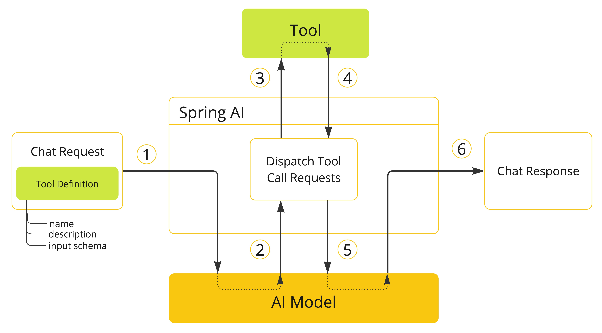
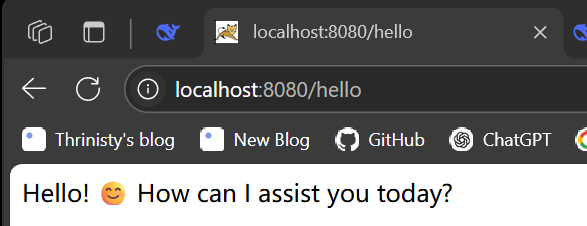

# Spring AI笔记

Spring AI是一个AI工程领域的应用程序框架，提供了一个友好的API和开发AI应用的抽象，旨在简化AI大模型应用的开发工作

对主流的AI大模型供应商提供了支持如OpenAI、DeepSeek、Ollama、Amazon

还可以把AI大模型的输出映射到JavaBean中


## 基本概念

### Prompt

提示（Prompt）是引导人工智能模型产生特定输出的语言输入的基础

对于熟悉 ChatGPT 的人来说，提示可能只是在对话框中输入并发送到 API 的文本。然而，它包含的内容远不止这些。在许多人工智能模型中，提示文本不仅仅是一个简单的字符串。

ChatGPT 的 API 在一个提示中包含多个文本输入，每个文本输入都被分配了一个角色。例如，`system` 角色会告诉模型如何操作，并为交互设置上下文。还有 `user` 角色，通常是来自用户的输入。


### 提示模板

设计优质提示词的关键在于构建请求的上下文框架，并将部分通用描述替换为用户输入的具体参数值。

该流程采用基于文本的传统模板引擎来实现提示词的创建与管理。为此，Spring AI 使用了开源库 [StringTemplate](https://www.stringtemplate.org/) 作为技术实现方案。

例如，一个简单的提示词模板如下：

```none
Tell me a {adjective} joke about {content}.
```

在 Spring AI 中，提示词模板可类比 Spring MVC 架构中的 “View” 层。系统会提供一个模型对象（通常是 `java.util.Map`）来填充模板中的占位符，最终 “渲染” 生成的字符串将作为传递给 AI 模型的提示内容。


### 结构化输出

AI 模型的输出传统上以 `java.lang.String` 形式返回 — 即便要求生成 JSON 格式的答复。它可能是格式正确的 JSON，但本质仍是字符串而非 JSON 数据结构。要注意，在提示词中简单要求 “输出 JSON” 并不能百分百保证结果准确性。

这一复杂性催生了一个专门领域：既要设计能生成预期输出的提示词，又需将返回的原始字符串转换为可供应用程序集成的数据结构。

[结构化输出](https://springdoc.cn/spring-ai/api/structured-output-converter.html#_structuredoutputconverter) 转换采用精心制作的提示，通常需要与模型进行多次交互才能实现所需的格式。


### 整合数据

现有三种技术可定制 AI 模型以整合你的数据：

- **微调（Fine-Tuning）**：这项传统机器学习技术通过调整模型内部权重实现定制，但对 GPT 等大模型而言存在双重挑战 — 不仅需要专业机器学习知识，还因模型规模导致计算资源消耗极大。值得注意的是，部分模型可能根本不开放此功能。
- **提示词填充（Prompt Stuffing）**：一种更实用的替代方案是将数据直接嵌入到提供给模型的提示词中。鉴于模型的 Token 限制，需要特定技术确保相关数据能适配上下文窗口。这种方法俗称 “提示词填充”。Spring AI 库能帮助你基于该技术（现多称为检索增强生成/RAG）实现解决方案。

- **[工具调用（Tool Calling）](https://springdoc.cn/spring-ai/concepts.html#concept-fc)**：该技术支持注册工具（用户自定义服务），将大语言模型与外部系统 API 连接。Spring AI 大幅简化了实现 [工具调用](https://springdoc.cn/spring-ai/api/tools.html) 所需的代码量。


### 工具调用

大语言模型（LLM）在训练完成后即固化，导致知识陈旧，且无法直接访问或修改外部数据。

[工具调用机制（Tool Calling）](https://springdoc.cn/spring-ai/api/tools.html) 有效解决了这些局限。该功能允许你将自定义服务注册为工具，将大语言模型与外部系统 API 连接，使 LLM 能获取实时数据并委托这些系统执行数据处理操作。

Spring AI 极大简化了支持工具调用所需的编码工作，自动处理工具调用的对话交互。你只需将工具定义为带有 `@Tool` 注解的方法，并通过提示选项提供给模型即可调用。此外，单个提示中可定义和引用多个工具。




## 入门使用

SpringAI整合DeepSeek作为示例，文档详见如下链接

https://api-docs.deepseek.com/zh-cn/

导入相关的pom依赖

```html
<?xml version="1.0" encoding="UTF-8"?>
<project xmlns="http://maven.apache.org/POM/4.0.0" xmlns:xsi="http://www.w3.org/2001/XMLSchema-instance"
         xsi:schemaLocation="http://maven.apache.org/POM/4.0.0 https://maven.apache.org/xsd/maven-4.0.0.xsd">
    <modelVersion>4.0.0</modelVersion>
    <parent>
        <groupId>org.springframework.boot</groupId>
        <artifactId>spring-boot-starter-parent</artifactId>
        <version>3.5.3</version>
        <relativePath/> <!-- lookup parent from repository -->
    </parent>
    <groupId>com.learn</groupId>
    <artifactId>DeepSeek</artifactId>
    <version>0.0.1-SNAPSHOT</version>
    <name>DeepSeek</name>
    <description>DeepSeek</description>
    <url/>
    <licenses>
        <license/>
    </licenses>
    <developers>
        <developer/>
    </developers>
    <scm>
        <connection/>
        <developerConnection/>
        <tag/>
        <url/>
    </scm>
    <properties>
        <java.version>17</java.version>
    </properties>

    <repositories>
        <repository>
            <id>spring-milestones</id>
            <name>Spring Milestones</name>
            <url>https://repo.spring.io/milestone</url>
            <snapshots>
                <enabled>true</enabled>
            </snapshots>
        </repository>
        <repository>
            <id>spring-snapshots</id>
            <name>Spring Snapshots</name>
            <url>https://repo.spring.io/snapshot</url>
            <releases>
                <enabled>true</enabled>
            </releases>
        </repository>
    </repositories>


    <dependencies>
        <dependency>
            <groupId>org.springframework.ai</groupId>
            <artifactId>spring-ai-openai-spring-boot-starter</artifactId>
        </dependency>

        <dependency>
            <groupId>org.springframework.boot</groupId>
            <artifactId>spring-boot-starter-web</artifactId>
        </dependency>

        <dependency>
            <groupId>org.springframework.boot</groupId>
            <artifactId>spring-boot-starter-test</artifactId>
            <scope>test</scope>
        </dependency>
    </dependencies>

    <dependencyManagement>
        <dependencies>
            <dependency>
                <groupId>org.springframework.ai</groupId>
                <artifactId>spring-ai-bom</artifactId>
                <version>1.0.0-M5</version>
                <type>pom</type>
                <scope>import</scope>
            </dependency>
        </dependencies>
    </dependencyManagement>

    <build>
        <plugins>
            <plugin>
                <groupId>org.springframework.boot</groupId>
                <artifactId>spring-boot-maven-plugin</artifactId>
            </plugin>
        </plugins>
    </build>

</project>
```


properties相关配置

```properties
spring.application.name=DeepSeek
server.port=8080
spring.ai.openai.api-key=sk-xxxxx
spring.ai.openai.base-url=https://api.deepseek.com
spring.ai.openai.chat.options.model=deepseek-chat
spring.ai.openai.chat.options.temperature=0.5
```

建立一个Controller调用DeepSeek模型

```java
@RestController
public class DeepSeekConroller {
    @Autowired
    private ChatModel chatModel;

    @GetMapping("/hello")
    public String generate(@RequestParam(value = "message", defaultValue = "hello")String message) {
        String result = chatModel.call(message);
        System.out.println(result);
        return result;
    }
}
```


通过ChatModel对象的call方法传入输入大模型的信息，将生成的字符串返回给用户

```
Hello! 😊 How can I assist you today?
```



