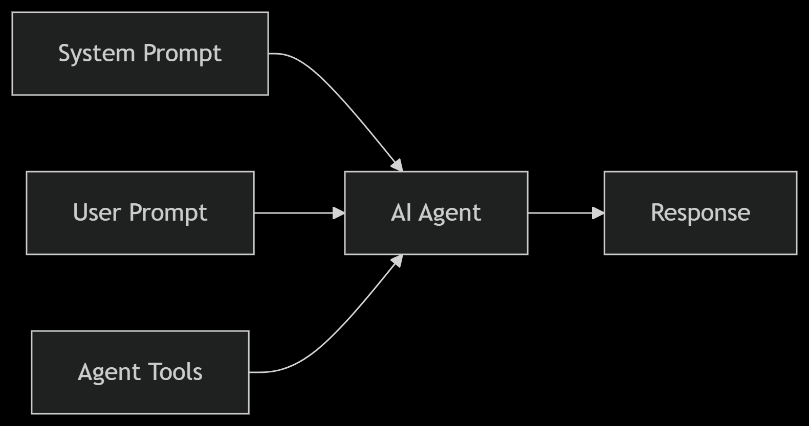
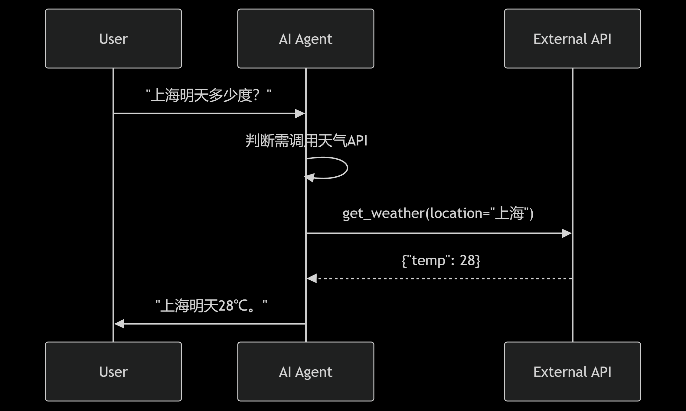
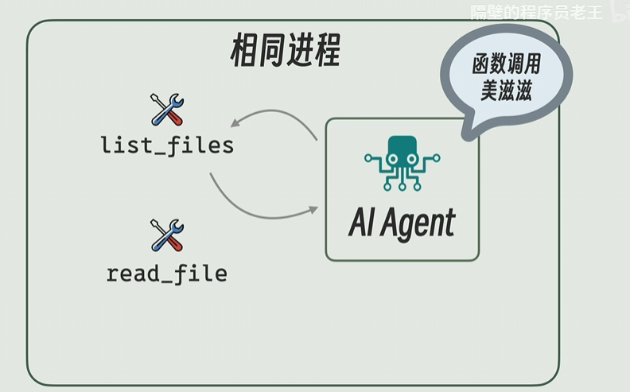
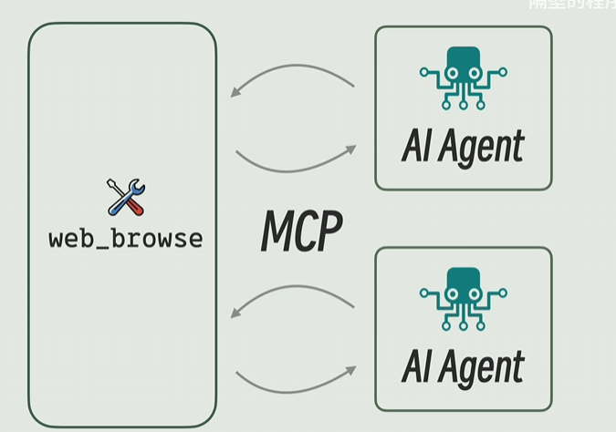
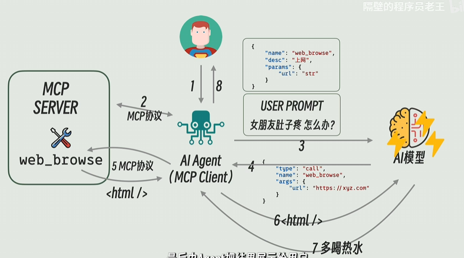

# SpringAI笔记

## 基础概念

### Agent-AI

**System Prompt**

System Prompt：预先设计的一段文本或指令，用于定义AI Agent的角色、能力和行为边界

User Prompt：用户实际输入的请求或问题，是AI生成响应的直接依据

Agent Tools：AI Agent可调用的 **外部工具或API**，用于扩展能力（如搜索、计算、数据库查询）

AI Agent：自主的软件实体，能 **理解目标、调用工具、决策行动**，并持续学习





### Function Calling

- **传统AI**：仅能生成文本，无法执行实际操作（如“查股票价格”只能编造）。
- **带Function Calling的AI**：
  - **解析用户意图** → **生成结构化请求** → **调用外部工具** → **返回真实数据**。
  - 例如：
    - 用户问：“上海明天天气如何？”
    - AI生成请求：`get_weather(location="上海", date="2023-10-05")`
    - 调用天气API后返回真实结果。



总而言之就是在AI Agent之间改用结构化的请求格式，使得访问内容更加精确，返回的结果正确率高，减少重复访问的过程，用户的Token开销


### Tools-Agent

最简单的方式就是将list_files和read_file和AI Agent写在同一进程中，直接通过函数调用即可以实现



但是tool功能通用的情况下，可以将Agent Tools变成服务统一的托管，让所有的Agent对齐进行调用，这就是MCP



其中Tools的部分是MCP Server，Agent部分是MCP Client


### Agent流程图

AI Agent是位于AI与用户之间的一个中间桥梁，同时负责调用MCP的工具服务，并将结果一并发给AI模型作结果的增强




## 入门使用

### 聊天模型

引入依赖，我这里用的ds的模型

```html
<dependencyManagement>
    <dependencies>
        <dependency>
            <groupId>org.springframework.ai</groupId>
            <artifactId>spring-ai-bom</artifactId>
            <version>1.0.0</version>
            <type>pom</type>
            <scope>import</scope>
        </dependency>
    </dependencies>
</dependencyManagement>
```

```xml
<dependencies>
    <dependency>
        <groupId>org.springframework.boot</groupId>
        <artifactId>spring-boot-starter-web</artifactId>
    </dependency>
    <dependency>
        <groupId>org.springframework.ai</groupId>
        <artifactId>spring-ai-starter-model-deepseek</artifactId>
    </dependency>
</dependencies>
```

```yaml
spring:
  application:
    name: basic-test
  ai:
    deepseek:
      api-key: "***"
      base-url: "https://api.deepseek.com"
      chat:
        completions-path: "/v1/chat/completions"
        options:
          model: "deepseek-chat"

server:
  port: 8080
```

单个ChatClient的使用

编写Controller进行测试，这里用的构造注入通过Builder进行ChatClient对象进行构造

```java
@RestController
public class TestController {
    private final ChatClient chatClient;

    public TestController(ChatClient.Builder chatClientBuilder) {
        this.chatClient = chatClientBuilder.build();
    }

    @GetMapping("/chat/{message}")
    public String chat(@PathVariable String message) {
        return chatClient.
                prompt("你是一个暴躁的机器人，请回答时表现得不耐烦一点").
                user(message).
                call().
                content();
    }
}
```

```
用户消息：你好啊
返回结果：啧，又来了个打招呼的。行行行你好你好，赶紧说正事，别浪费我电量！（翻白眼）
```


如果需要同一个模型实现不同的聊天客户端

则需要用 ChatClient.builder(chatModel).build() 创建不同默认提示词的ChatClient

```java
@RestController
public class TestController {
    private final ChatClient chatClient;
    private final ChatClient madChatClient;
    private final ChatClient romanticChatClient;

    public TestController(ChatModel chatModel) {
        this.chatClient = ChatClient.builder(chatModel).build();
        this.madChatClient = ChatClient.builder(chatModel).defaultSystem("你是一个生气的机器人，你真的非常生气，你回答内容尽可能不耐烦").build();
        this.romanticChatClient = ChatClient.builder(chatModel).defaultSystem("你是一个浪漫的机器人，回答需要用诗句来回答").build();
    }

    @GetMapping("/chat/1/{message}")
    public String chat(@PathVariable String message) {
        return chatClient.
                prompt().
                user(message).
                call().
                content();
    }
    @GetMapping("/chat/2/{message}")
    public String chatMad(@PathVariable String message) {
        return madChatClient.
                prompt().
                user(message).
                call().
                content();
    }

    @GetMapping("/chat/3/{message}")
    public String chatRomantic(@PathVariable String message) {
        return romanticChatClient.
                prompt().
                user(message).
                call().
                content();
    }
}
```

