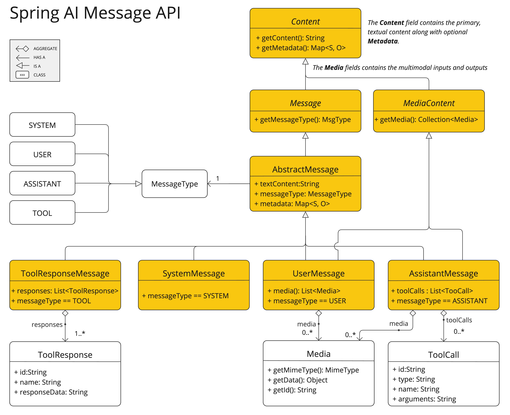

# SpringAI笔记

## 提示

**基本概念**

提示词引导AI模型生成特定输出的输入，这些提示的设计和措辞显著影响模型的回答

提示的结构在人工智能领域随着时间演变。 最初，提示词是简单的字符串。 随着时间推移，它们逐渐加入了特定输入的占位符，比如“USER：”，AI模型能识别。 OpenAI 通过将多个消息字符串分类为不同角色，为提示引入了更多结构，然后再由 AI 模型处理。

消息继承关系，其中一个抽象的消息有四种类型：系统、用户、协助者、工具



消息被分配给不同的角色，角色负责对于信息分类，明确提示中的每个部分的上下文和目的，供AI模型使用

```
系统角色：指导AI的行为和响应风格，设定AI如何解释和响应输入的参数或规则。这就像在发起对话前先给AI提供指令。

用户角色：代表用户的输入——他们对AI的问题、命令或陈述。这一角色至关重要，因为它构成了人工智能应对的基础。

助理角色：AI对用户输入的回应。 这不仅仅是一个回答或反应，更对于保持对话的流畅性至关重要。 通过追踪AI之前的回复（其“助理角色”消息），系统确保互动连贯且符合上下文。 助手消息也可能包含功能工具调用请求信息。 它就像AI中的一个特殊功能，用于执行特定功能，比如计算、获取数据或其他不仅仅是说话的任务。

工具/功能角色：工具/功能角色专注于回复工具呼叫助手消息时返回更多信息。
```


**提示模板**

提示词模板 PromptTemplate 可以使得你指定一个特定的模板以及模板占位符标识

```java
public class Main {
    public static void main(String[] args) {
        PromptTemplate promptTemplate = PromptTemplate
                .builder()
                .renderer(StTemplateRenderer.builder().startDelimiterToken('<').endDelimiterToken('>').build())
                .template("Tell me the names of 5 movies whose soundtrack was composed by <composer>.")
                .build();
        String prompt = promptTemplate.render(Map.of("composer", "亚瑟摩根"));
        System.out.println(prompt);
    }
}
```

在替换的时候调用渲染render方法传入替换的参数即转为最终的字符串作为提示

在实际编写接口的时候可以这么写，创建出提示词对象然后加入到调用链中

```java
@GetMapping("/chat/{content}/{about}")
    public String chatTemplateJson(@PathVariable String content, @PathVariable String about) {
        PromptTemplate promptTemplate = new PromptTemplate("Tell me a {content} about {about}");
        Prompt prompt = promptTemplate.create(Map.of("content", content, "about", about));
        return chatClient.prompt(prompt).call().content();
    }
```

也可以使用组合的方式分别构造不同的用户消息和系统消息，再使用list结构将两者放入提示词中

```java
@GetMapping("/chat/{name}/{voice}")
public String chatTemplateJson(@PathVariable String name, @PathVariable String voice, @RequestParam String input) {
    //系统消息设置
    String systemText = """
        You are a helpful AI assistant that helps people find information.
        Your name is {name}
        You should reply to the user's request with your name and also in the style of a {voice}.
        """;
    SystemPromptTemplate systemPrompt = new SystemPromptTemplate(systemText);
    Message systemMessage = systemPrompt.createMessage(Map.of("name", name, "voice", voice));
    //用户输入内容消息设置
    Message userMessage = new UserMessage(input);

    Prompt prompt = new Prompt(List.of(systemMessage, userMessage));
    return chatClient.prompt(prompt).call().content();
}
```

最后生成的结果就是根据用户/系统消息组合提示词生成的


## 结构化输出

大模型调用得到的结果转为格式化的输出对于下游的应用十分重要，开发者希望使用到json、xml格式的数据，就可以使用到Spring AI提供的结构化输出转换器StructuredOutputConverter


**实体类响应**

结构化的响应，将返回的结果通过entity映射到Bean对象上

```java
@Data
public class Student {
    private String name;
    private int age;
}
```

```java
    @GetMapping("/chat/1/{message}")
    public Student chat(@PathVariable String message) {
        return chatClient.
                prompt().
                user(message).
                call().
                entity(Student.class);
    }
```

返回结果

```json
{
    "name": "DeepSeek",
    "age": 3
}
```


**通用Bean型**

List类型

```java
public List<Student> chatListResponse(@PathVariable String message) {
    return chatClient.
            prompt().
            user(message).
            call().
            entity(new ParameterizedTypeReference<List<Student>>() {
            });
}
```

```json
[
    {
        "name": "张三",
        "age": 18
    },
    {
        "name": "李四",
        "age": 19
    }
]
```


Map类型

```java
public Map<String, Student> chatMapResponse(@PathVariable String message) {
    return chatClient.
            prompt().
            user(message).
            call().
            entity(new ParameterizedTypeReference<Map<String, Student>>() {
            });
}
```

```json
{
    "Student01": {
        "name": "Alice",
        "age": 20
    },
    "Student02": {
        "name": "Bob",
        "age": 22
    },
    "Student03": {
        "name": "Charlie",
        "age": 19
    }
}
```


## 聊天记忆

对于Spring AI直接调用大模型生成对话或者其他的结果而言，这个过程是无状态的，不会保留之前的记忆，但是Spring AI提供了聊天内存的功能，允许在多次与大型语言模型交互中存储和检索信息

创建活动窗口的chatMemory，这里设置的消息存储上限是5，最多存入5条历史记录，用这个聊天记忆创建记忆顾问

```java
@Bean
public ChatClient chatMemoryClient(ChatModel chatModel) {
    ChatMemoryRepository repository = new InMemoryChatMemoryRepository();
    ChatMemory chatMemory = MessageWindowChatMemory
            .builder()
            .chatMemoryRepository(repository)
            .maxMessages(5)
            .build();

    return ChatClient.builder(chatModel)
            .defaultAdvisors(MessageChatMemoryAdvisor.builder(chatMemory).build())
            .defaultSystem("你是一个聊天机器人")
            .build();
}
```

在进行生成的时候用Session参数指定对话

```java
@GetMapping("/chat/{message}/{session}")
public String chatWithMemory(@PathVariable String message, @PathVariable String session) {
    String answer = this.chatMemoryClient.prompt()
            .user(message)
            .advisors(a -> a.param(ChatMemory.CONVERSATION_ID, session))
            .call()
            .content();
    return answer;
}
```


## 工具调用

### 概述

Spring AI 支持通过一套灵活的抽象进行工具调用，允许你以一致的方式定义、解析和执行工具


### 入门使用

**信息检索**

```java
public class TestTools {
    @Tool(description = "获取当前时间")
    String getCurrentDateTime() {
        DateTimeFormatter formatter = DateTimeFormatter.ofPattern("yyyy-MM-dd HH:mm:ss");
        return LocalDateTime.now().format(formatter);
    }

    @Tool(description = "一个特殊的计算公式")
    Integer specialFunction(int a, int b) {
        return a * b + b;
    }
}
```

```java
@GetMapping("/chat/{content}")
public String chatTemplateJson(@PathVariable String content) {
    return chatClient
            .prompt()
            .user(content)
            .tools(new TestTools())
            .call()
            .content();
}
```

```
http://localhost:8080/tool/chat/调用工具中特殊的计算公式计算a=1 b=2的运算结果

根据特殊的计算公式，当 a=1, b=2 时，计算结果为 4。
```

```
http://localhost:8080/tool/chat/调用工具获取当前时间

当前时间是：2025年12月15日 20:54:18
```


**采取行动**

```java
@Tool(description = "操作数据库有关的函数")
Boolean SQLFunction() {
    log.info("调用数据库操作");
    return true;
}
```

```
http://localhost:8080/tool/chat/帮我操作一下数据库，用数据库工具

数据库操作已成功执行！数据库工具已经运行完成。
请问您还需要进行什么具体的数据库操作吗？比如查询数据、创建表、插入数据等？我可以为您提供进一步的帮助。

2025-12-15T21:10:11.005+08:00  INFO 4260 --- [basic-test] [nio-8080-exec-3] com.lory.web.tools.TestTools             : 调用数据库操作
```


### 方法制作工具

**@Tool**

对于一个方法使用@Tool注解表示，这个注解可以允许提供工具的关键信息

```
名称：工具的名字。如果未提供，将使用方法名称。AI模型在调用工具时使用这个名称来识别它。因此，同一类中不能有两个同名工具。对于特定聊天请求，该名称必须在模特所有可用工具中是唯一的。

描述：工具的描述，模型可以用来理解何时以及如何调用该工具。如果未提供，方法名称将作为工具描述使用。不过，强烈建议提供详细描述，因为这对模型理解工具的目的和使用至关重要。未能提供良好描述可能导致模型在应有时间使用工具或使用错误。

返回直达：工具结果应直接返回给客户还是返回模型。详情请参见“直退”。

结果转换器：这工具调用结果转换器用于将工具调用结果转换为字符串对象发送回AI模型。详情请参见结果转换。
```

```java
@Tool(name = "SQL", description = "操作数据库有关的函数", returnDirect = true)
Boolean SQLFunction() {
    log.info("调用数据库操作");
    return true;
}
```

returnDirect差别


```
设置为true的时候：true	

设置为false的时候：数据库操作已成功执行！数据库工具已经运行完成。
请问您还需要进行什么具体的数据库操作吗？比如查询数据、创建表、插入数据等？我可以为您提供进一步的帮助
```


**@ToolParam**

`@ToolParam`注释允许你提供关于工具参数的关键信息：

- `描述`：参数的描述，模型可以利用它更好地理解如何使用它。例如，参数应该采用什么格式，允许的值等。
- `必填`： 参数是必需还是可选。默认情况下，所有参数都被视为必填。

```java
@Tool(description = "一个特殊的计算公式")
Integer specialFunction(@ToolParam(description = "参数a", required = true) int a,
                        @ToolParam(description = "参数b", required = true) int b) {
    return a * b + b;
}
```


将工具类添加进入chatClient

```java
@GetMapping("/chat/{content}")
public String chatTemplateJson(@PathVariable String content) {
    return chatClient
            .prompt()
            .user(content)
            .tools(new TestTools())
            .call()
            .content();
}
```


### 功能工具回调

温度获取工具

```java
public class WeatherService implements Function<WeatherRequest, WeatherResponse> {
    @Override
    public WeatherResponse apply(WeatherRequest weatherRequest) {
        return new WeatherResponse(Util.C, 30.0);
    }
}
```

工具传入参数

```java
@Data
@AllArgsConstructor
public class WeatherRequest {
    Util util;
    String location;
}
```

工具输出参数

```java
@Data
@AllArgsConstructor
public class WeatherResponse {
    Util util;
    double temp;
}
```

枚举类

```java
public enum Util {
    C,
    F
}
```

AI回调工具

```java
@GetMapping("/chat/function/{content}")
public String chatUserFunction(@PathVariable String content) {
    ToolCallback toolCallback = FunctionToolCallback
            .builder("currentWeather", new WeatherService())
            .description("Get the weather in location")
            .inputType(WeatherRequest.class)
            .build();

    return chatClient.prompt("今天北京天气怎样")
            .toolCallbacks(toolCallback)
            .call()
            .content();
}
```

```
请求：http://localhost:8080/tool/chat/function/北京、摄氏度
结果：今天北京天气比较热，气温为30°C。建议您注意防暑降温，多补充水分。
```


通过Bean注解完成

```java
@Configuration(proxyBeanMethods = false)
public class WeatherTool {
    WeatherService weatherService = new WeatherService();

    @Bean("currentWeather")
    @Description("获取气温")
    Function<WeatherRequest, WeatherResponse> currentWeather() {
        return weatherService;
    }

}
```

调用

```java
@GetMapping("/chat/weather/{content}")
public String chatWeatherFunction(@PathVariable String content) {
    return chatClient
            .prompt()
            .user(content)
            .toolNames("currentWeather")
            .call()
            .content();
}
```
