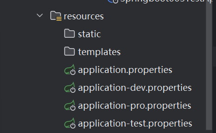

# SpringBoot笔记

SpringBoot是快速构建Spring项目的框架，不是对Spring功能的增强

Spring存在缺点：需要写很多的配置类，依赖繁琐（版本兼容，依赖管理）

SpringBoot自动配置，在项目启动的时候将项目的配置自动完成

SpringBoot起步依赖：简单而言起步依赖就是将具体的某种功能的坐标打包到一起，并提供一些默认功能

辅助功能：提供了一些大型项目中常见的非功能性特性，如嵌入式服务器，安全，指标健康检测，外部配置等


## 快速入门

搭建SpringBoot工程，定义HelloController.hello方法，返回Hello SpringBoot!

实现步骤：

1.创建Maven项目

2.导入SpringBoot起步依赖

3.定义Controller

4.编写引导类

5.启动测试


导入Maven依赖

```html
<dependency>
    <groupId>org.springframework.boot</groupId>
    <artifactId>spring-boot-starter-web</artifactId>
</dependency>
```


Controller编写

```java
@RestController
public class HelloController {
    @RequestMapping("/hello")
    public String hello() {
        return "Hello Spring Boot";
    }
}
```


编写引导类，这里还默认在请求映射的时候返回Hello World字符串作为响应体返回

```java
@RestController
@SpringBootApplication
public class Springboot001Application {
	@RequestMapping("/")
	public String home() {
		return "Hello World";
	}

	public static void main(String[] args) {
		SpringApplication.run(Springboot001Application.class, args);
	}
}
```

SpringBoot在打包的时候通过jar包进行打包

我们通过IDEA的SpringBoot也可以快速创建SpringBoot工程，可以很便捷的创建引导类，引入起步依赖

我们在起步依赖中定义的spring-boot-starter-parent定义了各种技术的版本信息，组合了一台最优搭配的技术版本

在starter中，定义了完成该功能需要的坐标集合，其中大部分信息来自于父工程


## SpringBoot配置

由propertis和yaml两种配置

application.properties

```
server.port=8080
```

```
spring.application.name=springboot-002
server.port=8080
```


application.yml

```
server:
  port: 8080
```

```
server:
  port: 8082
```

在同一级目录下，同样的配置，优先级priperties>yml>yaml


## YAML

YAML Ain't Markup Language

是一种直观的被电脑识别的数据序列化格式，同时容易被人类阅读，容易和脚本语言交互，文件拓展名是yml或yaml

### 基本语法

大小写敏感

数据值前边必须要有空格作为分隔符，最少一个空格

使用缩进表示层级关系

缩进的空格数不重要，只需要相同层级的元素左侧对齐即可

#表示注释，作用到行尾


### 数据格式

对象：键值对的集合

```yaml
#换行写法
person: 
  name: 'zhangsan'
  age: 20
  
#行内写法
person: {name: 'zhangsan',age: 20}
```

行内写法不多，了解即可


数组：一组按次序排列的值

```yaml
address: 
  - 'beijing'
  - 'shanghai'
address: ['beijing','shanghai']
```


纯量：单个的，不可再分的值

```yaml
msg1: 'hello \n world' #单引号忽略转义字符
msg2: "hello \n world" #双引号识别转义字符
```


### 参数引用

```yml
name: abc
person:
  name: ${name}
  age: 20
```


## 获取配置数据

SpringBoot通过了以下的方式获取配置内容

### @Value

```java
@Value("${name}")
private String name;

@RequestMapping("/name")
public String getNameController() {
    return name;
}
```

```java
@Value("${human.name}")
private String name;

@Value("${human.age}")
private int age;

@RequestMapping("/name")
public String getNameController() {
    return name + " " + age;
}
```

```
zhangsan 20
```

数组获取

```java
@Value("${hobbies[0]}")
private String hobbies;
```


### Environment

相比于Value注入的对象少一点，只需要注入环境对象即可

注入Environment对象

```java
@Autowired
private Environment env;
```

再通过env对象传入键获取值

```java
@RequestMapping("/name")
public String getNameController() {
    System.out.println(env.getProperty("name"));
    System.out.println(env.getProperty("human.age"));
    return "hobbies";
}
```


### @ConfigurationProperties

添加bean对象，用@Component @ConfigurationProperties两个对象标注

通过perfix属性传入对应标签

```java
@Component
@ConfigurationProperties(prefix = "person")
public class Person {
    private String name;
    private int age;
}
```

数组的获取类似，关键就是bean对象上的两个注解

```yaml
person:
  name: ${name}
  age: 20
  address: [shanghai,beijing]
```

```java
@Autowired
private Person person;

@RequestMapping("/name")
public String getNameController() {
    System.out.println(env.getProperty("name"));
    System.out.println(env.getProperty("human.age"));
    System.out.println(person);
    String[] address = person.getAddress();
    for (String s : address) {
        System.out.println(s);
    }
    return "hobbies";
}
```


## Profile

在开发SpringBoot应用的时候，通常同一套程序会被安装到不同的环境中，例如开发 测试 生产，其中的配置必然是不同的，为了避免每次打包时都需要修改配置文件非常麻烦，profile提供了进行动态配置切换的功能

### 多文件方式

第一种方式：通过配置多个配置文件文件，格式为application-xxx.properties，在application.properties中进行配置文件的选择



```
spring.application.name=springboot-003-test
spring.profiles.active=dev
```


### 多文档方式

第二种方式：多文档配置

:::warning

在 **Spring Boot 2.4+** 版本之后，`spring.profiles` 的写法已经被弃用，并替换为 `spring.config.activate.on-profile`

:::

```yaml
---
server:
  port: 8081
spring:
  config:
    activate:
      on-profile: dev
---
server:
  port: 8082
spring:
  config:
    activate:
      on-profile: test
---
server:
  port: 8083
spring:
  config:
    activate:
      on-profile: pro
---
spring:
  profiles:
    active: pro
```

在spring-profiles-active中设置激活配置文件

### 虚拟机选项配置

还可以在SpringBoot配置的虚拟机选项中添加如下的部分选择对应的配置文件

```
-Dspring.profiles.active=test
```


### Jar包运行参数设置

打包后通过如下指令在命令行中运行springboot程序jar包

```
java -jar .\springboot-003-test-0.0.1-SNAPSHOT.jar
```

```
java -jar .\springboot-003-test-0.0.1-SNAPSHOT.jar --spring.profiles.active=dev
```

通过--spring.profiles.active=dev指定对应的配置文件


## 项目配置加载顺序

内部配置和外部配置互补，算是一种优势，可以在打包后也可以修改配置参数

### 内部配置加载

SpringBoot程序启动的时候，会从一下的位置加载配置文件

1.file../config/ : 当前项目下的/config目录下

2.file../ : 当前项目的根目录下

3.classpath:/config : classpath的/config目录下

4.classpath:/ : classpath的根目录

:::note

加载顺序为上文的排列顺序，高优先级配置的属性会生效，这些配置都会被SpringBoot读取，但是高优先级存在的内容不会被低优先级的更改

而低优先级存在高优先级不存在的配置也会被正确配置

:::


### 外部配置加载

通过命令行参数指定运行端口

```
java -jar springboot-004-0.0.1-SNAPSHOT.jar --server.port=8090
```


通过命令行指定外部的配置文件路径 e://application.yaml

spring.config.location

```
java -jar springboot-004-0.0.1-SNAPSHOT.jar --spring.config.location=e://application.yaml
```


还可以将配置文件放置在jar包的同级目录，或者同级下的config目录下，不指定参数也可以使配置生效


## 整合框架

### JUnit测试框架

1.搭建SpringBoot工程

2.引入starter-test起步依赖

3.编写测试类，这里在service层编写一个方法做示范

```java
@Service
public class UserService {
    public void add() {
        System.out.println("add...");
    }
}
```

4.添加测试相关注解：

@RunWith(SpringRunner.class) 这个注解好像是新版本用不上，可以不加

@SpringBootTest(classes = 启动类.class) 

如果是测试类在启动类的同一个包下就不需要添加指定classes

```java
@SpringBootTest(classes = Springboot004Application.class)
public class UserServiceTest {
    @Autowired
    private UserService userService;

    @Test
    public void testAdd() {
        userService.add();
    }
}
```

5.编写测试方法

```java
@Test
public void testAdd() {
    userService.add();
}
```


### Redis整合

SpringBoot整合Redis非常方便

实现步骤：

1.搭建SpringBoot工程

2.引入redis起步依赖

3.配置redis相关属性

4.注入RedisTemplate模板

5.编写测试方法，测试


先启动Redis服务，执行set get测试方法

```java
@SpringBootTest
class Springboot006ApplicationTests {

    @Autowired
    private RedisTemplate redisTemplate;

    @Test
    void testSet() {
        //存入数据
        redisTemplate.boundValueOps("name").set("zhangsan");
    }

    @Test
    void testGet() {
        Object name = redisTemplate.boundValueOps("name").get();
        System.out.println(name);
    }
}
```

还可以在yaml配置文件中通过修改配置更改redis的地址与端口

```yaml
spring:
  data:
    redis:
      host: 127.0.0.1
      port: 6379
```


### MyBatis整合

SpringBoot整合MyBatis

1.搭建SpringBoot工程

2.引入mybatis起步依赖，添加MySQL驱动

3.编写DataSource和myBatis相关配置

4.定义表和实体类

5.编写dao和mapper文件/纯注解开发

6.测试

这里引入mybatis起步依赖的时候似乎3.5.3版本SpringBoot不支持MyBatis Framework，所以用的是3.4.8版本的SpringBoot

通过yml配置jdbc数据源配置

```yaml
spring:
  datasource:
    url: jdbc:mysql:///ssm
    username: root
    password: 654321
    driver-class-name: com.mysql.jdbc.Driver
```


userBean

```java
public class User {
    private int id;
    private String password;
    private double balance;

    public User() {
    }
    ...
}
```


#### 注解实现

通过注解实现UserMapper的实现类

```java
@Mapper
public interface UserMapper {
    @Select("select * from user;")
    public List<User> findAll();

    @Select("select * from user where `id`= #{id}")
    public User findById(Integer id);
}
```


编写测试程序

```java
@SpringBootTest
class Springboot007ApplicationTests {
	@Autowired
	UserMapper userMapper;
	@Test
	void testSelectAll() {
		List<User> users = userMapper.findAll();
		for (User user : users) {
			System.out.println(user);
		}
	}

	@Test
	void testSelectById() {
		User user = userMapper.findById(1);
		System.out.println(user);
	}
}
```
