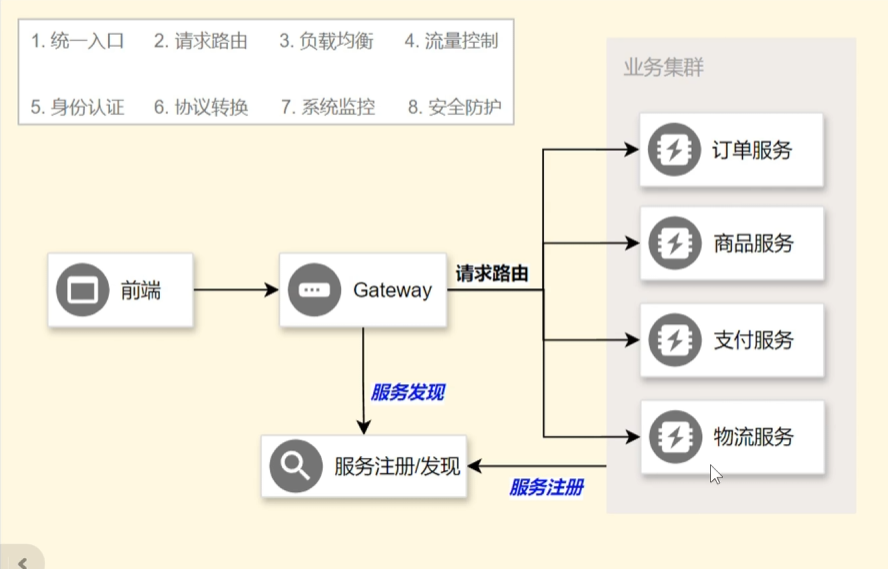
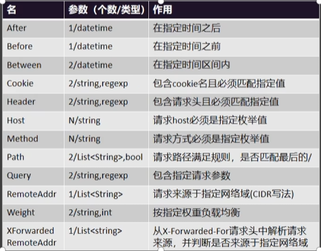
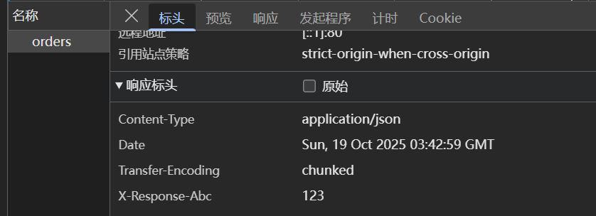
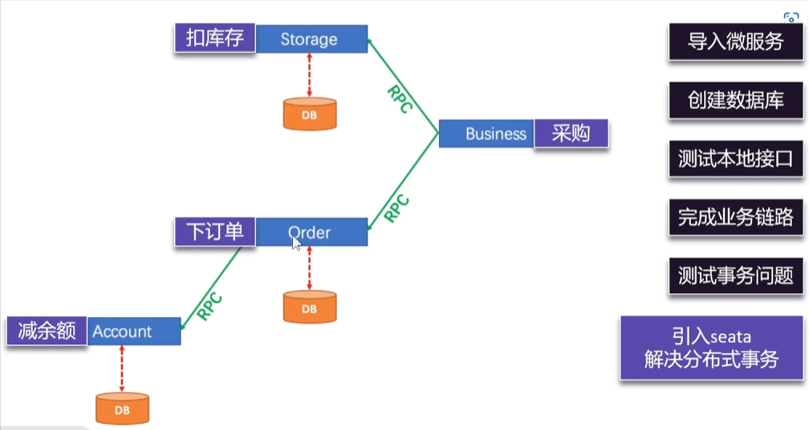
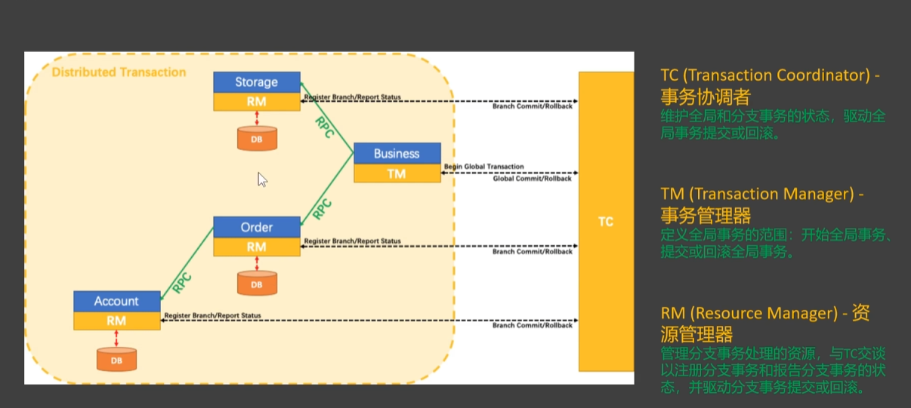

# SpringCloud笔记

## 网关

我们在用前端调用微服务项目接口的时候由于开启了非常多的服务，前端需要记住非常多的业务接口，这个时候我们就需要用统一的Gateway网关来管理接口方便调用，只需要记住网关的地址，将请求发给网关，由网关进行请求的转发




### 基础使用

新建立java项目，映入相关依赖

引入相关依赖

```xml
<dependency>
    <groupId>org.springframework.cloud</groupId>
    <artifactId>spring-cloud-starter-loadbalancer</artifactId>
</dependency>
```

```xml
<dependencies>
    <dependency>
        <groupId>com.alibaba.cloud</groupId>
        <artifactId>spring-cloud-starter-alibaba-nacos-discovery</artifactId>
    </dependency>
    <dependency>
        <groupId>org.springframework.cloud</groupId>
        <artifactId>spring-cloud-starter-gateway</artifactId>
    </dependency>
</dependencies>
```

配置文件

```yaml
spring:
  profiles:
    include: route
  application:
    name: gateway
  cloud:
    nacos:
      discovery:
        server-addr: 127.0.0.1:8848
server:
  port: 80
```

配置routes

```yaml
spring:
  cloud:
    gateway:
      routes:
        - id: order-route
          uri: lb://service-order
          predicates:
            - Path=/api/order/**

        - id: produce-route
          uri: lb://service-product
          predicates:
            - Path=/api/product/**
```

这个时候对于访问/api/order/**路径下的内容就会被转发给对应服务，请求ip后的路径保持一致


### 断言配置

断言是匹配是否符合规则，而决定转发给哪个服务，我们之前配置的是按照路径进行匹配同时属于短写法

```yaml
predicates:
  - Path=/api/order/**
```

以下是长写法，可以匹配多个规则，满足所有的规则才转发到指定路径下

```yaml
predicates:
  - name: Path
    args:
      patterns: /api/order/**
```

所有规则，具体可以查看官方文档进行使用




### 过滤器

在网关进行转发的时候我们可以设置一些过滤器，对于请求进行过滤前置处理，处理完后的请求被发送会客户的时候也可以进行过滤的后置处理

**路径重写**

将判断转发的条件删除，将后面的内容转发

```yaml
spring:
  cloud:
    gateway:
      routes:
        - id: order-route
          uri: lb://service-order
          filters:
            - RewritePath=/api/order/(?<segment>.*), /$\{segment}
          predicates:
            - name: Path
              args:
                patterns: /api/order/**
```

```
http://localhost:80/api/order/order/orders
```

被转发为

```
http://localhost:8000/order/orders
```


**添加响应头**

在被转发的所有响应中添加X-Response-abc, 123响应头

```yaml
spring:
  cloud:
    gateway:
      routes:
        - id: order-route
          uri: lb://service-order
          filters:
            - RewritePath=/api/order/(?<segment>.*), /$\{segment}
            - AddResponseHeader=X-Response-abc, 123
          predicates:
            - name: Path
              args:
                patterns: /api/order/**
```




对于gateway可以配置一个默认的DefaultFilter，这样每一个路由规则都会被使用到这个过滤器

```yaml
spring:
  cloud:
    gateway:
      default-filters:
        - AddResponseHeader=X-Response-abc, 123
      routes:
        - id: order-route
          uri: lb://service-order
          filters:
            - RewritePath=/api/order/(?<segment>.*), /$\{segment}
          predicates:
            - name: Path
              args:
                patterns: /api/order/**


        - id: produce-route
          uri: lb://service-product
          predicates:
            - Path=/api/product/**
```

**全局过滤器**

实现GlobalFilter, Ordered两个接口，getOrder方法返回的数字越小优先级越高

```java
@Component
@Slf4j
public class MyFilter implements GlobalFilter, Ordered {
    @Override
    public Mono<Void> filter(ServerWebExchange exchange, GatewayFilterChain chain) {
        ServerHttpRequest request = exchange.getRequest();
        ServerHttpResponse response = exchange.getResponse();
        String uri = request.getURI().toString();
        log.info("请求:"+ uri);
        //其上是前置逻辑
        Mono<Void> filter = chain.filter(exchange)
                .doFinally(
                        //以下是后置逻辑
                        (a) -> log.info("后置逻辑")
                );
        return filter;
    }

    @Override
    public int getOrder() {
        return -1;
    }
}
```


### 跨域

```yaml
spring:
  cloud:
    gateway:
      globalcors:
        cors-configurations:
          '[/**]':
            allowed-origins: "http://localhost:3000"
            allowed-methods: "*"
            allowed-headers: "*"
            allow-credentials: true
            max-age: 3600
```


## 分布式事务

我们在之前的业务都是连接同一个数据库，回滚只需要添加Spring的@Transactional注解进行事务的设置，但是到了分布式微服务架构的时候就难免出现一个微服务事务成功，但是有的事务没有成功的情况，造成数据不一致的问题，这个时候就要引入分布式事务



基本原理



### 入门使用

下载seata的二进制bin

在bin目录下启用seate-server

```
.\seate-server.bat
```

其中Server监听8091，Web界面在7091

在每一个服务中引入Seata的Maven依赖

```xml
<dependency>
    <groupId>com.alibaba.cloud</groupId>
    <artifactId>spring-cloud-starter-alibaba-seata</artifactId>
</dependency>
```

配置file.conf

```nginx
service {
  # 事务组名称（需与客户端保持一致）
  vgroupMapping.default_tx_group = "default"  # my_tx_group 需与client端的application.yml中的tx-service-group一致

  # 仅用于非registry模式（如直接连接TC服务器）
  default.grouplist = "127.0.0.1:8091"  # Seata TC Server地址（单机模式）

  # 禁用Seata的RM数据源自动代理（可选，若需要手动代理）
  enableDegrade = false

  # 禁用全局事务（测试时临时关闭）
  disableGlobalTransaction = false
}
```

在远程调用的管理接口中使用@GlobalTransactional开启全局事务，利用二段提交管理全局事务


### 四种事务模式

默认为AT模式：自动事务，全部由Seata进行控制

XA：也是二段提交，遵循数据库的提交规则，第一阶段不会提交，只会阻塞

TCC：是细粒度的手动二段提交，提交回滚的逻辑通过程序员手动编写，实现TccActionOne接口，适合夹杂了非数据库的事务，例如短信提交，通过发送短信失效声明（回滚）

Sage：长事务的解决方案，长时间的锁会影响性能，Saga通过消息模式实现最终一致性

