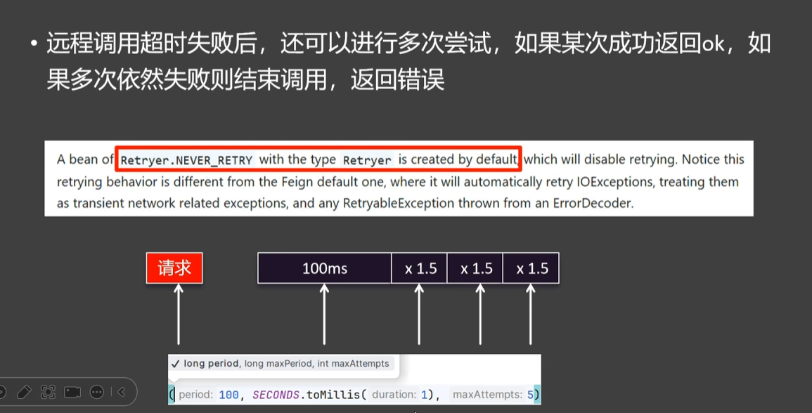
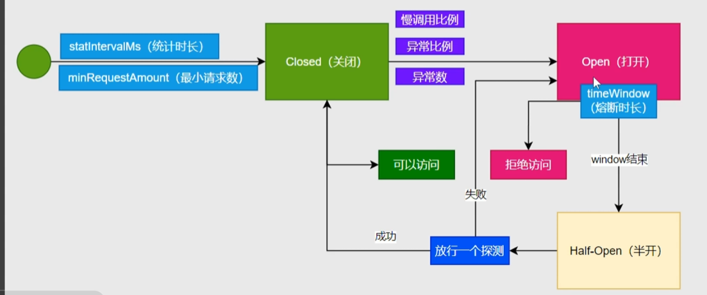

# SpringCloud笔记

## OpenFeign

### 远程调用

**调用注册中心服务**

```xml
<dependency>
    <groupId>org.springframework.cloud</groupId>
    <artifactId>spring-cloud-starter-openfeign</artifactId>
</dependency>
```

使用步骤

1.使用@EnableFeignClients标注启动类

```java
@EnableFeignClients
@EnableDiscoveryClient
@SpringBootApplication
public class OrderMainApplication {
    public static void main(String[] args) {
        SpringApplication.run(OrderMainApplication.class, args);
    }
```

2.创建接口，标注需要发送到的服务名称，构造发送的路径以及参数

```java
@FeignClient(value = "service-product")
public interface ProductFeignClient {

    @GetMapping("/product/{id}")
    public Product getProducts(@PathVariable int id);
}
```

3.自动注入ProductFeignClient，注入后即可调用接口方法（自动负载均衡）

```
@Autowired
ProductFeignClient productFeignClient;
```


**远程调用远程API**‘

将我们的调用地址该表为目标文档对应地址，以及按要求设置请求参数即可

```java
@FeignClient(value = "weather-client", url = "http://www.xxx.com")
public interface WeatherFeignClient {
    @PostMapping("/weather/condition")
    String getWeatherCondition(@RequestHeader String auth, 
                               @RequestParam String token, 
                               @RequestParam String cityId);
}
```


### 输出日志

获取远程调用的Debug信息

```yaml
logging:
  level:
    com.nwpu.order.feign: debug
```

```java
import feign.Logger;
import org.springframework.context.annotation.Bean;
import org.springframework.context.annotation.Configuration;

@Configuration
public class FullConfiguration {
    @Bean
    Logger.Level fullLevel() {
        return Logger.Level.FULL;
    }
}
```

日志结果

```
2025-10-14T16:03:52.718+08:00 DEBUG 28172 --- [service-order] [nio-8000-exec-1] c.nwpu.order.feign.ProductFeignClient    : [ProductFeignClient#getProducts] {"id":2,"name":"电视","price":201.2}
2025-10-14T16:03:52.718+08:00 DEBUG 28172 --- [service-order] [nio-8000-exec-1] c.nwpu.order.feign.ProductFeignClient    : [ProductFeignClient#getProducts] <--- END HTTP (38-byte body)
```


### 超时处理

如果被调用的服务运行太慢就会导致调用它的服务太慢，我们需要使用超时处理进行解决


超时又分为连接超时和读取超时，默认为10s和60s

也可以自己设置

```
spring:
  cloud:
   openfeign:
    client:
      config:
        service-product:
          connect-timeout: 10000
          read-timeout: 15000
```

也可以将service-product服务id改为deault默认，这样默认用的就是deault设置的参数，对应服务配置了就用对应的参数


### 重试策略

远程调用失败后还可以继续进行尝试，但是默认配置时不重试

**默认配置**

```yaml
service-product:
  connect-timeout: 10000
  read-timeout: 15000
  retryer: feign.retryer.Default
```



调用策略为间隔一段时间重试，每次重试*1.5倍，最大为1秒，最大重试次数为5

**Bean配置**

```java
@Bean
Retryer retryer () {
    return new Retryer.Default();
}
```


### 配置拦截器

又分为请求拦截器和响应拦截器，日常主要使用到的是请求拦截器


加上Component创建的请求拦截器，Cloud就会将其自动放在请求之前，用apply进行处理，例如这里添加上了一个X-Token

```java
@Component
public class TokenRequestInterceptor implements RequestInterceptor {
    @Override
    public void apply(RequestTemplate requestTemplate) {
        System.out.println("启动了请求拦截器");
        requestTemplate.header("X-Token", UUID.randomUUID().toString());
    }
}
```


### 兜底结果


原先的远程服务OpenFeign接口

```java
@FeignClient(value = "service-product")
public interface ProductFeignClient {

    @GetMapping("/product/{id}")
    public Product getProducts(@PathVariable int id);
}
```

FallBack只需要实现接口即可

```java
@Component
public class ProductFallBack implements ProductFeignClient {
    @Override
    public Product getProducts(int id) {
        System.out.println("Falling back");
        Product product = new Product();
        product.setName("null");
        product.setPrice(0.0);
        return product;
    }
}
```

除此以外我们还要导入Sentinel依赖配置，并开启熔断功能

```xml
<dependency>
    <groupId>org.springframework.cloud</groupId>
    <artifactId>spring-cloud-starter-openfeign</artifactId>
</dependency>
```

```yaml
feign:
  sentinel:
    enabled: true
```


## Sentinel

服务保护（限流、熔断降级）

**基本介绍**


**原理图**


处理流程


### 基本使用

下载 sentinel-dashboard-1.8.8.jar ，java -jar启动

```
java -jar sentinel-dashboard-1.8.8.jar
```

通过默认的8080端口访问

```
http://localhost:8080/
```

默认账户密码都是setinel


引入sentinel依赖

```xml
<dependency>
    <groupId>com.alibaba.cloud</groupId>
    <artifactId>spring-cloud-starter-alibaba-sentinel</artifactId>
</dependency>
```

配置yaml配置：由于sentinel按需加载我们配置eager为true实现提前加载

```yaml
spring:
  cloud:
    sentinel:
      transport:
        dashboard: localhost:8080
      eager: true
```


### 异常处理

在界面上新增限流策略QPS为1代表每秒只可以被访问一次，如果超出流量限制就会抛出BlockException的子类异常

其中有五种异常分别对应五种规则

```
流量控制：FlowRule
熔断降级：DegradeRule
系统保护：SystemRule
来源访问控制：AuthorityRule
热点参数：RaramFlowRule
```


总体而言分为了四个部分Web接口，SentinelResource注解，OpenFeign远程调用，SphU硬编码

#### Web接口

在抛出BlockException异常后SpringBoot会帮我们利用默认的DefaultException进行处理并写入异常信息，但是在实际使用的时候我们需要的应该是覆盖默认的异常处理器，返回Json字符串用与前端的响应

```java
@Component
public class MyBlockExceptionHandler implements BlockExceptionHandler {
    private ObjectMapper objectMapper = new ObjectMapper();

    @Override
    public void handle(HttpServletRequest request, HttpServletResponse response, String resourceName, BlockException e) throws Exception {
        PrintWriter writer = response.getWriter();
        response.setContentType("application/json;charset=utf-8");
        ResultVo<Object> fail = ResultVo.fail(500, e.getMessage());
        writer.write(objectMapper.writeValueAsString(fail));
    }
}
```

返回响应信息

```
{"code":500,"data":null,"message":"FlowException"}
```

#### @SentinelResouce

对于被该注解标标注的资源在管理端会显示其Value名字

```java
@SentinelResource(value = "createOrder")
@GetMapping("{userId}/{proId}")
public String order(@PathVariable int userId, @PathVariable int proId) {
    Product product = getProduct(proId);
    Order order = new Order();
    order.setUserId(userId);
    order.setPrice(product.getPrice());
    orderService.save(order);
    return order.toString();
}
```

如果我们对于他进行流量控制，超出预期后返回的是如下的结果，一个页面

```java
Whitelabel Error Page
This application has no explicit mapping for /error, so you are seeing this as a fallback.

Tue Oct 14 20:10:26 CST 2025
There was an unexpected error (type=Internal Server Error, status=500).
```

这是因为在Sentinel为了处理SentinelResouce资源运用AOP切入所有被SentinelResouce注解标注的资源，先拿到资源名称调用，并进行资源保护（根据规则决定继续执行还是抛出异常）

抛出异常后看有没有标注BlockHandler，标注了则交由Handler进行异常处理，如果标注fallback则走fallback兜底回调

如果两个都没有标注就调用DefaultFallBack抛出异常，上面的页面就是抛出的异常，在平时开发的时候会走全局异常处理器

解决方式：

所以，如果我们要对于这个异常进行自定义处理，就可以使用的是blockHandler指定处理方法（方法名和blockHandler指定的一致，参数一致，可以加BlockException），返回兜底的空数据

```java
@SentinelResource(value = "createOrder", blockHandler = "createOrderFallBack")
@GetMapping("{userId}/{proId}")
public String order(@PathVariable int userId, @PathVariable int proId) {
    Product product = getProduct(proId);
    Order order = new Order();
    order.setUserId(userId);
    order.setPrice(product.getPrice());
    orderService.save(order);
    return order.toString();
}

public String createOrderFallBack(int userId, int proId, BlockException e) {
    return new Order().toString() + e.getClass().getSimpleName();
}
```

当然用全局处理也可以

#### 远程调用

我们的Sentinel也可以对于远程被调用的服务进行规则处理，如果不满足规则，可以使用我们之前的OpenFeign超时时的兜底处理，如果没有被兜底处理，则交由全局进行处理

```java
@FeignClient(value = "service-product", fallback = ProductFallBack.class)
public interface ProductFeignClient {
    @GetMapping("/product/{id}")
    Product getProducts(@PathVariable int id);
}
```

```java
@Component
public class ProductFallBack implements ProductFeignClient {
    @Override
    public Product getProducts(int id) {
        System.out.println("Falling back");
        Product product = new Product();
        product.setName("null");
        product.setPrice(0.0);
        return product;
    }
}
```

#### SphU硬编码

如果我们需要对于一个代码段进行限流我们可以采用SphU.entry("name")的方式进行处理，将需要限流的代码段包括在try-catch中，并抛出BlockException异常，对于异常进行自定义处理即可

```java
try {
    SphU.entry("SphU");
    url = "http://service-product/product/" + proId;
    System.out.println(url);
} catch (BlockException e) {
    System.out.println("相关处理以及抛出");
}
```


### 流控规则

FlowRule，限制多余的请求，从而保护了系统资源不被耗尽

**流控规则细则**

资源名：就是流控规则的名称

针对来源：对于需要限流的来源，Default代表从任何地方的请求都符合我们流控规则

阈值类型：限流的类型，分为QPS（底部采用的是计数器），并发线程数（采用的是线程池）

是否集群：如果集群可以设置单击均摊（对于单个机器计数）还有总体阈值


流控模式：默认为直接模式，其他还有链路策略和关联策略

**直接模式**：只针对对于目标资源进行流量控制，超过则限制，在范围内则正常执行

**链路模式**：我们有两个服务请求相同的资源，相对整个资源进行限流，子链路一个做限流一个不做限流


添加上将合并链路配置为false的配置，使得链路拆分

```yaml
spring:
    cloud:
    sentinel:
      transport:
        dashboard: localhost:8080
      eager: true
      web-context-unify: false
```

拆分前：

拆分后：

对需要限制流量的链路，对其公共的方法createOrder进行限流，入口资源选取需要流量控制的那个接口路径即可

**关联规则**

有的时候有这么一个场景，在一般的时候对于一个操作量少的时候，对于其相关联的操作不做任何限制，但是操作量上升的时候，我们就需要对关联的操作做限制

运用关联留空，设置关联资源，即可实现，当write流量大的时候，对read限流


### 流控效果

快速失败：设置QPS，多余则丢弃

Warm up：设置QPS和冷启动周期，会从三分之一QPS开始逐步增加

匀速排队：设置QPS和Timeout，多于请求排队等待处理，超出时间再丢弃(漏桶算法)

:::warning

只有快速失败支持流控模式的设置，如果设置了流控规则不是快速失败，不支持链路关联

:::


### 熔断规则

又被称为熔断降级，切断不稳定调用，快速返回请求不积压，避免服务的雪崩效应

作为保护自身的手段在调用端设置，及时切断远程调用。

核心组件是断路器，默认为关闭，在调用接口出现问题的时候会将断路器打开，远程请求的时候会先走这一遍断路器，断路器打开了就会快速返回错误，而不是调用出问题的远程接口



配置熔断规则

**慢调用比例**

这里配置的是当请求时间超过1s是慢调用，当统计市场5s请求最少5的样本中有百分之80以上的满调用就启用5s的熔断


5s以后进入半开状态，尝试发送探测请求，如果请求顺畅则关闭断路器，否则继续熔断

**异常比例**

当远程触发异常的时候，这个远程调用就是异常的调用，我们可以设置异常比例，当异常比例超过某一个阈值就会触发熔断


**异常数**

和异常比例类似，不管百分比，只要在规定时间异常数达到阈值就会触发熔断
