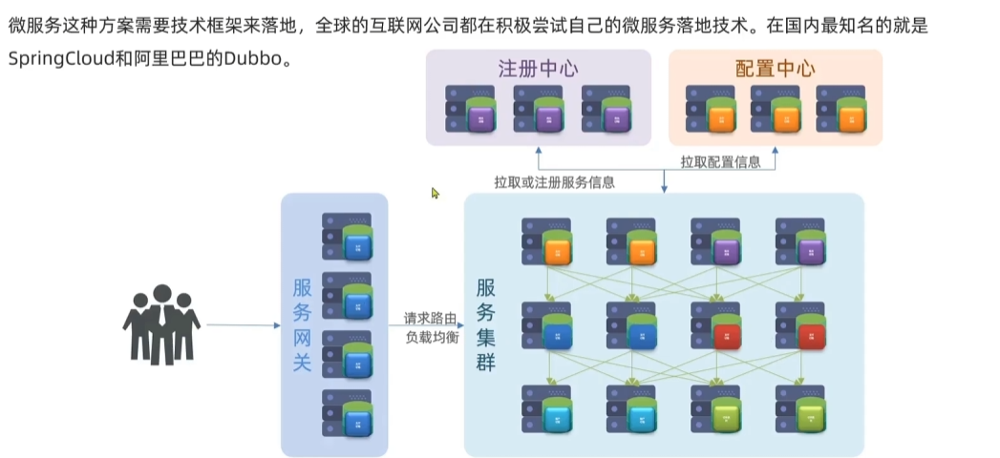
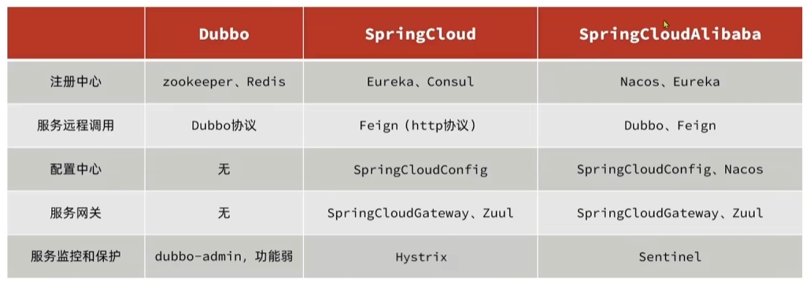
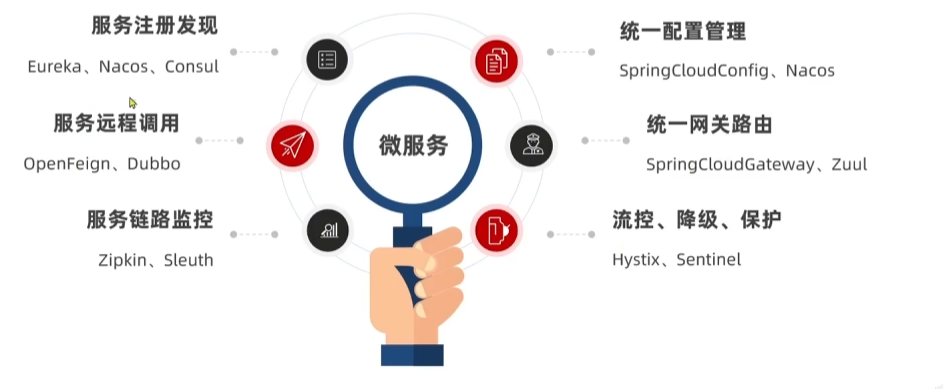
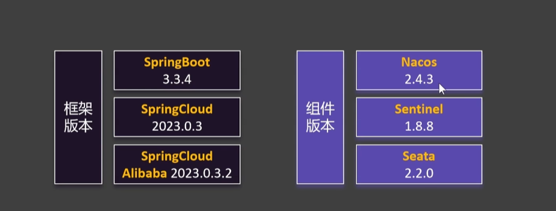
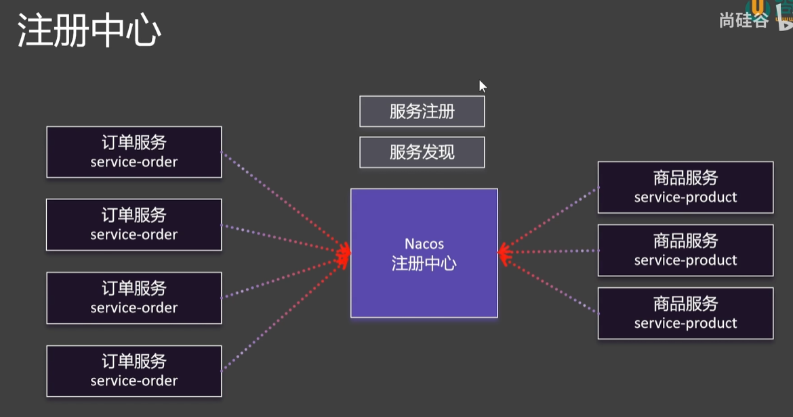
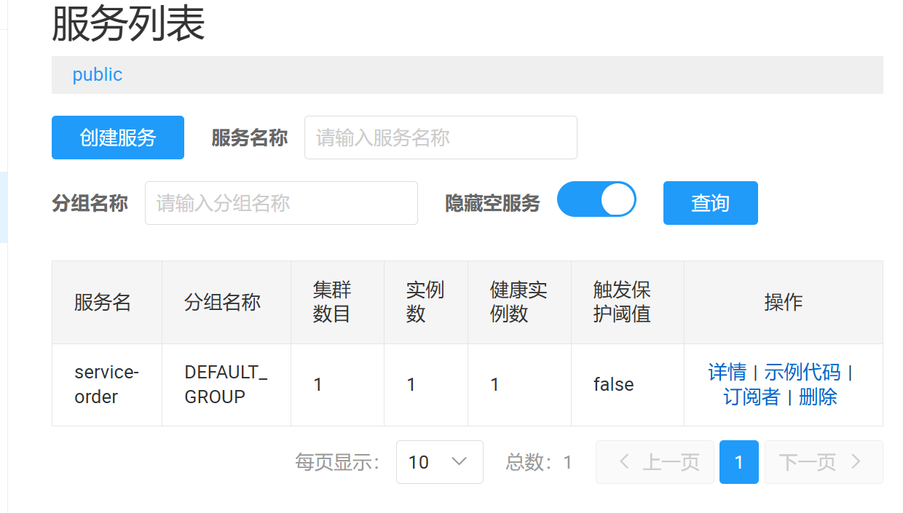

# SpringCloud笔记

## 何为微服务

微服务是一种经过良好架构设计的分布式框架方案，微服务框架特征如下：

单一职责：微服务拆分粒度更小，每一个服务对应唯一的业务能力，做到单一职责，避免重复业务开发

面向服务：微服务对外暴露业务接口

自治：团队独立，技术独立，数据独立，部署独立



微服务框架



相关功能




微服务拆分事项

1.不同微服务不要重复开发相同业务

2.微服务数据独立，不要访问其他微服务数据库

3.微服务将自己的业务暴露为接口，供其他微服务调用


## 项目创建



引入父工程版本管理，引入SpringCloud和SpringCloudAlibaba的版本管理

```xml
<?xml version="1.0" encoding="UTF-8"?>
<project xmlns="http://maven.apache.org/POM/4.0.0" xmlns:xsi="http://www.w3.org/2001/XMLSchema-instance"
         xsi:schemaLocation="http://maven.apache.org/POM/4.0.0 https://maven.apache.org/xsd/maven-4.0.0.xsd">
    <modelVersion>4.0.0</modelVersion>
    <parent>
        <groupId>org.springframework.boot</groupId>
        <artifactId>spring-boot-starter-parent</artifactId>
        <version>3.3.4</version>
        <relativePath/> <!-- lookup parent from repository -->
    </parent>
    <packaging>pom</packaging>
    <groupId>com.nwpu</groupId>
    <artifactId>LearnAnother</artifactId>
    <version>0.0.1-SNAPSHOT</version>
    <name>LearnAnother</name>
    <description>LearnAnother</description>
    <url/>
    <licenses>
        <license/>
    </licenses>
    <developers>
        <developer/>
    </developers>
    <scm>
        <connection/>
        <developerConnection/>
        <tag/>
        <url/>
    </scm>
    <properties>
        <!-- JDK 版本 -->
        <java.version>17</java.version>

        <!-- Spring Boot 版本 (需与 Spring Cloud 2023.0.x 兼容) -->
        <spring-boot.version>3.2.0</spring-boot.version>

        <!-- Spring Cloud 版本 (2023.0.x) -->
        <spring-cloud.version>2023.0.3</spring-cloud.version>

        <!-- Spring Cloud Alibaba 版本 (需与 SC 2023.0.x 适配) -->
        <spring-cloud-alibaba.version>2023.0.3.2</spring-cloud-alibaba.version>
    </properties>

    <dependencyManagement>
        <dependencies>
            <!-- Spring Boot Starter Parent (可选) -->
            <dependency>
                <groupId>org.springframework.boot</groupId>
                <artifactId>spring-boot-starter-parent</artifactId>
                <version>${spring-boot.version}</version>
                <type>pom</type>
                <scope>import</scope>
            </dependency>
            <!-- Spring Cloud BOM -->
            <dependency>
                <groupId>org.springframework.cloud</groupId>
                <artifactId>spring-cloud-dependencies</artifactId>
                <version>${spring-cloud.version}</version>
                <type>pom</type>
                <scope>import</scope>
            </dependency>
            <!-- Spring Cloud Alibaba BOM -->
            <dependency>
                <groupId>com.alibaba.cloud</groupId>
                <artifactId>spring-cloud-alibaba-dependencies</artifactId>
                <version>${spring-cloud-alibaba.version}</version>
                <type>pom</type>
                <scope>import</scope>
            </dependency>
        </dependencies>
    </dependencyManagement>

    <build>
        <plugins>
            <plugin>
                <groupId>org.springframework.boot</groupId>
                <artifactId>spring-boot-maven-plugin</artifactId>
            </plugin>
        </plugins>
    </build>

</project>
```

在其子级中建立services模块作为统一依赖配置管理，services下创建各个微服务


## 注册中心



下载Nacos：在对应目录下使用如下指令启动Nacos服务

```
startup.cmd -m standalone
```

这个时候就可以访问Nacos的管理页面了

```
http://localhost:8848/nacos
```


### 注册流程

1.启动微服务

2.引入服务发现依赖

```html
<dependency>
    <groupId>com.alibaba.cloud</groupId>
    <artifactId>spring-cloud-starter-alibaba-nacos-discovery</artifactId>
</dependency>
```

3.配置Nacos地址：地址端口默认如下

```yaml
spring:
  application:
    name: service-order
  cloud:
    nacos:
      discovery:
        server-addr: 127.0.0.1:8848

server:
  port: 8000
```

4.查看注册中心效果：启动微服务，查看Nacos管理页面



5.集群模式启动测试

通过复制配置的方式传入端口参数在不同端口启动相同程序形成集群

```
--server.port=8002
```


### 服务发现

想要获取到在Nacos中注册的所有服务以及其对应的IP端口可以通过以下步骤实现

1.开启服务发现功能：@EnableDiscoveryClient，这个根据有些版本可以自动开启服务发现，无需手动配置

```java
@EnableDiscoveryClient
@SpringBootApplication
public class OrderMainApplication {
    public static void main(String[] args) {
        SpringApplication.run(OrderMainApplication.class, args);
    }
}
```

2.测试服务发现API： DiscoveryClient

```java
@SpringBootTest
class OrderMainApplicationTest {
    @Autowired
    DiscoveryClient discoveryClient;

    @Test
    void contextLoads() {
        List<String> services = discoveryClient.getServices();
        for (String service : services) {
            System.out.println("service:"+ service);
        /*  获取服务
            service:service-order
s           service:service-product
         */
        }
        //更具服务名称获取对应实例
        List<ServiceInstance> instances = discoveryClient.getInstances("service-order");
        for (ServiceInstance instance : instances) {
            /*
                 ip:192.168.20.29
                 port:8000
             */
            System.out.println("ip:"+ instance.getHost());
            System.out.println("port:"+ instance.getPort());
            System.out.println();
        }
    }
}
```

3.测试服务发现API： NacosServiceDiscovery和上面的同理，只能使用引入Nacos注册的服务


### 远程调用

可以通过服务名称获取对应的实例，任取一个通过http请求url获取数据

Rest Template是一个线程安全的对象，也可以配置放入Bean中注入使用

```java
@GetMapping("{userId}/{proId}")
public String order(@PathVariable int userId, @PathVariable int proId) {
    Product product = getProduct(proId);
    Order order = new Order();
    order.setUserId(userId);
    order.setPrice(product.getPrice());
    orderService.save(order);
    return order.toString();
}

private Product getProduct(int proId) {
    List<ServiceInstance> instances = discoveryClient.getInstances("service-product");
    ServiceInstance instance = instances.get(0);
    //拼接url
    String url = "http://" + instance.getHost() + ":" + instance.getPort() + "/product/" + proId;
    RestTemplate restTemplate = new RestTemplate();
    return restTemplate.getForObject(url, Product.class);
}
```


### 负载均衡

我们在上述方式中采用的是服务实例的第一个服务，不能负载均衡，我们只需要调整调用的实例方式就可以实现负载均衡，在实际中使用LoadBalancerClient实现，自带负载均衡获取到实例

**loadBalancerClient实现**

```xml
<dependency>
    <groupId>org.springframework.cloud</groupId>
    <artifactId>spring-cloud-starter-loadbalancer</artifactId>
</dependency>
```

```java
@Autowired
LoadBalancerClient loadBalancerClient;
@Test
void test() {
    ServiceInstance instance = loadBalancerClient.choose("service-product");
    System.out.println(instance.getHost() + ":" + instance.getPort());
    instance = loadBalancerClient.choose("service-product");
    System.out.println(instance.getHost() + ":" + instance.getPort());
}
```


**注解实现**

放入一个负载均衡的RestTemplate

```java
@Configuration
public class CloudConfig {
    @LoadBalanced
    @Bean
    public RestTemplate restTemplate() {
        return new RestTemplate();
    }
}
```

直接在ip端口写服务名称，会被动态替换为对应负载均衡后的ip端口

```java
@Autowired
RestTemplate restTemplate;

private Product getProduct(int proId) {
    String url = "http://service-product/product/" + proId;
    return restTemplate.getForObject(url, Product.class);
}
```


