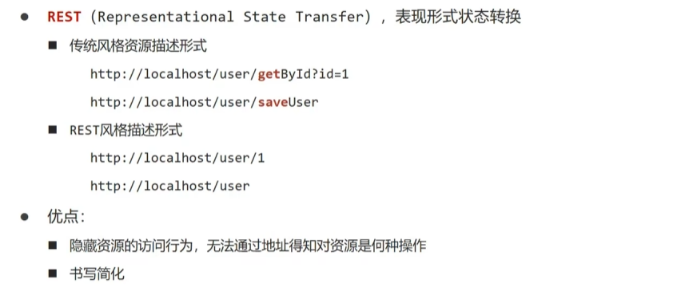
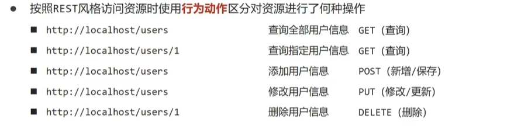
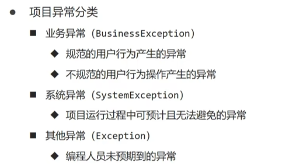
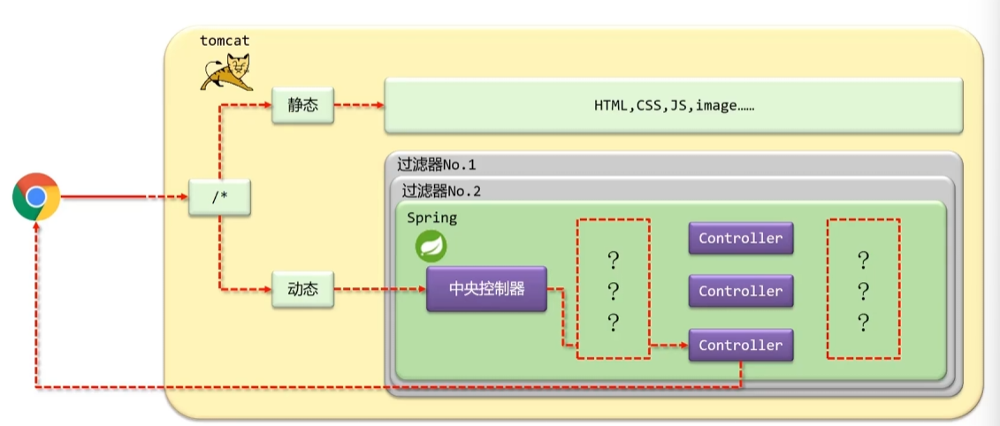
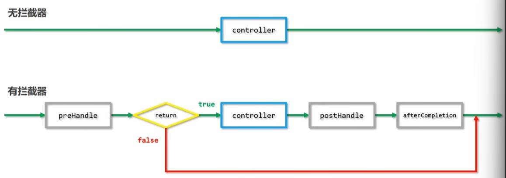
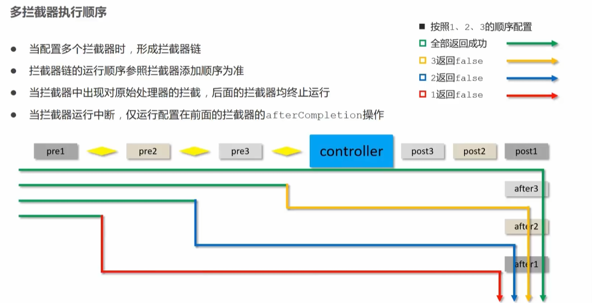

# SpringMVC笔记

## REST风格

Representational State Transfer 表现形式状态转换


通过访问的路径和访问的类别区分操作，一般资源后缀要加上s



使用这种风格访问资源称之为RESTful

http://localhost:8080/MVCTest_war/rests/17

```java
@RequestMapping(value = "/rests/{age}", method = RequestMethod.DELETE)
@ResponseBody
public String deleteRest(@PathVariable Integer age) {
    System.out.println("delete " + age);//delete 17
    return "success";
}
```

通过{age}建立映射，以及设置@PathVariable注解我们可以从路径上获取到参数，用method设置相应请求的类型

以下是查询的格式

```java
@Controller
public class RestTestController {
    @RequestMapping(value = "/rests", method = RequestMethod.GET)
    @ResponseBody
    public String getAllRests() {
        System.out.println("Get all rests");
        return "success";
    }

    @RequestMapping(value = "/rests/{age}", method = RequestMethod.GET)
    @ResponseBody
    public String getByAge(@PathVariable Integer age) {
        System.out.println("Get rest by age:" + age);
        return "success";
    }
}
```


Rest简化开发，我们将Mapping映射的rests提出放在类上，方法就可以只写路径参数或者不写了

我们方法上的所有方法都被@ResponseBody标注，可以将注解外提到类上，对所有的方法设置请求响应体

还可以将@Controller @ResponseBody两个注解合二为一为@RestController

```java
//@Controller
//@ResponseBody
@RestController//将上述合二为一
@RequestMapping("/rests")
public class RestsTestController {
    @RequestMapping(method = RequestMethod.GET)
    public String getAllRests() {
        System.out.println("Get all rests");
        return "success";
    }

    @RequestMapping(value = "{age}", method = RequestMethod.GET)
    public String getByAge(@PathVariable Integer age) {
        System.out.println("Get rest by age:" + age);
        return "success";
    }

    @RequestMapping(value = "{age}", method = RequestMethod.DELETE)
    public String deleteRest(@PathVariable Integer age) {
        System.out.println("delete " + age);
        return "success";
    }

    @RequestMapping(method = RequestMethod.PUT)
    @ResponseBody
    public String updateRest(@RequestParam String name, @RequestParam int age) {
        System.out.println("update " + name + " " + age);
        return "success";
    }
}
```

再次用XxxMapping简化

```java
//@Controller
//@ResponseBody
@RestController//将上述合二为一
@RequestMapping("/rests")
public class RestsTestController {
//    @RequestMapping(method = RequestMethod.GET)
    @GetMapping
    public String getAllRests() {
        System.out.println("Get all rests");
        return "get all success";
    }

//    @RequestMapping(value = "{age}", method = RequestMethod.GET)
    @GetMapping("{age}")
    public String getByAge(@PathVariable Integer age) {
        System.out.println("Get rest by age:" + age);
        return "get one success";
    }

//    @RequestMapping(value = "{age}", method = RequestMethod.DELETE)
    @DeleteMapping("{age}")
    public String deleteRest(@PathVariable Integer age) {
        System.out.println("delete " + age);
        return "delete success";
    }
//    @RequestMapping(value = "{age}", method = RequestMethod.Put)
    @PutMapping("{age}")
    public String updateRest(@PathVariable Integer age) {
        System.out.println("update " + age);
        return "update success";
    }
}
```


我们在前面ServletContainersInitConfig配置中拦截了所有的请求，所以当访问html页面的时候会被SpringMVC拦截，我们需要新建一个SpringMvcSupport类来对相应的资源放行

SpringMvcConfig配置也要扫瞄config包中的SpringMvcSupport类才可以正常使用

```java
@Configuration
@ComponentScan({"com.learn.controller", "com.learn.config"})
@EnableWebMvc
public class SpringMvcConfig {
}
```


```java
package com.learn.config;

import org.springframework.context.annotation.Configuration;
import org.springframework.web.servlet.config.annotation.ResourceHandlerRegistry;
import org.springframework.web.servlet.config.annotation.WebMvcConfigurationSupport;


@Configuration
public class SpringMvcSupport extends WebMvcConfigurationSupport {
    @Override
    protected void addResourceHandlers(ResourceHandlerRegistry registry) {
        registry.addResourceHandler("/pages/**").addResourceLocations("/pages/");
    }
}
```


## SSM开发整合

### MyBatis

```html
<?xml version="1.0" encoding="UTF-8"?>
<!DOCTYPE configuration
        PUBLIC "-//mybatis.org//DTD Config 3.0//EN"
        "http://mybatis.org/dtd/mybatis-3-config.dtd">
<configuration>
    <!--    <settings>-->
    <!--        <setting name="logImpl" value="STDOUT_LOGGING"/>-->
    <!--    </settings>-->
    <environments default="dev">
        <environment id="dev">
            <transactionManager type="JDBC"/>
            <dataSource type="POOLED">
                <property name="driver" value="com.mysql.cj.jdbc.Driver"/>
                <property name="url" value="jdbc:mysql://localhost:3306/ssm?useSSL=false&amp;serverTimezone=UTC"/>
                <property name="username" value="root"/>
                <property name="password" value="654321"/>
            </dataSource>
        </environment>

    </environments>
    <mappers>
        <!--        用于编写SQL语句的文件-->
        <mapper resource="UserMapper.xml"/>
    </mappers>
</configuration>
```

```html
<?xml version="1.0" encoding="UTF-8"?>
<!DOCTYPE mapper
        PUBLIC "-//mybatis.org//DTD Mapper 3.0//EN"
        "http://mybatis.org/dtd/mybatis-3-mapper.dtd">
<mapper namespace="userMapper">
    <select id="selectById" resultType="com.bean.User">
        select * from user where `id` = #{id};
    </select>
    <insert id="insertUser">
        insert into user values (#{id}, #{password}, #{balance});
    </insert>
</mapper>
```


### Dao

写的很简陋，将异常处理之类的都暂时省略

```java
@Repository("userDaoImpl")
public class UserDaoImpl implements UserDao {
    @Override
    public User getUserById(Integer id) {
        SqlSession sqlSession = SqlSessionUtil.getSqlSession();
        Object object = sqlSession.selectOne("selectById", id);
        return (User) object;
    }

    @Override
    public int insertUser(User user) {
        SqlSession sqlSession = SqlSessionUtil.getSqlSession();
        int i = sqlSession.insert("insertUser", user);
        if (i > 0) {
            sqlSession.commit();
        } else {
            sqlSession.rollback();
        }
        return i;
    }
}
```


### Utils

```java
package com.utils;

import org.apache.ibatis.io.Resources;
import org.apache.ibatis.session.SqlSession;
import org.apache.ibatis.session.SqlSessionFactory;
import org.apache.ibatis.session.SqlSessionFactoryBuilder;

import java.io.IOException;

public class SqlSessionUtil {
    private static SqlSessionFactory sqlSessionFactory;
    static {
        try {
            sqlSessionFactory = new SqlSessionFactoryBuilder()
                    .build(Resources.getResourceAsStream("mybatis-config.xml"));
        } catch (IOException e) {
            throw new RuntimeException(e);
        }
    }

    private SqlSessionUtil() {}
    public static SqlSession getSqlSession() {
        return sqlSessionFactory.openSession();
    }
}
```


### Cotroller

在整合使用的时候，Spring的使用需要jdk17版本，而且@PathVariable("id")需要显式的指定参数名称

```java
@RestController
@RequestMapping("/users")
public class UserController {
    @Autowired
    private UserDao userDao;

    @GetMapping("{id}")
    public User getUserById(@PathVariable("id") Integer id) {
        return userDao.getUserById(id);
    }

    @PostMapping
    public String insertUser(@RequestBody User user) {
        int update = userDao.insertUser(user);
        return "success update line:" + update;
    }
}
```


## 异常处理器

我们很容易想到通过AOP包围处理的代码

而SpringMVC中有注解可以有效处理异常

@RestControllerAdvice注解是控制的通知，而@ExceptionHandler(XxException.class)可以在发生相应异常的时候做对应处理

```java
@RestControllerAdvice
public class ProjectExceptionAdvice {
    @ExceptionHandler(NullPointerException.class)
    public void doException(Exception ex) {
        System.out.println("空指针异常被捕获");
    }
}
```





## 拦截器

是一种动态拦截方法调用的机制，在SpringMVC中动态拦截控制器方法的执行



作用：在指定的方法调用前后执行预先设定的代码，或者阻止原始方法的执行




根据preHandle中的返回boolean判定是继续执行还是直接跳过后续执行


拦截器和过滤器的区别

Filter属于Servlet技术，Interceptor属于SpringMVC技术

Filter对所有访问进行增强，而Interceptor仅针对SpringMVC的访问进行增强


### 入门使用

在表现层新建一个ProjectInterceptor类实现HandlerInterceptor接口

```java
package com.controller;

import org.springframework.stereotype.Component;
import org.springframework.web.servlet.HandlerInterceptor;
import org.springframework.web.servlet.ModelAndView;

import javax.servlet.http.HttpServletRequest;
import javax.servlet.http.HttpServletResponse;

@Component
public class ProjectInterceptor implements HandlerInterceptor {
    @Override
    public boolean preHandle(HttpServletRequest request, HttpServletResponse response, Object handler) throws Exception {
        System.out.println("preHandle");
        return true;
        //这里返回false代表终止原始操作，之后的postHandleafter  Completion也不会执行
    }

    @Override
    public void postHandle(HttpServletRequest request, HttpServletResponse response, Object handler, ModelAndView modelAndView) throws Exception {
        System.out.println("postHandle");
    }

    @Override
    public void afterCompletion(HttpServletRequest request, HttpServletResponse response, Object handler, Exception ex) throws Exception {
        System.out.println("afterCompletion");
    }
}
```

配置SpringMvcSupport，添加重写方法，注入刚才编写的ProjectInterceptor，将类传入addInterceptor方法中，在调用addPathPatterns设置拦截路径

/**为所有的子路径

/*为一级子路径

没有通配符只匹配精确路径

```java
@Configuration
public class SpringMvcSupport extends WebMvcConfigurationSupport {
    @Autowired
    private ProjectInterceptor projectInterceptor;
    
    @Override
    protected void addInterceptors(InterceptorRegistry registry) {
        registry.addInterceptor(projectInterceptor).addPathPatterns("/users/**");
    }
}
```

输出结果

```
preHandle //原始操作之前的代码
postHandle//原始操作之后的代码
afterCompletion//post之后的代码
```


### 简化配置

通过SpringMvcConfig配置类继承于WebMvcConfigurer接口，重写addInterceptors方法，即可简化实现，再扫描的时候不需要扫描config软件包下SpringMvcSupport

```java
@Configuration
@ComponentScan({"com.controller"})
@EnableWebMvc
public class SpringMvcConfig implements WebMvcConfigurer {
    @Autowired
    private ProjectInterceptor projectInterceptor;

    @Override
    public void addInterceptors(InterceptorRegistry registry) {
        registry.addInterceptor(projectInterceptor).addPathPatterns("/users/**");
    }
}
```

这种方式相较而言简便但是有缺陷，会和Spring强制绑定


### 拦截器参数

HttpServletRequest request, HttpServletResponse response,

Object handler通过方法传入的参数可以从其中取出数据，其中handler是方法的对象

ModelAndView modelAndView 其中封装了页面跳转的一些方法供以处理

Exception ex 是异常信息，而我们在使用的时候一般使用异常处理器完成，而不用这个

其中最常用的是preHandle，通过参数做校验，判断是否继续执行后续方法


### 拦截链配置

```java
@Configuration
@ComponentScan({"com.controller"})
@EnableWebMvc
public class SpringMvcConfig implements WebMvcConfigurer {
    @Autowired
    private ProjectInterceptor projectInterceptor;
    @Autowired
    private AnotherInterceptor anotherInterceptor;

    @Override
    public void addInterceptors(InterceptorRegistry registry) {
        registry.addInterceptor(projectInterceptor).addPathPatterns("/users/**");
        registry.addInterceptor(anotherInterceptor).addPathPatterns("/users/**");
    }
}
```

```
preHandle
another preHandle
another postHandle
postHandle
another afterCompletion
afterCompletion
```

顺序和添加的拦截器顺序有关

```java
registry.addInterceptor(projectInterceptor).addPathPatterns("/users/**");
        registry.addInterceptor(anotherInterceptor).addPathPatterns("/users/**");
```

前处理器按配置先后执行，而后处理器反向执行

以下是当preHandle返回false的时候的处理顺序，总的来说就是先返回true后的afterCompletion无论如何后续拦截器preHandle返回false与否都要执行先前afterCompletion方法


