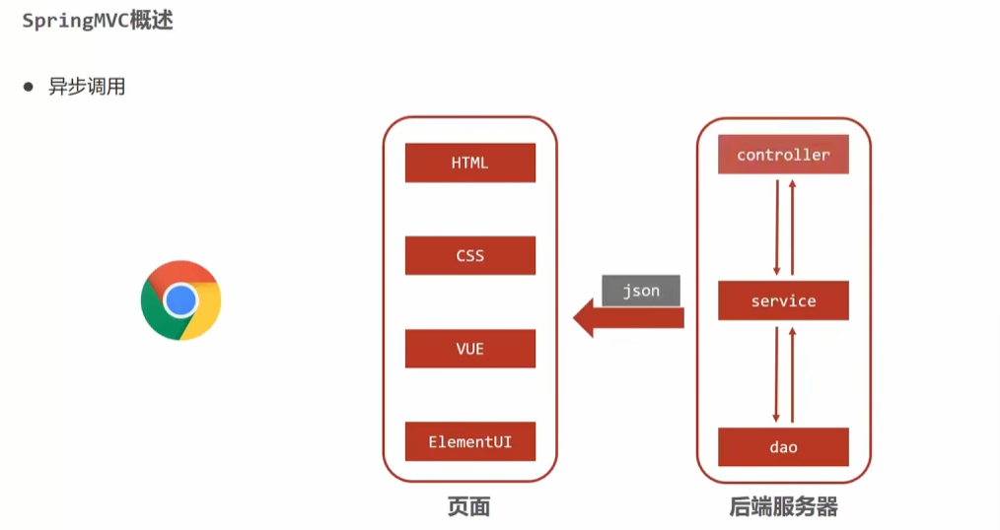
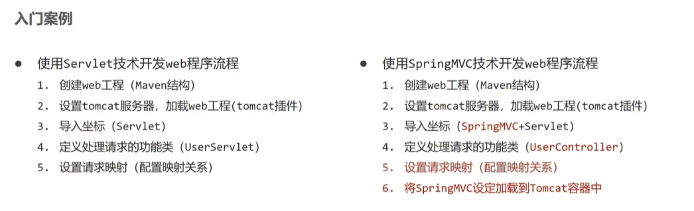
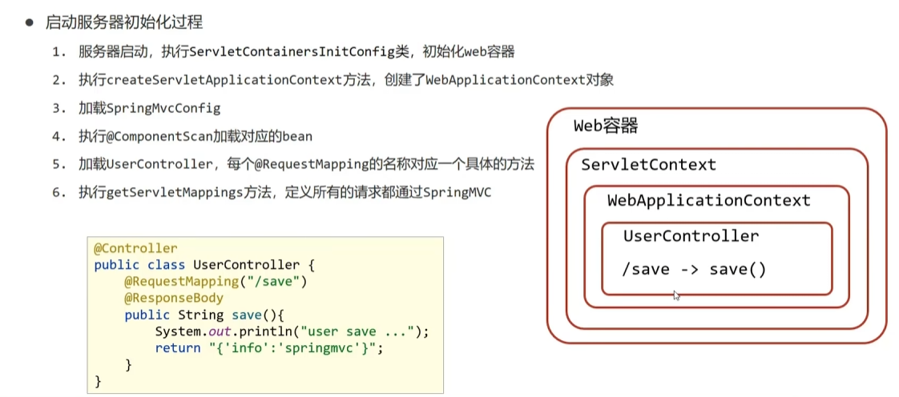
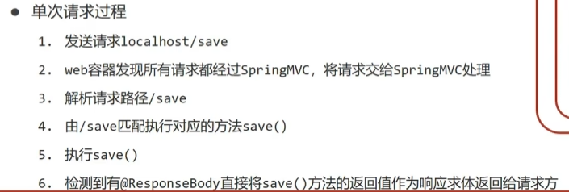

# SpringMVC笔记

由于时间紧张，这个部分的学习用的是黑马的六小时速成视频


## SpringMVC简介

在之前的小项目中我们采用的是JSP+Servlet+Dao的方式实现Web开发

而我们现在采取的方式如下图所示，SpringMVC负责的是控制器的制作以及将json数据传送给前端




## 入门案例

程序编写的对应关系



导入Maven配置文件

```html
<project xmlns="http://maven.apache.org/POM/4.0.0" xmlns:xsi="http://www.w3.org/2001/XMLSchema-instance"
  xsi:schemaLocation="http://maven.apache.org/POM/4.0.0 http://maven.apache.org/maven-v4_0_0.xsd">
  <modelVersion>4.0.0</modelVersion>
  <groupId>com.learn</groupId>
  <artifactId>MVCTest</artifactId>
  <packaging>war</packaging>
  <version>1.0-SNAPSHOT</version>
  <name>MVCTest Maven Webapp</name>
  <url>http://maven.apache.org</url>
  <dependencies>
    <dependency>
      <groupId>junit</groupId>
      <artifactId>junit</artifactId>
      <version>3.8.1</version>
      <scope>test</scope>
    </dependency>
    <dependency>
      <groupId>org.springframework</groupId>
      <artifactId>spring-webmvc</artifactId>
      <version>5.2.10.RELEASE</version>
    </dependency>

    <!-- Servlet API (Tomcat 10+/Jakarta EE 10) -->
    <dependency>
      <groupId>javax.servlet</groupId>
      <artifactId>javax.servlet-api</artifactId>
      <version>3.1.0</version>
      <scope>provided</scope> <!-- 由容器提供 -->
    </dependency>
  </dependencies>
  <build>
    <finalName>MVCTest</finalName>
  </build>
</project>
```


编写MVC的配置类，作用是扫描对应包下组件

```java
package com.learn.config;

import org.springframework.context.annotation.ComponentScan;
import org.springframework.context.annotation.Configuration;

@Configuration
@ComponentScan("com.learn.controller")
public class SpringMvcConfig {
}
```


编写Controller类

作用和Servlet一致，通过@RequestMapping("/save")注解映射到对应路径类的本身通过Controller注解标识

```java
package com.learn.controller;

import org.springframework.stereotype.Controller;
import org.springframework.web.bind.annotation.RequestMapping;

@Controller
public class UserController {
    @RequestMapping("/save")
    public void save() {
        System.out.println("User saved");
    }
}
```


Spring MVC 中用于 **替代传统 `web.xml` 配置的基于 Java 的初始化类**，它通过实现 `AbstractDispatcherServletInitializer` 抽象类来完成 Spring MVC 的初始化配置

```java
package com.learn.config;

import org.springframework.web.context.WebApplicationContext;
import org.springframework.web.context.support.AnnotationConfigWebApplicationContext;
import org.springframework.web.servlet.config.annotation.WebMvcConfigurerAdapter;
import org.springframework.web.servlet.support.AbstractDispatcherServletInitializer;

public class ServletContainersInitConfig extends AbstractDispatcherServletInitializer {
    //加载容器对象
    @Override
    protected WebApplicationContext createServletApplicationContext() {
        AnnotationConfigWebApplicationContext context = new AnnotationConfigWebApplicationContext();
        context.register(SpringMvcConfig.class);
        return context;
    }

    //过滤所有的对象管理，归SpringMVC管理
    @Override
    protected String[] getServletMappings() {
        return new String[]{"/"};
    }

    @Override
    protected WebApplicationContext createRootApplicationContext() {
        return null;
    }
}
```


我们上述访问/save路径的时候网页会发生错误，这是因为我们没有设置响应体，我们现在通过@ResponseBody注解标识返回的内容直接显示在页面上

```java
@Controller
public class UserController {
    @RequestMapping("/save")
    @ResponseBody
    public String save() {
        System.out.println("User saved");
        return "{'info':'User saved'}";
    }
}
```


启动服务器请求




单次请求过程




Spring和SpringMVC加载管理

我们在实际使用Spring和SpringMVC管理Bean对象的时候，我们一般用SpringMVC扫描controller包，而Spring扫描dao包以及service包，要使得他们二者管理的范围不重复，我们有两种方式

第一种：分别扫描具体的包

```java
@Configuration
@ComponentScan({"com.learn.service", "com.learn.dao"})
public class SpringConfig {
}
```

第二种：扫描外层包，在排除对应不需要的包

```java
@Configuration
@ComponentScan(value = "com.learn",
        excludeFilters = @ComponentScan.Filter(
                type = FilterType.ANNOTATION,
                classes = Controller.class
        )
)
public class SpringConfig {
}
```

这样的话我们执行一个测试语句，可以测试出controller的管理范围不在Spring中

```java
@Test
    public void TestMVC() {
        AnnotationConfigApplicationContext ctx = new AnnotationConfigApplicationContext();
        ctx.register(SpringConfig.class);
        ctx.refresh();
        UserController user = ctx.getBean("userController", UserController.class);
        user.save();
    }

    @Test
    public void TestSpring() {
        AnnotationConfigApplicationContext ctx = new AnnotationConfigApplicationContext();
        ctx.register(SpringConfig.class);
        ctx.refresh();
        TestPrint testPrint = ctx.getBean("testPrint", TestPrint.class);
        testPrint.print();
    }
```


最后我们还需要将Spring纳入ServletContainersInitConfig的管理，将Spring也在Tomcat启动的时候初始化

```java
@Override
protected WebApplicationContext createRootApplicationContext() {
    AnnotationConfigWebApplicationContext context = new AnnotationConfigWebApplicationContext();
    context.register(SpringConfig.class);
    return context;
}
```

因为上述代码较为麻烦，SpringMVC为我们提供了一个更加方便地实现，

我们的初始化类我们还可以用ServletContainersInitConfig类继承于AbstractAnnotationConfigDispatcherServletInitializer，也可以实现预期的功能

```java
public class ServletContainersInitConfig extends AbstractAnnotationConfigDispatcherServletInitializer {
    @Override
    protected Class<?>[] getRootConfigClasses() {
        return new Class[]{SpringConfig.class};
    }

    @Override
    protected Class<?>[] getServletConfigClasses() {
        return new Class[]{SpringMvcConfig.class};
    }

    @Override
    protected String[] getServletMappings() {
        return new String[]{"/"};
    }
}
```


## 请求路径映射

我们在前面编写了一个Controller，我们现在再加一个

```java
@Controller
public class UserController {
    @RequestMapping("/user/save")
    @ResponseBody
    public String save() {
        System.out.println("User saved");
        return "{'info':'User saved'}";
    }
}
```

```java
@Controller
public class BookController {
    @RequestMapping("/book/save")
    @ResponseBody
    public String save() {
        System.out.println("User saved");
        return "{'info':'User saved'}";
    }
}
```

要区分相同的请求路径我们需要在Mapping映射的时候加上不同的前缀以示区分，除此之外我们看还可以在类上加上前缀，后面是调用名称

```java
@Controller
@RequestMapping("/user")
public class UserController {
    @RequestMapping("/save")
    @ResponseBody
    public String save() {
        System.out.println("User saved");
        return "{'info':'User saved'}";
    }
}
```


## 请求参数传递

### 普通参数传递

```java
@RequestMapping("/commonParam")
    @ResponseBody
    public String commonParam(String name) {
        System.out.println("普通参数传递" + name);
        return "{'name':'"+name+"'}";
    }
```

get请求传入name、age参数

```
http://localhost:8080/MVCTest_war/user/commonParam?name=nameTest&age=10
```

接收两个参数

```java
@RequestMapping("/commonParam")
    @ResponseBody
    public String commonParam(String name, int age) {
        System.out.println("普通参数传递" + name + " " + age);
        return "name:" + name + ",age:" + age;
    }
```

在这里post和get不做区分

post在body中编辑请求体参数


不同名字参数传递，我们上述的请求名和处理器的参数变量名一致，当不一致的时候我们通过@RequestParam("name")注解绑定变量名称，默认为变量名称

```java
@RequestMapping("/commonParam")
@ResponseBody
public String commonParam(@RequestParam("name") String userName, int age) {
    System.out.println("普通参数传递" + userName + " " + age);
    return "name:" + userName + ",age:" + age;
}
```


### 对象传参

此外我们在实际使用的时候往往传入的是一个bean对象

```java
public class User {
    private String name;
    private int age;
    public User() {}
    ...
}
```

在接受的时候我们可以使用这个bean对象接收参数

```java
@RequestMapping("/commonParam")
@ResponseBody
public String commonParam(User user) {
    System.out.println(user);
    return "{'info':'User saved'}";
}
```


### 类嵌套传参

假设我们User现在有了一个新的引用类对象

```java
public class Address {
    private String city;
    private String province;
    public Address() {}
    public Address(String city, String province) {
        this.city = city;
        this.province = province;
    }
    ...
}
```

我们要对于这个对象的请求进行赋值

http://localhost:8080/MVCTest_war/user/commonParam?name=Jack&age=10&address.city=Xian&address.province=Shanxi

通过address.属性名的形式我们可以进行对于引用对象进行参数的赋值

```java
@RequestMapping("/commonParam")
@ResponseBody
public String commonParam(User user) {
    System.out.println(user);
    return "{'info':'User saved'}";
}
```


### List数据传输

用List集合接收参数，这里需要使用@RequestParam注解将结果放入List中，如果不设置注解则会尝试创建List接口对象从而导致报错

```java
@RequestMapping("/commonParam")
@ResponseBody
public String commonParam(@RequestParam List<String> likes) {
    System.out.println(likes);
    return "{'info':'likes'}";
}
```


### json数据传参

加入JSON的相关依赖

```html
<dependency>
  <groupId>com.google.code.gson</groupId>
  <artifactId>gson</artifactId>
  <version>2.10.1</version>
</dependency>
```

在配置中加上@EnableWebMvc注解

```java
@Configuration
@ComponentScan("com.learn.controller")
@EnableWebMvc
public class SpringMvcConfig {   
}
```

在请求体中设置发送json格式的数据

```
["game", "music", "travel"]
```

即可在控制器中用@RequestBody注解将json内容放入集合中

```java
@RequestMapping("/commonParam")
    @ResponseBody
    public String commonParam(@RequestBody List<String> likes) {
        System.out.println(likes);
        return "{'info':'likes'}";
    }
```


对于Bean对象的赋值

发送的json数据

```json
{
    "name":"Jack",
    "age":15,
    "address":{
        province:beijing,
        city:beijing
    }
}
```

```java
@RequestMapping("/commonParam")
    @ResponseBody
    public String commonParam(@RequestBody User user) {
        System.out.println(user);
        return "{'info':'likes'}";
    }
```


### 日期类型传参

date1  2025/05/05

date2  2025-05-05

通过DateTimeFormat注解指定日期类型的格式

```java
@RequestMapping("/commonParam")
    @ResponseBody
    public String commonParam(Date date1, @DateTimeFormat(pattern = "yyyy-MM-dd") Date date2) {
        System.out.println(date1);
        System.out.println(date2);
        return "{'info':'likes'}";
    }
```

:::warning

当发现不能按照预期的格式进行转换的时候记得检查一下@EnableWebMvc接口是否配置，其功能之一是根据类型匹配对应的类型转换器

:::


## 响应请求

我们不加@ResponseBody的时候，返回的字符串，SpringMVC会去寻找对应的页面返回给客户端，加上后返回的则是字符串的内容

如果我们需要返回一个Java Bean对象，我们设置对应返回类型，然后返回对象实例即可，在客户端会收到json格式的数据内容，这里其实是Gson帮助我们转的json格式

```java
@RequestMapping("/returnBean")
@ResponseBody
public User returnBean() {
    User user = new User();
    user.setAge(10);
    user.setName("Jack");
    return user;
}
```

```json
{
    "name": "Jack",
    "age": 10
}
```


返回类集合同理

```java
@RequestMapping("/returnBean")
@ResponseBody
public List<User> returnBean() {
    List<User> result = new ArrayList<User>();
    User user = new User();
    user.setAge(10);
    user.setName("Jack");
    User user2 = new User();
    user2.setAge(20);
    user2.setName("Bob");
    result.add(user);
    result.add(user2);
    return result;
}
```

```json
[
    {
        "name": "Jack",
        "age": 10
    },
    {
        "name": "Bob",
        "age": 20
    }
]
```

