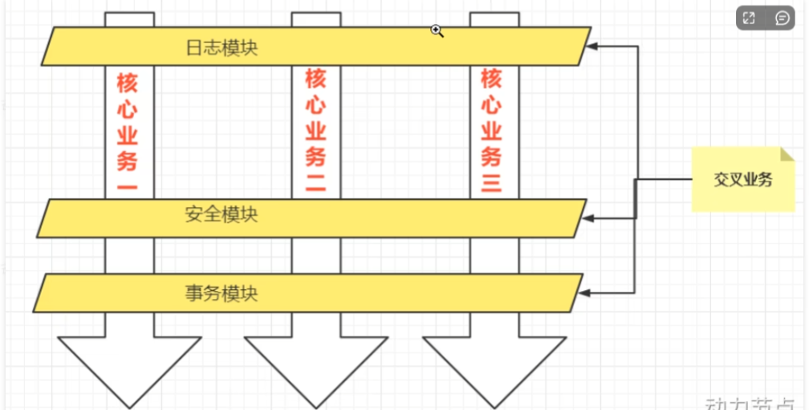

# Spring笔记

## AOP面向切面编程

AOP是一种编程技术，是对OOP的补充延申，底层采用动态代理实现，Spring AOP使用的动态代理是JDK动态代理 + CGLIB动态代理技术，Spring会在两者中切换

IoC使软件组件松耦合，AOP可以让你能够捕捉系统中经常使用的功能，把它转化为组件

一般一个系统当中都有一些系统服务，例如：日志，事务管理等称为交叉业务，切入核心代码中，在实现核心业务的时候不需要关系这些业务的实现



将于核心业务无关的代码独立提取出来，形成一个独立的组件，然后以横向交叉的方式运用到业务流程的过程中称之为AOP

:::note

AOP三大优点

1. 代码复用性强
2. 代码容易维护
3. 使得开发者更加专注于业务逻辑

:::


### AOP七大术语

连接点 Joinpoint：在程序的整个执行流程中，可以织入切面的位置，方法执行前后，异常抛出之后等位置

切点 Pointcut：在程序执行流程中，真正织入切面的方法（一个切点对应多个连接点）

通知 Advice：通知又称为增强，就是具体你要织入的代码，包括了以下的五种通知：前置通知，后置通知，环绕通知，异常通知，最终通知

切面 Aspect：切点+通知即为切面

织入 Weaving：把通知应用到目标对象的过程

代理对象 Proxy：一个目标对象被织入通知后产生的新对象

目标对象 Target：被织入通知的对象


## 切点表达式

切点表达式用来定义通知往哪些方法切入

切入点表达式的语法格式

```
execution([访问权限] 返回值类型 [全限定类名]方法名(形参列表) [异常])
```

访问权限：可选项，没写包括四个权限

返回类型：必填项，*表示任意类型

全限定类名：可选项，两个点".."代表当前包以及子包下的所有类，省略表示所有类

方法名：必填项，*表示所有方法，set*表示所有的set方法

形参列表：必填项，()表示无参，(..)表示参数类型和个数随意，(*)表示一个参数方法

异常：可选项，省略时表示任意类型异常


### 代码示例

Service包下所有的类中以delete开始的所有方法

```
execution(public * com.service.*delete*(..))
```

mall包下所有的类的所有方法

```
execution(* com.mail..*(..))
```

所有类的所有方法

```
execution(* *(..))
```


## Spring AOP

### AOP的实现

包括三种方式：

1.Spring框架结合AspectJ框架实现的AOP，基于注解方式

2.Spring框架结合AspectJ框架实现的AOP，基于XML方式

3.Spring框架自己实现的AOP，基于XML配置方式

在实际开发中，都是通过Spring + AspectJ实现AOP，重点掌握注解方式


### 使用方式

引入context依赖以及spring-aspects依赖

context默认有了，运用Maven添加spring-aspects依赖

```html
<!-- Spring Boot Starter AOP (包含 Spring AOP 核心功能) -->
<dependency>
    <groupId>org.springframework.boot</groupId>
    <artifactId>spring-boot-starter-aop</artifactId>
</dependency>

<!-- AspectJ 注解支持（可选，如果需要 @AspectJ 风格的切面） -->
<dependency>
    <groupId>org.aspectj</groupId>
    <artifactId>aspectjweaver</artifactId>
    <version>1.9.7</version> <!-- 版本可调整 -->
</dependency>
```

在spring配置文件中引入命名空间

```html
<?xml version="1.0" encoding="UTF-8"?>
<beans xmlns="http://www.springframework.org/schema/beans"
       xmlns:xsi="http://www.w3.org/2001/XMLSchema-instance"
       xmlns:context="http://www.springframework.org/schema/context"
       xmlns:aop="http://www.springframework.org/schema/aop"
       xsi:schemaLocation="http://www.springframework.org/schema/beans http://www.springframework.org/schema/beans/spring-beans.xsd
                           http://www.springframework.org/schema/context http://www.springframework.org/schema/context/spring-context.xsd
                           http://www.springframework.org/schema/aop http://www.springframework.org/schema/aop/spring-aop.xsd">
    <context:component-scan base-package="com.thrinisty.service"/>
</beans>
```


建立一个目标对象

```java
package com.thrinisty.service;

import org.springframework.stereotype.Service;

@Service("userService")
public class UserService {
    //目标类
    public void login() {
        System.out.println("系统登录");
    }
}
```

建立一个代理对象

使用Aspect注解表名是代理对象，使用Before注解传入切点表达式

```java
package com.thrinisty.service;

import org.aspectj.lang.annotation.Aspect;
import org.aspectj.lang.annotation.Before;
import org.springframework.stereotype.Component;

@Component("logAspect")
@Aspect
public class LogAspect {
    //切面 = 通知 + 切点
    @Before("execution(* com.thrinisty.service.UserService.*(..))")
    public void enhance() {
        System.out.println("一个通知，增强代码");
    }
}
```

spring配置

```html
<?xml version="1.0" encoding="UTF-8"?>
<beans xmlns="http://www.springframework.org/schema/beans"
       xmlns:xsi="http://www.w3.org/2001/XMLSchema-instance"
       xmlns:context="http://www.springframework.org/schema/context"
       xmlns:aop="http://www.springframework.org/schema/aop"
       xsi:schemaLocation="http://www.springframework.org/schema/beans http://www.springframework.org/schema/beans/spring-beans.xsd
                           http://www.springframework.org/schema/context http://www.springframework.org/schema/context/spring-context.xsd
                           http://www.springframework.org/schema/aop http://www.springframework.org/schema/aop/spring-aop.xsd">
    <context:component-scan base-package="com.thrinisty.service"/>
    <aop:aspectj-autoproxy proxy-target-class="true"/>
</beans>
```

运用context扫描service包下的类，使用aop自动代理，并使代理默认使用CGLIB代理

测试程序

```java
@Test
public void test() {
    ApplicationContext context = new ClassPathXmlApplicationContext("spring.xml");
    UserService userService = context.getBean("userService", UserService.class);
    userService.login();
}
```

```
一个通知，增强代码
系统登录
```

在调用方法之前，调用了前置通知，完成了织入


### 通知类型

是具体你要织入的代码，包括了以下的五种通知：前置通知（Before），后置通知（AfterReturning），环绕通知（Around），异常通知（AfterThrowing），最终通知（After）

```java
@Component("logAspect")
@Aspect
public class LogAspect {
    //切面 = 通知 + 切点
    @Before("execution(* com.thrinisty.service.OrderService.generate(..))")
    public void beforeAdvice() {
        System.out.println("前置通知");
    }

    @AfterReturning("execution(* com.thrinisty.service.OrderService.generate(..))")
    public void afterReturning() {
        System.out.println("后置通知");
    }

    @Around("execution(* com.thrinisty.service.OrderService.generate(..))")
    public void aroundAdvice(ProceedingJoinPoint joinPoint) throws Throwable {
        System.out.println("前环绕");
        joinPoint.proceed();//执行目标
        System.out.println("后环绕");
    }

    @After("execution(* com.thrinisty.service.OrderService.generate(..))")
    public void finalAdvice() {
        System.out.println("最终通知");
    }
}
```

执行顺序

```
前环绕
前置通知
生成订单
后置通知
最终通知
后环绕
```


我们在generate方法中抛出异常

```java
@Service
public class OrderService {
    public void generate() {
        System.out.println("生成订单");
        throw new RuntimeException();
    }
}
```

```java
@AfterThrowing("execution(* com.thrinisty.service.OrderService.generate(..))")
public void afterThrowing() {
    System.out.println("异常通知");
}
```

```
前环绕
前置通知
生成订单
异常通知
最终通知
```

后环绕和后置通知执行不到，在异常发生时异常通知，最终通知也正常


对于两个切面切入相同的的切点，可以通过@Order注解标注执行顺序，数字越小，优先级越高

```java
@Aspect
@Component
@Order(0)//原先的设置为1
public class SecurityAspect {
    @Before("execution(* com.thrinisty.service.OrderService.generate(..))")
    public void beforeAdvice() {
        System.out.println("前置通知：安全");
    }
}
```

```
前置通知：安全
前环绕
前置通知
生成订单
后置通知
最终通知
后环绕
```


### 通用切点

使用Pointcut注解可以复用一个切点

```java
@Component("logAspect")
@Aspect
@Order(0)
public class LogAspect {

    @Pointcut("execution(* com.thrinisty.service.OrderService.generate(..))")
    public void universe() {

    }

    //切面 = 通知 + 切点
    @Before("universe()")
    public void beforeAdvice() {
        System.out.println("前置通知");
    }
......
}
```

跨类也可以使用

```java
@Aspect
@Component
@Order(0)
public class SecurityAspect {
    @Before("com.thrinisty.service.LogAspect.universe()")
    public void beforeAdvice() {
        System.out.println("前置通知：安全");
    }
}
```


### 连接点

之前环绕通知使用过连接点 ProceedingJoinPoint joinPoint，作为参数传入

```java
@Around("execution(* com.thrinisty.service.OrderService.generate(..))")
public void aroundAdvice(ProceedingJoinPoint joinPoint) throws Throwable {
    System.out.println("前环绕");
    joinPoint.proceed();//执行目标
    System.out.println("后环绕");
}
```

在其他的通知也可以传入，joinPoint有很多方法可供调用

```java
@Before("universe()")
public void beforeAdvice(JoinPoint joinPoint) {
    System.out.println("前置通知");
    Signature signature = joinPoint.getSignature();//得到目标方法签名
    System.out.println(signature);
}
```

```
前置通知
void com.thrinisty.service.OrderService.generate()
```


### 全注解开发

流行的开发方式，全注解开发，不使用注解

创建一个Config类对象，使用@Configuration标注，指定扫描包，使用代理

```java
@Configuration
@ComponentScan({"com.thrinisty.service"})//扫描包
@EnableAspectJAutoProxy(proxyTargetClass = true)//启用代理，并使用CGLIB代理
public class Spring6Config {
}
```

测试文件，指定Config类对象

```java
@Test
public void test2() {
    ApplicationContext context = new AnnotationConfigApplicationContext(Spring6Config.class);
    OrderService orderService = (OrderService) context.getBean("orderService");
    orderService.generate();
}
```
